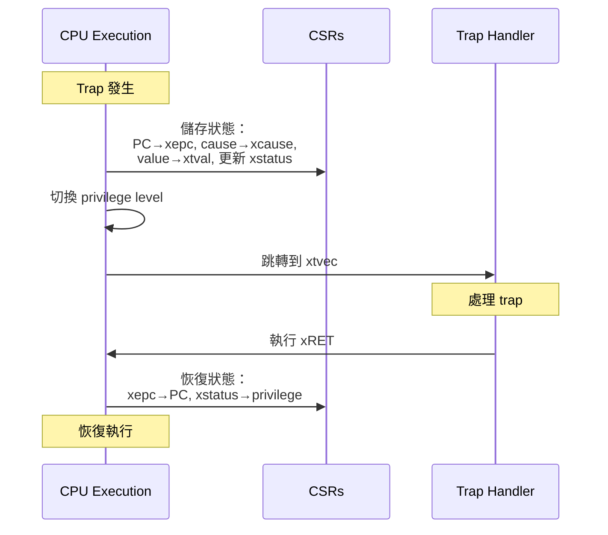

# Chapter 4. Trap, Exception, Interrupt

**Part III — Control Transfer 與 Exception System**

---

當程式遇到錯誤、接收到 interrupt、或發出 system call 時，控制權必須從當前執行環境轉移到能夠處理該事件的 handler。RISC-V 將這種機制稱為「trap」——一個涵蓋同步 exception（如 page fault 和 illegal instruction）和非同步 interrupt（如 timer tick 和 device signal）的通用術語。

理解 trap 機制是系統程式設計的基礎。作業系統依賴 trap 來實作 system call、處理錯誤、回應硬體事件。Firmware 使用 trap 來管理低階硬體並為上層軟體提供服務。即使是應用程式開發者，也能從理解 exception 如何傳播、interrupt latency 如何影響即時效能中受益。

本章深入探討 RISC-V 的 trap 機制：trap 如何觸發、控制權如何轉移到 handler、CSR 如何記錄 trap 資訊、Platform-Level Interrupt Controller (PLIC) 如何管理外部 interrupt。我們也會檢視擴展 RISC-V interrupt 能力的 Advanced Interrupt Architecture (AIA)，並比較 RISC-V 與 ARM 的 exception model。

---

## 4.1 Trap 基礎概念

**什麼是 Trap？**

在 RISC-V 術語中，「trap」是任何導致控制權轉移到 trap handler 的事件。這包括 exception（由指令執行引起的同步事件）和 interrupt（來自外部來源的非同步事件）。

「trap」這個術語刻意設計得很通用。它涵蓋：

- Illegal instruction
- Page fault
- System call (ECALL)
- Breakpoint
- Timer interrupt
- External device interrupt
- Inter-processor interrupt

當 trap 發生時，處理器會：

1. 將當前 program counter 儲存到 `xepc`（其中 x 是 m、s 或 u，取決於目標 privilege level）
2. 將 trap 原因儲存到 `xcause`
3. 將額外資訊儲存到 `xtval`（如果適用）
4. 更新 `xstatus` 以記錄先前的 privilege level 和 interrupt enable 狀態
5. 跳轉到 `xtvec` 中指定的 trap handler 位址

這個機制類似於其他架構的 exception handling，但 RISC-V 的術語和實作特別簡潔一致。

**Exception vs Interrupt**

Exception 和 interrupt 的區別是基礎概念：

*Exception* 是同步的——它們由特定指令的執行引起。當你執行一條導致 exception 的指令時，exception 就在該程式點發生。範例包括：

- Illegal instruction：處理器無法識別 opcode
- Page fault：記憶體存取違反 page table permission
- ECALL：程式明確請求 trap 到更高 privilege
- Breakpoint：觸發除錯 breakpoint

Exception 是可預測且可重現的。如果你以相同的處理器狀態執行相同的指令序列，你會在相同點得到相同的 exception。

*Interrupt* 是非同步的——它們由當前執行指令流之外的事件引起。Interrupt 可以在任意兩條指令之間發生（甚至在某些實作中可能在指令執行期間發生）。範例包括：

- Timer interrupt：timer 已到期
- External interrupt：裝置需要處理
- Software interrupt：另一個處理器或軟體向此處理器發出信號

Interrupt 無法僅從指令流預測。相同的程式在不同執行中可能在不同點遇到 interrupt，取決於外部事件。

這個區別影響 trap 的處理方式。Exception 通常需要檢查 faulting instruction（某些 exception 可在 `xtval` 中取得）。Interrupt 需要識別哪個裝置或來源引起了 interrupt。

**Synchronous vs Asynchronous Trap**

同步/非同步的區別編碼在 `xcause` CSR 中。`xcause` 的最高位元指示 trap 類型：

- Bit 63 (在 RV64 中) = 0：Exception（同步）
- Bit 63 (在 RV64 中) = 1：Interrupt（非同步）

低位元編碼具體原因。例如：

- `xcause = 0x0000000000000002`：Illegal instruction exception
- `xcause = 0x8000000000000005`：Supervisor timer interrupt

這種編碼允許 trap handler 透過簡單的符號測試快速區分 interrupt 和 exception。

**Trap 分類**

RISC-V 在 exception/interrupt 區別之外沒有正式分類 trap，但從行為角度思考 exception 是有用的：

*Fault*：可以修正的 exception，修正後可以重新執行 faulting instruction。Page fault 是經典範例。當 page fault 發生時：

1. OS trap handler 被調用
2. Handler 從磁碟載入缺失的 page
3. Handler 更新 page table
4. Handler 返回，faulting instruction 被重新執行
5. 這次，指令成功

關鍵是 `xepc` 指向 faulting instruction，因此從 trap 返回會重新執行它。

*Trap*（狹義）：在指令完成後報告的 exception。Breakpoint 是一個例子。Breakpoint exception 在 EBREAK 指令執行後發生，`xepc` 指向下一條指令。

*Interrupt*：非同步事件。被中斷的指令可能已完成也可能未完成。對於 precise interrupt，`xepc` 指向尚未執行的指令。對於 imprecise interrupt（在 RISC-V 中罕見），中斷的確切點可能是近似的。

*Abort*：不可恢復的錯誤。這在 RISC-V 中很罕見。大多數在其他架構中會是 abort 的錯誤，在 RISC-V 中要麼是 fault（如果可恢復），要麼導致處理器進入失效狀態。

理解這些分類有助於撰寫正確的 trap handler。Fault handler 必須是冪等的（可安全執行多次），因為 faulting instruction 會被重試。Breakpoint 的 trap handler 必須在返回前推進 `xepc`，以避免無限迴圈。

---

## 4.2 Trap Entry 與 Exit

**Trap Entry Flow**

當 trap 發生時，處理器執行一個明確定義的操作序列。理解這個序列對於撰寫 trap handler 和除錯 trap 相關問題至關重要。

Trap entry flow 根據目標 privilege level（M-mode、S-mode 或 U-mode）略有不同，但基本模式相同。讓我們考慮一個到 M-mode 的 trap：

1. **儲存 PC**：當前 PC 被儲存到 `mepc`。對於 exception，這是 faulting instruction 的 PC。對於 interrupt，這是本應接下來執行的指令的 PC。

2. **更新 mcause**：Trap 原因被寫入 `mcause`。最高位元指示 interrupt (1) 或 exception (0)。低位元編碼具體原因。

3. **更新 mtval**：額外的 trap 特定資訊被寫入 `mtval`。對於與位址相關的 exception（如 page fault），`mtval` 包含 faulting address。對於 illegal instruction exception，`mtval` 可能包含指令本身。對於某些 trap，`mtval` 為零。

4. **更新 mstatus**：`mstatus` 中的幾個欄位被更新：
   - MPP（previous privilege）設定為當前 privilege level
   - MPIE（previous interrupt enable）設定為 MIE 的當前值
   - MIE（interrupt enable）設定為 0，在 M-mode 中停用 interrupt

5. **設定 privilege 為 M-mode**：處理器切換到 M-mode。

6. **跳轉到 handler**：PC 設定為 `mtvec` 中的 trap handler 位址。確切位址取決於 `mtvec` mode（direct 或 vectored）。

整個序列是原子的——它不能被中斷。一旦 trap 開始，它會在任何其他 trap 發生之前完成。

**Figure 4.1: Trap Entry 與 Exit Flow**



**CSR 更新細節**

讓我們詳細檢視每個 CSR 更新：

*xepc (Exception Program Counter)*：這個暫存器保存處理 trap 後要返回的位址。對於 exception，它是引起 exception 的指令位址。對於 interrupt，它是 interrupt 發生時即將執行的指令位址。

Trap handler 可以在返回前修改 `xepc`。這對以下情況很有用：

- 跳過無法修復的 faulting instruction
- 在 debugger 中實作 single-stepping
- 實作 emulation（模擬不支援的指令）

*xcause (Trap Cause)*：這個暫存器指示 trap 的原因。格式為：

- Bit 63 (RV64) 或 Bit 31 (RV32)：Interrupt bit（1 = interrupt, 0 = exception）
- 其餘位元：Exception code 或 interrupt code

常見的 exception code：

- 0：Instruction address misaligned
- 1：Instruction access fault
- 2：Illegal instruction
- 3：Breakpoint
- 12：Instruction page fault
- 13：Load page fault
- 15：Store/AMO page fault

常見的 interrupt code（當 interrupt bit = 1 時）：

- 1：Supervisor software interrupt
- 5：Supervisor timer interrupt
- 9：Supervisor external interrupt

*xtval (Trap Value)*：這個暫存器提供額外的 trap 特定資訊：

- 對於 address misalignment 或 access fault：包含 faulting address
- 對於 illegal instruction：可能包含 instruction 本身（實作定義）
- 對於 breakpoint：包含 breakpoint 位址
- 對於 page fault：包含 faulting virtual address
- 對於其他 trap：通常為 0

*xstatus (Status Register)*：這個暫存器的幾個欄位在 trap 時更新：

- xPP (Previous Privilege)：設定為 trap 前的 privilege level
- xPIE (Previous Interrupt Enable)：設定為 trap 前的 interrupt enable 狀態
- xIE (Interrupt Enable)：設定為 0，停用 interrupt

這些欄位形成一個單層的 privilege 和 interrupt enable 堆疊，允許 trap handler 知道從哪裡來以及如何返回。

**Trap Exit Flow**

從 trap 返回使用特殊的 `xRET` 指令（`MRET` 用於 M-mode，`SRET` 用於 S-mode，`URET` 用於 U-mode）。

當執行 `xRET` 時，處理器：

1. 將 `xepc` 的值載入到 PC（返回到 trap 前的執行點）
2. 將 privilege level 設定為 `xstatus.xPP` 中儲存的值
3. 將 interrupt enable 設定為 `xstatus.xPIE` 中儲存的值
4. 將 `xstatus.xPIE` 設定為 1
5. 將 `xstatus.xPP` 設定為最低 privilege level（U-mode，如果支援）

這個序列恢復 trap 前的執行環境。

**範例：簡單的 M-mode Trap Handler**

```c
// M-mode trap handler（簡化版）
void m_trap_handler(void) {
    unsigned long mcause_val = read_csr(mcause);
    unsigned long mepc_val = read_csr(mepc);
    unsigned long mtval_val = read_csr(mtval);

    // 檢查是 interrupt 還是 exception
    if (mcause_val & (1UL << 63)) {
        // Interrupt
        unsigned long interrupt_code = mcause_val & 0x7FFFFFFFFFFFFFFF;
        handle_interrupt(interrupt_code);
    } else {
        // Exception
        unsigned long exception_code = mcause_val;
        handle_exception(exception_code, mepc_val, mtval_val);
    }

    // 返回（透過 mret 指令）
    // 注意：實際的 handler 通常用組合語言撰寫
}

// Exception handler 範例
void handle_exception(unsigned long code, unsigned long epc, unsigned long tval) {
    switch (code) {
        case 2:  // Illegal instruction
            printf("Illegal instruction at 0x%lx, instruction: 0x%lx\n", epc, tval);
            // 可以選擇跳過這條指令
            write_csr(mepc, epc + 4);
            break;

        case 12:  // Instruction page fault
            printf("Instruction page fault at 0x%lx, address: 0x%lx\n", epc, tval);
            // 處理 page fault（載入 page、更新 page table 等）
            handle_page_fault(tval);
            break;

        default:
            printf("Unhandled exception %lu at 0x%lx\n", code, epc);
            // 可能需要終止程式或進入 panic 狀態
            break;
    }
}
```

**Nested Trap**

RISC-V 的 trap 機制只提供單層的狀態儲存（`xepc`、`xcause`、`xtval`、`xstatus` 中的 xPP/xPIE）。這意味著如果在處理 trap 時發生另一個 trap，先前的 trap 資訊會被覆蓋。

為了支援 nested trap（在 trap handler 中處理另一個 trap），軟體必須：

1. 在 trap handler 開始時將 trap 狀態儲存到記憶體（通常是 stack）
2. 重新啟用 interrupt（如果需要）
3. 處理 trap
4. 在返回前從記憶體恢復 trap 狀態

範例：

```asm
# M-mode trap handler 支援 nested trap
m_trap_entry:
    # 儲存所有 register 到 stack
    addi sp, sp, -256
    sd x1, 0(sp)
    sd x2, 8(sp)
    # ... 儲存所有 register ...

    # 儲存 trap 狀態
    csrr t0, mepc
    sd t0, 240(sp)
    csrr t0, mcause
    sd t0, 248(sp)

    # 重新啟用 interrupt（如果需要 nested interrupt）
    # csrsi mstatus, 0x8  # 設定 MIE bit

    # 呼叫 C trap handler
    call m_trap_handler

    # 恢復 trap 狀態
    ld t0, 240(sp)
    csrw mepc, t0

    # 恢復所有 register
    ld x1, 0(sp)
    ld x2, 8(sp)
    # ... 恢復所有 register ...
    addi sp, sp, 256

    # 返回
    mret
```

大多數作業系統在 S-mode 中支援 nested interrupt，但在 M-mode 中通常保持 interrupt 停用以簡化 handler。

---

## 4.3 Exception 原因與處理

**Exception Cause Code**

RISC-V 定義了一組標準的 exception code，記錄在 `xcause` CSR 中（當最高位元為 0 時）：

| Code | Exception | 描述 |
|------|-----------|------|
| 0 | Instruction address misaligned | 指令位址未對齊（非 2-byte 邊界） |
| 1 | Instruction access fault | 指令存取失敗（記憶體保護違規） |
| 2 | Illegal instruction | 非法指令（未知 opcode 或權限不足） |
| 3 | Breakpoint | EBREAK 指令 |
| 4 | Load address misaligned | Load 位址未對齊 |
| 5 | Load access fault | Load 存取失敗 |
| 6 | Store/AMO address misaligned | Store/AMO 位址未對齊 |
| 7 | Store/AMO access fault | Store/AMO 存取失敗 |
| 8 | Environment call from U-mode | ECALL 從 U-mode |
| 9 | Environment call from S-mode | ECALL 從 S-mode |
| 11 | Environment call from M-mode | ECALL 從 M-mode |
| 12 | Instruction page fault | 指令 page fault |
| 13 | Load page fault | Load page fault |
| 15 | Store/AMO page fault | Store/AMO page fault |

這些 code 是標準化的，所有 RISC-V 實作都必須使用相同的編號。Code 10、14 和 16-23 保留供未來使用。Code 24-31 保留給自訂使用。Code ≥32 保留給平台特定的 exception。

**常見 Exception 處理**

讓我們檢視幾個常見 exception 的處理方式：

*Illegal Instruction (Code 2)*

當處理器遇到無法識別的 opcode、或當前 privilege level 不允許的指令時，會觸發 illegal instruction exception。

處理策略：

1. **Emulation**：軟體可以模擬不支援的指令。例如，不支援浮點運算的處理器可以用軟體模擬浮點指令。
2. **Termination**：對於真正非法的指令，終止程式並報告錯誤。
3. **Skip**：在某些除錯情境中，可能選擇跳過指令並繼續執行。

範例：

```c
void handle_illegal_instruction(unsigned long epc, unsigned long tval) {
    unsigned int instruction = tval;  // 某些實作會在 tval 中提供指令

    // 嘗試模擬指令
    if (emulate_instruction(instruction, epc)) {
        // 模擬成功，推進 PC
        write_csr(mepc, epc + 4);  // 假設是 32-bit 指令
        return;
    }

    // 無法模擬，終止程式
    printf("Illegal instruction at 0x%lx: 0x%x\n", epc, instruction);
    terminate_program();
}
```

*Page Fault (Code 12, 13, 15)*

Page fault 是最重要的 exception 之一，是 virtual memory 系統的基礎。當存取的 virtual address 沒有有效的 page table entry、或違反權限時，會觸發 page fault。

`mtval` 包含 faulting virtual address，這對於 page fault handler 至關重要。

處理策略：

1. **Demand Paging**：載入缺失的 page 並更新 page table
2. **Copy-on-Write**：為寫入操作分配新 page
3. **Swap**：從 swap space 載入 page
4. **Termination**：如果是真正的非法存取，終止程式（segmentation fault）

範例：

```c
void handle_page_fault(unsigned long epc, unsigned long faulting_addr) {
    // 查找 page table entry
    pte_t *pte = lookup_pte(faulting_addr);

    if (pte == NULL) {
        // 沒有對應的 mapping，這是非法存取
        printf("Segmentation fault at 0x%lx (accessing 0x%lx)\n",
               epc, faulting_addr);
        terminate_program();
        return;
    }

    if (!pte->present) {
        // Page 不在記憶體中，需要從磁碟載入
        load_page_from_disk(faulting_addr, pte);
        // 更新 page table
        pte->present = 1;
        // 刷新 TLB
        flush_tlb_entry(faulting_addr);
        // 返回並重試指令
        return;
    }

    if (pte->copy_on_write) {
        // Copy-on-write page，分配新 page
        allocate_and_copy_page(faulting_addr, pte);
        pte->copy_on_write = 0;
        pte->writable = 1;
        flush_tlb_entry(faulting_addr);
        return;
    }

    // 其他情況：權限違規
    printf("Permission violation at 0x%lx (accessing 0x%lx)\n",
           epc, faulting_addr);
    terminate_program();
}
```

*ECALL (Code 8, 9, 11)*

ECALL 指令用於發出 system call 或請求從較低 privilege level 轉移到較高 privilege level。Exception code 指示 ECALL 來自哪個 privilege level。

處理策略：

1. 檢查 system call number（通常在 `a7` register 中）
2. 驗證參數
3. 執行請求的服務
4. 將結果放入 return register（通常是 `a0`）
5. 推進 `mepc` 以跳過 ECALL 指令
6. 返回

範例：

```c
void handle_ecall(unsigned long epc) {
    // 讀取 system call number（在 a7 中）
    unsigned long syscall_num = read_register(17);  // x17 = a7

    // 讀取參數（在 a0-a6 中）
    unsigned long arg0 = read_register(10);  // x10 = a0
    unsigned long arg1 = read_register(11);  // x11 = a1
    // ... 更多參數 ...

    // 執行 system call
    unsigned long result;
    switch (syscall_num) {
        case SYS_WRITE:
            result = sys_write(arg0, arg1, arg2);
            break;
        case SYS_READ:
            result = sys_read(arg0, arg1, arg2);
            break;
        // ... 更多 system call ...
        default:
            result = -ENOSYS;  // 不支援的 system call
            break;
    }

    // 將結果寫入 a0
    write_register(10, result);

    // 推進 PC 以跳過 ECALL 指令
    write_csr(mepc, epc + 4);
}
```

**Exception Priority**

當多個 exception 同時發生時（例如，一條指令同時觸發 address misalignment 和 page fault），RISC-V 定義了 exception priority 順序：

1. Instruction address breakpoint（最高優先級）
2. Instruction page fault
3. Instruction access fault
4. Illegal instruction
5. Instruction address misaligned
6. Environment call
7. Load/Store/AMO address breakpoint
8. Load/Store/AMO address misaligned
9. Load/Store/AMO access fault
10. Load/Store/AMO page fault（最低優先級）

只有最高優先級的 exception 會被報告。這確保了 exception 處理的確定性。

---

## 4.4 Interrupt 架構

**Interrupt 類型**

RISC-V 定義了三種標準 interrupt 類型，每種都有三個 privilege level 的變體：

1. **Software Interrupt**：由軟體觸發，通常用於 inter-processor interrupt (IPI)
   - Machine software interrupt (code 3)
   - Supervisor software interrupt (code 1)
   - User software interrupt (code 0)

2. **Timer Interrupt**：由 timer 觸發
   - Machine timer interrupt (code 7)
   - Supervisor timer interrupt (code 5)
   - User timer interrupt (code 4)

3. **External Interrupt**：由外部裝置觸發（透過 PLIC 或其他 interrupt controller）
   - Machine external interrupt (code 11)
   - Supervisor external interrupt (code 9)
   - User external interrupt (code 8)

Interrupt code 在 `xcause` 中編碼，最高位元設定為 1 以指示這是 interrupt。

**Interrupt Enable 與 Pending**

RISC-V 使用兩組 CSR 來管理 interrupt：

*xie (Interrupt Enable)*：控制哪些 interrupt 被啟用。每個 interrupt 類型有一個對應的 bit：

- MSIE (bit 3)：Machine software interrupt enable
- MTIE (bit 7)：Machine timer interrupt enable
- MEIE (bit 11)：Machine external interrupt enable
- SSIE (bit 1)：Supervisor software interrupt enable
- STIE (bit 5)：Supervisor timer interrupt enable
- SEIE (bit 9)：Supervisor external interrupt enable

*xip (Interrupt Pending)*：指示哪些 interrupt 正在 pending（等待處理）。Bit 位置與 `xie` 相同。

一個 interrupt 只有在以下條件都滿足時才會被處理：

1. 對應的 `xie` bit 被設定（interrupt 被啟用）
2. 對應的 `xip` bit 被設定（interrupt 正在 pending）
3. 全域 interrupt enable bit（`xstatus.xIE`）被設定
4. 當前 privilege level 低於或等於 interrupt 的目標 privilege level

範例：

```c
// 啟用 M-mode timer interrupt
void enable_m_timer_interrupt(void) {
    // 設定 mie.MTIE bit
    set_csr(mie, 1 << 7);

    // 設定 mstatus.MIE bit（全域啟用 M-mode interrupt）
    set_csr(mstatus, 1 << 3);
}

// 檢查是否有 pending interrupt
int check_pending_interrupts(void) {
    unsigned long mip_val = read_csr(mip);
    unsigned long mie_val = read_csr(mie);

    // 計算哪些 interrupt 既 pending 又 enabled
    unsigned long pending_and_enabled = mip_val & mie_val;

    if (pending_and_enabled & (1 << 7)) {
        printf("M-mode timer interrupt pending\n");
        return 1;
    }

    if (pending_and_enabled & (1 << 11)) {
        printf("M-mode external interrupt pending\n");
        return 1;
    }

    return 0;
}
```

**Interrupt Delegation**

RISC-V 支援 interrupt delegation，允許較高 privilege level 將某些 interrupt 委派給較低 privilege level 處理。這透過 `mideleg` (Machine Interrupt Delegation) CSR 實現。

`mideleg` 中的每個 bit 對應一個 interrupt 類型。如果 bit 被設定，對應的 interrupt 會被委派到 S-mode（而不是 M-mode）。

範例：

```c
// 將 supervisor timer interrupt 委派到 S-mode
void delegate_s_timer_to_s_mode(void) {
    // 設定 mideleg bit 5（supervisor timer interrupt）
    set_csr(mideleg, 1 << 5);
}

// 將所有 supervisor interrupt 委派到 S-mode
void delegate_all_s_interrupts(void) {
    unsigned long delegate_mask =
        (1 << 1) |  // Supervisor software interrupt
        (1 << 5) |  // Supervisor timer interrupt
        (1 << 9);   // Supervisor external interrupt

    set_csr(mideleg, delegate_mask);
}
```

Delegation 對於執行作業系統很重要。M-mode firmware（如 OpenSBI）通常會將 supervisor interrupt 委派到 S-mode，讓作業系統直接處理這些 interrupt，而不需要透過 M-mode。

**Interrupt Priority**

當多個 interrupt 同時 pending 時，處理器按照以下優先級順序處理：

1. Machine external interrupt（最高優先級）
2. Machine software interrupt
3. Machine timer interrupt
4. Supervisor external interrupt
5. Supervisor software interrupt
6. Supervisor timer interrupt
7. User external interrupt
8. User software interrupt
9. User timer interrupt（最低優先級）

一般規則是：

- 較高 privilege level 的 interrupt 優先於較低 privilege level
- 在同一 privilege level 中：external > software > timer

---

## 4.5 Platform-Level Interrupt Controller (PLIC)

**PLIC 架構**

Platform-Level Interrupt Controller (PLIC) 是 RISC-V 的標準外部 interrupt controller。它管理來自外部裝置的 interrupt，並將它們路由到適當的 hart 和 privilege level。

PLIC 的主要功能：

1. **Interrupt Source Management**：支援多個 interrupt source（通常 1-1023）
2. **Priority Management**：每個 interrupt source 有可配置的 priority（0-7）
3. **Routing**：將 interrupt 路由到特定的 hart 和 privilege level
4. **Claiming**：Hart 可以 claim（認領）pending interrupt 進行處理
5. **Completion**：處理完成後，hart 通知 PLIC

**PLIC Memory Map**

PLIC 透過 memory-mapped register 進行配置和控制：

```
Base Address: 0x0C000000（典型值，平台特定）

Offset          Register                    Description
0x000000        Priority[1]                 Source 1 priority
0x000004        Priority[2]                 Source 2 priority
...
0x000FFC        Priority[1023]              Source 1023 priority

0x001000        Pending[0]                  Pending bits 0-31
0x001004        Pending[1]                  Pending bits 32-63
...

0x002000        Enable[0][0]                Hart 0 M-mode enable bits 0-31
0x002004        Enable[0][1]                Hart 0 M-mode enable bits 32-63
...
0x002080        Enable[0][32]               Hart 0 S-mode enable bits 0-31
...

0x200000        Threshold[0][M]             Hart 0 M-mode priority threshold
0x200004        Claim/Complete[0][M]        Hart 0 M-mode claim/complete
0x201000        Threshold[0][S]             Hart 0 S-mode priority threshold
0x201004        Claim/Complete[0][S]        Hart 0 S-mode claim/complete
...
```

**PLIC 操作流程**

1. **初始化**：
   - 設定每個 interrupt source 的 priority
   - 為每個 hart 和 privilege level 啟用需要的 interrupt source
   - 設定 priority threshold

2. **Interrupt 發生**：
   - 裝置觸發 interrupt
   - PLIC 設定對應的 pending bit
   - PLIC 檢查 priority 和 enable 設定
   - 如果 interrupt priority > threshold，PLIC 向目標 hart 發出 external interrupt

3. **Interrupt 處理**：
   - Hart 進入 trap handler
   - Handler 從 Claim/Complete register 讀取，獲得 interrupt source ID
   - Handler 處理 interrupt
   - Handler 將 source ID 寫回 Claim/Complete register，表示完成

範例：

```c
// PLIC register 定義
#define PLIC_BASE           0x0C000000
#define PLIC_PRIORITY(id)   (PLIC_BASE + (id) * 4)
#define PLIC_PENDING(id)    (PLIC_BASE + 0x1000 + ((id) / 32) * 4)
#define PLIC_ENABLE(hart, mode, id) \
    (PLIC_BASE + 0x2000 + (hart) * 0x100 + (mode) * 0x80 + ((id) / 32) * 4)
#define PLIC_THRESHOLD(hart, mode) \
    (PLIC_BASE + 0x200000 + (hart) * 0x2000 + (mode) * 0x1000)
#define PLIC_CLAIM(hart, mode) \
    (PLIC_BASE + 0x200004 + (hart) * 0x2000 + (mode) * 0x1000)

// 初始化 PLIC
void plic_init(void) {
    // 設定 interrupt source 1 的 priority 為 7（最高）
    *(volatile uint32_t *)PLIC_PRIORITY(1) = 7;

    // 為 hart 0 M-mode 啟用 interrupt source 1
    uint32_t *enable_reg = (uint32_t *)PLIC_ENABLE(0, 1, 1);  // mode 1 = M-mode
    *enable_reg |= (1 << (1 % 32));

    // 設定 priority threshold 為 0（接受所有 priority > 0 的 interrupt）
    *(volatile uint32_t *)PLIC_THRESHOLD(0, 1) = 0;

    // 啟用 M-mode external interrupt
    set_csr(mie, 1 << 11);  // MEIE
    set_csr(mstatus, 1 << 3);  // MIE
}

// PLIC interrupt handler
void plic_handler(void) {
    // Claim interrupt（讀取 source ID）
    uint32_t source = *(volatile uint32_t *)PLIC_CLAIM(0, 1);

    if (source == 0) {
        // 沒有 pending interrupt（不應該發生）
        return;
    }

    // 處理 interrupt
    printf("Handling PLIC interrupt from source %u\n", source);
    handle_device_interrupt(source);

    // Complete interrupt（寫回 source ID）
    *(volatile uint32_t *)PLIC_CLAIM(0, 1) = source;
}
```

**PLIC Priority Threshold**

Priority threshold 是一個重要的 PLIC 功能。每個 hart 和 privilege level 都有一個 threshold register。只有 priority 嚴格大於 threshold 的 interrupt 才會被傳遞。

這允許實作 critical section：

```c
// 進入 critical section：提高 threshold 以阻擋低優先級 interrupt
uint32_t enter_critical_section(void) {
    uint32_t old_threshold = *(volatile uint32_t *)PLIC_THRESHOLD(0, 1);
    *(volatile uint32_t *)PLIC_THRESHOLD(0, 1) = 7;  // 只接受最高優先級
    return old_threshold;
}

// 離開 critical section：恢復原 threshold
void exit_critical_section(uint32_t old_threshold) {
    *(volatile uint32_t *)PLIC_THRESHOLD(0, 1) = old_threshold;
}
```

---

## 4.6 Core-Local Interrupt Controller (CLIC)

**CLIC vs PLIC**

Core-Local Interrupt Controller (CLIC) 是 RISC-V 的進階 interrupt controller，提供比 PLIC 更多的功能：

| 功能 | PLIC | CLIC |
|------|------|------|
| Interrupt source 數量 | 1-1023 | 1-4095 |
| Priority level | 0-7 | 0-255（可配置） |
| Vectored interrupt | 有限支援 | 完整支援 |
| Nested interrupt | 軟體實作 | 硬體支援 |
| Interrupt latency | 較高 | 較低 |
| Preemption | 軟體實作 | 硬體支援 |

CLIC 特別適合需要低 latency 和複雜 interrupt 處理的即時系統。

**CLIC 主要功能**

1. **Hardware Vectoring**：每個 interrupt 可以有自己的 handler 位址，無需軟體分派
2. **Hardware Preemption**：高優先級 interrupt 可以自動 preempt 低優先級 interrupt
3. **Nested Interrupt**：硬體自動儲存和恢復 interrupt 狀態
4. **Selective Interrupt**：可以選擇性地啟用/停用特定 interrupt level

**CLIC CSR**

CLIC 引入了額外的 CSR：

- `mintstatus`/`sintstatus`：Interrupt status（包含當前 interrupt level）
- `mintthresh`/`sintthresh`：Interrupt threshold
- `mtvt`/`stvt`：Trap vector table base address

---

## 4.7 Advanced Interrupt Architecture (AIA)

**AIA 概述**

Advanced Interrupt Architecture (AIA) 是 RISC-V 的最新 interrupt 擴展，提供：

1. **Message-Signaled Interrupt (MSI)**：類似 PCIe MSI，裝置直接寫入記憶體觸發 interrupt
2. **Interrupt File (IMSIC)**：每個 hart 的本地 interrupt 管理
3. **Improved PLIC (APLIC)**：增強版 PLIC，支援 MSI 和更多功能
4. **Guest Interrupt File**：支援虛擬化環境中的 interrupt 管理

AIA 特別適合高效能伺服器和虛擬化環境。

**IMSIC (Incoming MSI Controller)**

IMSIC 是每個 hart 的本地 interrupt controller，管理 MSI：

- 每個 hart 有獨立的 IMSIC
- 支援數千個 interrupt source
- 硬體 interrupt pending bit 管理
- 與 APLIC 協同工作

---

## 4.8 與 ARM GIC 的比較

**ARM Generic Interrupt Controller (GIC)**

ARM 的 GIC 是成熟的 interrupt controller 架構，經過多代演進（GICv2、GICv3、GICv4）。

**RISC-V PLIC vs ARM GIC**

| 功能 | RISC-V PLIC | ARM GICv3 |
|------|-------------|-----------|
| Interrupt source | 1-1023 | 1-1020 (SPI) + 16 (SGI) + 16 (PPI) |
| Priority level | 0-7 | 0-255 |
| Affinity routing | 簡單 | 複雜（支援 cluster） |
| Message-signaled interrupt | 需要 AIA | GICv3 支援 |
| Virtualization | 需要軟體支援 | GICv4 硬體支援 |
| 複雜度 | 簡單 | 複雜 |

**設計哲學差異**

- **RISC-V**：簡單、模組化、可擴展。PLIC 提供基本功能，CLIC 和 AIA 提供進階功能。
- **ARM**：整合、功能豐富。GIC 試圖在單一架構中滿足所有需求。

RISC-V 的方法允許實作者根據需求選擇適當的 interrupt controller，從簡單的嵌入式系統（PLIC）到高效能伺服器（AIA）。

---

## Summary

RISC-V 的 trap 機制提供了一個統一的框架來處理同步 exception 和非同步 interrupt。當 trap 發生時，處理器將當前 PC 儲存到 `xepc`、將原因記錄在 `xcause`、將額外資訊儲存在 `xtval`、更新 `xstatus` 中的 privilege 和 interrupt 狀態、並跳轉到 `xtvec` 中的 handler 位址。這個簡潔一致的機制在所有 privilege level（M-mode、S-mode、U-mode）中使用平行的 CSR 集合。

Exception 處理涵蓋從簡單的 illegal instruction 到複雜的 page fault。每種 exception 都有標準化的 cause code 和明確定義的行為。Trap handler 必須理解 exception 的語義（fault、trap、interrupt）以正確處理和恢復。

Interrupt 架構從基本的 software/timer/external interrupt 開始，透過 PLIC 提供平台級的 interrupt 管理。PLIC 支援多個 interrupt source、可配置的 priority、靈活的路由、以及 claim/complete 協議。對於更進階的需求，CLIC 提供硬體 vectoring 和 preemption，AIA 提供 MSI 和虛擬化支援。

與 ARM 的 GIC 相比，RISC-V 採用模組化方法：PLIC 提供簡單但足夠的基本功能，CLIC 和 AIA 為需要的系統提供進階功能。這種設計哲學反映了 RISC-V 的核心原則：簡單、模組化、可擴展。

理解 trap 機制是 RISC-V 系統程式設計的基礎。無論是撰寫作業系統、firmware、還是除錯工具，都需要深入理解 trap 如何觸發、如何處理、以及如何返回。本章提供的概念和範例為進一步探索 RISC-V 系統軟體奠定了基礎。
