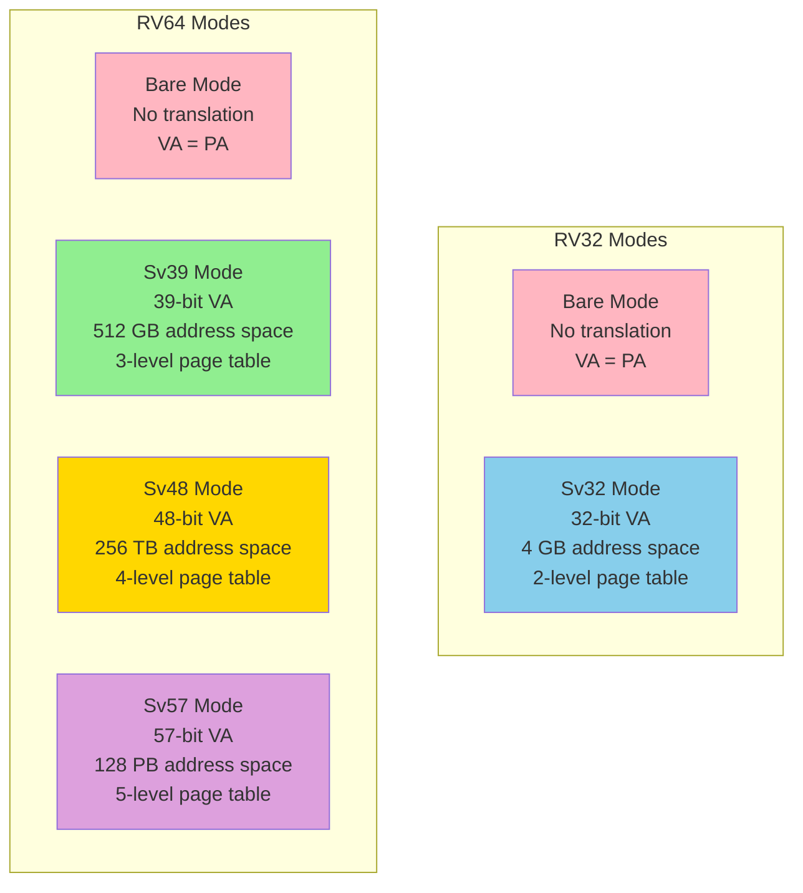
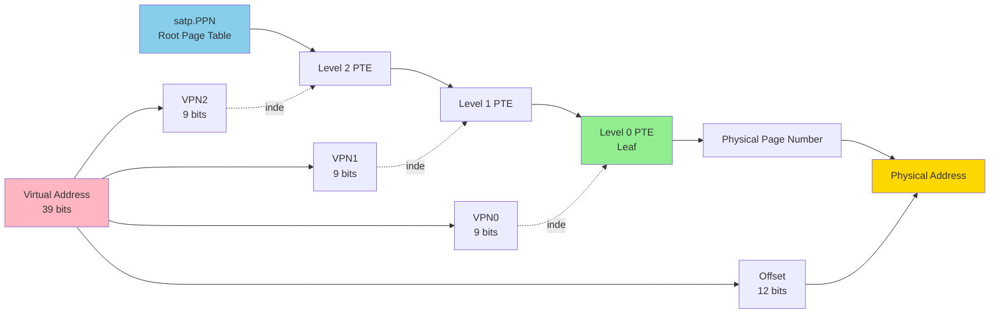

# Chapter 5. Virtual Memory & Paging (Sv39 / Sv48)

**Part IV — Memory & Addressing**

---

## 🎯 學習目標

讀完本章後，你將能夠：

1. **理解 VA 到 PA 的轉換**：掌握 Virtual Address 如何透過 Page Table 轉換為 Physical Address
2. **掌握 Sv39 結構**：明白三級 Page Table 的層次 (L2 → L1 → L0)
3. **設定 `satp` CSR**：能夠計算並設置 `satp` 以開啟 MMU
4. **理解 TLB 機制**：明白 TLB 如何加速位址轉換及其 flush 時機
5. **處理 Page Fault**：能夠分析 Page Fault 的原因並理解處理流程

---

## 💡 情境引入：圖書館的索書號

> **場景**：小華在除錯一個多程序的系統，看著 GDB 顯示的記憶體位址，越看越困惑。

**小華**：「陳教授，我遇到一個很奇怪的事。我同時跑兩個程式，用 GDB 去看它們的記憶體，發現兩個程式都在用 `0x10000` 這個位址！但裡面的資料完全不一樣。這怎麼可能？難道 CPU 是量子電腦嗎？」

**陳教授**：「哈哈，這可不是量子糾纏。你有去過圖書館嗎？」

**小華**：「有啊，這跟圖書館有什麼關係？」

**陳教授**：「想像一下。你在 A 分館，根據索書號 `Q123` 找到一本書，是《量子力學導論》。你朋友在 B 分館，用同樣的索書號 `Q123`，找到的卻是《微積分習題集》。」

**小華**：「因為每個分館有自己的書架配置？」

**陳教授**：「完全正確！

1. **索書號 (Virtual Address)**：程式看到的位址，就像索書號。每個程式都覺得自己有一整座圖書館。
2. **實際書架位置 (Physical Address)**：書真正放在哪裡。
3. **索書目錄 (Page Table)**：將索書號翻譯成實際書架位置的對照表。
4. **分館 (Process)**：每個分館有自己的索書目錄。」

**小華**：「所以兩個程式用同一個虛擬位址，但透過不同的 Page Table，翻譯成不同的實體位址？」

**陳教授**：「你悟了！這就是 **Virtual Memory** 的精髓。作業系統為每個 Process 準備了專屬的索書目錄 (Page Table)，讓它們以為自己獨佔整座圖書館，實際上大家的書都擠在同一個倉庫裡。這樣的好處是：

- **隔離 (Isolation)**：程式 A 翻錯書不會影響程式 B。
- **保護 (Protection)**：有些書架標示『僅限員工』，你沒權限就不能碰。
- **彈性 (Flexibility)**：書可以隨時搬動位置，只要更新索書目錄就好。」

**小華**：「那 `satp` 這個 CSR 是幹嘛的？」

**陳教授**：「`satp` 就是告訴 CPU：『現在使用哪一份索書目錄 (Page Table)，從哪裡開始翻。』當作業系統切換 Process 時，它會更新 `satp`，讓 CPU 去查另一份目錄。」

**小華**：「懂了！那我們來試試看怎麼建立這個索書目錄？」

---

Virtual memory 是現代計算中最重要的抽象之一。它提供記憶體保護，將 process 彼此隔離，也與作業系統隔離。它提供 address space 抽象，讓每個 process 看到簡單、連續的記憶體視圖，無論實體佈局如何。它支援 memory overcommitment，允許系統執行比實體 RAM 容量更多的程式。它還支援 shared memory，實現高效的通訊和資源共享。

RISC-V 透過簡潔、靈活的 paging system 實作 virtual memory。Sv39 提供 39-bit virtual address（512 GB address space）和 three-level page table，適合大多數 application processor。Sv48 將其擴展到 48-bit virtual address（256 TB address space）和 four-level page table，適用於需要更大 address space 的系統。兩種模式都支援 superpage（2 MB 和 1 GB page），以減少 TLB pressure 並高效映射大型區域。

本章深入探討 RISC-V 的 virtual memory system：page table 結構、address translation、TLB 管理、page fault、以及 Physical Memory Protection (PMP) 機制（即使沒有 virtual memory 也能提供記憶體保護）。理解這些概念對於作業系統開發者、hypervisor 實作者、以及任何從事 RISC-V system software 的人都至關重要。

---

## 5.1 Virtual Memory Overview

**為什麼需要 Virtual Memory？**

Virtual memory 是現代計算中最重要的抽象之一。它解決了幾個基本問題，沒有它，作業系統幾乎不可能建構。

首先，virtual memory 提供 *memory protection*。沒有它，任何程式都可以讀寫任何記憶體位置，包括作業系統的 code 和 data。有 bug 的程式可能會讓整個系統崩潰。惡意程式可能會從其他程式竊取資料或控制系統。Virtual memory 允許 OS 將每個 process 隔離在自己的 address space 中，防止干擾。

其次，virtual memory 提供 *address space abstraction*。每個 process 看到一個簡單、連續的 address space，從 address zero 開始，無論其記憶體實際位於實體 RAM 的哪裡。Process 不需要知道——也不需要關心——它的記憶體可能分散在不同的實體位置，或者其中一些可能被 swap 到 disk。這種抽象簡化了程式設計，並允許 OS 靈活管理實體記憶體。

第三，virtual memory 支援 *memory overcommitment*。OS 可以給每個 process 一個大的 virtual address space（Sv39 中 512 GB，Sv48 中 256 TB），即使系統的實體 RAM 遠少於此。大部分 virtual space 實際上從未使用。OS 只為實際存取的 page 分配實體記憶體。這允許同時執行比實體記憶體容量更多的程式。

第四，virtual memory 支援 *shared memory*。多個 process 可以將相同的實體記憶體映射到它們的 virtual address space。這對於 shared library（如 libc）至關重要，否則每個 process 都要單獨載入，浪費記憶體。它也用於 inter-process communication 和 memory-mapped file。

**RISC-V Virtual Memory Mode**

RISC-V 定義了幾種 virtual memory mode，由 `satp`（Supervisor Address Translation and Protection）CSR 中的 MODE field 選擇：

- **Bare**（MODE=0）：無 address translation。Virtual address 等於 physical address。這是 M-mode 使用的模式，以及不需要 virtual memory 的系統。

- **Sv32**（MODE=1）：RV32 的 32-bit virtual addressing。提供 4 GB virtual address space 和 two-level page table。用於執行作業系統的 32-bit embedded system。

- **Sv39**（MODE=8）：RV64 的 39-bit virtual addressing。提供 512 GB virtual address space 和 three-level page table。這是執行 Linux 或類似作業系統的 64-bit RISC-V 系統最常見的模式。

- **Sv48**（MODE=9）：RV64 的 48-bit virtual addressing。提供 256 TB virtual address space 和 four-level page table。用於需要更大 address space 的系統，如大型 server 或 database。

- **Sv57**（MODE=10）：RV64 的 57-bit virtual addressing。提供 128 PB virtual address space 和 five-level page table。這個模式已定義但很少實作，因為 256 TB 對幾乎所有當前應用都足夠。

模式的選擇是一種權衡。更大的 address space 需要更多層級的 page table lookup，這增加了 TLB miss 的成本。大多數系統使用 Sv39，它在 address space 大小和效能之間提供了良好的平衡。

**satp CSR**

`satp`（Supervisor Address Translation and Protection）register 控制 virtual memory。它是 supervisor-level CSR，只能從 S-mode 或 M-mode 存取。

在 RV64 中，satp 有三個 field：

```
 63    60 59                44 43                                0
+--------+--------------------+----------------------------------+
|  MODE  |        ASID        |               PPN                |
+--------+--------------------+----------------------------------+
```

- **MODE**（bits 63:60）：選擇 address translation mode（0=Bare, 8=Sv39, 9=Sv48, 10=Sv57）
- **ASID**（bits 59:44）：Address Space Identifier，16-bit tag，用於區分不同 process 的 TLB entry
- **PPN**（bits 43:0）：root page table 的 Physical Page Number

要啟用 virtual memory，OS 需要：

1. 在實體記憶體中分配 page table
2. 初始化 page table entry
3. 將 satp 寫入 MODE=8（Sv39）或 MODE=9（Sv48）以及 root page table 的實體位址
4. 執行 SFENCE.VMA 以 flush TLB

之後，所有來自 S-mode 和 U-mode 的記憶體存取都會經過 address translation。

**Address Space Identifier (ASID)**

satp 中的 ASID field 是一種最佳化。當 OS 在 process 之間切換時，必須更改 satp 以指向新 process 的 page table。這通常需要 flush 整個 TLB，因為來自舊 process 的 TLB entry 不再有效。

ASID 避免了這個成本。每個 TLB entry 都用建立時 satp 中的 ASID 標記。查找 TLB entry 時，硬體檢查 ASID 是否匹配。這允許來自多個 process 的 TLB entry 共存。切換 process 時，OS 只需更改 satp（包括 ASID），TLB 會自動過濾 entry。

如果 OS 用完 ASID（只有 2^16 = 65536 個可能值），可以 flush TLB 並重用 ASID。但實際上，65536 對大多數 workload 都足夠。

**TLB Management**

Translation Lookaside Buffer (TLB) 快取最近的 address translation。沒有 TLB，每次記憶體存取都需要 walk page table，這可能需要多次記憶體存取。TLB 透過快取 translation 使 virtual memory 變得實用。

RISC-V 不指定 TLB 實作——這是 microarchitecture 細節。但它提供了管理 TLB 的指令：

- **SFENCE.VMA**：Virtual memory 的 fence。這個指令排序記憶體存取和 TLB 更新。在修改 page table 後使用，以確保 TLB 一致。

SFENCE.VMA 可以接受兩個可選參數：

- `rs1`：如果非零，只 flush 該 virtual address 的 TLB entry
- `rs2`：如果非零，只 flush 該 ASID 的 TLB entry

如果兩者都為零，flush 整個 TLB。如果只有 rs1 非零，只 flush 該 virtual address 的 entry（跨所有 ASID）。如果只有 rs2 非零，只 flush 該 ASID 的 entry。

這種靈活性允許 OS 最小化 TLB flush。例如，unmap 單個 page 時，OS 可以只 flush 該 page 的 TLB entry，而不是整個 TLB。

**Figure 5.1: RISC-V Virtual Memory Mode**



---

## 5.2 Sv39: 39-bit Virtual Address Space

**Sv39 概述**

Sv39 是 64-bit RISC-V 系統最廣泛使用的 virtual memory mode。它提供 512 GB virtual address space，對大多數應用來說足夠，同時保持 page table walk 相對快速。

Sv39 中的「39」指的是 virtual address 的 bit 數。39-bit address 可以表示 2^39 = 512 GB 的 address space。與 RV64 的 64-bit register 相比，這可能看起來很小，但這是一個實用的選擇。大多數程式不需要超過 512 GB 的 virtual memory，使用較少的 bit 意味著較少層級的 page table lookup。

**Sv39 Address Format**

Sv39 virtual address 分為四個部分：

```
 63        39 38    30 29    21 20    12 11           0
+------------+--------+--------+--------+--------------+
|  Reserved  | VPN[2] | VPN[1] | VPN[0] | Page Offset  |
+------------+--------+--------+--------+--------------+
    25 bits    9 bits   9 bits   9 bits    12 bits
```

- **Reserved**（bits 63:39）：必須等於 bit 38（sign extension）。這確保有效 address 要麼在 64-bit address space 的下半部（0x0000_0000_0000_0000 到 0x0000_003F_FFFF_FFFF），要麼在上半部（0xFFFF_FFC0_0000_0000 到 0xFFFF_FFFF_FFFF_FFFF）。不遵循此規則的 address 會導致 page fault。

- **VPN[2]**（bits 38:30）：Virtual Page Number, level 2。這是 root page table 的 index。

- **VPN[1]**（bits 29:21）：Virtual Page Number, level 1。這是 second-level page table 的 index。

- **VPN[0]**（bits 20:12）：Virtual Page Number, level 0。這是 third-level（leaf）page table 的 index。

- **Page Offset**（bits 11:0）：4 KB page 內的 offset。這不會被 translate——直接複製到 physical address。

每個 VPN field 是 9 bit，意味著每個 page table 有 2^9 = 512 個 entry。Page offset 是 12 bit，意味著 page 是 2^12 = 4096 byte（4 KB）。

**Three-Level Page Table Walk**

Sv39 中的 address translation 涉及 walk three-level page table。演算法如下：

1. 從 root page table 開始。其實體位址在 satp.PPN。

2. 使用 VPN[2] 作為 root page table 的 index。讀取該 index 的 Page Table Entry (PTE)。

3. 如果 PTE 無效（V=0）或有無效 permission，raise page fault。

4. 如果 PTE 是 leaf（R=1, W=1, 或 X=1），translation 完成。PTE 包含 physical page number。跳到步驟 8。

5. 否則，PTE 指向下一層 page table。使用 VPN[1] 作為該 page table 的 index。讀取該 index 的 PTE。

6. 如果 PTE 無效或有無效 permission，raise page fault。

7. 如果 PTE 是 leaf，translation 完成。否則，使用 VPN[0] 作為 third-level page table 的 index。讀取該 index 的 PTE。這必須是 leaf。

8. 將 PTE 中的 physical page number 與 virtual address 中的 page offset 組合，形成 physical address。

這個過程最多需要三次記憶體存取（每層一次）。這就是為什麼 TLB 如此重要——它快取結果，避免對同一 page 的後續存取進行 page table walk。

**Page Table Entry (PTE) Format**

Sv39 中的每個 PTE 是 64 bit：

```
 63      54 53        28 27        19 18        10 9  8 7 6 5 4 3 2 1 0
+----------+------------+------------+------------+-----+-+-+-+-+-+-+-+-+
| Reserved |   PPN[2]   |   PPN[1]   |   PPN[0]   | RSW |D|A|G|U|X|W|R|V|
+----------+------------+------------+------------+-----+-+-+-+-+-+-+-+-+
  10 bits     26 bits      9 bits       9 bits    2 bits  8 flag bits
```

- **Reserved**（bits 63:54）：保留供未來使用。必須為零。

- **PPN[2:0]**（bits 53:10）：Physical Page Number。對於 leaf PTE，這是 mapped page 的 physical page number。對於 non-leaf PTE，這是下一層 page table 的 physical page number。

- **RSW**（bits 9:8）：Reserved for Software。硬體忽略這些 bit。OS 可以將它們用於任何目的（例如，追蹤 page 狀態）。

- **D**（bit 7）：Dirty。當 page 被寫入時由硬體設定。OS 用它來追蹤哪些 page 需要寫回 disk。

- **A**（bit 6）：Accessed。當 page 被讀取或寫入時由硬體設定。OS 用於 page replacement algorithm。

- **G**（bit 5）：Global。如果設定，此 mapping 是 global 的，不與任何 ASID 關聯。Global mapping 永遠不會被 ASID-specific SFENCE.VMA flush。

- **U**（bit 4）：User。如果設定，此 page 可從 U-mode 存取。如果清除，page 只能從 S-mode 存取。

- **X**（bit 3）：Execute。如果設定，page 可以執行。

- **W**（bit 2）：Write。如果設定，page 可以寫入。

- **R**（bit 1）：Read。如果設定，page 可以讀取。

- **V**（bit 0）：Valid。如果清除，PTE 無效，任何存取都會導致 page fault。

**PTE Flag 與 Permission**

R、W、X 和 U flag 控制存取 permission。硬體在 address translation 期間檢查這些 flag：

- 如果 V=0，PTE 無效。Page fault。
- 如果 R=0 且 W=1，PTE 無效（write-only page 保留）。Page fault。
- 如果 R=1、W=1 或 X=1，PTE 是 leaf。Physical page number 在 PPN[2:0]。
- 如果 R=0、W=0 且 X=0，PTE 是指向下一層的 pointer。下一層 page table 的 physical page number 在 PPN[2:0]。

對於 leaf PTE，檢查 permission：

- 如果存取是 read 且 R=0，page fault。
- 如果存取是 write 且 W=0，page fault。
- 如果存取是 instruction fetch 且 X=0，page fault。
- 如果存取來自 U-mode 且 U=0，page fault。

A 和 D bit 在 page 被存取或修改時由硬體設定。OS 可以清除這些 bit 並使用它們來實作 page replacement algorithm（例如 LRU）。

**Superpage**

Sv39 支援 *superpage*——base 4 KB page size 的倍數的大 page。Superpage 透過將 level 1 或 level 2 的 PTE 設為 leaf（設定 R、W 或 X）來建立。

- Level 1 leaf PTE 建立 2 MB superpage（2^21 byte）。VPN[0] 不使用；相反，virtual address 的 bit 20:12 成為 page offset 的一部分。

- Level 2 leaf PTE 建立 1 GB superpage（2^30 byte）。VPN[1] 和 VPN[0] 不使用；相反，virtual address 的 bit 29:12 成為 page offset 的一部分。

Superpage 透過用更少的 TLB entry 覆蓋更多記憶體來減少 TLB pressure。它們通常用於大型分配，如 kernel 的實體記憶體 direct map，或大型 application heap。

要使 superpage PTE 有效，PPN 必須正確對齊。對於 2 MB superpage，PPN[0] 必須為零。對於 1 GB superpage，PPN[1:0] 必須為零。如果對齊不正確，PTE 被視為無效。

**Figure 5.2: Sv39 Address Translation**



**程式碼範例：Sv39 Page Table 操作**

```c
#include <stdint.h>

// PTE flag 定義
#define PTE_V    (1 << 0)  // Valid
#define PTE_R    (1 << 1)  // Read
#define PTE_W    (1 << 2)  // Write
#define PTE_X    (1 << 3)  // Execute
#define PTE_U    (1 << 4)  // User
#define PTE_G    (1 << 5)  // Global
#define PTE_A    (1 << 6)  // Accessed
#define PTE_D    (1 << 7)  // Dirty

// PTE 結構
typedef uint64_t pte_t;

// 從 PTE 提取 PPN
#define PTE_PPN(pte) (((pte) >> 10) & 0xFFFFFFFFFFF)

// 建立 PTE
#define MAKE_PTE(ppn, flags) (((ppn) << 10) | (flags))

// 檢查 PTE 是否為 leaf
static inline int pte_is_leaf(pte_t pte) {
    return (pte & (PTE_R | PTE_W | PTE_X)) != 0;
}

// 檢查 PTE 是否有效
static inline int pte_is_valid(pte_t pte) {
    return (pte & PTE_V) != 0;
}

// Sv39 address translation（簡化版）
uint64_t sv39_translate(uint64_t va, uint64_t satp) {
    // 提取 satp 中的 root page table PPN
    uint64_t pt_ppn = satp & 0xFFFFFFFFFFF;

    // 提取 VPN field
    uint64_t vpn[3];
    vpn[2] = (va >> 30) & 0x1FF;  // VPN[2]
    vpn[1] = (va >> 21) & 0x1FF;  // VPN[1]
    vpn[0] = (va >> 12) & 0x1FF;  // VPN[0]
    uint64_t offset = va & 0xFFF;  // Page offset

    // Walk page table
    pte_t *pt = (pte_t *)(pt_ppn << 12);
    pte_t pte;

    for (int level = 2; level >= 0; level--) {
        pte = pt[vpn[level]];

        if (!pte_is_valid(pte)) {
            // Page fault: invalid PTE
            return -1;
        }

        if (pte_is_leaf(pte)) {
            // Leaf PTE found
            uint64_t ppn = PTE_PPN(pte);

            // 對於 superpage，需要組合未使用的 VPN bit
            if (level == 2) {
                // 1 GB superpage
                ppn = (ppn & ~0x3FFFF) | ((va >> 12) & 0x3FFFF);
            } else if (level == 1) {
                // 2 MB superpage
                ppn = (ppn & ~0x1FF) | ((va >> 12) & 0x1FF);
            }

            return (ppn << 12) | offset;
        }

        // Non-leaf PTE: 移到下一層
        pt_ppn = PTE_PPN(pte);
        pt = (pte_t *)(pt_ppn << 12);
    }

    // 不應該到達這裡
    return -1;
}

// 建立 page table mapping
void map_page(pte_t *root_pt, uint64_t va, uint64_t pa, uint64_t flags) {
    uint64_t vpn[3];
    vpn[2] = (va >> 30) & 0x1FF;
    vpn[1] = (va >> 21) & 0x1FF;
    vpn[0] = (va >> 12) & 0x1FF;
    uint64_t ppn = pa >> 12;

    pte_t *pt = root_pt;

    // Walk to level 0
    for (int level = 2; level > 0; level--) {
        pte_t *pte_ptr = &pt[vpn[level]];

        if (!pte_is_valid(*pte_ptr)) {
            // 分配新的 page table
            uint64_t new_pt_ppn = alloc_page();
            *pte_ptr = MAKE_PTE(new_pt_ppn, PTE_V);
        }

        pt = (pte_t *)(PTE_PPN(*pte_ptr) << 12);
    }

    // 設定 leaf PTE
    pt[vpn[0]] = MAKE_PTE(ppn, flags | PTE_V);
}

// Unmap page
void unmap_page(pte_t *root_pt, uint64_t va) {
    uint64_t vpn[3];
    vpn[2] = (va >> 30) & 0x1FF;
    vpn[1] = (va >> 21) & 0x1FF;
    vpn[0] = (va >> 12) & 0x1FF;

    pte_t *pt = root_pt;

    // Walk to level 0
    for (int level = 2; level > 0; level--) {
        pte_t pte = pt[vpn[level]];

        if (!pte_is_valid(pte) || pte_is_leaf(pte)) {
            return;  // 已經 unmapped 或是 superpage
        }

        pt = (pte_t *)(PTE_PPN(pte) << 12);
    }

    // 清除 leaf PTE
    pt[vpn[0]] = 0;

    // Flush TLB
    asm volatile("sfence.vma %0, zero" : : "r"(va));
}
```

---

## 5.3 Sv48: 48-bit Virtual Address Space

**Sv48 概述**

Sv48 透過在 page table 中增加一層，將 Sv39 擴展，將 virtual address space 從 512 GB 增加到 256 TB。這對於非常大的應用很有用，例如管理 terabyte 資料的 database，或需要映射大量實體記憶體的系統。

權衡是效能。每增加一層 page table 就會在 page table walk 中增加一次記憶體存取。對於 TLB hit rate 較差的 workload，這可能會明顯影響效能。大多數系統使用 Sv39，除非特別需要更大的 address space。

**Sv48 Address Format**

Sv48 virtual address 有 48 bit 的 address 和 16 bit 的 sign extension：

```
 63        48 47    39 38    30 29    21 20    12 11           0
+------------+--------+--------+--------+--------+--------------+
|  Reserved  | VPN[3] | VPN[2] | VPN[1] | VPN[0] | Page Offset  |
+------------+--------+--------+--------+--------+--------------+
    16 bits    9 bits   9 bits   9 bits   9 bits    12 bits
```

結構與 Sv39 類似，但有額外的 VPN[3] field 用於第四層 page table。

**Four-Level Page Table Walk**

Sv48 中的 page table walk 與 Sv39 類似，但有額外的一層：

1. 從 satp.PPN 的 root page table 開始
2. 使用 VPN[3] 索引 root page table
3. 如果 PTE 是 leaf，translation 完成
4. 否則，使用 VPN[2] 索引 level 2 page table
5. 如果 PTE 是 leaf，translation 完成
6. 否則，使用 VPN[1] 索引 level 1 page table
7. 如果 PTE 是 leaf，translation 完成
8. 否則，使用 VPN[0] 索引 level 0 page table
9. 這必須是 leaf PTE
10. 將 PTE 中的 PPN 與 page offset 組合，形成 physical address

**Sv48 Superpage**

Sv48 支援與 Sv39 相同的 superpage，加上一個額外的大小：

- **4 KB**：Level 0 leaf（base page size）
- **2 MB**：Level 1 leaf（2^21 byte）
- **1 GB**：Level 2 leaf（2^30 byte）
- **512 GB**：Level 3 leaf（2^39 byte）

512 GB superpage 非常巨大——它是整個 Sv39 的 address space！這種大 page 很少使用，但對於以最小 TLB overhead 映射非常大的實體記憶體區域可能很有用。

**Sv48 vs Sv39 權衡**

在 Sv39 和 Sv48 之間選擇涉及幾個考慮：

*Address Space*：

- Sv39：512 GB（對大多數應用足夠）
- Sv48：256 TB（需要用於非常大的 database、in-memory computing）

*Page Table Walk Cost*：

- Sv39：最多 3 次記憶體存取
- Sv48：最多 4 次記憶體存取
- 影響取決於 TLB hit rate

*Memory Overhead*：

- Sv48 對於 sparse address space 需要更多 page table 記憶體
- 每增加一層，每 512 GB virtual address space 增加 4 KB

*Compatibility*：

- Sv39 更廣泛支援
- Sv48 可能不在所有 RISC-V processor 上實作

對於大多數系統，Sv39 是正確的選擇。只有在真正需要更大的 address space 時才應使用 Sv48。

---

## 5.4 Page Fault 與 Exception Handling

**Page Fault 類型**

RISC-V 定義了三種類型的 page fault，根據導致 fault 的存取類型區分：

- **Instruction Page Fault**（exception code 12）：從未映射、不可執行、或在當前 privilege level 不可存取的 page fetch instruction 時發生。

- **Load Page Fault**（exception code 13）：從未映射、不可讀、或在當前 privilege level 不可存取的 page load 時發生。

- **Store/AMO Page Fault**（exception code 15）：store 到未映射、不可寫、或在當前 privilege level 不可存取的 page 時發生。

當 page fault 發生時，processor：

1. 將 `scause` 設為 exception code（12、13 或 15）
2. 將 `sepc` 設為 faulting instruction 的 PC
3. 將 `stval` 設為 faulting virtual address
4. Trap 到 S-mode（或 M-mode，如果未 delegate）

OS page fault handler 檢查 `stval` 以確定哪個 page 導致 fault，然後決定如何處理。

**Page Fault Handling**

OS 可以用幾種方式處理 page fault：

*Demand Paging*：Page 有效但當前不在實體記憶體中。OS：

1. 分配 physical page
2. 從 disk 載入 page 內容（如果被 swap out）或將其清零（如果是新 page）
3. 更新 page table 以將 virtual page 映射到 physical page
4. 執行 SFENCE.VMA 以 flush TLB
5. 用 SRET 返回，重新執行 faulting instruction

*Copy-on-Write*：Page 映射為 read-only，但 process 嘗試寫入。這用於 fork() 最佳化。OS：

1. 分配新的 physical page
2. 將內容從舊 page 複製到新 page
3. 更新 page table 以將 virtual page 映射到新 page，並具有 write permission
4. 執行 SFENCE.VMA
5. 用 SRET 返回

*Invalid Access*：Page 未映射且不應該映射。OS：

1. 向 process 發送 SIGSEGV signal（在 Unix-like 系統上）
2. Process 通常以 segmentation fault 終止

關鍵是 `sepc` 指向 faulting instruction，因此從 trap 返回會重新執行它。這對於 demand paging 和 copy-on-write 正確工作至關重要。

**程式碼範例：Page Fault Handler**

```c
#include <stdint.h>

// Page fault handler
void handle_page_fault(uint64_t scause, uint64_t sepc, uint64_t stval) {
    // 確定 fault 類型
    int is_instruction_fault = (scause == 12);
    int is_load_fault = (scause == 13);
    int is_store_fault = (scause == 15);

    printf("Page fault at VA 0x%lx, PC 0x%lx\n", stval, sepc);

    // 檢查 address 是否在有效範圍內
    if (!is_valid_user_address(stval)) {
        // Invalid address: 終止 process
        printf("Invalid address, sending SIGSEGV\n");
        send_signal(current_process, SIGSEGV);
        return;
    }

    // 查找 VMA (Virtual Memory Area)
    struct vma *vma = find_vma(current_process, stval);
    if (!vma) {
        // 沒有 VMA 覆蓋此 address
        printf("No VMA found, sending SIGSEGV\n");
        send_signal(current_process, SIGSEGV);
        return;
    }

    // 檢查 permission
    if (is_instruction_fault && !(vma->flags & VMA_EXEC)) {
        printf("Execute permission denied\n");
        send_signal(current_process, SIGSEGV);
        return;
    }

    if (is_load_fault && !(vma->flags & VMA_READ)) {
        printf("Read permission denied\n");
        send_signal(current_process, SIGSEGV);
        return;
    }

    if (is_store_fault && !(vma->flags & VMA_WRITE)) {
        // 可能是 copy-on-write
        if (vma->flags & VMA_COW) {
            handle_cow_fault(stval);
            return;
        }

        printf("Write permission denied\n");
        send_signal(current_process, SIGSEGV);
        return;
    }

    // Demand paging: 分配並映射 page
    handle_demand_paging(stval, vma);
}

// Demand paging handler
void handle_demand_paging(uint64_t va, struct vma *vma) {
    // 分配 physical page
    uint64_t pa = alloc_physical_page();
    if (pa == 0) {
        // Out of memory
        printf("Out of memory\n");
        send_signal(current_process, SIGKILL);
        return;
    }

    // 如果是 file-backed VMA，從 file 載入
    if (vma->file) {
        uint64_t offset = (va - vma->start) + vma->file_offset;
        read_file(vma->file, offset, (void *)pa, PAGE_SIZE);
    } else {
        // Anonymous page: 清零
        memset((void *)pa, 0, PAGE_SIZE);
    }

    // 建立 page table mapping
    uint64_t flags = PTE_V | PTE_U;
    if (vma->flags & VMA_READ)  flags |= PTE_R;
    if (vma->flags & VMA_WRITE) flags |= PTE_W;
    if (vma->flags & VMA_EXEC)  flags |= PTE_X;

    map_page(current_process->page_table, va, pa, flags);

    // Flush TLB
    asm volatile("sfence.vma %0, zero" : : "r"(va));

    printf("Mapped VA 0x%lx to PA 0x%lx\n", va, pa);
}

// Copy-on-write handler
void handle_cow_fault(uint64_t va) {
    // 獲取當前 mapping
    uint64_t old_pa = get_physical_address(current_process->page_table, va);

    // 分配新 page
    uint64_t new_pa = alloc_physical_page();
    if (new_pa == 0) {
        printf("Out of memory\n");
        send_signal(current_process, SIGKILL);
        return;
    }

    // 複製內容
    memcpy((void *)new_pa, (void *)old_pa, PAGE_SIZE);

    // 更新 mapping 為 writable
    uint64_t flags = PTE_V | PTE_U | PTE_R | PTE_W;
    map_page(current_process->page_table, va, new_pa, flags);

    // Flush TLB
    asm volatile("sfence.vma %0, zero" : : "r"(va));

    // 減少舊 page 的 reference count
    dec_page_refcount(old_pa);

    printf("COW: Copied page at VA 0x%lx\n", va);
}
```

**TLB Shootdown**

在多處理器系統中，當一個 CPU 修改 page table 時，其他 CPU 的 TLB 可能包含過時的 entry。這需要 *TLB shootdown*——通知其他 CPU flush 它們的 TLB。

RISC-V 沒有硬體 TLB shootdown 機制。OS 必須使用 inter-processor interrupt (IPI) 來實作：

```c
// TLB shootdown（多處理器）
void tlb_shootdown(uint64_t va, uint64_t asid) {
    // 在當前 CPU 上 flush
    if (asid == 0) {
        asm volatile("sfence.vma %0, zero" : : "r"(va));
    } else {
        asm volatile("sfence.vma %0, %1" : : "r"(va), "r"(asid));
    }

    // 向其他 CPU 發送 IPI
    for (int cpu = 0; cpu < num_cpus; cpu++) {
        if (cpu == current_cpu()) continue;

        send_ipi(cpu, IPI_TLB_FLUSH, va, asid);
    }

    // 等待所有 CPU 確認
    wait_for_ipi_ack();
}

// IPI handler（在其他 CPU 上）
void handle_tlb_flush_ipi(uint64_t va, uint64_t asid) {
    if (asid == 0) {
        asm volatile("sfence.vma %0, zero" : : "r"(va));
    } else {
        asm volatile("sfence.vma %0, %1" : : "r"(va), "r"(asid));
    }

    // 發送確認
    send_ipi_ack();
}
```

---

## 🛠️ 實作練習：Lab 5.1 — 戴上魔術眼鏡 (Enable Paging)

這個 Lab 將帶你建立最簡單的 Page Table：Identity Mapping（虛擬位址 = 實體位址），並開啟 MMU。

### 實驗目標

1. 理解 Sv39 的 Page Table Entry (PTE) 結構
2. 建立一個 Identity Mapping 的 Page Table
3. 設定 `satp` CSR 並開啟 MMU
4. 理解 `sfence.vma` 的作用

### 概念說明

在 Sv39 模式下，Page Table 有三級：

```
Virtual Address (39-bit):
+--------+--------+--------+------------+
| VPN[2] | VPN[1] | VPN[0] |   Offset   |
|  9-bit |  9-bit |  9-bit |   12-bit   |
+--------+--------+--------+------------+

Page Table Walk:
  satp.PPN → Level 2 Table → Level 1 Table → Level 0 Table → Physical Page
```

每個 Page Table Entry (PTE) 為 64-bit：

```
PTE 格式:
+-----------------------------------------------+-------+
|             PPN (44-bit)                      | Flags |
|                                               | RWXUG |
+-----------------------------------------------+-------+
  63                                    10  9       0

Flags:
  V (Valid)     - bit 0: Entry 是否有效
  R (Read)      - bit 1: 可讀
  W (Write)     - bit 2: 可寫
  X (Execute)   - bit 3: 可執行
  U (User)      - bit 4: User mode 可存取
  G (Global)    - bit 5: 全域映射
  A (Accessed)  - bit 6: 已被存取
  D (Dirty)     - bit 7: 已被寫入
```

### 程式碼

建立 `lab5_paging.c`：

```c
// lab5_paging.c - 最小化 Identity Mapping 示範
#include <stdint.h>

// PTE Flag 定義
#define PTE_V   (1 << 0)  // Valid
#define PTE_R   (1 << 1)  // Read
#define PTE_W   (1 << 2)  // Write
#define PTE_X   (1 << 3)  // Execute
#define PTE_U   (1 << 4)  // User
#define PTE_A   (1 << 6)  // Accessed
#define PTE_D   (1 << 7)  // Dirty

// Sv39: 512 entries per page table (9-bit index)
#define PAGE_SIZE     4096
#define PTE_PER_PAGE  512

// Page Table (需 4KB 對齊)
__attribute__((aligned(PAGE_SIZE)))
uint64_t root_page_table[PTE_PER_PAGE];

// 簡化：我們用 1GB 大頁 (Gigapage) 進行 Identity Mapping
// VPN[2] = 0 → PA 0x0000_0000 ~ 0x3FFF_FFFF (1GB)
// VPN[2] = 1 → PA 0x4000_0000 ~ 0x7FFF_FFFF (1GB)

void setup_identity_mapping(void) {
    // 清空 Page Table
    for (int i = 0; i < PTE_PER_PAGE; i++) {
        root_page_table[i] = 0;
    }

    // 建立 Identity Mapping (前 4GB，使用 1GB 大頁)
    // 這是 Leaf PTE: RWX bits 都設，代表這是最終映射
    for (int i = 0; i < 4; i++) {
        uint64_t pa = (uint64_t)i << 30;  // 每個 entry 映射 1GB
        uint64_t ppn = pa >> 12;          // PPN = PA >> 12
        root_page_table[i] = (ppn << 10) | PTE_V | PTE_R | PTE_W | PTE_X | PTE_A | PTE_D;
    }
}

void enable_paging(void) {
    uint64_t root_ppn = ((uint64_t)root_page_table) >> 12;

    // satp 格式: MODE (4-bit) | ASID (16-bit) | PPN (44-bit)
    // MODE = 8 (Sv39)
    uint64_t satp_val = (8ULL << 60) | root_ppn;

    // 設定 satp
    asm volatile("csrw satp, %0" : : "r"(satp_val));

    // 刷新 TLB
    asm volatile("sfence.vma");
}
```

### 編譯與執行

```bash
# 此 Lab 需要配合 Bare-metal 啟動程式
# 通常整合到 Chapter 9 的 Boot Lab 中使用

# 如果只是觀察 Page Table 結構，可以用 QEMU + GDB：
# 編譯
riscv64-unknown-elf-gcc -O0 -g -c lab5_paging.c -o lab5_paging.o

# 在 GDB 中檢視 Page Table 內容
(gdb) x/8gx &root_page_table
```

### 手算練習：Address Translation Drill

給定一個 Sv39 Virtual Address：`0x0000_0040_1234_5678`

請手動拆解：

1. **VPN[2]** = 第 38-30 bit = ?
2. **VPN[1]** = 第 29-21 bit = ?
3. **VPN[0]** = 第 20-12 bit = ?
4. **Offset** = 第 11-0 bit = ?

<details>
<summary>點擊查看答案</summary>

```
VA = 0x0000_0040_1234_5678
   = 0b 0000...0001 000000001 000100011 010001010110 01111000

VPN[2] = bits 38-30 = 0x001 = 1
VPN[1] = bits 29-21 = 0x009 = 9
VPN[0] = bits 20-12 = 0x234 = 564
Offset = bits 11-0  = 0x678 = 1656
```

**Translation 過程**：
1. 從 `satp.PPN` 找到 Root Table (Level 2)
2. 用 VPN[2]=1 索引，找到 Level 1 Table 的 PPN
3. 用 VPN[1]=9 索引，找到 Level 0 Table 的 PPN
4. 用 VPN[0]=564 索引，找到最終 Physical Page 的 PPN
5. Physical Address = (PPN << 12) | Offset

</details>

---

## ⚠️ 常見陷阱

### 陷阱 1：Page Table 沒有對齊

**錯誤情境**：Page Table 沒有 4KB 對齊，導致 `satp` 計算出錯誤的 PPN。

```c
// ❌ 錯誤：沒有對齊
uint64_t page_table[512];  // 可能不是 4KB 對齊！

// ✅ 正確：強制 4KB 對齊
__attribute__((aligned(4096)))
uint64_t page_table[512];
```

### 陷阱 2：忘記刷新 TLB

**錯誤情境**：修改了 Page Table 但沒有執行 `sfence.vma`，CPU 繼續使用舊的 TLB 快取。

```c
// ❌ 錯誤：修改後忘記刷新
page_table[index] = new_pte;
// CPU 可能還在用舊的映射！

// ✅ 正確：修改後刷新 TLB
page_table[index] = new_pte;
asm volatile("sfence.vma");  // 告訴 CPU：Page Table 變了，請清除快取
```

### 陷阱 3：混淆 Leaf PTE 與 Non-Leaf PTE

**錯誤情境**：在中間層級設定了 RWX 位元，變成意外的大頁映射。

```c
// PTE 類型判斷規則：
// - RWX 都是 0：Non-Leaf (指向下一級 Page Table)
// - RWX 至少有一個是 1：Leaf (最終映射)

// ❌ 錯誤：Level 2 PTE 設了 R bit，變成 1GB 大頁！
level2_pte = (next_table_ppn << 10) | PTE_V | PTE_R;  // 意外變成 Leaf

// ✅ 正確：Non-Leaf PTE 只設 V bit
level2_pte = (next_table_ppn << 10) | PTE_V;  // 正確的 Non-Leaf
```

---

## Summary

RISC-V 的 virtual memory system 透過簡潔的 paging 機制提供記憶體保護、address space 抽象和靈活的記憶體管理。`satp` CSR 控制 address translation，選擇 translation mode（Bare、Sv32、Sv39、Sv48），指定用於 TLB tagging 的 Address Space Identifier (ASID)，並指向 root page table。

Sv39 提供 39-bit virtual address 和 512 GB address space，使用 three-level page table。每層有 512 個 entry，由 9-bit VPN field 索引。Page Table Entry (PTE) 是 64 bit，包含 44-bit physical page number 和 8 個 flag bit（V、R、W、X、U、G、A、D）。Level 0 的 leaf PTE 映射 4 KB page。更高層級的 leaf PTE 建立 superpage：level 1 為 2 MB，level 2 為 1 GB。

Sv48 將其擴展到 48-bit virtual address 和 256 TB address space，使用 four-level page table。額外的層級以每次 translation 多一次記憶體存取為代價提供更多 address space。Sv48 需要用於大型 database、scientific computing 和需要非常大 address space 的系統。

Translation Lookaside Buffer (TLB) 快取最近的 address translation，避免昂貴的 page table walk。TLB entry 用 ASID 標記以區分不同的 address space。SFENCE.VMA 指令 flush TLB entry，可選參數可 flush 特定 virtual address 或 ASID。高效的 TLB 管理對效能至關重要——不必要的 flush 會導致昂貴的 page table walk。

Page fault 在硬體無法完成 translation 時發生：無效 PTE（V=0）、permission violation（存取沒有 R/W/X permission 的 page）、或 privilege violation（U-mode 存取 non-U page）。OS page fault handler 可以實作 demand paging（首次存取時分配和載入 page）、copy-on-write（共享 page 直到寫入）、和 memory-mapped file（將 file 內容映射到 address space）。

與 ARM 的 translation system 相比，RISC-V 的更簡單、更規則。ARM 使用複雜的 descriptor format，具有多種 page size 和 attribute。RISC-V 使用單一 PTE format，具有簡潔的 flag bit。ARM 的 ASID 是 16 bit；RISC-V 在 Sv39 中是 16 bit，在 Sv48 中是 9 bit。兩者都支援 superpage，但 RISC-V 的方法更統一——任何層級都可以是 leaf。

RISC-V 的 virtual memory 設計反映了其哲學：提供簡潔、最小的機制，易於實作和理解，同時支援現代作業系統所需的功能。結果是一個比 ARM 更簡單但對大多數應用同樣強大的系統。
