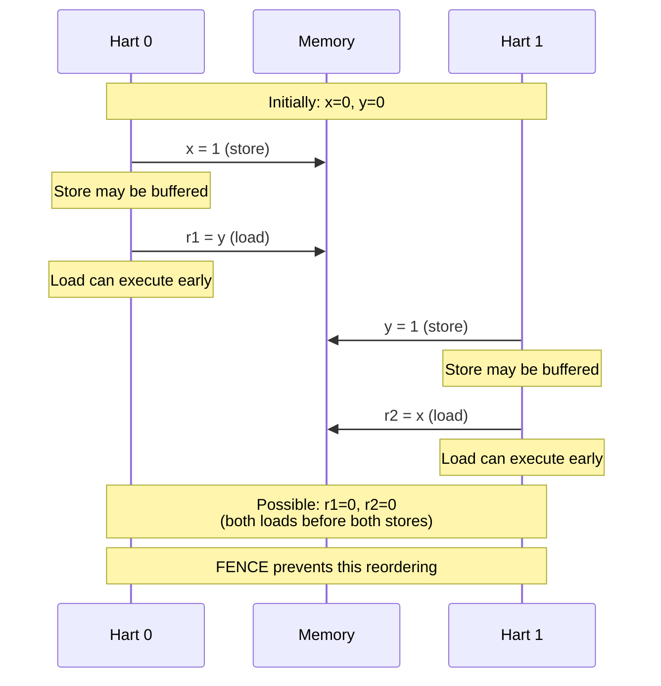

# Chapter 6. Memory Ordering & Synchronization

**Part IV — Memory & Addressing**

---

現代處理器會 out-of-order 執行指令、重新排序記憶體存取、並使用 cache 來延遲 write 對其他處理器的可見性。這些最佳化對效能至關重要，但它們造成了一個基本問題：當多個處理器存取 shared memory 時，程式實際上意味著什麼？沒有仔細的同步，程式可能會觀察到不可能的行為，其中效果似乎以錯誤的順序發生。

RISC-V 透過 memory consistency model 來解決這個問題，該模型定義了哪些記憶體存取順序是合法的，以及在需要時強制執行順序的同步 primitive。RISC-V Weak Memory Ordering (RVWMO) model 允許積極的重新排序以提高效能，同時提供 fence instruction 和 atomic operation 在需要時強制執行順序。理解 memory ordering 對於任何撰寫 concurrent code、實作同步 primitive、或最佳化 multi-threaded application 的人都至關重要。

本章深入探討 RISC-V 的 memory model：RVWMO consistency model、用於強制執行順序的 fence instruction、用於 lock-free synchronization 的 atomic instruction、提供更強順序的 Total Store Ordering (RVTSO) extension、以及與 ARM 和 x86 memory model 的比較。我們將看到如何在 RISC-V 上正確實作 lock、barrier 和 lock-free data structure。

---

## 6.1 Memory Consistency Model

**Memory Ordering 問題**

現代處理器不會按照程式中出現的順序執行指令。它們重新排序 load 和 store、out-of-order 執行指令、並使用 store buffer 和 cache，這些可能會延遲 write 對其他處理器的可見性。這些最佳化對效能至關重要，但它們造成了一個問題：當多個處理器存取 shared memory 時，程式實際上 *意味著* 什麼？

考慮這個簡單的例子，有兩個處理器：

```
Processor 0:          Processor 1:
x = 1                 y = 1
r1 = y                r2 = x
```

最初，`x = 0` 和 `y = 0`。兩個處理器執行後，`r1` 和 `r2` 的可能值是什麼？

在 sequentially consistent system 中，有三種可能的結果：

- `r1 = 0, r2 = 1`（P0 先執行）
- `r1 = 1, r2 = 0`（P1 先執行）
- `r1 = 1, r2 = 1`（store 在 load 之前發生）

但在像 RISC-V 這樣的 weakly ordered system 中，有第四種可能性：

- `r1 = 0, r2 = 0`（兩個 load 都在兩個 store 變得可見之前執行）

這是因為每個處理器可以將自己的 store 重新排序到 load 之後。對 `x` 的 store 可能在 P0 的 store buffer 中，而 P0 執行從 `y` 的 load。P1 也類似。兩個 load 都看到舊值（0），即使兩個 store 最終都完成了。

這種行為令人驚訝，如果程式設計師不小心，可能會導致 bug。但它對效能也至關重要。強制 sequential consistency 需要在每次記憶體操作時 stall 處理器，這會慢得無法接受。

**Sequential Consistency (SC)**

Sequential consistency 是最簡單、最直觀的 memory model。它由 Leslie Lamport 在 1979 年定義：「任何執行的結果都與所有處理器的操作以某種順序執行相同，並且每個處理器的操作在該序列中按其程式指定的順序出現。」

換句話說：

1. 所有記憶體操作似乎以某種 total order 執行
2. 每個處理器的操作在該 total order 中按 program order 出現

SC 易於推理——程式的行為就像一次執行一條指令，按順序執行。但 SC 也很限制。它禁止許多最佳化：

- Store buffer（store 必須立即可見）
- Load 的 out-of-order execution
- Speculative load
- Non-blocking cache

現代處理器不實作 SC，因為效能成本太高。

**Weak Memory Model**

Weak memory model 放寬了順序要求，以允許更多最佳化。它們允許重新排序記憶體操作，並使用明確的同步指令（如 fence）在需要時強制執行順序。

關鍵洞察是大多數記憶體操作不需要嚴格的順序。如果 thread 在 local data 上計算，load 和 store 是否重新排序並不重要——沒有其他 thread 可以觀察到差異。順序只在同步點重要：獲取 lock、釋放 lock、或在 thread 之間通訊時。

Weak memory model 使這些同步點明確。程式設計師（或編譯器）插入 fence instruction 或使用具有順序語義的 atomic operation 來強制執行必要的順序。在同步點之間，硬體可以自由地重新排序操作以提高效能。

**RISC-V Weak Memory Ordering (RVWMO)**

RISC-V 使用稱為 RVWMO（RISC-V Weak Memory Ordering）的 weak memory model。它類似於 ARM 和 Power 的 memory model，但具有精確定義允許哪些行為的正式規範。

RVWMO 允許廣泛的重新排序：

- Load 可以與其他 load 重新排序
- Store 可以與其他 store 重新排序
- Load 可以與 store 重新排序
- Store 可以與 load 重新排序

唯一 *不* 重新排序的操作是那些具有明確 dependency 的操作或由 fence instruction 分隔的操作。

這聽起來可能很混亂，但實際上，大多數程式不需要擔心它。Single-threaded 程式的行為符合預期（處理器在 thread 內保持 sequential execution 的錯覺）。Multithreaded 程式使用 lock、atomic 和其他同步 primitive，這些包含必要的 fence。

RVWMO 取得平衡：它足夠弱以允許積極的最佳化，但足夠強以支援高效的同步 primitive。

---

## 6.2 RISC-V Memory Model (RVWMO)

**Program Order vs Memory Order**

要理解 RVWMO，我們需要區分兩個概念：

*Program order* 是指令在程式中出現的順序。如果指令 A 在程式中出現在指令 B 之前，我們說 A 在 program order 中先於 B。

*Memory order* 是記憶體操作對其他 hart（RISC-V 對 hardware thread 的術語）變得可見的順序。這是其他 hart 從記憶體讀取時觀察到的順序。

在 sequentially consistent system 中，memory order 等於 program order。在 RVWMO 中，由於重新排序，memory order 可能與 program order 不同。

**Load 和 Store Ordering Rule**

RVWMO 允許以下重新排序：

1. **Load → Load**：Load 可以在較早的 load 之前重新排序（除非它們有 dependency 或由 fence 分隔）

2. **Load → Store**：Load 可以在較早的 store 之前重新排序（除非它們有 dependency 或由 fence 分隔）

3. **Store → Store**：Store 可以在較早的 store 之前重新排序（除非它們在 address 上重疊或由 fence 分隔）

4. **Store → Load**：Store 可以在較早的 load 之前重新排序（除非它們在 address 上重疊或由 fence 分隔）

關鍵例外是：

- 對重疊 address 的操作不會重新排序
- 由 FENCE instruction 分隔的操作不會重新排序
- 具有 syntactic dependency 的操作不會重新排序

**Preserved Program Order (PPO)**

並非所有 program order 都會丟失。RVWMO 定義了 *Preserved Program Order* (PPO)——保證在 memory order 中遵守的 program order 子集。

PPO 包括：

1. **重疊 address**：如果兩個記憶體操作存取重疊的 address，它們不會重新排序。例如，對 address X 的 store 後跟從 address X 的 load 將按順序執行。

2. **明確同步**：由 FENCE instruction 分隔的操作保持其順序。

3. **Acquire/Release**：具有 `.aq`（acquire）或 `.rl`（release）後綴的 atomic operation 強制執行順序。

4. **Syntactic dependency**：如果後面的指令使用前面指令的結果，它們按順序執行。例如：

   ```assembly
   ld a0, 0(a1)      # 從 a1 中的 address load
   ld a2, 0(a0)      # 從 a0 中的 address load（依賴於第一個 load）
   ```

   第二個 load 依賴於第一個，因此它們不能重新排序。

5. **Control dependency**：如果後面的指令在控制上依賴於前面的指令（例如，在 branch 之後），則保留某些順序。

PPO 是 RVWMO 的基礎。它定義了硬體必須遵守的最小順序。其他一切都可以重新排序。

**Global Memory Order**

RVWMO 要求存在 *global memory order*——所有 hart 上所有記憶體操作的 total order，與每個 hart 的 PPO 一致。

這並不意味著操作實際上按此順序執行。它意味著可觀察的效果必須與某個這樣的順序 *一致*。硬體可以重新排序、緩衝和快取操作，只要最終結果看起來像它們以某個有效的 global order 執行。

這個屬性稱為 *multi-copy atomicity*。當 store 對一個 hart 變得可見時，它在 global memory order 中的同一點對所有 hart 變得可見。不存在 hart A 看到 store 但 hart B 看不到的狀態（假設兩者都在讀取相同的 address）。

Multi-copy atomicity 簡化了對 concurrent program 的推理。這意味著你不必擔心 store 以不同的速率傳播到不同的 hart。

**Figure 6.1: Memory Ordering Example**



---

## 6.3 Memory Ordering Instruction

**FENCE Instruction**

FENCE instruction 強制執行記憶體操作之間的順序。它防止 fence 之前的操作與 fence 之後的操作重新排序。

基本語法是：

```assembly
fence pred, succ
```

其中 `pred`（predecessor）和 `succ`（successor）指定哪些類型的操作被排序：

- `r`：Read（load）
- `w`：Write（store）
- `rw`：Read 和 write

常見的 fence 變體：

**FENCE rw, rw**（full fence）：

```assembly
fence rw, rw
```

將 fence 之前的所有記憶體操作與 fence 之後的所有記憶體操作排序。這是最強的 fence——它防止所有跨 fence 的重新排序。

**FENCE w, w**（store-store fence）：

```assembly
fence w, w
```

將 fence 之前的 store 與 fence 之後的 store 排序。Load 仍然可以重新排序。這對於確保一系列 store 按順序變得可見很有用。

**FENCE r, r**（load-load fence）：

```assembly
fence r, r
```

將 fence 之前的 load 與 fence 之後的 load 排序。Store 仍然可以重新排序。

**FENCE r, rw**（acquire fence）：

```assembly
fence r, rw
```

將 fence 之前的 load 與 fence 之後的所有操作排序。這用於 acquire semantic（例如，獲取 lock 後）。

**FENCE rw, w**（release fence）：

```assembly
fence rw, w
```

將 fence 之前的所有操作與 fence 之後的 store 排序。這用於 release semantic（例如，釋放 lock 之前）。

**範例：Message Passing**

考慮經典的 message-passing pattern：

```assembly
# Producer (Hart 0)
    sw a0, 0(s0)      # Write data
    fence w, w        # 確保 data 在 flag 之前寫入
    sw a1, 0(s1)      # Write flag

# Consumer (Hart 1)
loop:
    lw t0, 0(s1)      # Read flag
    beqz t0, loop     # 等待 flag
    fence r, r        # 確保 flag 在 data 之前讀取
    lw t1, 0(s0)      # Read data
```

Producer 寫入 data，然後設置 flag。Consumer 等待 flag，然後讀取 data。Fence 確保：

1. Data write 在 flag write 之前發生（producer）
2. Flag read 在 data read 之前發生（consumer）

沒有 fence，硬體可能會重新排序操作，consumer 可能會讀取過時的 data。

**FENCE.I: Instruction Fence**

FENCE.I 同步 instruction 和 data stream。它確保所有先前對 instruction memory 的 store 對後續的 instruction fetch 可見。

這對於以下情況是必需的：

- **Self-modifying code**：如果程式將新指令寫入記憶體，FENCE.I 確保這些指令被正確 fetch。
- **JIT compilation**：JIT compiler 在 runtime 生成 code。在將 code 寫入記憶體後，它在跳轉到新 code 之前執行 FENCE.I。
- **Dynamic linking**：載入 shared library 涉及將 code 寫入記憶體。

範例：

```assembly
    # 將新指令寫入記憶體
    sw a0, 0(s0)

    # 確保 instruction cache 看到新指令
    fence.i

    # 跳轉到新 code
    jalr s0
```

FENCE.I 相對昂貴——它可能需要 flush instruction cache。應該謹慎使用。

**FENCE.TSO: Total Store Ordering**

FENCE.TSO 提供類似 x86 的 memory ordering。它等同於 `FENCE rw, rw`，但在某些 microarchitecture 上可能實作得更有效率。

TSO（Total Store Ordering）是 x86 處理器使用的 memory model。它比 RVWMO 更強：

- Load 不與 load 重新排序
- Store 不與 store 重新排序
- Load 不與較早的 store 重新排序
- Store *可以* 與較早的 load 重新排序（唯一的放寬）

FENCE.TSO 對於將 x86 code 移植到 RISC-V 很有用。不需要分析 code 以確定需要哪些 fence，你可以在同步點插入 FENCE.TSO 並獲得類似 x86 的行為。

**Acquire 和 Release Semantic**

Atomic operation（來自 A extension）可以具有 `.aq`（acquire）或 `.rl`（release）後綴，強制執行順序：

- **Acquire**（`.aq`）：atomic 之後的記憶體操作不能在它之前重新排序。這在獲取 lock 時使用——你想確保對受保護 data 的存取在獲取 lock 之後發生。

- **Release**（`.rl`）：atomic 之前的記憶體操作不能在它之後重新排序。這在釋放 lock 時使用——你想確保對受保護 data 的存取在釋放 lock 之前發生。

範例：

```assembly
# Acquire lock
acquire_loop:
    lr.w.aq t0, 0(a0)     # Load-reserved with acquire
    bnez t0, acquire_loop # 如果 locked 則等待
    li t1, 1
    sc.w t1, t1, 0(a0)    # Store-conditional
    bnez t1, acquire_loop # 如果失敗則重試

    # Critical section - 存取受保護的 data
    lw t2, 0(s0)
    addi t2, t2, 1
    sw t2, 0(s0)

# Release lock
    sw zero, 0(a0)        # Clear lock (with release semantics)
    fence rw, w           # Release fence
```

LR 上的 `.aq` 確保 critical section 中的 load/store 不會在 lock acquisition 之前移動。Release fence 確保它們不會在 lock release 之後移動。

---

## 6.4 Atomic Operation (A Extension)

**A Extension**

A（Atomic）extension 提供用於同步的 atomic memory operation。它包括：

- Load-Reserved / Store-Conditional (LR/SC)
- Atomic Memory Operation (AMO)

這些操作對於實作 lock、semaphore 和 lock-free data structure 至關重要。

**Load-Reserved / Store-Conditional (LR/SC)**

LR/SC 是一對指令，它們一起實作 atomic read-modify-write：

**LR.W / LR.D**（Load-Reserved）：

```assembly
lr.w rd, (rs1)      # 從 rs1 中的 address load word
lr.d rd, (rs1)      # 從 rs1 中的 address load doubleword
```

LR 從記憶體載入一個值並在該記憶體位置建立 *reservation*。Reservation 追蹤是否有任何其他 hart 寫入該位置。

**SC.W / SC.D**（Store-Conditional）：

```assembly
sc.w rd, rs2, (rs1)  # 將 word store 到 rs1 中的 address
sc.d rd, rs2, (rs1)  # 將 doubleword store 到 rs1 中的 address
```

SC 嘗試將值 store 到記憶體。只有在 reservation 仍然有效（沒有其他 hart 寫入該位置）時才成功。SC 在成功時將 0 寫入 `rd`，在失敗時寫入非零值。

**LR/SC 範例：Atomic Increment**

```assembly
atomic_increment:
    lr.w t0, 0(a0)        # Load current value
    addi t0, t0, 1        # Increment
    sc.w t1, t0, 0(a0)    # 嘗試 store
    bnez t1, atomic_increment  # 如果失敗則重試
```

這實作了 atomic increment。如果另一個 hart 在 LR 和 SC 之間修改了該位置，SC 失敗，我們重試。

**Reservation Set**

Reservation 不一定在單個 address 上。硬體維護一個 *reservation set*——包含 LR 載入的 address 的 byte 集合。如果任何 hart 寫入 reservation set 中的任何 byte，reservation 就會失效。

Reservation set 是 implementation-defined，但它必須至少包含 LR 載入的 byte。它可能小到單個 word，或大到 cache line。

這意味著 SC 可能會虛假失敗——即使沒有其他 hart 寫入確切的 address，如果另一個 hart 寫入同一 reservation set 中的附近 address，SC 也可能失敗。使用 LR/SC 的 code 必須透過重試來處理虛假失敗。

**LR/SC 指南**

為了使 LR/SC 正確工作：

1. **LR 和 SC 之間的最小 code**：Reservation 可能被 interrupt、context switch 或其他 hart 的 store 破壞。保持 critical section 小。

2. **沒有其他記憶體操作**：某些實作如果 hart 在 LR 和 SC 之間執行任何其他記憶體操作，則會使 reservation 失效。避免在 LR 和 SC 之間進行 load 或 store。

3. **總是在失敗時重試**：SC 可能會虛假失敗。總是檢查結果並重試。

4. **Forward progress**：實作必須保證如果沒有其他 hart 競爭，LR/SC 最終會成功。這防止了 livelock。

**Atomic Memory Operation (AMO)**

AMO 是單個指令，原子地讀取、修改和寫入記憶體。對於常見操作（如 increment、swap 或 bitwise operation），它們比 LR/SC 更簡單。

A extension 定義了這些 AMO：

**AMOSWAP**：Atomic swap

```assembly
amoswap.w rd, rs2, (rs1)   # Atomically: rd = mem[rs1]; mem[rs1] = rs2
amoswap.d rd, rs2, (rs1)
```

**AMOADD**：Atomic add

```assembly
amoadd.w rd, rs2, (rs1)    # Atomically: rd = mem[rs1]; mem[rs1] += rs2
amoadd.d rd, rs2, (rs1)
```

**AMOAND, AMOOR, AMOXOR**：Atomic bitwise operation

```assembly
amoand.w rd, rs2, (rs1)    # Atomically: rd = mem[rs1]; mem[rs1] &= rs2
amoor.w rd, rs2, (rs1)     # Atomically: rd = mem[rs1]; mem[rs1] |= rs2
amoxor.w rd, rs2, (rs1)    # Atomically: rd = mem[rs1]; mem[rs1] ^= rs2
```

**AMOMIN, AMOMAX**：Atomic min/max（signed）

```assembly
amomin.w rd, rs2, (rs1)    # Atomically: rd = mem[rs1]; mem[rs1] = min(mem[rs1], rs2)
amomax.w rd, rs2, (rs1)    # Atomically: rd = mem[rs1]; mem[rs1] = max(mem[rs1], rs2)
```

**AMOMINU, AMOMAXU**：Atomic min/max（unsigned）

```assembly
amominu.w rd, rs2, (rs1)   # Atomically: rd = mem[rs1]; mem[rs1] = min_u(mem[rs1], rs2)
amomaxu.w rd, rs2, (rs1)   # Atomically: rd = mem[rs1]; mem[rs1] = max_u(mem[rs1], rs2)
```

所有 AMO 都可以具有 `.aq` 和/或 `.rl` 後綴以提供 acquire/release semantic。

**AMO 範例：Spinlock**

使用 AMOSWAP 實作簡單的 spinlock：

```assembly
# Acquire spinlock
acquire_spinlock:
    li t0, 1
    amoswap.w.aq t1, t0, 0(a0)  # Swap 1 into lock, get old value
    bnez t1, acquire_spinlock    # 如果已經 locked (old value != 0)，重試

    # Critical section
    # ...

# Release spinlock
    amoswap.w.rl zero, zero, 0(a0)  # Swap 0 into lock (release)
```

`.aq` 在 acquire 上確保 critical section 不會在 lock acquisition 之前執行。`.rl` 在 release 上確保 critical section 不會在 lock release 之後執行。

**AMO vs LR/SC**

何時使用 AMO vs LR/SC？

**使用 AMO 當**：

- 操作簡單（swap, add, bitwise）
- 你想要更簡單的 code
- 你想要更好的效能（單個指令）

**使用 LR/SC 當**：

- 操作複雜（需要多個步驟）
- 你需要 ABA-safe update（LR/SC 檢測任何 intervening write）
- 你正在實作 lock-free data structure

範例：使用 LR/SC 實作 compare-and-swap (CAS)：

```assembly
# CAS: if (*addr == expected) { *addr = desired; return true; } else { return false; }
compare_and_swap:
    lr.w t0, 0(a0)           # Load current value
    bne t0, a1, cas_fail     # 如果 != expected，失敗
    sc.w t1, a2, 0(a0)       # 嘗試 store desired
    bnez t1, compare_and_swap # 如果 SC 失敗，重試
    li a0, 1                 # 成功
    ret
cas_fail:
    li a0, 0                 # 失敗
    ret
```

---

## 6.5 Total Store Ordering (RVTSO) Extension

**RVTSO Extension**

RVTSO（RISC-V Total Store Ordering）extension 提供比 RVWMO 更強的 memory ordering，與 x86 的 TSO model 相容。

在 RVTSO 下，允許的唯一重新排序是 store-load reordering（store 可以與較早的 load 重新排序）。所有其他順序都被保留：

- Load → Load：保留
- Load → Store：保留
- Store → Store：保留
- Store → Load：**可以重新排序**（唯一的放寬）

這比 RVWMO 強得多，RVWMO 允許所有四種重新排序。

**為什麼使用 RVTSO？**

RVTSO 的主要用例是 **x86 code 移植**。x86 處理器使用 TSO memory model，許多 x86 程式依賴於 TSO 的強順序保證。將這些程式移植到 RISC-V 時，你可以：

1. **選項 A**：仔細分析 code 並插入必要的 fence（困難且容易出錯）
2. **選項 B**：使用 RVTSO extension（簡單但可能犧牲效能）

RVTSO 使移植更容易，但可能會降低效能，因為它限制了硬體可以執行的最佳化。

**RVTSO 實作**

RVTSO 是可選的 extension。支援它的處理器可以在 RVWMO 和 RVTSO 模式之間切換（通常透過 CSR bit）。

在 RVTSO 模式下：

- 硬體自動強制執行更強的順序
- 不需要明確的 fence（除了 store-load ordering）
- Code 的行為類似於在 x86 上

**RVTSO vs RVWMO 效能**

RVTSO 的效能影響取決於 microarchitecture：

- **In-order processor**：影響最小（它們無論如何都不會重新排序太多）
- **Out-of-order processor**：可能顯著（限制了 load/store reordering）

對於大多數 RISC-V 實作，RVWMO 是首選，因為它允許更好的效能。RVTSO 主要用於相容性。

---

## 6.6 與 ARM 和 x86 的比較

**RISC-V (RVWMO) vs ARM**

ARM 和 RISC-V 都使用 weak memory model，但有一些差異：

**相似之處**：

- 兩者都允許廣泛的重新排序（load-load, load-store, store-store, store-load）
- 兩者都使用 fence instruction 和 acquire/release semantic
- 兩者都提供 LR/SC（ARM 稱為 LDREX/STREX 或 LDXR/STXR）和 AMO

**差異**：

- **正式規範**：RISC-V 有更正式、更精確的 memory model 規範
- **Fence 語法**：RISC-V 使用 `fence pred, succ`；ARM 使用 DMB/DSB/ISB
- **Acquire/Release**：RISC-V 使用 `.aq`/`.rl` 後綴；ARM 使用單獨的指令（LDAR/STLR）
- **Multi-copy atomicity**：RISC-V 保證 multi-copy atomicity；ARM 在某些版本中不保證

總體而言，RISC-V 和 ARM 的 memory model 非常相似，從一個移植到另一個相對簡單。

**RISC-V (RVWMO) vs x86 (TSO)**

x86 使用 TSO（Total Store Ordering），比 RISC-V 的 RVWMO 強得多：

| Reordering | RVWMO | x86 TSO |
|------------|-------|---------|
| Load → Load | 允許 | **禁止** |
| Load → Store | 允許 | **禁止** |
| Store → Store | 允許 | **禁止** |
| Store → Load | 允許 | 允許 |

x86 只允許 store-load reordering。所有其他順序都被保留。

**影響**：

- **x86 程式更容易撰寫**：更強的順序意味著更少的驚喜
- **RISC-V 程式需要更多 fence**：必須明確同步
- **RISC-V 可以更快**：更弱的 model 允許更多最佳化

**從 x86 移植到 RISC-V**：

- **選項 1**：使用 RVTSO extension（如果可用）
- **選項 2**：在同步點插入 fence
- **選項 3**：使用 atomic operation 與 acquire/release

**從 RISC-V 移植到 x86**：

- 通常很簡單——x86 的更強順序意味著 RISC-V fence 通常是不必要的
- 但要小心：某些 RISC-V idiom 可能在 x86 上不需要，但移除它們可能會破壞可移植性

---

## 6.7 常見同步 Pattern

**Spinlock**

使用 AMOSWAP 的簡單 spinlock：

```c
typedef struct {
    int locked;
} spinlock_t;

void spin_lock(spinlock_t *lock) {
    int expected = 0;
    while (__atomic_exchange_n(&lock->locked, 1, __ATOMIC_ACQUIRE) != 0) {
        // Spin
        while (__atomic_load_n(&lock->locked, __ATOMIC_RELAXED) != 0) {
            // Pause (減少 bus traffic)
        }
    }
}

void spin_unlock(spinlock_t *lock) {
    __atomic_store_n(&lock->locked, 0, __ATOMIC_RELEASE);
}
```

Assembly 版本：

```assembly
spin_lock:
    li t0, 1
acquire_loop:
    amoswap.w.aq t1, t0, 0(a0)
    beqz t1, acquired
spin_wait:
    lw t1, 0(a0)
    bnez t1, spin_wait
    j acquire_loop
acquired:
    ret

spin_unlock:
    amoswap.w.rl zero, zero, 0(a0)
    ret
```

**Mutex with Futex**

對於可能長時間持有的 lock，spinning 會浪費 CPU。更好的方法是使用 futex（fast userspace mutex）在 lock 被持有時 block：

```c
void mutex_lock(int *lock) {
    int c;
    // 快速路徑：嘗試 acquire
    if ((c = __atomic_exchange_n(lock, 1, __ATOMIC_ACQUIRE)) == 0)
        return;

    // 慢速路徑：等待
    do {
        if (c == 2 || __atomic_exchange_n(lock, 2, __ATOMIC_ACQUIRE) != 0)
            futex_wait(lock, 2);  // System call to block
    } while ((c = __atomic_exchange_n(lock, 2, __ATOMIC_ACQUIRE)) != 0);
}

void mutex_unlock(int *lock) {
    if (__atomic_exchange_n(lock, 0, __ATOMIC_RELEASE) == 2)
        futex_wake(lock, 1);  // System call to wake one waiter
}
```

**Barrier**

Barrier 確保所有 thread 在繼續之前都到達某個點：

```c
typedef struct {
    int count;
    int total;
    int sense;
} barrier_t;

void barrier_wait(barrier_t *b) {
    int local_sense = !b->sense;

    // Atomically decrement count
    if (__atomic_sub_fetch(&b->count, 1, __ATOMIC_ACQ_REL) == 0) {
        // Last thread: reset and flip sense
        b->count = b->total;
        __atomic_store_n(&b->sense, local_sense, __ATOMIC_RELEASE);
    } else {
        // Wait for sense to flip
        while (__atomic_load_n(&b->sense, __ATOMIC_ACQUIRE) != local_sense) {
            // Spin
        }
    }
}
```

**Lock-Free Stack**

使用 LR/SC 實作 lock-free stack：

```c
typedef struct node {
    void *data;
    struct node *next;
} node_t;

typedef struct {
    node_t *head;
} stack_t;

void push(stack_t *stack, node_t *node) {
    node_t *old_head;
    do {
        old_head = __atomic_load_n(&stack->head, __ATOMIC_RELAXED);
        node->next = old_head;
    } while (!__atomic_compare_exchange_n(&stack->head, &old_head, node,
                                          0, __ATOMIC_RELEASE, __ATOMIC_RELAXED));
}

node_t *pop(stack_t *stack) {
    node_t *head, *next;
    do {
        head = __atomic_load_n(&stack->head, __ATOMIC_ACQUIRE);
        if (head == NULL)
            return NULL;
        next = head->next;
    } while (!__atomic_compare_exchange_n(&stack->head, &head, next,
                                          0, __ATOMIC_ACQUIRE, __ATOMIC_RELAXED));
    return head;
}
```

Assembly 版本（使用 LR/SC）：

```assembly
# push(stack_t *stack, node_t *node)
push:
    ld t0, 0(a0)           # Load current head
    sd t0, 8(a1)           # node->next = head
push_retry:
    lr.d.aq t0, 0(a0)      # Load-reserved head
    sd t0, 8(a1)           # node->next = head (update)
    sc.d.rl t1, a1, 0(a0)  # Try to store new head
    bnez t1, push_retry    # Retry if failed
    ret

# pop(stack_t *stack)
pop:
pop_retry:
    lr.d.aq a1, 0(a0)      # Load-reserved head
    beqz a1, pop_empty     # If NULL, return NULL
    ld t0, 8(a1)           # next = head->next
    sc.d.aq t1, t0, 0(a0)  # Try to store next as new head
    bnez t1, pop_retry     # Retry if failed
    mv a0, a1              # Return old head
    ret
pop_empty:
    li a0, 0
    ret
```

**Message Passing**

經典的 message-passing pattern：

```assembly
# Producer
    sw a0, 0(s0)       # Write data
    fence rw, w        # Release fence
    sw a1, 0(s1)       # Write flag

# Consumer
    lw t0, 0(s1)       # Read flag
    fence r, rw        # Acquire fence
    lw t1, 0(s0)       # Read data
```

**Dekker's Algorithm**

不使用 atomic operation 的 mutual exclusion：

```assembly
# Hart 0
    li t0, 1
    sw t0, flag0       # flag0 = 1
    fence w, rw
    lw t1, flag1       # Read flag1
    bnez t1, wait      # 如果 flag1 設置，等待
    # Critical section
    sw zero, flag0     # flag0 = 0
```

這些 pattern 依賴於仔細放置 fence 以確保在 RVWMO 下的正確性。

**Debugging Memory Ordering Issue**

Memory ordering bug 非常難以 debug：

- 它們可能很少發生且不確定
- 它們可能不會在某些硬體上出現
- 當添加 debugging code 時它們可能會消失

策略：

- 使用 memory model checking tool（例如 herd7、rmem）
- 添加 assertion 來檢查 invariant
- 使用 thread sanitizer（例如 ThreadSanitizer）
- 在高競爭下測試
- 仔細審查同步 code

RISC-V memory model 是正式指定的，這允許使用 formal verification tool 來證明正確性。

---

## Summary

Memory ordering 是 concurrent programming 最微妙和最具挑戰性的方面之一。現代處理器為了效能而重新排序記憶體存取，創造出從 sequential 角度看似乎不可能的行為。RISC-V 的 memory model 定義了哪些重新排序是合法的，並提供同步 primitive 在需要時強制執行順序。

RISC-V Weak Memory Ordering (RVWMO) model 允許積極的重新排序：load 可以與 load 重新排序、store 與 store 重新排序、load 與較早的 store 重新排序。預設情況下只保留 store-load ordering。這個 weak model 實現了高效能，但需要明確的同步。該 model 使用 happens-before relationship 和 preserved program order 正式指定，允許對 concurrent algorithm 進行 formal verification。

Fence instruction 強制執行 memory ordering。具有 predecessor 和 successor set（r、w、rw）的 FENCE 在記憶體操作之間創建順序。FENCE RW, RW 是防止所有重新排序的 full barrier。FENCE W, W 排序 store（用於 publish）。FENCE R, RW 在後續存取之前排序 load（用於 acquire）。FENCE RW, W 在 store 之前排序所有存取（用於 release）。FENCE.I 在 code modification 後同步 instruction 和 data cache。

Atomic instruction 提供對同步至關重要的不可分割的 read-modify-write operation。Load-Reserved/Store-Conditional (LR/SC) 實作 lock-free algorithm：LR load 並 reserve，SC 只有在 reservation 仍然有效時才 store。Atomic Memory Operation (AMO)（如 AMOSWAP、AMOADD 和 AMOAND）直接執行 atomic operation。Acquire 和 release annotation（`.aq`、`.rl`）提供順序而無需單獨的 fence。

Total Store Ordering (RVTSO) extension 提供與 x86 的 TSO model 相容的更強順序。RVTSO 保留除 store-load 之外的所有順序，使移植 x86 code 更容易，但可能會降低效能。大多數 RISC-V 實作使用 RVWMO 以獲得更好的效能，但 RVTSO 可用於相容性。

常見的同步 pattern 包括 spinlock（使用 AMOSWAP 或 LR/SC）、mutex（使用 futex system call 進行 blocking）、barrier（使用 atomic counter）和 lock-free data structure（使用 LR/SC 進行 ABA-safe update）。每個 pattern 都需要仔細放置 fence 以確保在 RVWMO 下的正確性。

與 ARM 和 x86 相比，RISC-V 的 memory model 類似於 ARM（兩者都是 weakly ordered），但更簡單且更正式地指定。x86 的 TSO model 更強，預設保留更多順序，這簡化了程式設計但可能會降低效能。RISC-V 的 RVTSO extension 在需要時提供 x86 相容性。

Memory ordering bug 非常難以 debug——它們很少發生、不確定，並且在添加 debugging code 時可能會消失。策略包括使用 memory model checking tool（herd7、rmem）、thread sanitizer（ThreadSanitizer）、formal verification 和仔細的 code review。RISC-V 的 formal memory model specification 實現了對 concurrent algorithm 的嚴格驗證。
