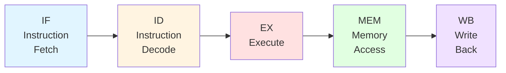
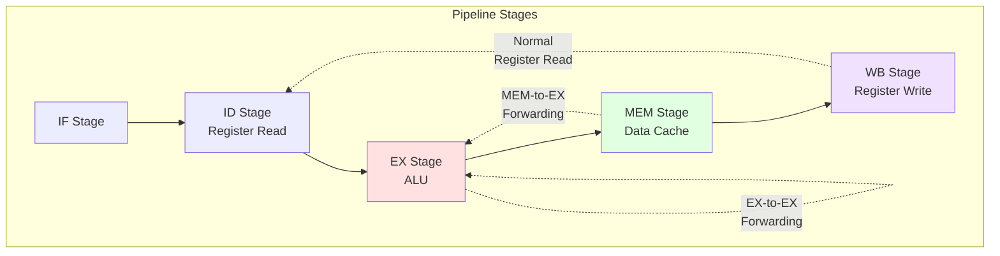

# Chapter 7. RISC-V Pipeline Fundamentals

**Part V — Pipeline & Microarchitecture**

---

Pipeline 是現代處理器設計的核心。它是允許處理器同時處理多條指令的機制，大幅提高 throughput。在本章中，我們將探討 RISC-V 處理器如何實作 pipelining，從經典的 five-stage pipeline 到處理 hazard 和 branch 的進階技術。

理解 pipeline 對於任何使用 RISC-V 的人都至關重要，無論你是設計硬體、撰寫編譯器，還是最佳化效能關鍵的 code。RISC-V 設計的美妙之處在於其乾淨、規則的 instruction set 使其特別適合高效的 pipeline 實作。我們將檢視經典的 five-stage pipeline（Fetch、Decode、Execute、Memory、Writeback）、破壞 pipeline flow 的三種 hazard（structural、data、control）、以及處理它們的技術（forwarding、stalling、branch prediction）。我們還將探討 pipeline depth 如何影響效能和複雜性。

---

## 7.1 Classic Five-Stage Pipeline

Classic five-stage pipeline 是大多數 RISC 處理器設計的基礎。它將指令執行分為五個不同的 stage，允許最多五條指令同時在執行中。讓我們逐一了解每個 stage。

**Figure 7.1: Five-Stage Pipeline Overview**



**Figure 7.2: Pipeline Timing Diagram**

```
Cycle:  1    2    3    4    5    6    7    8    9
I1:     IF   ID   EX   MEM  WB
I2:          IF   ID   EX   MEM  WB
I3:               IF   ID   EX   MEM  WB
I4:                    IF   ID   EX   MEM  WB
I5:                         IF   ID   EX   MEM  WB
```

在 steady state 中，所有五個 stage 都忙於處理不同的指令，達到每個 cycle 一條指令的 throughput（IPC = 1）。

### Instruction Fetch (IF)

**第一個 stage 從記憶體 fetch 下一條指令。** Program counter (PC) 指向要 fetch 的指令的 address。指令從 instruction cache (I-cache) 讀取，如果 cache miss 則從 main memory 讀取。

在 RISC-V 中，所有指令都是 16-bit（compressed，使用 C extension）或 32-bit（standard）。Fetch unit 必須處理兩種格式，儘管在沒有 C extension 的簡單實作中，所有指令都是 32-bit aligned。

```
IF Stage:
  instruction = I-cache[PC]
  next_PC = PC + 4  // 或 PC + 2 for compressed instructions
```

**Fetch bandwidth** 對效能至關重要。可以每個 cycle fetch 多條指令的處理器（superscalar）需要更寬的 fetch path 和更複雜的 PC prediction logic。

### Instruction Decode (ID)

**第二個 stage decode 指令並從 register file 讀取 operand。** Decoder 檢查 opcode 和 function field 以確定要執行什麼操作以及要讀取哪些 register。

RISC-V 的規則 instruction format 使 decoding 變得簡單。所有指令的 opcode 都在 bit [6:0]，register specifier 總是在相同的位置：

- `rs1`（source register 1）：bit [19:15]
- `rs2`（source register 2）：bit [24:20]
- `rd`（destination register）：bit [11:7]

```
ID Stage:
  opcode = instruction[6:0]
  rs1_data = register_file[instruction[19:15]]
  rs2_data = register_file[instruction[24:20]]
  rd_addr = instruction[11:7]
  immediate = decode_immediate(instruction)
```

**Immediate generation** 也是這個 stage 的一部分。RISC-V 有幾種 immediate format（I-type、S-type、B-type、U-type、J-type），decoder 必須正確提取和 sign-extend immediate value。

### Execute (EX)

**第三個 stage 執行實際的計算。** 這是 ALU（Arithmetic Logic Unit）對 source operand 進行操作以產生結果的地方。

對於 arithmetic instruction（如 `ADD`、`SUB`、`AND`），ALU 執行操作。對於 load/store instruction，ALU 透過將 base register 和 offset 相加來計算 memory address。對於 branch，ALU 評估 branch condition。

```
EX Stage:
  case opcode:
    ADD:  result = rs1_data + rs2_data
    SUB:  result = rs1_data - rs2_data
    LOAD: address = rs1_data + immediate
    BEQ:  taken = (rs1_data == rs2_data)
```

**Branch condition evaluation** 在這裡發生。如果 branch 被 taken，pipeline 必須被 flush（更多內容見 Section 7.4）。

### Memory Access (MEM)

**第四個 stage 為 load 和 store instruction 存取 data memory。** 對於 load，從 data cache (D-cache) 讀取 data。對於 store，將 data 寫入 cache。

```
MEM Stage:
  if LOAD:
    load_data = D-cache[address]
  if STORE:
    D-cache[address] = rs2_data
```

**Cache hit or miss** 在這裡確定。Cache miss 可能會 stall pipeline 許多 cycle，直到從 main memory fetch data。

對於非 memory instruction，這個 stage 什麼都不做（或從 EX stage 傳遞結果）。

### Write Back (WB)

**第五個也是最後一個 stage 將結果寫回 register file。** 這是 commit point，指令的效果在架構上變得可見。

```
WB Stage:
  if rd != x0:  // x0 is hardwired to zero
    register_file[rd] = result
```

**RISC-V 的 x0 register** 總是 zero，因此對 x0 的 write 被丟棄。這在硬體中檢查以避免不必要的 register file write。

### Pipeline 範例：執行簡單程式

讓我們追蹤一個簡單的 RISC-V 程式通過 pipeline：

```assembly
# Example: Calculate sum = a + b + c
    lw   x1, 0(x10)    # I1: Load a from memory
    lw   x2, 4(x10)    # I2: Load b from memory
    lw   x3, 8(x10)    # I3: Load c from memory
    add  x4, x1, x2    # I4: x4 = a + b
    add  x5, x4, x3    # I5: x5 = (a + b) + c
    sw   x5, 12(x10)   # I6: Store sum to memory
```

**Cycle-by-cycle execution**（假設沒有 cache miss）：

```
Cycle:  1    2    3    4    5    6    7    8    9    10   11
I1:     IF   ID   EX   MEM  WB
I2:          IF   ID   EX   MEM  WB
I3:               IF   ID   EX   MEM  WB
I4:                    IF   ID   EX   MEM  WB
I5:                         IF   ID   EX   MEM  WB
I6:                              IF   ID   EX   MEM  WB
```

在這個理想情況下，6 條指令在 11 個 cycle 中完成。在 pipeline 填滿後（前 5 個 cycle），我們達到每個 cycle 1 條指令。

---

## 7.2 Pipeline Hazard

如果指令完全獨立，pipelining 將是完美的。不幸的是，它們不是。**Hazard** 是下一條指令無法在下一個 clock cycle 執行的情況。有三種類型的 hazard。

### Structural Hazard

**當兩條指令同時需要相同的硬體資源時，就會發生 structural hazard。** 例如，如果 instruction fetch 和 memory access stage 都需要在同一個 cycle 存取記憶體，就會發生衝突。

在具有單個 memory port 的簡單 RISC-V 實作中，你不能同時 fetch 指令和執行 load/store。解決方案是 stall 一個操作或使用單獨的 instruction 和 data cache（Harvard architecture）。

**Register file port conflict** 是另一個例子。如果 register file 只有一個 write port，你不能在同一個 cycle 寫回兩個結果。大多數 RISC-V 實作透過擁有足夠的 port 或仔細調度操作來避免這種情況。

### Data Hazard

**當指令依賴於尚未完成的先前指令的結果時，就會發生 data hazard。** 有三種類型：

**RAW (Read After Write)** — 最常見的 hazard。指令在先前指令寫入之前嘗試讀取 register：

```assembly
add  x1, x2, x3   # x1 = x2 + x3
sub  x4, x1, x5   # x4 = x1 - x5  (needs x1 from previous instruction)
```

`sub` 指令需要 `x1` 的值，但 `add` 指令還沒有寫入它。這是 **true dependency**，必須小心處理。

**Figure 7.3: RAW Data Hazard**

```
Cycle:           1    2    3    4    5    6    7    8
add x1,x2,x3:    IF   ID   EX   MEM  WB
sub x4,x1,x5:         IF   ID   --   --   EX   MEM  WB
                                └─ stall ─┘
```

沒有 forwarding，`sub` 必須 stall 直到 `add` 在 cycle 5 寫入 `x1`。

**WAR (Write After Read)** — 指令在先前指令讀取之前寫入 register。這是 **anti-dependency**：

```assembly
add  x1, x2, x3   # reads x2
sub  x2, x4, x5   # writes x2
```

在 in-order pipeline 中，WAR hazard 不會發生，因為指令按順序完成。但在 out-of-order processor（Chapter 8）中，它們可能發生。

**WAW (Write After Write)** — 兩條指令寫入相同的 register。這是 **output dependency**：

```assembly
add  x1, x2, x3   # writes x1
sub  x1, x4, x5   # writes x1
```

同樣，這主要是 out-of-order processor 的問題。

### Control Hazard

**當 pipeline 不知道接下來要 fetch 哪條指令時，就會發生 control hazard。** 這發生在 branch 和 jump 時。

考慮 conditional branch：

```assembly
beq  x1, x2, target   # if x1 == x2, jump to target
add  x3, x4, x5       # next instruction if not taken
...
target:
  sub  x6, x7, x8     # target instruction if taken
```

Pipeline 不知道是要 fetch `add` 還是 `sub`，直到在 EX stage 評估 branch condition。到那時，pipeline 已經 speculatively fetch 了下一條指令。

**Branch misprediction** 導致 pipeline bubble（浪費的 cycle），因為 speculatively fetch 的指令必須被丟棄。

**Figure 7.6: Branch Misprediction**

```
Cycle:           1    2    3    4    5    6
beq (taken):     IF   ID   EX   MEM  WB
Wrong Path I1:        IF   ID   XX
Wrong Path I2:             IF   XX
Correct Path:                   IF   ID   EX
                                └─ 3 cycles wasted ─┘
```

當 branch 在 cycle 3 被 resolve 並發現被 mispredicted 時，來自錯誤路徑的指令被 squash，浪費 2-3 個 cycle。

---

## 7.3 Hazard Resolution

處理器使用幾種技術來處理 hazard，而不會過多地 stall pipeline。

### Forwarding (Bypassing)

**Forwarding（也稱為 bypassing）允許在結果寫回 register file 之前使用它。** 這是減少 data hazard stall 的最重要技術。

考慮我們之前的例子：

```assembly
add  x1, x2, x3   # x1 = x2 + x3 (result available at end of EX stage)
sub  x4, x1, x5   # x4 = x1 - x5 (needs x1 in EX stage)
```

沒有 forwarding，`sub` 必須等到 `add` 在 WB stage 寫入 `x1`（3 個 cycle 後）。有了 forwarding，`add` 指令的 EX stage 的結果可以直接 forward 到 `sub` 指令的 EX stage。

**Forwarding path** 是繞過 register file 的 data path：

- **EX-to-EX forwarding**：從 EX stage 到 EX stage 的結果（1 個 cycle 後）
- **MEM-to-EX forwarding**：從 MEM stage 到 EX stage 的結果（2 個 cycle 後）
- **WB-to-EX forwarding**：從 WB stage 到 EX stage 的結果（3 個 cycle 後，但這只是正常的 register file read）

**Figure 7.4: Forwarding Paths**



**Forwarding Logic**（簡化）：

```c
// Forwarding unit logic
if (EX_MEM.RegWrite && (EX_MEM.rd != 0) && (EX_MEM.rd == ID_EX.rs1))
    ForwardA = 01;  // Forward from EX/MEM pipeline register
else if (MEM_WB.RegWrite && (MEM_WB.rd != 0) && (MEM_WB.rd == ID_EX.rs1))
    ForwardA = 10;  // Forward from MEM/WB pipeline register
else
    ForwardA = 00;  // No forwarding, use register file

// Similar logic for rs2 (ForwardB)
```

**有 forwarding 的範例**：

```assembly
add  x1, x2, x3   # I1: x1 = x2 + x3 (result ready at end of EX)
sub  x4, x1, x5   # I2: x4 = x1 - x5 (needs x1 at start of EX)
```

```
Cycle:  1    2    3    4    5    6
I1:     IF   ID   EX   MEM  WB
I2:          IF   ID   EX   MEM  WB
                       ^
                       |
                Forward from I1's EX stage
```

有了 forwarding，I2 可以在 I1 之後立即執行，沒有 stall！

**Forwarding 不能解決所有 data hazard。** 經典的例子是 load 後立即使用：

```assembly
lw   x1, 0(x2)    # load x1 from memory
add  x3, x1, x4   # use x1 immediately
```

Load data 直到 MEM stage 結束才可用，但 `add` 在 EX stage 開始時需要它。即使有 forwarding，也需要 **one-cycle stall**。

**Figure 7.5: Load-Use Hazard**

```
Cycle:           1    2    3    4    5    6    7
lw x1,0(x2):     IF   ID   EX   MEM  WB
add x3,x1,x4:         IF   ID   --   EX   MEM  WB
                                └─ stall ─┘
```

`add` 必須在 cycle 3 stall，因為 load data 直到 cycle 4 結束才準備好。即使有 MEM-to-EX forwarding，我們也需要一個 bubble。

### Pipeline Stall

**當 forwarding 不夠時，pipeline 必須 stall（插入 bubble）。** Stall 凍結較早的 pipeline stage，而較晚的 stage 繼續。

對於上面的 load-use hazard，pipeline 插入一個 one-cycle stall：

```
Cycle:  1    2    3    4    5    6
lw      IF   ID   EX   MEM  WB
add          IF   ID   stall EX  MEM
```

`add` 指令的 ID stage 被保持一個額外的 cycle，在 EX stage 創建一個 bubble。

**Stall detection logic** 監控 pipeline 的 hazard：

```c
// Hazard detection unit
bool load_use_hazard = (ID_EX.MemRead) &&
                       ((ID_EX.rd == IF_ID.rs1) ||
                        (ID_EX.rd == IF_ID.rs2));

if (load_use_hazard) {
    // Stall the pipeline
    PC_write = 0;        // Don't update PC
    IF_ID_write = 0;     // Don't update IF/ID register
    Control_signals = 0; // Insert bubble (nop) in EX stage
}
```

**效能影響**：每個 stall 都會降低 IPC（Instructions Per Cycle）。編譯器嘗試調度指令以盡可能避免 load-use hazard。

**編譯器調度範例**：

```assembly
# Original code (has load-use hazard):
lw   x1, 0(x2)
add  x3, x1, x4    # Stall! (depends on x1)
sub  x5, x6, x7

# Compiler-scheduled code (no hazard):
lw   x1, 0(x2)
sub  x5, x6, x7    # Independent instruction fills the slot
add  x3, x1, x4    # No stall now (x1 is ready)
```

透過重新排序獨立的指令，編譯器可以隱藏 load latency 並避免 stall。

### Compiler Scheduling

**編譯器可以重新排序指令以避免 hazard，而不改變程式語義。** 這稱為 **instruction scheduling** 或 **software pipelining**。

範例：不是這樣（有 load-use hazard）：

```assembly
lw   x1, 0(x2)
add  x3, x1, x4   # stall!
```

編譯器可以重新排序為：

```assembly
lw   x1, 0(x2)
# 插入獨立的指令
add  x3, x1, x4   # no stall
```

這對於 loop 特別有效，編譯器可以將 loop iteration 的操作交錯以隱藏 latency。

---

## 7.4 Branch Handling

Branch 是 pipeline 效能的主要挑戰。每次 branch misprediction 都會浪費幾個 cycle。

### Branch Penalty

在簡單的 five-stage pipeline 中，branch 在 EX stage（cycle 3）被 resolve。如果 branch 被 taken，已經 fetch 的兩條指令（在 IF 和 ID stage）必須被 flush。

**Branch penalty** = 2-3 cycle（取決於 branch 何時 resolve）

對於更深的 pipeline，penalty 更高。這就是為什麼 branch prediction 如此重要。

### Static Branch Prediction

**Static prediction** 在編譯時做出決定，不使用 runtime 資訊：

**Always Not Taken**：假設 branch 永遠不會被 taken。繼續 fetch sequential instruction。如果 branch 實際上被 taken，flush pipeline 並從 target 開始。

**Always Taken**：假設 branch 總是被 taken。立即從 target fetch。如果 branch 實際上沒有被 taken，flush 並繼續 sequential。

**Backward Taken, Forward Not Taken**（BTFNT）：假設 backward branch（loop）被 taken，forward branch（if statement）不被 taken。這是一個簡單但有效的啟發式方法。

### Dynamic Branch Prediction

**Dynamic prediction** 使用 runtime 資訊來預測 branch：

**Branch History Table (BHT)**：一個小的 table，為每個 branch 儲存最近的結果（taken/not taken）。使用 branch PC 的低位作為 index。

**Two-Bit Saturating Counter**：不是只儲存最後一個結果，而是使用 2-bit counter：

- 00: Strongly Not Taken
- 01: Weakly Not Taken
- 10: Weakly Taken
- 11: Strongly Taken

這對於偶爾 misprediction 的 branch 更有彈性。

**Branch Target Buffer (BTB)**：儲存 branch target address，因此如果預測 taken，可以立即 fetch target，而無需等待 branch 計算。

**Return Address Stack (RAS)**：專門用於 function return 的小 stack。`call` 將 return address push 到 RAS，`ret` pop 並預測該 address。這對於 function call 非常準確。

### RISC-V Branch Handling

RISC-V 簡化了 branch handling：

**沒有 delay slot**：與 MIPS 不同，RISC-V 沒有 branch delay slot。Branch 後的指令只有在 branch 沒有被 taken 時才執行。這簡化了編譯器和 pipeline 控制。

**Conditional branch**：`BEQ`、`BNE`、`BLT`、`BGE`、`BLTU`、`BGEU` 在 EX stage 評估 condition。

**Unconditional jump**：`JAL`、`JALR` 總是 taken。`JAL` 的 target 在 decode 時已知（immediate），因此可以更早 resolve。`JALR` 的 target 是 register + offset，需要 register read。

**範例：Branch prediction 的影響**

考慮一個 loop：

```assembly
loop:
    lw   x1, 0(x2)
    addi x1, x1, 1
    sw   x1, 0(x2)
    addi x2, x2, 4
    bne  x2, x3, loop   # Loop 100 times
```

**沒有 prediction**（always not taken）：

- 99 次 misprediction（loop 被 taken 99 次）
- 99 × 3 = 297 cycle penalty

**有 prediction**（BTFNT 或 dynamic）：

- 1 次 misprediction（最後一次 iteration，branch 沒有被 taken）
- 1 × 3 = 3 cycle penalty

Prediction 將 penalty 從 297 cycle 減少到 3 cycle！

---

## 7.5 Trap Handling in Pipeline

Trap（exception 和 interrupt）必須在 pipeline 中小心處理以保持 **precise exception**。

### Precise Exception

**Precise exception** 意味著當 exception 發生時：

1. 所有在 exception instruction 之前的指令都已完成
2. Exception instruction 和之後的指令都沒有修改 architectural state
3. PC 指向 exception instruction（或下一條指令，取決於 exception 類型）

這允許 exception handler 檢查和修復問題，然後恢復執行。

### Pipeline Flush

當 exception 發生時，pipeline 必須被 flush：

```
Cycle:           1    2    3    4    5    6
I1 (normal):     IF   ID   EX   MEM  WB
I2 (exception):       IF   ID   EX   XX
I3:                        IF   ID   XX
I4:                             IF   XX
Exception Handler:                   IF   ID   EX
```

I2 在 EX stage 產生 exception。I3 和 I4（在 pipeline 中的較早 stage）被 flush（標記為 XX）。Exception handler 在 cycle 5 開始執行。

### Imprecise Exception

某些 processor 允許 **imprecise exception**，其中 exception 可能在稍後報告，並且某些後續指令可能已經執行。這簡化了硬體但使 exception handling 更複雜。

RISC-V 通常實作 precise exception，特別是對於 synchronous exception（page fault、illegal instruction）。Asynchronous interrupt 可能不太精確。

### Performance Impact

Exception 和 interrupt 會破壞 pipeline flow：

- **Exception**：flush pipeline，跳轉到 handler（~10-20 cycle overhead）
- **Interrupt**：類似，但可能更頻繁（timer interrupt、I/O interrupt）

高效能系統最小化 exception/interrupt 頻率並優化 handler。

---

## 7.6 Pipeline Depth and Performance

Pipeline depth（stage 數量）是設計權衡。

### Deeper Pipeline

**優點**：

- **更高的 clock frequency**：每個 stage 做更少的工作，可以更快地 clock
- **更高的 throughput**（理論上）：更多指令同時在執行中

**缺點**：

- **更高的 branch misprediction penalty**：更多 stage 需要 flush
- **更複雜的 hazard handling**：更多 forwarding path，更多 stall
- **更高的 power consumption**：更多 pipeline register，更多 control logic

### Shallow Pipeline

**優點**：

- **更低的 misprediction penalty**：更少的 stage 需要 flush
- **更簡單的 control**：更少的 hazard，更少的 forwarding
- **更低的 power**：更少的 pipeline register

**缺點**：

- **更低的 clock frequency**：每個 stage 做更多工作
- **更低的 throughput**（理論上）

### Optimal Depth

最佳 pipeline depth 取決於：

- **Workload**：Branch-heavy code 偏好 shallow pipeline；compute-heavy code 可以容忍 deeper pipeline
- **Technology**：更先進的 process node 允許更高的 frequency，有利於 deeper pipeline
- **Power budget**：Mobile/embedded 系統偏好 shallow pipeline 以節省 power

現代 RISC-V core 範圍：

- **Embedded**（E-series）：3-5 stage
- **Application**（U-series）：5-8 stage
- **High-performance**（P-series）：10-15 stage

### Multi-Issue Pipeline

**Single-issue** pipeline 每個 cycle 執行一條指令（IPC ≤ 1）。

**Multi-issue** (superscalar) pipeline 每個 cycle 執行多條指令（IPC > 1）：

- **2-issue**：每個 cycle 最多 2 條指令
- **4-issue**：每個 cycle 最多 4 條指令

Multi-issue 需要：

- 更寬的 fetch/decode/execute unit
- 更多 register file port
- 更複雜的 hazard detection 和 forwarding logic

### Scalar vs Superscalar

**Scalar** 意味著 single-issue，一次一條指令。

**Superscalar** 意味著 multi-issue，透過並行執行獨立指令來利用 **instruction-level parallelism (ILP)**。

Superscalar processor 更複雜，但可以達到更高的 IPC。4-issue superscalar 理論上可以每個 cycle 執行 4 條指令，達到 IPC = 4（儘管實際上，由於 hazard 和 dependency，IPC 通常是 1.5-2.5）。

### RISC-V Implementation 範例

**Rocket Core**：UC Berkeley 開發的 open-source、in-order、single-issue RISC-V core。它有經典的 five-stage pipeline，用於許多學術和商業項目。Rocket 簡單、高效且易於理解。

**BOOM (Berkeley Out-of-Order Machine)**：Open-source、out-of-order、superscalar RISC-V core（也來自 UC Berkeley）。BOOM 比 Rocket 複雜得多，但達到更高的效能。我們將在 Chapter 8 介紹 out-of-order execution。

**SiFive Core**：

- **E-series**（例如 E20、E21）：小型、低功耗、in-order core，用於 embedded system
- **U-series**（例如 U54、U74）：更高效能、in-order core，帶 MMU，用於執行 Linux
- **P-series**（例如 P270、P670）：高效能、out-of-order core，用於要求苛刻的應用

### Performance Characteristic

**CPI (Cycles Per Instruction)**：執行一條指令所需的平均 cycle 數。對於沒有 hazard 的理想 five-stage pipeline，CPI = 1。實際上，hazard 將 in-order core 的 CPI 增加到 1.2-1.5。

**IPC (Instructions Per Cycle)**：CPI 的倒數。IPC = 1/CPI。更高的 IPC 意味著更好的效能。

**Pipeline depth 權衡**：

- **Deeper pipeline**（更多 stage）允許更高的 clock frequency，因為每個 stage 做更少的工作。但它們增加了 branch misprediction penalty 並使 hazard handling 更複雜。
- **Shallow pipeline**（更少 stage）有更低的 misprediction penalty 和更簡單的 control，但更低的最大 frequency。

現代處理器平衡這些權衡。RISC-V core 範圍從 3-stage pipeline（簡單的 embedded core）到 10+ stage pipeline（高效能 core）。

---

## Summary

在本章中，我們探討了 RISC-V pipelining 的基礎：

- **Five-stage pipeline**：IF、ID、EX、MEM、WB — 經典的 RISC pipeline 結構。
- **Hazard**：Structural、data（RAW、WAR、WAW）和 control hazard 破壞 pipeline flow。
- **Hazard resolution**：Forwarding、stall 和 compiler scheduling 以最小化效能損失。
- **Branch handling**：Static 和 dynamic prediction、BTB，以及 RISC-V 消除 delay slot。
- **Trap handling**：Precise exception、pipeline flushing 和效能成本。
- **Implementation**：Single-issue vs multi-issue、scalar vs superscalar，以及真實的 RISC-V core。

RISC-V 的乾淨、規則的 ISA 使其非常適合高效的 pipeline 實作。與 MIPS 等較舊的架構相比，沒有 delay slot 和複雜的 addressing mode 簡化了 pipeline control。

在下一章中，我們將探討 **out-of-order execution**，其中處理器動態重新排序指令以提取更多 parallelism 和效能。
