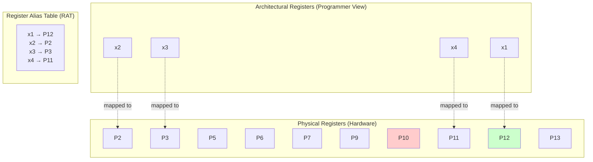
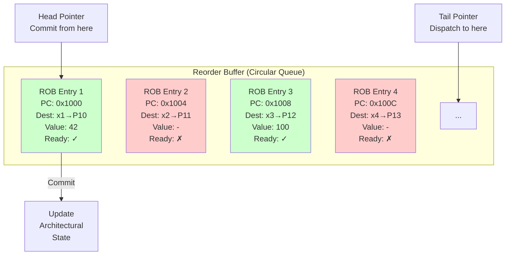
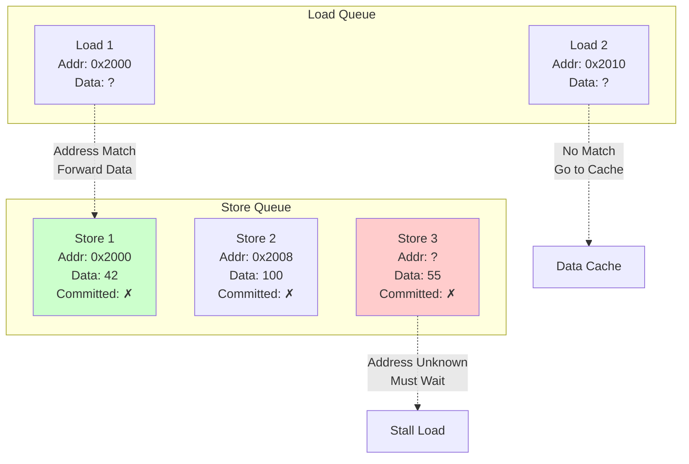
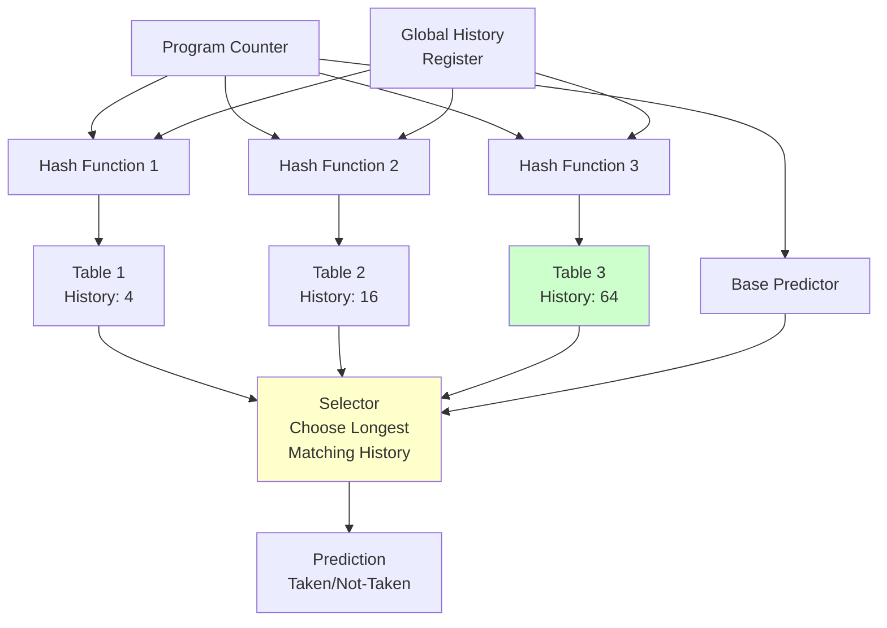
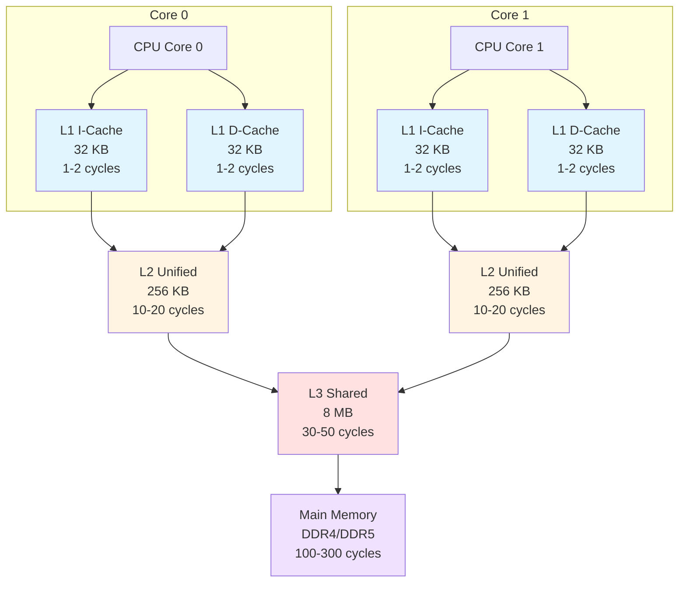
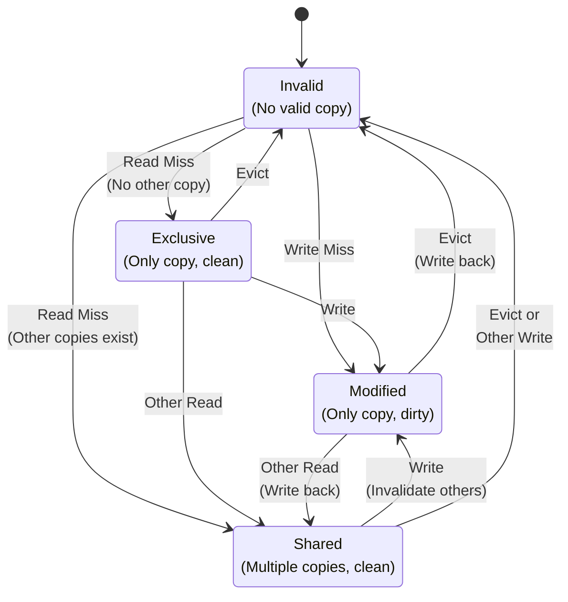

# Chapter 8. Microarchitecture Variations

**Part V — Pipeline & Microarchitecture**

---

## 🎯 學習目標

讀完本章後，你將能夠：

1. **區分 In-Order 與 Out-of-Order**：理解兩種執行模式的效能差異與適用場景
2. **理解 Register Renaming**：明白如何透過 Physical Register 消除 False Dependency (WAW/WAR)
3. **掌握 ROB 機制**：理解 Reorder Buffer 如何保證「亂序執行、順序提交」
4. **認識 Speculative Execution**：了解預測執行的原理與安全風險 (Spectre/Meltdown)
5. **使用效能計數器**：能夠透過 `mcycle` 和 `minstret` 計算 CPI

---

## 💡 情境引入：米其林餐廳的廚房哲學

> **場景**：小華在比較兩款 RISC-V 核心的跑分結果，發現頻率差不多，但效能差了兩倍。

**小華**：「陳教授，我看了兩款 RISC-V 核心的規格。SiFive U74 和阿里巴巴 C910，時脈都差不多是 1.5GHz，但 CoreMark 跑分差了快兩倍！這怎麼可能？」

**陳教授**：「你有去過米其林餐廳嗎？」

**小華**：「有啊，但這跟 CPU 有什麼關係？」

**陳教授**：「想像兩間餐廳。

**第一間（In-Order）**：廚師嚴格按照點單順序做菜。如果第一道菜需要等食材解凍 10 分鐘，後面所有菜都得等著，即使第二道菜的食材早就準備好了。

**第二間（Out-of-Order）**：廚師會看哪道菜的食材先準備好，就先做哪道。等食材解凍的時候，他已經把其他三道菜都做完了。」

**小華**：「所以 Out-of-Order 就是讓 CPU 不要傻等？」

**陳教授**：「沒錯。但這需要一個聰明的『餐廳經理』來協調：

1. **Reservation Station（備餐區）**：記錄每道菜需要什麼食材，食材到了就開始做。
2. **Reorder Buffer（出菜順序表）**：雖然做菜順序亂了，但出菜還是要按客人點的順序，不然會搞混。
3. **Register Renaming（食材標籤）**：如果兩道菜都需要『雞蛋』，但其實是不同的雞蛋，就貼上不同標籤避免搞混。」

**小華**：「聽起來很複雜，代價是什麼？」

**陳教授**：「電晶體數量暴增，功耗也跟著上去。這就是為什麼手機的『大核心』耗電，『小核心』省電——大核心通常是 Out-of-Order，小核心是 In-Order。」

**小華**：「那我們來量量看實際的效能差異吧！」

---

在 Chapter 7 中，我們探討了經典的 five-stage in-order pipeline。但現代處理器遠遠超越了這個簡單的模型。Out-of-order (OOO) execution 允許處理器動態重新排序指令以提取更多 parallelism，大幅提高效能。In-order processor 按程式順序執行指令並在 dependency 上 stall，而 out-of-order processor 可以在等待慢速操作完成時執行獨立的指令。

本章探討實現高效能 RISC-V 處理器的 microarchitectural 技術：register renaming 以消除 false dependency、reorder buffer 以維持 precise exception、speculative execution 以在 branch 之外執行、以及 advanced branch prediction 以最小化 misprediction penalty。我們將檢視隱藏 memory latency 的 cache hierarchy，以及維持多個 core 之間一致性的 cache coherence protocol。理解這些技術對於任何設計高效能 RISC-V 系統或為現代處理器最佳化 code 的人都至關重要。

---

## 8.1 Out-of-Order Execution Basics

### In-Order vs Out-of-Order

**In-order processor 按照指令在程式中出現的確切順序執行指令。** 如果一條指令 stall（例如，等待 cache miss），所有後續指令都必須等待，即使它們是獨立的並且可以執行。

**Out-of-order (OOO) processor 可以以與程式指定的不同順序執行指令**，只要最終結果相同。這允許處理器繞過 stall 和 dependency，保持 execution unit 忙碌。

範例：

```assembly
lw   x1, 0(x2)     # I1: load (cache miss, 100 cycles)
add  x3, x4, x5    # I2: independent of I1
sub  x6, x7, x8    # I3: independent of I1
add  x9, x1, x10   # I4: depends on I1
```

**In-order execution**：I2 和 I3 必須等待 I1 完成（100 個 cycle），即使它們是獨立的。

**Out-of-order execution**：I2 和 I3 可以在 I1 等待 cache miss 時立即執行。只有 I4 必須等待 I1。

這種簡單的重新排序可以大幅提高效能，特別是當 memory latency 很高時。

**Figure 8.1: In-Order vs Out-of-Order Execution**

In-order execution（所有指令都 stall）：

```
Cycle:           1    2    3    ...  103  104  105  106  107
lw x1 (miss):    IF   ID   EX   MEM(100 cycles)  WB
add x3,x4,x5:         IF   ID   -------- stall -------- EX   MEM  WB
sub x6,x7,x8:              IF   -------- stall -------- ID   EX   MEM  WB
```

Out-of-order execution（獨立指令繼續執行）：

```
Cycle:            1    2    3    4    5    6    7    ...  103  104  105  106
lw x1 (miss):     IF   ID   EX   MEM (100 cycles) -------- WB
add x3,x4,x5:          IF   ID   EX   MEM  WB
sub x6,x7,x8:               IF   ID   EX   MEM  WB
add x9,x1,x10:                   IF   ID   ---- wait ----  EX   MEM  WB
```

Out-of-order execution 允許獨立指令在 load 等待時繼續執行，大幅減少浪費的 cycle。

### Dynamic Scheduling

**Dynamic scheduling** 是實現 out-of-order execution 的硬體機制。處理器在 runtime 分析 dependency 並在 operand 準備好時將指令調度到 execution unit。

兩種經典的 dynamic scheduling 演算法：

**Scoreboarding**（CDC 6600，1964）：集中式 control unit 追蹤哪些 register 正在被寫入以及哪些指令正在等待它們。當所有 operand 準備好時，指令被 issue 到 execution unit。

**Tomasulo's algorithm**（IBM 360/91，1967）：使用 **reservation station** 來緩衝等待 operand 的指令。當 operand 產生時，它被 broadcast 到所有等待的指令。這消除了對集中式 scoreboard 的需求並實現了 **register renaming**（Section 8.2）。

現代 OOO processor 使用 Tomasulo's algorithm 的變體，並帶有額外的結構，如 **Reorder Buffer (ROB)** 以確保 precise exception。

---

## 8.2 Register Renaming

### The Problem: False Dependencies

考慮這段 code：

```assembly
add  x1, x2, x3    # I1: x1 = x2 + x3
sub  x4, x1, x5    # I2: x4 = x1 - x5 (RAW dependency on x1)
add  x1, x6, x7    # I3: x1 = x6 + x7 (WAW dependency on x1)
mul  x8, x1, x9    # I4: x8 = x1 * x9 (RAW dependency on x1 from I3)
```

I2 對 I1 有 **true dependency (RAW)** — 它必須等待 I1 產生 `x1`。

但 I3 對 I1 有 **false dependency (WAW)** — 兩者都寫入 `x1`，但 I3 的寫入實際上不依賴於 I1 的值。類似地，I4 依賴於 I3 的 `x1`，而不是 I1 的。

**False dependency（WAR 和 WAW）限制了 parallelism**，因為處理器必須序列化本來可以並行執行的指令。

### Physical vs Architectural Registers

**Register renaming** 透過將 architectural register（程式設計師可見的 32 個 register）映射到更大的 **physical register** 集合（對程式設計師隱藏）來消除 false dependency。

RISC-V 有 32 個 architectural register（`x0`-`x31`）。高效能 OOO processor 可能有 128 或 256 個 physical register。

**Register Alias Table (RAT)**：將每個 architectural register 映射到 physical register。當指令寫入 architectural register 時，它被分配一個新的 physical register。

有 renaming 的範例：

```assembly
add  P10, P2, P3   # I1: x1 -> P10
sub  P11, P10, P5  # I2: x4 -> P11, reads P10 (I1's result)
add  P12, P6, P7   # I3: x1 -> P12 (new physical register!)
mul  P13, P12, P9  # I4: x8 -> P13, reads P12 (I3's result)
```

現在 I3 和 I4 對 `x1` 使用 `P12`，而 I1 和 I2 使用 `P10`。WAW dependency 被消除 — I3 可以在 `P6` 和 `P7` 準備好後立即執行，無需等待 I1。

**Figure 8.2: Register Renaming Example**



在這個範例中，`x1` 之前映射到 `P10`（紅色顯示，現在 free），目前映射到 `P12`（綠色顯示）。

### Free List Management

**Physical register 必須在不再需要時被回收。** **Free list** 追蹤哪些 physical register 可用於分配。

當指令 commit（Section 8.3）時，其舊的 physical register mapping 可以被釋放：

```
I3 commits: x1 was mapped to P10, now mapped to P12
  -> P10 can be freed (added to free list)
```

**Register renaming 消除了 WAR 和 WAW hazard**，只留下 true RAW dependency。這大幅增加了 instruction-level parallelism。

---

## 8.3 Reorder Buffer (ROB) and Issue Queue

### Reorder Buffer (ROB)

**ROB 確保指令按程式順序 commit**，即使它們 out-of-order 執行。這對於 **precise exception**（Chapter 7）至關重要。

ROB 是一個 circular buffer，按程式順序保存所有 in-flight 指令。每個 entry 包含：

- Instruction PC
- Destination register（architectural 和 physical）
- Result value（當執行完成時）
- Exception status
- Ready bit

**指令通過 ROB 的流程**：

1. **Dispatch**：指令被分配一個 ROB entry 並 issue 到 execution unit。
2. **Execute**：指令在 operand 準備好時 out-of-order 執行。
3. **Complete**：結果被寫入 ROB entry 並 broadcast 到等待的指令。
4. **Commit**：當指令到達 ROB 的 head 並完成時，它 commit（更新 architectural state）。

**Commit 是 in-order 的**：指令從 ROB 的 head 一次一條（或小批量）commit。這確保如果發生 exception，所有較早的指令都已 commit，所有較晚的指令都可以被丟棄。

**Figure 8.3: Reorder Buffer (ROB) Structure**



綠色 entry 準備好 commit（當它們到達 head 時）。紅色 entry 仍在執行。

**ROB 範例 Code**：

```c
// ROB entry structure
struct ROB_Entry {
    uint64_t PC;              // Instruction address
    uint8_t  arch_reg;        // Architectural register (x0-x31)
    uint8_t  phys_reg;        // Physical register (P0-P127)
    uint64_t value;           // Result value
    bool     ready;           // Execution complete?
    bool     exception;       // Exception occurred?
    uint8_t  exception_code;  // Exception type
};

// Commit logic (simplified)
void commit_instruction() {
    ROB_Entry *entry = &ROB[head];

    if (!entry->ready) {
        return;  // Can't commit yet
    }

    if (entry->exception) {
        // Handle exception: flush pipeline, jump to handler
        flush_pipeline();
        PC = trap_handler_address;
        return;
    }

    // Update architectural state
    if (entry->arch_reg != 0) {  // x0 is always zero
        RAT[entry->arch_reg] = entry->phys_reg;
        free_old_physical_register(entry->arch_reg);
    }

    // Advance head pointer
    head = (head + 1) % ROB_SIZE;
}
```

### Issue Queue and Reservation Stations

**Issue queue（或 reservation station）保存等待 operand 的指令。** 當指令被 dispatch 時，它被放入 issue queue。當所有 operand 準備好時，它被 issue 到 execution unit。

**Wakeup and select**：

- **Wakeup**：當結果產生時，它被 broadcast 到所有 issue queue entry。等待該結果的 entry 將 operand 標記為 ready。
- **Select**：在所有 ready 的指令中，scheduler 選擇哪些 issue 到 execution unit（基於 priority、age 或其他 policy）。

這是 dynamic scheduling 的核心。Issue queue 將 instruction dispatch 與 execution 解耦，允許處理器動態找到 parallelism。

---

## 8.4 Load/Store Queue

Memory operation 在 OOO processor 中特別具有挑戰性，因為它們必須遵守 **memory ordering**（Chapter 6），同時仍允許重新排序以提高效能。

### Load Queue and Store Queue

**Load queue** 保存所有 in-flight load。**Store queue** 保存所有 in-flight store。這些 queue 追蹤 memory address 和 data，並強制執行 ordering constraint。

**Store-to-load forwarding**：如果 load 從與較早 store 相同的 address 讀取，load 可以直接從 store queue 獲取 data，而無需等待 store commit 到 memory。

```assembly
sw   x1, 0(x2)     # Store x1 to address in x2
lw   x3, 0(x2)     # Load from same address
```

Load 可以從 store queue forward data，避免 memory access。

**Figure 8.4: Load/Store Queue Structure**



Store-to-load forwarding 允許 load 從較早的 store 獲取 data，而無需等待它們 commit 到 memory。

### Memory Disambiguation

**Memory disambiguation** 是確定兩個 memory operation 是否存取相同 address 的問題。這很困難，因為 address 通常是動態計算的。

```assembly
sw   x1, 0(x2)     # Store to address A
lw   x3, 0(x4)     # Load from address B — is B == A?
```

如果 `x2` 和 `x4` 包含相同的值，load 依賴於 store。但處理器在計算 address 之前不知道這一點。

**Conservative approach**：假設所有 load 都依賴於所有較早的 store。這是安全的，但限制了 parallelism。

**Speculative approach**：假設 load 不依賴於較早的 store 並 speculatively 執行它們。如果稍後檢測到 dependency（address match），squash load 並重新執行。

現代處理器使用 **memory dependence prediction** 來猜測哪些 load 依賴於哪些 store，提高 speculation 準確性。

---

## 8.5 Advanced Branch Prediction

Branch prediction 在 OOO processor 中更加關鍵，因為 misprediction 浪費更多工作（所有 speculatively 執行的指令都必須被丟棄）。

### Two-Level Adaptive Predictors

**Two-level predictor** 使用 local 和 global branch history 來進行 prediction。它們可以捕獲複雜的 pattern，如：

```c
if (a > 0) {        // Branch B1
  if (b > 0) {      // Branch B2
    ...
  }
}
```

如果 B1 被 taken，B2 更有可能被 taken。Global history predictor 可以學習這種相關性。

**結構**：Global history register (GHR) 追蹤最後 N 個 branch outcome（taken/not-taken）。這用於 index 到包含 2-bit counter 的 pattern history table (PHT)。

### TAGE (Tagged Geometric History Length)

**TAGE** 是現代高效能處理器中使用的最先進的 branch predictor。它使用多個具有不同 history length 的 predictor table（例如，4、8、16、32、64 個 branch）。

每個 table 由 PC 和 history 的 hash index。Predictor 使用最長匹配的 history 進行 prediction，如果沒有匹配則回退到較短的 history。

TAGE 在大多數 workload 上達到非常高的準確性（98-99%）。

**Figure 8.5: TAGE Predictor Structure**



TAGE 使用多個具有不同 history length 的 table。最長匹配的 history 提供 prediction。

### Return Address Stack (RAS)

**Function return** 使用 hardware stack（在 Chapter 7 中提到）進行預測。當檢測到 function call（`jal` 或 `jalr` with `rd != x0`）時，return address 被 push 到 RAS。當檢測到 return（`jalr x0, 0(x1)`）時，RAS 的 top 被 pop 並用作 prediction。

RAS 非常準確（>99%），因為 function call 和 return 結構良好。

### Indirect Branch Prediction

**Indirect branch**（`jalr` with computed target）比 direct branch 更難預測。Target 可能會根據 register 中的值而有很大差異。

**Indirect branch target buffer (iBTB)**：由 branch PC index 的 cache，儲存最近看到的 target。對於 virtual function call 或 switch statement，iBTB 可以達到良好的準確性。

**Advanced technique**：某些處理器使用 call path（最近 function call 的序列）來預測 indirect branch target，提高 polymorphic code 的準確性。

---

## 8.6 Cache Hierarchy

現代處理器有多個 level 的 cache 來隱藏 memory latency。

### L1 Instruction and Data Caches

**L1 cache** 很小（32-64 KB），快速（1-2 cycle latency），並分為單獨的 instruction (I-cache) 和 data (D-cache) cache。

**Split I/D cache** 允許同時 instruction fetch 和 data access，避免 structural hazard。它們也以不同方式最佳化：I-cache 是 read-only 的，可以使用更簡單的 replacement policy。

**Virtually indexed, physically tagged (VIPT)**：L1 cache 通常使用 virtual address 進行 indexing（以避免 TLB lookup latency），但使用 physical address 進行 tag（以避免 aliasing 問題）。

### L2 Unified Cache

**L2 cache** 更大（256 KB - 1 MB），更慢（10-20 cycle），並且是 unified 的（同時保存 instruction 和 data）。

L2 是 L1 的 victim cache：當 data 從 L1 evict 時，它被放入 L2。這創建了 inclusive hierarchy（L2 包含 L1 中的所有內容）。

### L3 Shared Cache

**L3 cache**（如果存在）更大（4-32 MB），更慢（30-50 cycle），並在 multi-core processor 中的所有 core 之間共享。

L3 減少了到 main memory 的流量，並為所有 core 提供大型共享 working set。

**Figure 8.6: Cache Hierarchy**



每個 level 都更大且更慢。L1 是每個 core 私有的，L2 可能是私有或共享的，L3 在所有 core 之間共享。

### Cache Replacement Policies

**LRU (Least Recently Used)**：Evict 最長時間未被存取的 cache line。這是有效的，但對於高 associativity 來說實作成本很高。

**PLRU (Pseudo-LRU)**：LRU 的近似值，實作成本更低。使用 bit tree 來追蹤近似的 recency。

**Random**：Evict 隨機的 cache line。令人驚訝地有效且非常簡單。

現代 cache 通常使用 PLRU 或結合多種策略的 adaptive policy。

---

## 8.7 Cache Coherence

在 multi-core system 中，每個 core 都有自己的 L1 cache。**Cache coherence** 確保所有 core 看到一致的 memory view。

### MESI Protocol

**MESI** 是最常見的 coherence protocol。每個 cache line 處於四種狀態之一：

- **M (Modified)**：此 cache 有唯一的有效副本，並且已被修改（dirty）。
- **E (Exclusive)**：此 cache 有唯一的有效副本，並且是 clean 的（與 memory 匹配）。
- **S (Shared)**：多個 cache 有有效副本，都是 clean 的。
- **I (Invalid)**：此 cache line 無效。

**State transition**：

- **Read miss**：如果另一個 cache 在 M 中有該 line，它 write back 到 memory 並轉換到 S。請求的 cache 在 S 中載入該 line。
- **Write**：如果 line 在 S 中，所有其他 cache invalidate 它們的副本。寫入的 cache 轉換到 M。

**Figure 8.7: MESI Protocol State Diagram**



**MESI 範例**：

```c
// Core 0 and Core 1 both access the same cache line

// Initial state: Both caches Invalid (I)

// Core 0: Read from address 0x1000
// Core 0 cache: I → E (exclusive, no other copy)

// Core 1: Read from address 0x1000
// Core 0 cache: E → S (shared)
// Core 1 cache: I → S (shared)

// Core 0: Write to address 0x1000
// Core 0 cache: S → M (modified, dirty)
// Core 1 cache: S → I (invalidated)

// Core 1: Read from address 0x1000
// Core 0 cache: M → S (write back to memory)
// Core 1 cache: I → S (load from memory)
```

### MOESI Protocol

**MOESI** 添加了 **O (Owned)** state：cache 有 dirty copy，但其他 cache 可能有 shared copy。這減少了到 memory 的 write-back。

### Snooping vs Directory-Based Coherence

**Snooping**：所有 cache 監控（snoop）shared bus 上的 memory transaction。當 cache 看到影響其 data 的 transaction 時，它會適當地響應（invalidate、write-back 等）。

Snooping 很簡單，但在超過 ~8-16 個 core 後擴展性不佳，因為 bus bandwidth 成為瓶頸。

**Directory-based**：集中式 directory 追蹤哪些 cache 有每個 cache line 的副本。Coherence message 是 point-to-point 發送的，而不是 broadcast。

Directory-based coherence 更好地擴展到許多 core（64+），並用於大型 multi-core processor。

### RISC-V Coherence Considerations

RISC-V 不強制要求特定的 coherence protocol。**RVWMO memory model**（Chapter 6）定義了 ordering guarantee，但 coherence mechanism 是 implementation-defined。

大多數 RISC-V multi-core system 使用 MESI 或 MOESI with snooping（對於小 core count）或 directory-based coherence（對於大 core count）。

---

## 8.8 Comparison with ARM and MIPS OOO Cores

讓我們將 RISC-V OOO implementation 與其他架構進行比較。

### RISC-V BOOM vs ARM Cortex-A76/A78

**BOOM (Berkeley Out-of-Order Machine)** 是 open-source RISC-V OOO core。它有：

- 3-4 issue width
- 128-entry ROB
- 64-entry issue queue
- Advanced branch prediction (TAGE)
- L1 I/D cache、L2 unified cache

**ARM Cortex-A76**（2018）是高效能 mobile core：

- 4-issue width
- 128-entry ROB
- Sophisticated branch prediction
- 64 KB L1 I/D、256-512 KB L2

**比較**：BOOM 和 Cortex-A76 在結構上相似。兩者都使用 register renaming、ROB 和 advanced branch prediction。主要差異在於實作細節（pipeline depth、cache size、power optimization）。

RISC-V 更簡單的 ISA（沒有複雜的 addressing mode、沒有 condition code）使 OOO logic 比 ARM 稍微簡單，但在現代設計中差異很小。

### RISC-V vs MIPS R10000 Pipeline

**MIPS R10000**（1996）是最早的商業 OOO processor 之一：

- 4-issue superscalar
- 32-entry active list（類似於 ROB）
- Register renaming with 64 physical register
- Speculative execution

R10000 開創了許多今天仍在使用的技術。現代 RISC-V OOO core（如 BOOM）是 R10000 設計哲學的演進後代。

**關鍵差異**：RISC-V 沒有 branch delay slot，使 branch misprediction recovery 比 MIPS 更簡單。

### Microarchitecture Trade-offs

**Complexity vs Performance**：OOO execution 為通用 workload 提供 2-3 倍的效能提升，但代價是 3-5 倍的 transistor 和 power。

**何時使用 OOO**：

- 高效能應用（server、desktop、high-end mobile）
- 具有不規則 memory access pattern 的 workload
- 有許多 branch 和 dependency 的 code

**何時使用 in-order**：

- 具有 power/area constraint 的 embedded system
- 可預測的 real-time workload
- 簡單的 control-dominated code

RISC-V 的靈活性允許 in-order（Rocket、SiFive E/U-series）和 OOO（BOOM、SiFive P-series）implementation，使其適用於廣泛的應用。

---

## 🛠️ 實作練習：Lab 8.1 — 效能計數器的真相 (Perf Counters)

這個 Lab 將帶你使用 RISC-V 的硬體效能計數器，測量同一段程式在不同情況下的 CPI (Cycles Per Instruction)。

### 實驗目標

1. 讀取 `mcycle` (Machine Cycle Counter) 和 `minstret` (Machine Instructions Retired)
2. 計算 CPI = Cycles / Instructions
3. 觀察不同程式碼模式對 CPI 的影響

### 概念說明

RISC-V 提供兩個關鍵的效能計數器 CSR：

| CSR | 名稱 | 說明 |
|-----|------|------|
| `mcycle` | Machine Cycle Counter | 從 reset 開始經過的時脈週期數 |
| `minstret` | Machine Instructions Retired | 從 reset 開始完成的指令數 |

**CPI (Cycles Per Instruction)** = mcycle / minstret

- CPI = 1.0：理想情況，每個 cycle 完成一條指令
- CPI > 1.0：有 stall（cache miss、hazard 等）
- CPI < 1.0：超純量 (Superscalar) 處理器，每個 cycle 完成多條指令

### 程式碼

建立 `lab8_perf.c`：

```c
// lab8_perf.c - 效能計數器測量
#include <stdio.h>
#include <stdint.h>

// 讀取 mcycle
static inline uint64_t read_mcycle(void) {
    uint64_t val;
    asm volatile("csrr %0, mcycle" : "=r"(val));
    return val;
}

// 讀取 minstret
static inline uint64_t read_minstret(void) {
    uint64_t val;
    asm volatile("csrr %0, minstret" : "=r"(val));
    return val;
}

// 測試函數 1：簡單的加法迴圈（無依賴）
volatile int result1;
void test_independent(int n) {
    int a = 0, b = 0, c = 0, d = 0;
    for (int i = 0; i < n; i++) {
        a += 1;
        b += 2;
        c += 3;
        d += 4;
    }
    result1 = a + b + c + d;
}

// 測試函數 2：有依賴的加法迴圈
volatile int result2;
void test_dependent(int n) {
    int a = 0;
    for (int i = 0; i < n; i++) {
        a += 1;
        a += a;  // 依賴前一行的結果
        a += a;  // 依賴前一行的結果
        a += a;  // 依賴前一行的結果
    }
    result2 = a;
}

void measure(const char *name, void (*func)(int), int n) {
    uint64_t cycle_start = read_mcycle();
    uint64_t instr_start = read_minstret();

    func(n);

    uint64_t cycle_end = read_mcycle();
    uint64_t instr_end = read_minstret();

    uint64_t cycles = cycle_end - cycle_start;
    uint64_t instrs = instr_end - instr_start;

    // 計算 CPI (乘以 100 避免浮點數)
    uint64_t cpi_x100 = (cycles * 100) / instrs;

    printf("%s:\n", name);
    printf("  Cycles: %lu\n", cycles);
    printf("  Instructions: %lu\n", instrs);
    printf("  CPI: %lu.%02lu\n", cpi_x100 / 100, cpi_x100 % 100);
}

int main() {
    int n = 100000;

    printf("=== Performance Counter Lab ===\n\n");

    measure("Independent Operations", test_independent, n);
    printf("\n");
    measure("Dependent Operations", test_dependent, n);

    return 0;
}
```

### 編譯與執行

```bash
# 編譯
riscv64-unknown-elf-gcc -O1 -o lab8_perf lab8_perf.c

# 執行 (需要 M-mode 權限讀取 mcycle/minstret)
# 使用 Spike + PK
spike pk lab8_perf

# 或使用 QEMU (可能需要特殊配置)
qemu-riscv64 lab8_perf
```

### 預期觀察

你應該會看到類似這樣的結果：

```text
=== Performance Counter Lab ===

Independent Operations:
  Cycles: 1200000
  Instructions: 1000000
  CPI: 1.20

Dependent Operations:
  Cycles: 2500000
  Instructions: 1000000
  CPI: 2.50
```

**分析**：
- **Independent Operations**：四個變數互不依賴，Out-of-Order 處理器可以並行執行，CPI 接近 1
- **Dependent Operations**：每一行都依賴前一行的結果，必須等待，CPI 較高

### 延伸思考

> 💭 **為什麼 In-Order 處理器在這兩個測試中的 CPI 差異較小？**
>
> 因為 In-Order 處理器本來就按順序執行，無法利用 Independent Operations 的並行性。兩種情況的 CPI 都會比較高。

---

## ⚠️ 常見陷阱

### 陷阱 1：以為 Out-of-Order 萬能

**錯誤認知**：「OoO 處理器一定比 In-Order 快！」

**正確理解**：
- OoO 在 **Branch Misprediction** 時懲罰更重（需要 flush 更多指令）
- OoO 在 **功耗受限** 的場景（如手機、IoT）可能不是最佳選擇
- 對於 **高度並行** 的 workload（如 GPU-like），簡單的 In-Order 核心反而更有效率

### 陷阱 2：忽略 Spectre/Meltdown 風險

**錯誤認知**：「Speculative Execution 只是效能優化，沒有副作用。」

**正確理解**：
- Spectre 和 Meltdown 攻擊利用了 Speculative Execution 的 **側通道效應**
- 即使預測錯誤的指令被取消，它們對 **Cache** 的影響仍然存在
- 攻擊者可以透過測量 Cache 存取時間來推斷秘密資料

```c
// Spectre 攻擊的簡化概念
if (x < array1_size) {           // 邊界檢查
    y = array2[array1[x] * 256]; // 如果 x 越界，這行不該執行
}
// 但 Speculative Execution 可能會「先執行再說」
// 即使後來發現 x 越界而取消，array2 的 cache 狀態已經洩漏了 array1[x] 的值
```

### 陷阱 3：混淆 mcycle 與 time

**錯誤情境**：用 `mcycle` 來測量「真實時間」。

**正確理解**：
- `mcycle`：CPU 時脈週期數，與 CPU 頻率相關
- `time`：真實時間（通常來自 RTC 或 Timer）
- 如果 CPU 頻率會動態調整（DVFS），`mcycle` 不能直接換算成時間

```c
// ❌ 錯誤：假設 mcycle 等於時間
uint64_t start = read_mcycle();
do_something();
uint64_t elapsed_ns = (read_mcycle() - start) * 1000000000 / CPU_FREQ;
// 如果 CPU 頻率變了，這個計算就錯了

// ✅ 正確：使用 time CSR 或 SBI timer
uint64_t start = read_time();
do_something();
uint64_t elapsed_ns = (read_time() - start) * 1000000000 / TIMER_FREQ;
```

---

## Summary

在本章中，我們探討了高效能 RISC-V 處理器的 advanced microarchitecture 技術：

- **Out-of-order execution**：Dynamic scheduling 以提取 instruction-level parallelism。
- **Register renaming**：使用 physical register 消除 false dependency（WAR、WAW）。
- **Reorder buffer**：確保 in-order commit 以實現 precise exception。
- **Load/store queue**：Memory disambiguation 和 store-to-load forwarding。
- **Advanced branch prediction**：TAGE、RAS、indirect branch prediction。
- **Cache hierarchy**：L1/L2/L3 cache with LRU/PLRU replacement。
- **Cache coherence**：MESI/MOESI protocol 用於 multi-core consistency。
- **比較**：RISC-V BOOM vs ARM Cortex-A76 和 MIPS R10000。

RISC-V 的乾淨 ISA 使其成為簡單 in-order core 和複雜 OOO 設計的絕佳目標。架構不會施加不必要的限制，允許 microarchitect 自由創新。

在下一章中，我們將從硬體轉向軟體，探討 RISC-V 系統如何 boot 以及 firmware 和 operating system 如何與硬體互動。
