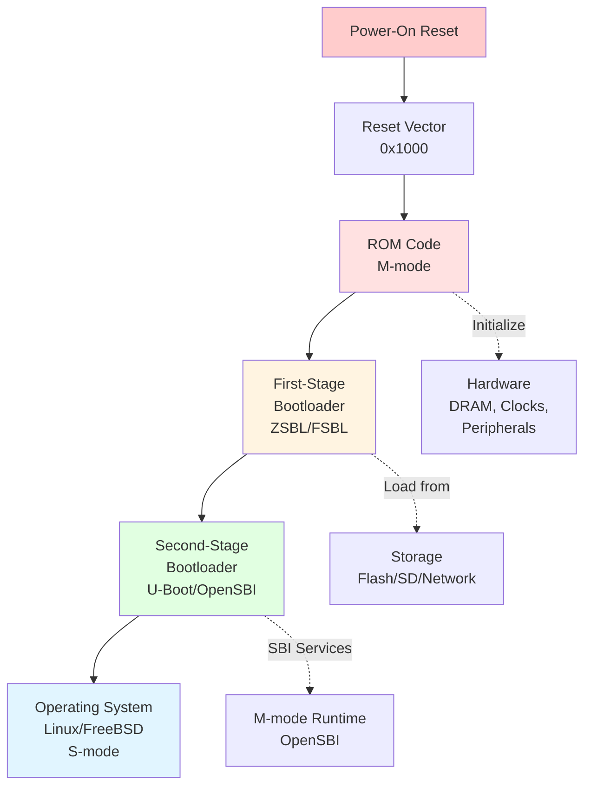
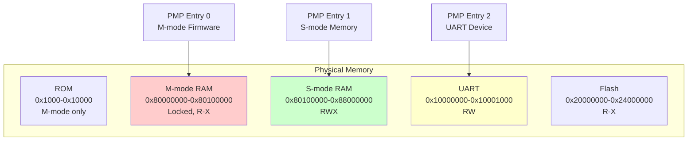
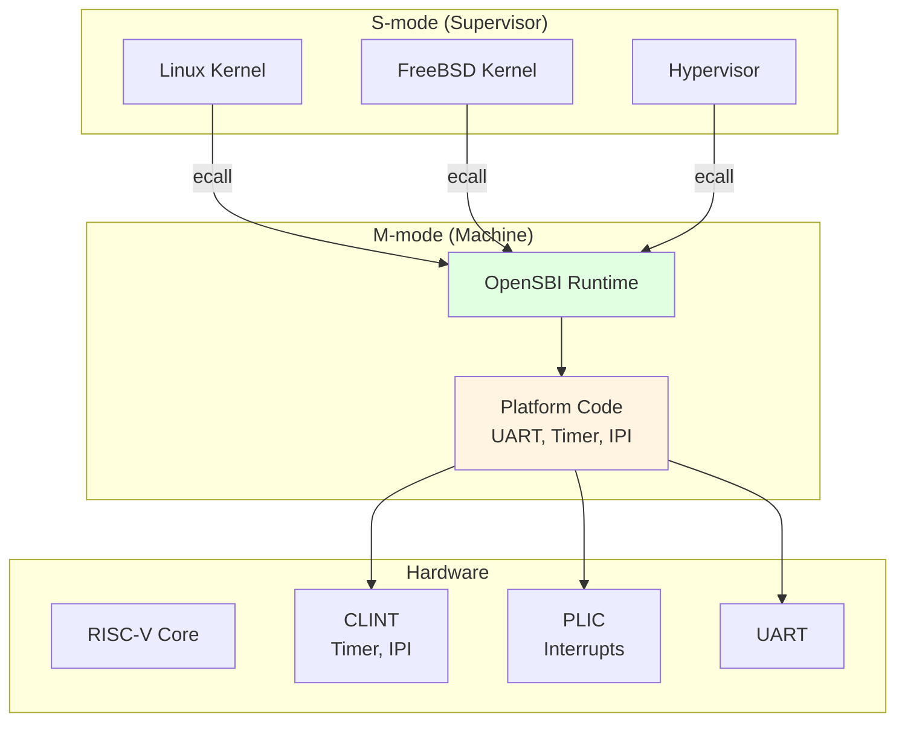

# Chapter 9. Reset, Boot Flow & Firmware

**Part VI — Booting & System Software**

---

當你打開 RISC-V 系統的電源時會發生什麼？與在準備好的環境中運行的應用程式不同，boot process 從零開始 — 沒有 operating system、沒有 memory initialization、甚至沒有 stack。本章探討 RISC-V 系統如何從 power-on reset 自我啟動到運行的 operating system。

Boot process 是一個精心編排的 firmware stage 序列，每個階段都為下一個階段準備環境。我們將追蹤這個旅程，從 reset vector 經過 machine-mode firmware（ZSBL、FSBL、OpenSBI）、bootloader（U-Boot、GRUB），最後到 operating system handoff。理解這個過程對於 firmware developer、system integrator 以及任何 debug boot issue 的人都至關重要。

---

## 9.1 Reset and Boot Sequence

### Power-On Reset

**當電源施加到 RISC-V processor 時，hardware reset logic 將 core 初始化為已知狀態。** 所有 hart（hardware thread）在 **Machine mode (M-mode)** 中開始執行，這是具有完全存取所有 hardware resource 的最高 privilege level。

**Reset state**（由 RISC-V Privileged Specification 定義）：

- **PC (Program Counter)**：設置為 **reset vector** address（implementation-defined，通常是 `0x1000` 或 `0x80000000`）
- **Privilege mode**：M-mode（mstatus.MPP = 3）
- **Interrupt**：Disabled（mstatus.MIE = 0, mie = 0）
- **Virtual memory**：Disabled（satp = 0）
- **大多數 CSR**：Undefined 或 zero
- **General-purpose register**：Undefined（除了 x0，它總是 zero）

**預設只有一個 hart boot。** 在 multi-hart system 中，**boot hart**（通常是 hart 0）從 reset vector 開始執行，而其他 hart 保持在 wait state，直到 boot hart 明確啟動它們。

### Reset Vector

**Reset vector 是 reset 後執行的第一個 instruction address。** 這個 address 是 implementation-defined 的，通常指向：

- **ROM**（Read-Only Memory）：包含 first-stage bootloader (FSBL)
- **Flash memory**：包含 firmware image
- **RAM**：由 JTAG debugger 預載（用於開發）

**Reset vector 範例**：

- SiFive FU540: `0x1000`（ROM）
- SiFive FU740: `0x1000`（ROM）
- QEMU virt machine: `0x1000`（ROM）
- Rocket Chip: `0x10000`（configurable）

**Figure 9.1: RISC-V Boot Sequence Overview**



### Early Initialization

**在 reset vector 執行的第一段 code 必須非常小心** — 它在沒有 stack、沒有 initialized data 和最小 hardware setup 的情況下運行。典型的 early initialization：

```assembly
# Reset vector entry point (M-mode)
_start:
    # Disable interrupts (already disabled by reset, but be explicit)
    csrw    mie, zero
    csrw    mip, zero
    
    # Initialize global pointer (gp) for data access
    .option push
    .option norelax
    la      gp, __global_pointer$
    .option pop
    
    # Set up stack pointer (sp)
    la      sp, __stack_top
    
    # Clear BSS (uninitialized data)
    la      t0, __bss_start
    la      t1, __bss_end
1:  bge     t0, t1, 2f
    sd      zero, 0(t0)
    addi    t0, t0, 8
    j       1b
2:
    # Jump to C code
    call    boot_main
```

**關鍵步驟**：

1. **Disable interrupt**：確保在 initialization 期間不會發生 interrupt
2. **Set up `gp` (global pointer)**：啟用對 global variable 的高效存取
3. **Set up `sp` (stack pointer)**：啟用 function call 和 local variable
4. **Clear BSS**：Zero-initialize uninitialized global variable
5. **Jump to C code**：現在可以安全地運行 higher-level code

---

## 9.2 Machine Mode Initialization

### CSR Initialization

**Machine-mode firmware 必須在繼續之前初始化關鍵 CSR。** 這些控制 interrupt handling、memory protection 和 hardware feature。

**Essential CSR initialization**：

```c
// Initialize machine-mode CSRs
void init_machine_mode(void) {
    // 1. Set up trap vector
    write_csr(mtvec, (uintptr_t)&m_trap_vector);
    
    // 2. Enable machine-mode interrupts (but keep global IE off for now)
    write_csr(mie, MIE_MSIE | MIE_MTIE | MIE_MEIE);
    
    // 3. Initialize mstatus
    uintptr_t mstatus = read_csr(mstatus);
    mstatus &= ~MSTATUS_MIE;  // Keep interrupts disabled
    mstatus |= MSTATUS_FS_INITIAL;  // Enable FPU (if present)
    write_csr(mstatus, mstatus);
    
    // 4. Clear pending interrupts
    write_csr(mip, 0);
    
    // 5. Initialize performance counters (if present)
    write_csr(mcounteren, 0x7);  // Enable cycle, time, instret for S-mode
}
```

### Physical Memory Protection (PMP) Setup

**PMP 是 RISC-V 用於隔離 memory region 和強制執行 access permission 的機制。** M-mode firmware 配置 PMP entry 以保護 firmware code、限制 device access 並為 S-mode 定義 memory region。

**PMP configuration 範例**：

```c
// Configure PMP to allow S-mode access to RAM
void setup_pmp(void) {
    // Entry 0: Protect M-mode firmware (0x80000000 - 0x80100000)
    // TOR (Top-Of-Range) addressing
    write_csr(pmpaddr0, 0x80000000 >> 2);
    write_csr(pmpaddr1, 0x80100000 >> 2);
    write_csr(pmpcfg0, PMP_R | PMP_X | PMP_L | PMP_TOR);  // R-X, locked

    // Entry 1: Allow S-mode full access to RAM (0x80100000 - 0x88000000)
    write_csr(pmpaddr2, 0x80100000 >> 2);
    write_csr(pmpaddr3, 0x88000000 >> 2);
    write_csr(pmpcfg0, (PMP_R | PMP_W | PMP_X | PMP_TOR) << 8);  // RWX

    // Entry 2: Allow access to UART (0x10000000 - 0x10001000)
    write_csr(pmpaddr4, 0x10000000 >> 2);
    write_csr(pmpaddr5, 0x10001000 >> 2);
    write_csr(pmpcfg0, (PMP_R | PMP_W | PMP_TOR) << 16);  // RW
}
```

**PMP addressing mode**：

- **OFF**：Entry disabled
- **TOR (Top-Of-Range)**：Region 從 `pmpaddr[i-1]` 到 `pmpaddr[i]`
- **NA4**：Naturally aligned 4-byte region
- **NAPOT**：Naturally aligned power-of-2 region

**Figure 9.2: PMP Memory Protection**



### Memory Configuration

**M-mode firmware 必須初始化 DRAM controller 並配置 memory timing。** 這是高度 platform-specific 的，通常是 early boot 中最複雜的部分。

**典型的 DRAM initialization**：

1. 配置 DRAM controller register（timing、refresh rate）
2. 執行 DRAM training（calibrate delay）
3. 測試 memory（optional，但建議）
4. 設置 memory map（base address、size）

**範例（簡化）**：

```c
void init_dram(void) {
    volatile uint32_t *dram_ctrl = (uint32_t *)0x10000000;

    // Configure DRAM timing (platform-specific)
    dram_ctrl[0] = 0x12345678;  // Timing register
    dram_ctrl[1] = 0x9ABCDEF0;  // Refresh register

    // Wait for DRAM ready
    while (!(dram_ctrl[2] & 0x1));

    // Simple memory test
    volatile uint64_t *mem = (uint64_t *)0x80000000;
    mem[0] = 0xDEADBEEFCAFEBABE;
    if (mem[0] != 0xDEADBEEFCAFEBABE) {
        // Memory test failed
        while (1);
    }
}
```

---

## 9.3 Firmware and Bootloader

### Firmware Stages

**RISC-V boot firmware 通常組織成多個 stage**，每個都有特定的責任：

1. **ZSBL (Zeroth-Stage Bootloader)**：Minimal ROM code，初始化 DRAM
2. **FSBL (First-Stage Bootloader)**：從 storage 載入 SSBL
3. **SSBL (Second-Stage Bootloader)**：Full-featured bootloader（U-Boot）
4. **Runtime firmware**：M-mode service（OpenSBI）

**為什麼需要多個 stage？**

- **ROM size constraint**：ZSBL 必須適合小型 on-chip ROM
- **Flexibility**：FSBL/SSBL 可以在不更改 hardware 的情況下更新
- **Feature richness**：Later stage 可以使用 DRAM 並有更多 code space

### First-Stage Bootloader (FSBL)

**FSBL 的主要工作是從 non-volatile storage 載入 second-stage bootloader**（Flash、SD card、network）。

**FSBL 責任**：

- 初始化 storage controller（SPI、SD、eMMC）
- 從 storage 載入 SSBL image 到 DRAM
- 驗證 SSBL integrity（checksum、signature）
- Jump 到 SSBL entry point

**FSBL flow 範例**：

```c
void fsbl_main(void) {
    // 1. Initialize storage
    spi_flash_init();

    // 2. Load SSBL from flash to DRAM
    uint8_t *ssbl_dest = (uint8_t *)0x80200000;
    uint32_t ssbl_size = 512 * 1024;  // 512 KB
    spi_flash_read(0x100000, ssbl_dest, ssbl_size);

    // 3. Verify checksum
    if (!verify_checksum(ssbl_dest, ssbl_size)) {
        panic("SSBL checksum failed");
    }

    // 4. Jump to SSBL
    void (*ssbl_entry)(void) = (void (*)(void))ssbl_dest;
    ssbl_entry();
}
```

### U-Boot for RISC-V

**U-Boot 是 RISC-V Linux system 最常見的 second-stage bootloader。** 它為載入和 boot operating system 提供豐富的環境。

**U-Boot feature**：

- **Multiple boot source**：Flash、SD、USB、network（TFTP、NFS）
- **File system support**：FAT、ext2/3/4、SquashFS
- **Network stack**：DHCP、TFTP、NFS
- **Scripting**：Boot script 用於自動化
- **Device tree**：將 hardware description 傳遞給 OS
- **Interactive shell**：用於 debugging 和 manual boot

**U-Boot boot flow**：

```
U-Boot SPL (if used) → U-Boot proper → Load kernel → Load device tree → Boot kernel
```

---

## 9.4 OpenSBI: Supervisor Binary Interface

**OpenSBI 是 RISC-V Supervisor Binary Interface (SBI) 的 reference implementation。** 它在 M-mode firmware 和 S-mode operating system 之間提供標準介面。

### OpenSBI Architecture

**OpenSBI 在 M-mode 中運行，並為 S-mode software 提供 runtime service**（OS kernel、hypervisor）。它充當一個 thin firmware layer，抽象 platform-specific detail。

**Figure 9.3: OpenSBI Architecture**



**OpenSBI 提供**：

- **Timer service**：Set timer interrupt
- **IPI (Inter-Processor Interrupt)**：Send IPI 到其他 hart
- **RFENCE**：Remote fence operation（TLB flush、I-cache flush）
- **Hart state management**：Start/stop hart
- **System reset**：Reboot 或 shutdown
- **Console I/O**：Early debug output

### Platform Initialization

**OpenSBI 在 boot 期間初始化 platform-specific hardware**：

```c
// OpenSBI platform initialization (simplified)
int sbi_platform_init(void) {
    // 1. Initialize console (UART)
    uart_init();
    sbi_printf("OpenSBI v1.0\n");

    // 2. Initialize CLINT (timer and IPI)
    clint_init();

    // 3. Initialize PLIC (interrupt controller)
    plic_init();

    // 4. Set up PMP for S-mode
    setup_pmp();

    // 5. Initialize other harts
    for (int i = 1; i < num_harts; i++) {
        sbi_hsm_hart_start(i, smode_entry, 0);
    }

    return 0;
}
```

### SBI Runtime Services

**S-mode software 使用 `ecall` instruction 調用 SBI service。** SBI call convention 使用 register 傳遞 function ID 和 parameter：

- **a7**：SBI extension ID (EID)
- **a6**：SBI function ID (FID)
- **a0-a5**：Parameter
- **a0**：Return value（0 = success，negative = error）
- **a1**：Additional return value（optional）

**範例：Setting a timer**

```assembly
# S-mode code: Set timer for 1 second from now
li      a7, 0x54494D45    # EID_TIME = 0x54494D45 ("TIME")
li      a6, 0             # FID_SET_TIMER = 0
rdtime  a0                # Read current time
li      t0, 10000000      # 1 second at 10 MHz
add     a0, a0, t0        # Target time
ecall                     # Call OpenSBI
```

**OpenSBI 處理 ecall**：

```c
// OpenSBI trap handler
void sbi_trap_handler(struct sbi_trap_regs *regs) {
    if (regs->cause == CAUSE_SUPERVISOR_ECALL) {
        ulong eid = regs->a7;
        ulong fid = regs->a6;

        if (eid == SBI_EXT_TIME && fid == SBI_EXT_TIME_SET_TIMER) {
            // Set timer
            uint64_t next_time = regs->a0;
            clint_set_timer(current_hart(), next_time);
            regs->a0 = SBI_SUCCESS;
        }

        // Advance sepc past ecall
        regs->sepc += 4;
    }
}
```

---

## 9.5 Supervisor Mode Handoff

### M-mode to S-mode Transition

**在 OpenSBI initialization 之後，control 被轉移到 S-mode**（operating system）。這個 transition 涉及：

1. **Set up S-mode entry point**：`sepc` = OS entry address
2. **Configure mstatus**：Set `MPP` = 1（S-mode），enable interrupt
3. **Delegate interrupt/exception**：Configure `mideleg` 和 `medeleg`
4. **Pass parameter**：Device tree address 在 `a1`
5. **Execute `mret`**：Return 到 S-mode

**OpenSBI handoff code**：

```c
void sbi_boot_hart(ulong next_addr, ulong next_mode, ulong fdt_addr) {
    // 1. Set S-mode entry point
    csr_write(CSR_SEPC, next_addr);

    // 2. Configure mstatus for S-mode
    ulong mstatus = csr_read(CSR_MSTATUS);
    mstatus = INSERT_FIELD(mstatus, MSTATUS_MPP, PRV_S);  // Return to S-mode
    mstatus = INSERT_FIELD(mstatus, MSTATUS_MPIE, 0);     // Disable interrupts initially
    mstatus = INSERT_FIELD(mstatus, MSTATUS_SPP, 0);      // S-mode came from U-mode
    csr_write(CSR_MSTATUS, mstatus);

    // 3. Delegate interrupts to S-mode
    csr_write(CSR_MIDELEG, MIP_SSIP | MIP_STIP | MIP_SEIP);

    // 4. Delegate exceptions to S-mode
    csr_write(CSR_MEDELEG, (1 << CAUSE_MISALIGNED_FETCH) |
                           (1 << CAUSE_FETCH_PAGE_FAULT) |
                           (1 << CAUSE_LOAD_PAGE_FAULT) |
                           (1 << CAUSE_STORE_PAGE_FAULT));

    // 5. Pass device tree address in a1
    register ulong a0 asm("a0") = current_hartid();
    register ulong a1 asm("a1") = fdt_addr;

    // 6. Jump to S-mode
    asm volatile("mret" : : "r"(a0), "r"(a1));
}
```

### Device Tree Passing

**Device tree (DTB) 向 OS 描述 hardware platform。** OpenSBI 在 register `a1` 中將 DTB address 傳遞給 kernel。

**Device tree structure**（簡化）：

```dts
/dts-v1/;

/ {
    #address-cells = <2>;
    #size-cells = <2>;
    compatible = "sifive,fu740", "sifive,fu540";
    model = "SiFive HiFive Unmatched";

    cpus {
        #address-cells = <1>;
        #size-cells = <0>;

        cpu@0 {
            device_type = "cpu";
            reg = <0>;
            compatible = "sifive,u74", "riscv";
            riscv,isa = "rv64imafdc";
            mmu-type = "riscv,sv39";
        };
        // More CPUs...
    };

    memory@80000000 {
        device_type = "memory";
        reg = <0x0 0x80000000 0x2 0x00000000>;  // 8 GB at 0x80000000
    };

    soc {
        uart@10010000 {
            compatible = "sifive,uart0";
            reg = <0x0 0x10010000 0x0 0x1000>;
            interrupts = <4>;
        };
        // More devices...
    };
};
```

**Kernel 接收 DTB**：

```c
// Linux kernel entry point (arch/riscv/kernel/head.S)
_start:
    // a0 = hartid
    // a1 = DTB address

    // Save DTB address
    la      t0, dtb_early_pa
    sd      a1, 0(t0)

    // Continue boot...
```

---

## 9.6 Linux Boot on RISC-V

### Linux Kernel Entry Point

**RISC-V 的 Linux kernel 在 `arch/riscv/kernel/head.S` 中開始**，具有以下狀態：

- **Privilege mode**：S-mode
- **MMU**：Disabled（satp = 0）
- **Interrupt**：Disabled
- **a0**：Hart ID
- **a1**：Device tree physical address

**Early kernel initialization**：

```assembly
# arch/riscv/kernel/head.S (simplified)
_start:
    # Disable interrupts
    csrw    sie, zero
    csrw    sip, zero

    # Save hart ID and DTB address
    mv      s0, a0          # s0 = hartid
    mv      s1, a1          # s1 = DTB address

    # Set up temporary stack
    la      sp, init_thread_union + THREAD_SIZE

    # Clear BSS
    la      t0, __bss_start
    la      t1, __bss_stop
1:  sd      zero, 0(t0)
    addi    t0, t0, 8
    blt     t0, t1, 1b

    # Set up early page tables
    call    setup_vm

    # Enable MMU
    la      t0, early_pg_dir
    srli    t0, t0, 12
    li      t1, SATP_MODE_SV39
    or      t0, t0, t1
    csrw    satp, t0
    sfence.vma

    # Jump to virtual address space
    la      t0, .Lvirtual
    jr      t0
.Lvirtual:
    # Now running with MMU enabled
    call    start_kernel
```

### Device Tree Parsing

**Kernel 解析 device tree 以發現 hardware**：

```c
// Simplified device tree parsing
void __init setup_arch(char **cmdline_p) {
    // 1. Unflatten device tree
    unflatten_device_tree();

    // 2. Parse memory nodes
    early_init_dt_scan_memory();

    // 3. Parse CPU nodes
    for_each_of_cpu_node(node) {
        parse_cpu_node(node);
    }

    // 4. Parse chosen node (bootargs, initrd)
    early_init_dt_scan_chosen(cmdline_p);

    // 5. Set up memory management
    setup_bootmem();
    paging_init();
}
```

**Figure 9.4: Linux Boot Sequence**

```
OpenSBI (M-mode)
    |
    | mret (a0=hartid, a1=DTB address)
    v
_start (S-mode, arch/riscv/kernel/head.S)
    |
    +---> Setup early page tables
    +---> Enable MMU (write satp, sfence.vma)
    |
    v
start_kernel() (init/main.c)
    |
    +---> parse_early_param()
    +---> setup_arch()  ← Parse device tree, setup memory
    +---> mm_init()     ← Memory management init
    +---> sched_init()  ← Scheduler init
    +---> rest_init()
          |
          +---> kernel_init() → Init process (PID 1)
```

---

## 9.7 Comparison with ARM Trusted Firmware

**RISC-V 的 boot architecture 比 ARM 的更簡單**，但服務類似的目的。

### Boot Flow Comparison

**ARM Trusted Firmware (TF-A)** 使用多個 boot stage：

- **BL1**：ROM code（EL3）
- **BL2**：Trusted boot firmware（EL3）
- **BL31**：Runtime firmware（EL3）
- **BL32**：Secure OS（S-EL1，optional）
- **BL33**：Non-secure bootloader（EL2/EL1）→ OS

**RISC-V OpenSBI** 更簡單：

- **ZSBL/FSBL**：ROM code（M-mode）
- **OpenSBI**：Runtime firmware（M-mode）
- **U-Boot**：Bootloader（S-mode）
- **OS**：Linux/FreeBSD（S-mode）

**關鍵差異**：

| Feature | ARM TF-A | RISC-V OpenSBI |
|---------|----------|----------------|
| **Privilege level** | EL0-EL3（4 level） | U/S/M（3 level） |
| **Secure world** | TrustZone（S-EL0/1） | PMP-based isolation |
| **Runtime firmware** | BL31（EL3） | OpenSBI（M-mode） |
| **Hypervisor** | EL2（built-in） | H-extension（optional） |
| **Boot stage** | BL1→BL2→BL31→BL33 | ZSBL→FSBL→OpenSBI→U-Boot |
| **Complexity** | High（many stage） | Lower（fewer stage） |

### M-mode vs EL3

**M-mode 和 EL3 都是最高 privilege level**，但在 scope 上有所不同：

**M-mode (RISC-V)**：

- Minimal，專注於 essential service
- 將大多數 exception/interrupt delegate 到 S-mode
- Thin runtime layer（OpenSBI ~50 KB）
- 沒有 built-in secure world（使用 PMP）

**EL3 (ARM)**：

- Rich feature set（TrustZone、secure monitor）
- 處理所有 secure world transition
- Larger runtime（TF-A ~200 KB+）
- Built-in secure/non-secure separation

**RISC-V 的哲學**：Keep M-mode minimal，push complexity 到 S-mode。ARM 的哲學：Rich firmware layer with extensive security feature。

---

## Summary

**RISC-V boot process 是一個精心編排的序列**：

1. **Reset**：Hart 在 M-mode 的 reset vector 開始
2. **ZSBL/FSBL**：初始化 DRAM，載入 bootloader
3. **OpenSBI**：提供 SBI runtime service
4. **U-Boot**：載入 kernel 和 device tree
5. **Linux**：解析 device tree，初始化 hardware，啟動 init

**關鍵要點**：

- ✅ M-mode firmware 是 minimal 和 platform-specific 的
- ✅ OpenSBI 提供標準 SBI interface
- ✅ Device tree 向 OS 描述 hardware
- ✅ PMP 保護 M-mode firmware 免受 S-mode 存取
- ✅ 比 ARM 的 multi-stage boot flow 更簡單

在下一章中，我們將更深入地探討 M-mode firmware design、SBI call interface 和 Hypervisor extension。
