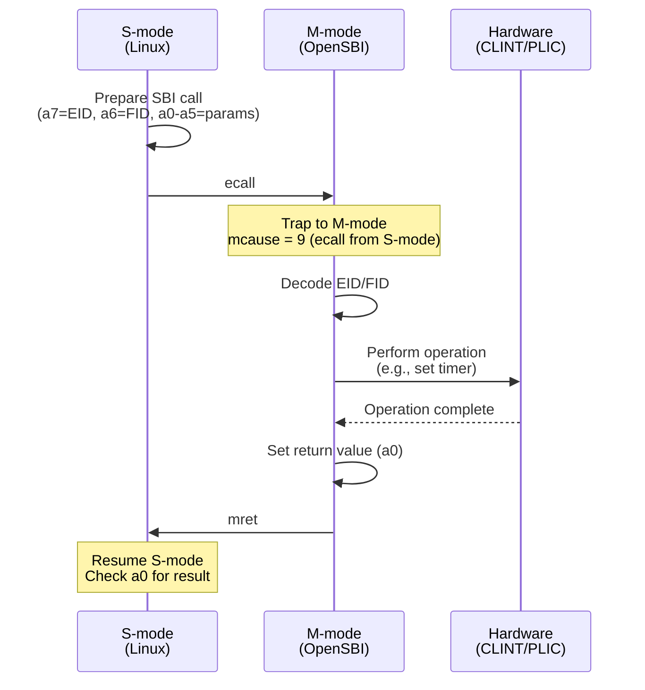
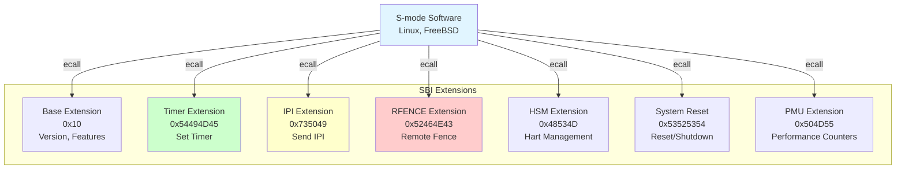
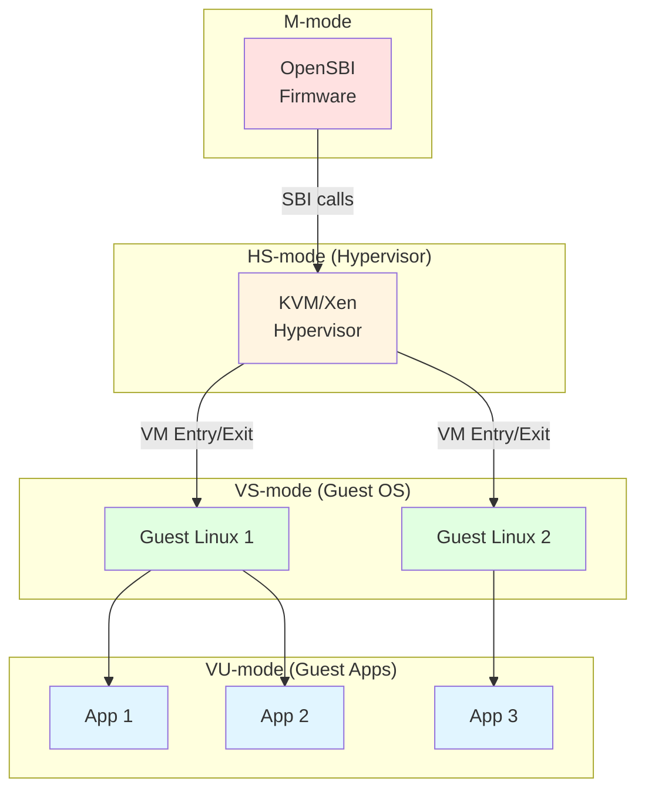
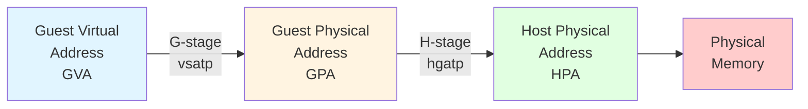

# Chapter 10. Machine Mode, SBI & Supervisor Mode

**Part VI — Booting & System Software**

---

Machine mode 是 RISC-V 的最高 privilege level，具有對所有 hardware resource 的無限制存取。但權力越大，責任越大 — M-mode firmware 必須是 minimal、robust 的，並為 supervisor mode software 提供 essential service。本章探討如何設計 M-mode firmware、實作 SBI service，以及支援 virtualization 和 security 等 advanced feature。

與 monolithic firmware architecture 不同，RISC-V 鼓勵一個 thin M-mode layer，將大部分功能 delegate 到 S-mode。這種設計哲學保持 M-mode 簡單和可移植，同時允許 S-mode 中的 rich OS feature。我們將檢視 M-mode firmware design pattern、Supervisor Binary Interface (SBI) specification、通過 H extension 的 hypervisor support，以及 Physical Memory Protection (PMP) 和 WorldGuard extension 等 security feature。

---

## 10.1 Machine Mode Firmware Design

### Minimal M-mode Firmware

**RISC-V 的哲學是保持 M-mode firmware 盡可能小。** Minimal M-mode firmware 可能只有幾 kilobyte，提供足夠的功能來 boot S-mode software。

**Minimal M-mode 責任**：

1. **Early hardware initialization**：DRAM、clock、reset
2. **Platform-specific setup**：配置 peripheral
3. **SBI runtime service**：Timer、IPI、RFENCE、console
4. **Exception delegation**：將大多數 trap 傳遞給 S-mode
5. **Boot S-mode software**：設置並 jump 到 OS

**Minimal M-mode firmware structure 範例**：

```c
// Minimal M-mode firmware
void m_mode_main(unsigned long hartid, void *fdt) {
    // 1. Initialize platform
    platform_init();
    
    // 2. Set up trap handler
    write_csr(mtvec, (uintptr_t)&m_trap_entry);
    
    // 3. Configure PMP
    setup_pmp();
    
    // 4. Delegate exceptions and interrupts
    write_csr(medeleg, 0xb1ff);  // Delegate most exceptions
    write_csr(mideleg, 0x0222);  // Delegate S-mode interrupts
    
    // 5. Start other harts (if multi-core)
    if (hartid == 0) {
        for (int i = 1; i < num_harts; i++) {
            start_hart(i);
        }
    }
    
    // 6. Boot S-mode payload
    boot_next_stage(hartid, fdt);
}
```

### Platform-Specific Initialization

**每個 RISC-V platform 都有必須初始化的 unique hardware。** M-mode firmware 通過 platform layer 抽象這些細節。

**Platform initialization 範例**：

```c
// Platform-specific initialization
struct platform_ops {
    int (*early_init)(void);
    int (*final_init)(void);
    void (*console_putc)(char c);
    int (*console_getc)(void);
    void (*timer_init)(void);
    void (*ipi_send)(unsigned long hartid);
    void (*system_reset)(void);
};

// SiFive FU740 platform
static struct platform_ops fu740_ops = {
    .early_init = fu740_early_init,
    .final_init = fu740_final_init,
    .console_putc = uart_putc,
    .console_getc = uart_getc,
    .timer_init = clint_timer_init,
    .ipi_send = clint_ipi_send,
    .system_reset = fu740_system_reset,
};

int platform_init(void) {
    struct platform_ops *ops = &fu740_ops;
    
    // Early initialization
    if (ops->early_init)
        ops->early_init();
    
    // Initialize console
    if (ops->console_putc)
        sbi_console_init(ops->console_putc, ops->console_getc);
    
    // Initialize timer
    if (ops->timer_init)
        ops->timer_init();
    
    // Final initialization
    if (ops->final_init)
        ops->final_init();
    
    return 0;
}
```

### Runtime Services

**M-mode firmware 通過 SBI interface 為 S-mode 提供 runtime service。** 這些 service 在 S-mode boot 後保持 active。

**Core runtime service**：

- **Timer**：Set timer interrupt（`sbi_set_timer`）
- **IPI**：Send inter-processor interrupt（`sbi_send_ipi`）
- **RFENCE**：Remote fence operation（`sbi_remote_fence_i`、`sbi_remote_sfence_vma`）
- **Console**：Debug output（`sbi_console_putchar`、`sbi_console_getchar`）
- **Hart management**：Start/stop hart（`sbi_hart_start`、`sbi_hart_stop`）
- **System reset**：Reboot/shutdown（`sbi_system_reset`）

---

## 10.2 SBI Call Interface

### SBI Call Mechanism

**S-mode software 使用 `ecall` instruction 調用 SBI service。** 這會 trap 到 M-mode，M-mode 處理 request 並 return 到 S-mode。

**Figure 10.1: SBI Call Flow**



### SBI Calling Convention

**SBI call 使用標準 register convention**：

**Input register**：

- **a7**：Extension ID (EID) — 識別 SBI extension
- **a6**：Function ID (FID) — 識別 extension 內的 function
- **a0-a5**：Function parameter（最多 6 個 parameter）

**Output register**：

- **a0**：Error code（0 = success，negative = error）
- **a1**：Return value（optional，function-specific）

**Preserved register**：除了 a0-a1 之外的所有 register 在 SBI call 中都被保留。

**範例：Send IPI**

```c
// S-mode code: Send IPI to hart 1
static inline long sbi_send_ipi(unsigned long hart_mask,
                                unsigned long hart_mask_base) {
    register unsigned long a0 asm("a0") = hart_mask;
    register unsigned long a1 asm("a1") = hart_mask_base;
    register unsigned long a6 asm("a6") = SBI_EXT_IPI_SEND_IPI;
    register unsigned long a7 asm("a7") = SBI_EXT_IPI;

    asm volatile("ecall"
                 : "+r"(a0), "+r"(a1)
                 : "r"(a6), "r"(a7)
                 : "memory");

    return a0;  // Return error code
}

// Usage
sbi_send_ipi(1 << 1, 0);  // Send IPI to hart 1
```

### SBI Error Codes

**SBI function 返回標準 error code**：

```c
#define SBI_SUCCESS                0
#define SBI_ERR_FAILED            -1
#define SBI_ERR_NOT_SUPPORTED     -2
#define SBI_ERR_INVALID_PARAM     -3
#define SBI_ERR_DENIED            -4
#define SBI_ERR_INVALID_ADDRESS   -5
#define SBI_ERR_ALREADY_AVAILABLE -6
#define SBI_ERR_ALREADY_STARTED   -7
#define SBI_ERR_ALREADY_STOPPED   -8
```

**Error handling**：

```c
long ret = sbi_send_ipi(hart_mask, 0);
if (ret < 0) {
    switch (ret) {
    case SBI_ERR_INVALID_PARAM:
        pr_err("Invalid hart mask\n");
        break;
    case SBI_ERR_FAILED:
        pr_err("IPI send failed\n");
        break;
    default:
        pr_err("Unknown error: %ld\n", ret);
    }
}
```

---

## 10.3 SBI Standard Extensions

**SBI 定義多個 extension**，每個提供相關功能。Extension 由 EID (Extension ID) 識別。

### Timer Extension (EID = 0x54494D45)

**Timer extension 提供 timer interrupt service。**

**Function: `sbi_set_timer` (FID = 0)**

設置 timer 在特定 time value 觸發。

```c
// Set timer to fire in 1 second
uint64_t current_time = rdtime();
uint64_t next_time = current_time + 10000000;  // 10 MHz clock

register unsigned long a0 asm("a0") = next_time;
register unsigned long a6 asm("a6") = 0;  // FID_SET_TIMER
register unsigned long a7 asm("a7") = 0x54494D45;  // EID_TIME
asm volatile("ecall" : "+r"(a0) : "r"(a6), "r"(a7) : "memory");
```

**M-mode implementation**：

```c
void sbi_set_timer(uint64_t stime_value) {
    unsigned long hartid = current_hartid();

    // Write to CLINT mtimecmp register
    volatile uint64_t *mtimecmp = (uint64_t *)(CLINT_BASE + 0x4000 + hartid * 8);
    *mtimecmp = stime_value;

    // Clear pending timer interrupt
    csr_clear(CSR_MIP, MIP_STIP);
}
```

### IPI Extension (EID = 0x735049)

**IPI extension 發送 inter-processor interrupt。**

**Function: `sbi_send_ipi` (FID = 0)**

向 hart mask 指定的一組 hart 發送 IPI。

```c
// Send IPI to harts 1, 2, 3
unsigned long hart_mask = 0b1110;  // Bits 1, 2, 3 set
sbi_send_ipi(hart_mask, 0);
```

**M-mode implementation**：

```c
int sbi_send_ipi(unsigned long hart_mask, unsigned long hart_mask_base) {
    for (int i = 0; i < 64; i++) {
        if (hart_mask & (1UL << i)) {
            unsigned long hartid = hart_mask_base + i;

            // Write to CLINT MSIP register
            volatile uint32_t *msip = (uint32_t *)(CLINT_BASE + hartid * 4);
            *msip = 1;
        }
    }
    return SBI_SUCCESS;
}
```

### RFENCE Extension (EID = 0x52464E43)

**RFENCE extension 在其他 hart 上執行 remote fence operation**（TLB flush、I-cache flush）。

**Function**：

- `sbi_remote_fence_i` (FID = 0)：Flush instruction cache
- `sbi_remote_sfence_vma` (FID = 1)：Flush TLB entry
- `sbi_remote_sfence_vma_asid` (FID = 2)：Flush 特定 ASID 的 TLB entry

**範例：Remote TLB flush**

```c
// Flush TLB on harts 1-3 for address range 0x80000000-0x80001000
unsigned long hart_mask = 0b1110;
unsigned long start_addr = 0x80000000;
unsigned long size = 0x1000;

register unsigned long a0 asm("a0") = hart_mask;
register unsigned long a1 asm("a1") = 0;  // hart_mask_base
register unsigned long a2 asm("a2") = start_addr;
register unsigned long a3 asm("a3") = size;
register unsigned long a6 asm("a6") = 1;  // FID_REMOTE_SFENCE_VMA
register unsigned long a7 asm("a7") = 0x52464E43;  // EID_RFENCE
asm volatile("ecall" : "+r"(a0) : "r"(a1), "r"(a2), "r"(a3), "r"(a6), "r"(a7) : "memory");
```

**M-mode implementation**：

```c
int sbi_remote_sfence_vma(unsigned long hart_mask, unsigned long hart_mask_base,
                          unsigned long start_addr, unsigned long size) {
    // Send IPI to target harts
    for (int i = 0; i < 64; i++) {
        if (hart_mask & (1UL << i)) {
            unsigned long hartid = hart_mask_base + i;

            // Store fence parameters for target hart
            remote_fence_info[hartid].start = start_addr;
            remote_fence_info[hartid].size = size;
            remote_fence_info[hartid].type = FENCE_SFENCE_VMA;

            // Send IPI
            clint_send_ipi(hartid);
        }
    }

    // Wait for completion (optional, depends on implementation)
    return SBI_SUCCESS;
}

// IPI handler on target hart
void handle_remote_fence_ipi(void) {
    struct remote_fence_info *info = &remote_fence_info[current_hartid()];

    if (info->type == FENCE_SFENCE_VMA) {
        // Perform sfence.vma
        if (info->size == 0) {
            asm volatile("sfence.vma" ::: "memory");
        } else {
            // Flush specific range (implementation-specific)
            for (unsigned long addr = info->start;
                 addr < info->start + info->size;
                 addr += PAGE_SIZE) {
                asm volatile("sfence.vma %0" :: "r"(addr) : "memory");
            }
        }
    }
}
```

### HSM Extension (EID = 0x48534D)

**Hart State Management (HSM) extension 控制 hart lifecycle。**

**Function**：

- `sbi_hart_start` (FID = 0)：Start a hart
- `sbi_hart_stop` (FID = 1)：Stop current hart
- `sbi_hart_get_status` (FID = 2)：Get hart status

**範例：Start a hart**

```c
// Start hart 1 at address 0x80200000 with argument 0x12345678
unsigned long hartid = 1;
unsigned long start_addr = 0x80200000;
unsigned long opaque = 0x12345678;

register unsigned long a0 asm("a0") = hartid;
register unsigned long a1 asm("a1") = start_addr;
register unsigned long a2 asm("a2") = opaque;
register unsigned long a6 asm("a6") = 0;  // FID_HART_START
register unsigned long a7 asm("a7") = 0x48534D;  // EID_HSM
asm volatile("ecall" : "+r"(a0) : "r"(a1), "r"(a2), "r"(a6), "r"(a7) : "memory");
```

**M-mode implementation**：

```c
int sbi_hart_start(unsigned long hartid, unsigned long start_addr, unsigned long opaque) {
    if (hartid >= num_harts)
        return SBI_ERR_INVALID_PARAM;

    if (hart_state[hartid] != HART_STOPPED)
        return SBI_ERR_ALREADY_STARTED;

    // Set up hart entry point
    hart_entry_addr[hartid] = start_addr;
    hart_entry_arg[hartid] = opaque;

    // Wake up hart (platform-specific)
    platform_hart_start(hartid);

    hart_state[hartid] = HART_STARTED;
    return SBI_SUCCESS;
}
```

### System Reset Extension (EID = 0x53525354)

**System Reset extension 提供 system-wide reset 和 shutdown。**

**Function: `sbi_system_reset` (FID = 0)**

```c
// Reboot the system
#define SBI_RESET_TYPE_SHUTDOWN  0
#define SBI_RESET_TYPE_COLD_REBOOT  1
#define SBI_RESET_TYPE_WARM_REBOOT  2

register unsigned long a0 asm("a0") = SBI_RESET_TYPE_COLD_REBOOT;
register unsigned long a1 asm("a1") = 0;  // Reset reason
register unsigned long a6 asm("a6") = 0;  // FID_SYSTEM_RESET
register unsigned long a7 asm("a7") = 0x53525354;  // EID_SRST
asm volatile("ecall" : "+r"(a0) : "r"(a1), "r"(a6), "r"(a7) : "memory");
// This call does not return
```

**Figure 10.2: SBI Extensions Overview**



---

## 10.4 Console and Debug Output

### Console I/O via SBI

**SBI 為 early debugging 提供簡單的 console I/O**，在完整的 UART driver 可用之前。

**Legacy console function**（deprecated 但廣泛使用）：

- `sbi_console_putchar` (EID = 0x01)：Output one character
- `sbi_console_getchar` (EID = 0x02)：Input one character

**範例：Early printk**

```c
void sbi_putchar(char c) {
    register unsigned long a0 asm("a0") = c;
    register unsigned long a7 asm("a7") = 0x01;  // Legacy console putchar
    asm volatile("ecall" : "+r"(a0) : "r"(a7) : "memory");
}

void early_printk(const char *str) {
    while (*str) {
        if (*str == '\n')
            sbi_putchar('\r');
        sbi_putchar(*str++);
    }
}

// Usage
early_printk("Hello from S-mode!\n");
```

**M-mode implementation**：

```c
void sbi_console_putchar(int ch) {
    // Platform-specific UART output
    uart_putc(ch);
}

int sbi_console_getchar(void) {
    // Platform-specific UART input
    return uart_getc();
}
```

**Modern approach**：使用 **Debug Console Extension (DBCN)** 以獲得更多 feature（buffered I/O、formatted output）。

---

## 10.5 Hypervisor Extension (H Extension)

### Virtualization Support in RISC-V

**Hypervisor extension (H) 為 RISC-V 添加 virtualization support**，使 hypervisor 能夠運行多個 guest operating system。與 ARM 的 built-in EL2 不同，RISC-V virtualization 是 optional extension。

**Key feature**：

- **VS-mode 和 VU-mode**：Virtualized supervisor 和 user mode
- **Two-stage address translation**：Guest physical → Host physical
- **Virtual interrupt**：Virtualized interrupt delivery
- **Hypervisor CSR**：控制 virtualization feature

**Privilege mode with H extension**：

- **M-mode**：Machine mode（firmware）
- **HS-mode**：Hypervisor-extended supervisor mode（hypervisor）
- **VS-mode**：Virtual supervisor mode（guest OS）
- **U-mode**：User mode（application）
- **VU-mode**：Virtual user mode（guest application）

**Figure 10.3: RISC-V Virtualization Architecture**



### Two-Stage Address Translation

**使用 H extension，address translation 分兩個 stage 進行**：

1. **First stage (G-stage)**：Guest virtual address (GVA) → Guest physical address (GPA)
   - 由 guest OS 控制（vsatp CSR）
   - Guest 認為它正在管理 physical memory

2. **Second stage (H-stage)**：Guest physical address (GPA) → Host physical address (HPA)
   - 由 hypervisor 控制（hgatp CSR）
   - 將 guest "physical" address 轉換為真實 physical address

**Figure 10.4: Two-Stage Address Translation**



**範例**：

- Guest OS 將 virtual address `0x1000` 映射到 guest physical address `0x80001000`（使用 vsatp）
- Hypervisor 將 guest physical `0x80001000` 映射到 host physical `0x90001000`（使用 hgatp）
- 最終存取：`0x1000` (GVA) → `0x80001000` (GPA) → `0x90001000` (HPA)

### Virtual Interrupt Handling

**H extension 虛擬化 interrupt**，允許 hypervisor 將 interrupt inject 到 guest VM。

**Hypervisor interrupt CSR**：

- **hvip**：Hypervisor virtual interrupt pending
- **hie**：Hypervisor interrupt enable
- **hgeip**：Hypervisor guest external interrupt pending

**Injecting a virtual interrupt**：

```c
// Hypervisor code: Inject timer interrupt into guest
void inject_guest_timer_interrupt(void) {
    // Set virtual supervisor timer interrupt pending
    csr_set(CSR_HVIP, HVIP_VSTIP);

    // When guest resumes, it will see a timer interrupt
}
```

**Guest handling**：

```c
// Guest OS sees the interrupt as a normal S-mode interrupt
void guest_timer_handler(void) {
    // Handle timer interrupt
    // Guest doesn't know it's virtualized
}
```

### VM Entry and Exit

**Hypervisor 使用 special instruction 和 CSR manipulation 在 HS-mode 和 VS-mode 之間切換。**

**VM Entry**（HS-mode → VS-mode）：

```c
void vm_enter(struct vcpu *vcpu) {
    // 1. Load guest state
    write_csr(CSR_VSSTATUS, vcpu->vsstatus);
    write_csr(CSR_VSIE, vcpu->vsie);
    write_csr(CSR_VSTVEC, vcpu->vstvec);
    write_csr(CSR_VSSCRATCH, vcpu->vsscratch);
    write_csr(CSR_VSEPC, vcpu->vsepc);
    write_csr(CSR_VSCAUSE, vcpu->vscause);
    write_csr(CSR_VSTVAL, vcpu->vstval);
    write_csr(CSR_VSATP, vcpu->vsatp);

    // 2. Set hstatus.SPV = 1 (virtualization enabled)
    csr_set(CSR_HSTATUS, HSTATUS_SPV);

    // 3. Set sepc to guest entry point
    write_csr(CSR_SEPC, vcpu->pc);

    // 4. Enter VS-mode
    asm volatile("sret");  // Return to VS-mode
}
```

**VM Exit**（VS-mode → HS-mode）：

當 guest 執行某些 instruction（ecall、WFI、privileged CSR access）或 take a trap 時，control 返回到 hypervisor。

```c
void vm_exit_handler(struct vcpu *vcpu) {
    // Save guest state
    vcpu->vsstatus = read_csr(CSR_VSSTATUS);
    vcpu->vsepc = read_csr(CSR_VSEPC);
    vcpu->vscause = read_csr(CSR_VSCAUSE);
    vcpu->vstval = read_csr(CSR_VSTVAL);
    vcpu->pc = read_csr(CSR_SEPC);

    // Handle exit reason
    unsigned long cause = read_csr(CSR_SCAUSE);

    switch (cause) {
    case CAUSE_VIRTUAL_SUPERVISOR_ECALL:
        // Guest made hypercall
        handle_hypercall(vcpu);
        break;
    case CAUSE_GUEST_PAGE_FAULT:
        // Guest page fault (G-stage or H-stage)
        handle_guest_page_fault(vcpu);
        break;
    case CAUSE_VIRTUAL_INSTRUCTION:
        // Guest tried to execute privileged instruction
        emulate_instruction(vcpu);
        break;
    default:
        // Other traps
        inject_exception_to_guest(vcpu, cause);
    }
}
```

---

## 10.6 Security Model

### Physical Memory Protection (PMP)

**PMP 是 RISC-V 的主要 memory protection mechanism**，在 M-mode 中強制執行。它定義 memory region 和 lower privilege mode 的 access permission。

**PMP use case**：

- 保護 M-mode firmware 免受 S-mode 存取
- 隔離 security-critical region
- 強制執行 memory access policy
- 實作 basic TEE (Trusted Execution Environment)

**PMP configuration register**：

- **pmpcfg0-pmpcfg15**：PMP entry 的 configuration（每個 register 8 個 entry）
- **pmpaddr0-pmpaddr63**：Address register（最多 64 個 entry）

**PMP entry format** (pmpcfg)：

```
Bits [7:0] for each entry:
  [7]: L (Lock) - Entry cannot be modified until reset
  [6:5]: Reserved
  [4:3]: A (Address matching mode)
         00 = OFF, 01 = TOR, 10 = NA4, 11 = NAPOT
  [2]: X (Execute permission)
  [1]: W (Write permission)
  [0]: R (Read permission)
```

**範例：Protect M-mode firmware**

```c
void protect_m_mode_firmware(void) {
    // Protect 0x80000000 - 0x80100000 (1 MB M-mode firmware)
    // Use TOR (Top-Of-Range) mode

    // Entry 0: Start address (0x80000000)
    write_csr(pmpaddr0, 0x80000000 >> 2);

    // Entry 1: End address (0x80100000)
    write_csr(pmpaddr1, 0x80100000 >> 2);

    // Configure: TOR mode, R+X, Locked
    uint8_t cfg = PMP_R | PMP_X | PMP_TOR | PMP_L;
    write_csr(pmpcfg0, cfg << 8);  // Entry 1 config

    // Now S-mode cannot access 0x80000000 - 0x80100000
}
```

### Enhanced PMP (ePMP)

**ePMP 以額外的 security feature 擴展 PMP**：

- **Rule locking**：防止修改 PMP entry
- **M-mode lockdown**：限制 M-mode 存取特定 region
- **Whitelist mode**：Default deny，explicit allow

**ePMP 添加 mseccfg CSR**：

```
Bits:
  [2]: RLB (Rule Locking Bypass) - Allow M-mode to modify locked entries
  [1]: MMWP (Machine Mode Whitelist Policy) - Enforce whitelist for M-mode
  [0]: MML (Machine Mode Lockdown) - Restrict M-mode access
```

**範例：M-mode lockdown**

```c
void enable_m_mode_lockdown(void) {
    // Set MML bit: M-mode can only access regions with L=1 and X=0
    write_csr(CSR_MSECCFG, MSECCFG_MML);

    // Now M-mode is restricted to explicitly allowed regions
}
```

### Comparison with ARM TrustZone

**RISC-V PMP vs ARM TrustZone**：

| Feature | RISC-V PMP | ARM TrustZone |
|---------|------------|---------------|
| **Isolation** | Region-based (up to 64 regions) | World-based (Secure/Non-secure) |
| **Granularity** | 4 bytes to 2^64 bytes | 4 KB minimum |
| **Privilege** | M-mode enforced | EL3 enforced |
| **Secure world** | No built-in secure world | Dedicated S-EL0/S-EL1 |
| **Complexity** | Simple, flexible | Complex, rich features |
| **Use case** | Firmware protection, basic TEE | Full TEE, secure boot, DRM |

**RISC-V security philosophy**：提供 minimal hardware mechanism（PMP），在 software 中構建 rich security feature（TEE framework 如 Keystone、Penglai）。

**ARM TrustZone philosophy**：為 secure world 提供 rich hardware support，標準化 TEE architecture。

---

## Summary

Machine mode 和 SBI 為 RISC-V system software 提供基礎。本章涵蓋五個關鍵領域：

**M-mode firmware** 設計為 minimal 和 platform-specific。它初始化 hardware、設置 memory protection，並通過 SBI interface 提供 runtime service。與 ARM 的 extensive EL3 firmware 不同，RISC-V 保持 M-mode 簡單，並將大部分功能 delegate 到 S-mode。

**SBI interface** 在 M-mode firmware 和 S-mode operating system 之間提供標準的 ecall-based interface。Calling convention 使用 register a0-a7 作為 parameter，並在 a0 中返回 error code。這種標準化確保 OS kernel 可以在任何 RISC-V platform 上運行而無需修改。

**SBI extension** 涵蓋 essential system service：Timer extension 用於 scheduling、IPI extension 用於 inter-processor communication、RFENCE extension 用於 TLB synchronization、HSM extension 用於 hart lifecycle management，以及 System Reset extension 用於 reboot 和 shutdown。每個 extension 由 Extension ID (EID) 識別並提供多個 function。

**Hypervisor extension** 通過 VS-mode 和 VU-mode 添加 virtualization support，使 guest operating system 能夠在 hypervisor 下運行。Two-stage address translation（GVA → GPA → HPA）隔離 guest memory，而 virtual interrupt injection 允許 hypervisor 向 guest 傳遞 interrupt。VM entry 和 exit 通過 CSR manipulation 和 SRET instruction 管理。

**PMP 和 ePMP** 通過定義 memory region 的 access permission 提供 memory protection。PMP 比 ARM TrustZone 簡單，但足以保護 M-mode firmware 並實作 basic trusted execution environment。ePMP 添加 enhanced security feature，如 M-mode lockdown 和 rule locking。

在下一章中，我們將探討 RISC-V ISA extension，從 standard extension（M、A、F、D、C）開始，然後轉向 advanced feature，如 Vector 和 Bit Manipulation。

---
