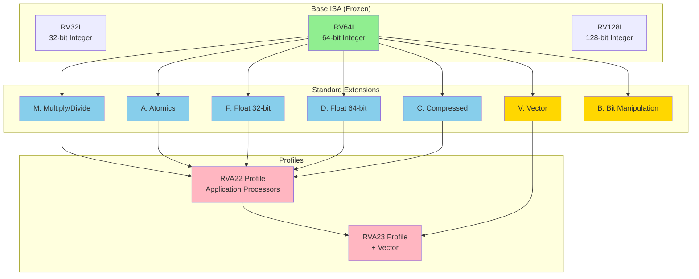

# Chapter 11. RISC-V Standard Extensions

**Part VII — ISA Extensions**

---

## 🎯 學習目標

讀完本章後，你將能夠：

1. **解讀 ISA 命名**：能夠解析 RV64GC、RV32IM 等 ISA 字串的含義
2. **理解 G 組合包**：明白 G = IMAFD 的定義與歷史背景
3. **掌握 Z/X 擴充邏輯**：理解新式 Extension 的命名規則
4. **比較軟硬體實作**：了解硬體指令 vs 軟體模擬的效能差異
5. **檢測 Extension 存在**：能夠透過 `misa` CSR 查詢 CPU 支援的功能

---

## 💡 情境引入：技能樹與 DLC

> **場景**：小華在閱讀 Linux Kernel 的編譯選項時，被一長串 ISA 字串嚇到了。

**小華**：「杰哥，這行 `MARCH` 變數是在寫 Wi-Fi 密碼嗎？`RV64IMAFDC_Zicsr`...這誰看得懂啊？」

**阿杰**：（笑）「這可是 RISC-V 的身分證。別怕，我們把它當作 RPG 遊戲的角色屬性來看，拆開就很簡單。」

**小華**：「RPG 屬性？」

**阿杰**：「你看頭兩個字 **RV64**，這代表它是 64 位元的角色，能拿雙手大劍（64-bit 暫存器）。如果是 RV32 就是 32 位元。」

**小華**：「這我懂，那後面那串英文字母呢？」

**阿杰**：「那是它『學會的技能』，每個字母代表一種能力：

| 字母 | 名稱 | 比喻 | 功能 |
|-----|------|------|------|
| **I** | Integer | 基本功 | 加減法和邏輯運算，必備技能 |
| **M** | Multiply | 乘法技 | 硬體乘除法，沒它就得連做 N 次加法 |
| **A** | Atomic | 鎖定技 | 原子操作，Spinlock 的基礎 |
| **F** | Float | 單精度魔法 | 32-bit 浮點數運算 |
| **D** | Double | 雙精度魔法 | 64-bit 浮點數運算 |
| **C** | Compressed | 縮骨功 | 16-bit 壓縮指令，省空間 |

」

**小華**：「原來如此。那大家常說的 **RV64GC** 又是什麼？這裡面沒有 G 啊？」

**阿杰**：「**G (General)** 是一個『超值套餐』。因為 IMAFD 這五個太常用了，所以官方定義 **G = I + M + A + F + D**。所以 `RV64GC` 其實就是 `RV64IMAFDC` 的縮寫，這是現在跑 Linux 的基本門檻。」

**小華**：「懂了！那最後那個 **Z** 開頭的又是什麼？隱藏版技能？」

**阿杰**：「差不多。因為 26 個英文字母快不夠用了，所以後來的新功能（或是從 I 裡面拆出來的功能）都用 **Z** 開頭加上名字。這就像是遊戲的 **DLC 資料片**。

比如 `Zicsr` 代表它支援 CSR 操作，`Zifencei` 代表支援指令屏障。這串密碼其實就是告訴編譯器：『這顆 CPU 有買這些 DLC，你可以盡量用這些指令』！」

**小華**：「哈！原來只是技能列表啊，這樣看就清楚多了！」

---

RISC-V 的 modular design 是其最顯著的特點之一。與將所有功能捆綁在一起的 monolithic instruction set architecture 不同，RISC-V 將功能分離為 minimal base ISA 加上 optional extension。這種方法允許 implementation 只包含它們需要的 feature，從 tiny microcontroller 到 high-performance server。

Base integer ISA（RV32I 或 RV64I）提供足夠的 instruction 來運行完整的 operating system 和 application — 總共 47 條 instruction。但大多數實際系統需要更多：multiplication 和 division、用於 synchronization 的 atomic operation、floating-point arithmetic，以及用於 code density 的 compressed instruction。這些能力來自 standard extension，每個由單個字母識別。

理解這些 extension 對於任何使用 RISC-V 的人都至關重要。Compiler writer 需要知道哪些 instruction 可用。Hardware designer 必須決定實作哪些 extension。Software developer 需要理解使用 extension instruction 與在 software 中 emulate 它們的 performance implication。

在本章中，我們將探討構成大多數 RISC-V system 基礎的 standard extension：M 用於 multiplication、A 用於 atomic、F 和 D 用於 floating-point、C 用於 compressed instruction，以及 B 用於 bit manipulation。我們將看到這些 extension 如何與 base ISA 整合，並將它們與 ARM 和 x86 中的類似 feature 進行比較。

---

## 11.1 Extension Overview

**The Extension Model**

RISC-V extension 遵循精心設計的 model。Base ISA (I) 是 frozen 的，永遠不會改變。Extension 添加功能而不修改 base。一旦 extension 被 ratify，它也是 frozen 的，確保長期穩定性。

Extension 由單個字母識別：M、A、F、D、C、V、B 等。Processor 的能力通過連接這些字母來描述：RV64IMAFD 表示具有 integer、multiplication、atomic、single-precision float 和 double-precision float extension 的 64-bit processor。字母 G 是 IMAFD（general-purpose）的簡寫，因此 RV64GC 表示 RV64IMAFD 加上 compressed instruction。

**Standard vs Non-Standard Extensions**

Standard extension 由 RISC-V International 定義並通過正式流程 ratify。它們有保留的字母代碼，並保證在 implementation 之間兼容。Non-standard extension 使用 X prefix（如 Xvendor）並且是 vendor-specific。

Custom extension 可以添加 specialized instruction 而不與 standard 衝突。Instruction encoding 為 custom instruction 保留 opcode space，允許 vendor 創新同時保持與 standard software 的兼容性。

**Extension Discovery**

Software 可以通過讀取 `misa` CSR（Machine ISA register）來檢測存在哪些 extension。`misa` 中的每個 bit 對應一個 extension：

```c
// Read misa to detect extensions
unsigned long misa = read_csr(CSR_MISA);

bool has_M = (misa & (1 << ('M' - 'A')));  // Bit 12
bool has_A = (misa & (1 << ('A' - 'A')));  // Bit 0
bool has_F = (misa & (1 << ('F' - 'A')));  // Bit 5
bool has_D = (misa & (1 << ('D' - 'A')));  // Bit 3
bool has_C = (misa & (1 << ('C' - 'A')));  // Bit 2
```

在某些 implementation 上，`misa` 是 read-only。在其他 implementation 上，寫入 `misa` 可以動態 enable 或 disable extension，儘管這在實踐中很少見。

**Figure 11.1: RISC-V Extension Ecosystem**



圖表顯示 extension 如何建立在 base ISA 之上，並組合成用於特定 use case 的 profile。

---

## 11.2 M Extension: Integer Multiplication and Division

**Why M is Optional**

M extension 添加 integer multiplication 和 division instruction。你可能想知道為什麼這些基本操作不在 base ISA 中。答案是簡單性和靈活性。

Tiny embedded system（如 IoT sensor）可能永遠不需要 multiplication 或 division。使 M optional 允許這些系統節省 chip area 和 power。如果需要，software 可以使用 shift 和 add 來 emulate multiplication，儘管比 hardware 慢得多。

對於大多數系統，M 是必不可少的。它是 G（general-purpose）bundle 的一部分，並且是 application processor 的 RVA22 profile 所要求的。

**Multiplication Instructions**

M extension 為 RV32 和 RV64 提供四條 multiplication instruction：

*MUL rd, rs1, rs2*：將 rs1 乘以 rs2，將低 XLEN bit 存儲在 rd 中。這是最常見的 multiplication，當你只需要 low-order result 時使用。

```assembly
# Example: Multiply two 32-bit numbers
li a0, 100
li a1, 200
mul a2, a0, a1      # a2 = 100 * 200 = 20000
```

*MULH rd, rs1, rs2*：將 signed rs1 乘以 signed rs2，將高 XLEN bit 存儲在 rd 中。用於檢測 overflow 或實作 multi-word multiplication。

*MULHU rd, rs1, rs2*：將 unsigned rs1 乘以 unsigned rs2，將高 XLEN bit 存儲在 rd 中。

*MULHSU rd, rs1, rs2*：將 signed rs1 乘以 unsigned rs2，將高 XLEN bit 存儲在 rd 中。這個 asymmetric variant 對某些 algorithm 很有用。

**為什麼分離 high 和 low multiply？** 兩個 XLEN-bit number 的完整 multiplication 產生 2×XLEN-bit result。MUL 給你 low half，MULH/MULHU/MULHSU 給你 high half。要獲得完整 result，你執行兩者：

```assembly
# 64-bit × 64-bit = 128-bit multiplication
mul  a2, a0, a1     # Low 64 bits
mulh a3, a0, a1     # High 64 bits
# Result is in a3:a2 (128 bits)
```

**Division and Remainder**

M extension 還提供 division 和 remainder instruction：

*DIV rd, rs1, rs2*：Signed division，rd = rs1 / rs2（truncated toward zero）。

*DIVU rd, rs1, rs2*：Unsigned division，rd = rs1 / rs2。

*REM rd, rs1, rs2*：Signed remainder，rd = rs1 % rs2。

*REMU rd, rs1, rs2*：Unsigned remainder，rd = rs1 % rs2。

```assembly
# Example: Divide 100 by 7
li a0, 100
li a1, 7
div a2, a0, a1      # a2 = 100 / 7 = 14
rem a3, a0, a1      # a3 = 100 % 7 = 2
```

**Division by zero** 在 RISC-V 中不會 trap。相反，它返回定義的值：division by zero 返回 -1（所有 bit 設置），remainder by zero 返回 dividend。這允許 software 在需要時明確檢查 zero，而無需 trap handling 的 overhead。

**RV64 Word Operations**

在 RV64 上，M extension 添加 word-sized（32-bit）variant，它們操作低 32 bit 並將 result sign-extend 到 64 bit：

*MULW, DIVW, DIVUW, REMW, REMUW*

```assembly
# RV64: 32-bit multiplication with sign extension
li a0, 0x80000000   # -2147483648 (32-bit)
li a1, 2
mulw a2, a0, a1     # a2 = 0xFFFFFFFF00000000 (sign-extended)
```

這些對於在 64-bit processor 上高效處理 32-bit data 至關重要。

**Performance Characteristics**

Multiplication 和 division 比 addition 和 logic operation 慢。典型 latency：

- MUL：2-4 cycle（pipelined，throughput 1/cycle）
- DIV：10-40 cycle（not pipelined，variable latency）

Division 特別昂貴。Compiler 在可能的情況下將 constant division 優化為 reciprocal multiplication。

---

## 11.3 A Extension: Atomic Instructions

**The Need for Atomics**

在 multi-processor system 中，多個 hart（hardware thread）可能同時存取 shared memory。沒有 atomic operation，race condition 可能會破壞 data。考慮 increment shared counter：

```c
// Non-atomic increment (WRONG for multi-threaded code)
int counter = 0;

void increment() {
    counter++;  // Read-modify-write: NOT atomic!
}
```

這編譯為三個獨立的 instruction：

```assembly
lw   a0, counter
addi a0, a0, 1
sw   a0, counter
```

如果兩個 hart 同時執行此操作，兩者可能讀取相同的值，increment 它，並寫回相同的 result — 丟失一個 increment。Atomic instruction 解決了這個問題。

**Load-Reserved / Store-Conditional**

A extension 提供兩個基本 primitive 來構建 atomic operation：

*LR.W rd, (rs1)*：Load-Reserved Word。從 memory 加載 word 並在該 address 上註冊 reservation。

*SC.W rd, rs1, (rs2)*：Store-Conditional Word。僅當 reservation 仍然有效時，將 rs1 存儲到 rs2 的 memory。成功時在 rd 中返回 0，失敗時返回 non-zero。

如果另一個 hart 寫入 reserved address 或發生某些事件（context switch、cache eviction 等），reservation 將被 invalidate。

**使用 LR/SC 的 atomic increment**：

```assembly
# Atomic increment of counter
retry:
    lr.w  a0, (a1)      # Load counter, set reservation
    addi  a0, a0, 1     # Increment
    sc.w  a2, a0, (a1)  # Store if reservation valid
    bnez  a2, retry     # Retry if SC failed
```

如果另一個 hart 在 LR 和 SC 之間修改 counter，SC 失敗並且 loop retry。這確保了 atomicity。

**Atomic Memory Operations (AMO)**

對於常見的 atomic operation，A extension 提供專用的 AMO instruction，比 LR/SC loop 更高效：

*AMOSWAP.W rd, rs2, (rs1)*：Atomically swap memory[rs1] with rs2，在 rd 中返回 old value。

*AMOADD.W rd, rs2, (rs1)*：Atomically add rs2 to memory[rs1]，在 rd 中返回 old value。

*AMOAND.W, AMOOR.W, AMOXOR.W*：Atomic AND、OR、XOR。

*AMOMIN.W, AMOMAX.W, AMOMINU.W, AMOMAXU.W*：Atomic min/max（signed 和 unsigned）。

```assembly
# Atomic increment using AMO (simpler than LR/SC)
amoadd.w zero, a0, (a1)  # Atomically add a0 to memory[a1]
```

**Atomic Ordering Annotations**

AMO 和 LR/SC instruction 可以有 ordering annotation：

*.aq*（acquire）：Subsequent memory operation 不能在此 instruction 之前 reorder。

*.rl*（release）：Previous memory operation 不能在此 instruction 之後 reorder。

*.aqrl*：Both acquire 和 release。

```assembly
# Atomic swap with acquire-release semantics
amoswap.w.aqrl a0, a1, (a2)
```

這些 annotation 對於實作 lock-free data structure 和 memory barrier 至關重要（見 Chapter 6 關於 memory ordering）。

**RV64 Variants**

在 RV64 上，A extension 提供 word（32-bit）和 doubleword（64-bit）variant：

*LR.W / SC.W*：32-bit load-reserved / store-conditional
*LR.D / SC.D*：64-bit load-reserved / store-conditional
*AMOADD.W / AMOADD.D*：32-bit / 64-bit atomic add
（其他 AMO operation 類似）

**Comparison with ARM and x86**

*ARM*：使用 LDREX/STREX（load-exclusive / store-exclusive），類似於 RISC-V 的 LR/SC。ARMv8.1 添加了 atomic instruction（LDADD、LDSWP 等），類似於 RISC-V 的 AMO。

*x86*：使用 LOCK prefix 與 normal instruction（LOCK ADD、LOCK XCHG 等）和專用 atomic instruction（CMPXCHG）。x86 的 model 更複雜，但默認提供 strong ordering。

RISC-V 的方法更清晰：LR/SC 提供靈活性，AMO 用於常見情況，explicit ordering annotation 用於 performance。

---

## 11.4 F and D Extensions: Floating-Point

**Floating-Point in RISC-V**

F extension 添加 single-precision（32-bit）floating-point，D extension 添加 double-precision（64-bit）。兩者都遵循 IEEE 754 standard，確保與其他 architecture 和 programming language 的兼容性。

Floating-point 是 optional，因為並非所有系統都需要它。Embedded controller 通常只使用 integer。但對於 scientific computing、graphics 和許多 application，floating-point 是必不可少的。

**Floating-Point Register File**

F 和 D extension 添加一個獨立的 register file，有 32 個 floating-point register，f0 到 f31。每個 register 是 FLEN bit 寬，其中 FLEN 對於僅 F 是 32，對於 D 是 64，對於 Q（quad-precision，future extension）是 128。

Integer 和 floating-point register 的分離簡化了 hardware design，並允許同時存取兩者。它也遵循 RISC architecture（如 MIPS 和 SPARC）的傳統。

**Floating-Point CSRs**

三個 CSR 控制 floating-point behavior：

*fcsr*（Floating-Point Control and Status Register）：Combined control 和 status。

*frm*（Floating-Point Rounding Mode）：fcsr 的 bit [7:5]，選擇 rounding mode：

- 000：Round to nearest, ties to even（default）
- 001：Round toward zero（truncate）
- 010：Round down（toward -∞）
- 011：Round up（toward +∞）
- 100：Round to nearest, ties to max magnitude

*fflags*（Floating-Point Exception Flags）：fcsr 的 bit [4:0]，記錄 exception：

- NV：Invalid operation
- DZ：Divide by zero
- OF：Overflow
- UF：Underflow
- NX：Inexact

```c
// Set rounding mode to round toward zero
write_csr(CSR_FRM, 0b001);

// Check for floating-point exceptions
unsigned int flags = read_csr(CSR_FFLAGS);
if (flags & 0x10) {
    // Invalid operation occurred
}
```

**F Extension Instructions**

F extension 為 single-precision float 提供 arithmetic、comparison、conversion 和 move instruction：

*Arithmetic*：FADD.S、FSUB.S、FMUL.S、FDIV.S、FSQRT.S

*Fused multiply-add*：FMADD.S、FMSUB.S、FNMADD.S、FNMSUB.S

*Comparison*：FEQ.S、FLT.S、FLE.S

*Conversion*：FCVT.W.S（float to int）、FCVT.S.W（int to float），以及 variant

*Move*：FMV.X.W（float reg to int reg）、FMV.W.X（int reg to float reg）

*Load/Store*：FLW、FSW

```assembly
# Example: Compute (a * b) + c using fused multiply-add
flw  fa0, 0(a0)     # Load a
flw  fa1, 4(a0)     # Load b
flw  fa2, 8(a0)     # Load c
fmadd.s fa3, fa0, fa1, fa2  # fa3 = (a * b) + c
fsw  fa3, 12(a0)    # Store result
```

**D Extension Instructions**

D extension 以 double-precision operation 擴展 F。所有 F instruction 都有 D equivalent（FADD.D、FMUL.D 等）。此外，D 提供 single 和 double precision 之間的 conversion：

*FCVT.S.D*：Convert double to single（with rounding）
*FCVT.D.S*：Convert single to double（exact）

```assembly
# Convert single to double
flw  fa0, 0(a0)     # Load single-precision
fcvt.d.s fa1, fa0   # Convert to double-precision
fsd  fa1, 0(a1)     # Store double-precision
```

**NaN Boxing**

在 RV64 with F extension（但不是 D）上，64-bit register 中的 single-precision value 必須是 NaN-boxed：高 32 bit 設置為全 1。這允許 hardware 區分 valid single-precision value 和 invalid data。

```
Valid single-precision in 64-bit register:
[63:32] = 0xFFFFFFFF
[31:0]  = single-precision value
```

使用 D extension，這不需要，因為 register 自然是 64 bit。

**Performance**

Floating-point operation 通常比 integer operation 慢：

- FADD/FSUB：3-5 cycle latency
- FMUL：4-6 cycle latency
- FDIV：10-20 cycle latency（not pipelined）
- FSQRT：15-30 cycle latency

Fused multiply-add（FMADD）特別有價值：它在一條 instruction 中計算 (a × b) + c，只有一次 rounding，比單獨的 multiply 和 add 更快更準確。

---

## 11.5 C Extension: Compressed Instructions

**The Code Density Problem**

RISC architecture 傳統上使用 fixed-length 32-bit instruction。這簡化了 decoding 和 pipelining，但浪費 memory 和 instruction cache space。許多常見操作（如 "add register to register" 或 "load from stack"）不需要 32 bit 來 encode。

C extension 通過添加可以與 standard 32-bit instruction 自由混合的 16-bit compressed instruction 來解決這個問題。這以最小的 hardware complexity 將 code density 提高 25-30%。

**How Compressed Instructions Work**

Compressed instruction 是 16 bit，並在 16-bit boundary 上對齊。Processor 的 fetch unit 在 decoding 之前自動將它們擴展為等效的 32-bit instruction。這種 expansion 對 software 是透明的 — compressed instruction 只是更緊湊的 encoding。

Instruction 的低 2 bit 指示其長度：

- `xx00`、`xx01`、`xx10`：16-bit compressed instruction（C extension）
- `xxx11`：32-bit standard instruction（或更長的 future extension）

這種 encoding 允許 processor 在不進行 pre-decoding 的情況下確定 instruction boundary。

**Common Compressed Instructions**

C extension 提供最頻繁操作的 compressed form：

*C.ADD rd, rs2*：Add register to register（expand 到 ADD rd, rd, rs2）

*C.ADDI rd, imm*：Add immediate（expand 到 ADDI rd, rd, imm）

*C.LW rd', offset(rs1')*：Load word（expand 到 LW rd, offset(rs1)）

*C.SW rs2', offset(rs1')*：Store word（expand 到 SW rs2, offset(rs1)）

*C.J offset*：Jump（expand 到 JAL x0, offset）

*C.JALR rs1*：Jump and link register（expand 到 JALR x1, 0(rs1)）

*C.MV rd, rs2*：Move register（expand 到 ADD rd, x0, rs2）

*C.LI rd, imm*：Load immediate（expand 到 ADDI rd, x0, imm）

```assembly
# Standard 32-bit instructions (8 bytes total)
addi sp, sp, -16
sw   ra, 12(sp)

# Compressed equivalents (4 bytes total)
c.addi16sp sp, -16
c.swsp ra, 12
```

**Register Encoding Restrictions**

為了適應 16 bit，compressed instruction 有限制：

- 許多只使用 register x8-x15（s0-s1、a0-a5），用 3 bit encode
- Immediate 更小（6-bit 而不是 12-bit）
- Offset 是 scaled（例如，word load 使用 offset×4）

Compiler 和 assembler 自動處理這些限制，在可能時使用 compressed instruction，在必要時回退到 32-bit instruction。

**Code Density Improvement**

典型 program 使用 C extension 可以看到 25-30% 的 code size reduction。這轉化為：

- 更好的 instruction cache utilization
- 減少 memory bandwidth
- 降低 power consumption（更少的 instruction fetch）

對於 flash memory 有限的 embedded system，這可能是 program 能否 fit 的區別。

**Mixing 16-bit and 32-bit Instructions**

Compressed 和 standard instruction 可以在同一 program 中自由混合。Processor 自動處理 alignment：

```
Address  Instruction
0x1000:  c.addi sp, -16     (16-bit)
0x1002:  c.sw ra, 12(sp)    (16-bit)
0x1004:  jal ra, function   (32-bit)
0x1008:  c.lwsp ra, 12      (16-bit)
```

Branch target 和 jump address 可以是任何 16-bit aligned address，而不僅僅是 32-bit aligned。

---

## 11.6 B Extension: Bit Manipulation

**Why Bit Manipulation Matters**

Bit manipulation operation — counting leading zero、rotating bit、extracting bit field — 在 cryptography、compression、hashing 和 low-level systems programming 中很常見。沒有專用 instruction，這些操作需要多條 instruction 並且很慢。

B extension 添加高效的 bit manipulation instruction。與 M、A、F、D 和 C 不同，B extension 是 modular 的，分為幾個可以獨立實作的 sub-extension。

**B Extension Sub-Extensions**

*Zba*：Address generation instruction（shift-add for array indexing）

*Zbb*：Basic bit manipulation（count leading zero、rotate、min/max、sign-extend）

*Zbc*：Carry-less multiplication（for cryptography）

*Zbs*：Single-bit operation（set、clear、invert、extract）

Processor 可能實作 Zba 和 Zbb 用於一般用途，同時如果不需要 cryptography 則省略 Zbc。

**Zba: Address Generation**

Zba 提供 shift-add instruction 用於高效的 array indexing：

*SH1ADD rd, rs1, rs2*：rd = (rs1 << 1) + rs2
*SH2ADD rd, rs1, rs2*：rd = (rs1 << 2) + rs2
*SH3ADD rd, rs1, rs2*：rd = (rs1 << 3) + rs2

```c
// Array indexing: address = base + (index * sizeof(element))
int array[100];
int index = 10;

// Without Zba (3 instructions):
// slli t0, index, 2    # t0 = index * 4
// add  t0, t0, base    # t0 = base + (index * 4)
// lw   a0, 0(t0)

// With Zba (2 instructions):
// sh2add t0, index, base  # t0 = base + (index * 4)
// lw     a0, 0(t0)
```

**Zbb: Basic Bit Manipulation**

Zbb 提供常用的 bit operation：

*CLZ rd, rs*：Count leading zero
*CTZ rd, rs*：Count trailing zero
*CPOP rd, rs*：Count population（number of 1 bit）

*ROL rd, rs1, rs2*：Rotate left
*ROR rd, rs1, rs2*：Rotate right

*MIN rd, rs1, rs2*：Signed minimum
*MAX rd, rs1, rs2*：Signed maximum
*MINU, MAXU*：Unsigned variant

*SEXT.B, SEXT.H*：Sign-extend byte/halfword to XLEN

```assembly
# Count leading zeros (useful for finding highest set bit)
li   a0, 0x00001000
clz  a1, a0          # a1 = 51 (on RV64)

# Rotate right by 4 bits
li   a0, 0x12345678
rori a1, a0, 4       # a1 = 0x81234567
```

**Zbc: Carry-Less Multiplication**

Zbc 提供 carry-less multiplication，用於 cryptographic algorithm 如 AES-GCM：

*CLMUL rd, rs1, rs2*：Carry-less multiply（low half）
*CLMULH rd, rs1, rs2*：Carry-less multiply（high half）

Carry-less multiplication 類似於 normal multiplication，但在 bit position 之間沒有 carry — 本質上是 XOR 而不是 ADD。

**Zbs: Single-Bit Operations**

Zbs 提供操作 individual bit 的 instruction：

*BSET rd, rs1, rs2*：Set bit rs2 in rs1
*BCLR rd, rs1, rs2*：Clear bit rs2 in rs1
*BINV rd, rs1, rs2*：Invert bit rs2 in rs1
*BEXT rd, rs1, rs2*：Extract bit rs2 from rs1

```assembly
# Set bit 5 in register a0
bseti a0, a0, 5      # a0 |= (1 << 5)

# Extract bit 3 from register a1
bexti a2, a1, 3      # a2 = (a1 >> 3) & 1
```

**Performance Impact**

Bit manipulation instruction 通常在 1 cycle 內執行，與 basic ALU operation 相同。沒有它們，等效操作可能需要 3-10 條 instruction。對於 cryptography 和 compression，這可能意味著 2-5× speedup。

---

## 11.7 Zicsr and Zifencei

**Zicsr: CSR Instructions**

Zicsr extension 定義我們在本書中一直使用的 CSR（Control and Status Register）instruction：CSRRW、CSRRS、CSRRC，以及它們的 immediate variant。

歷史上，這些是 base I extension 的一部分。但為了保持 base ISA 真正 minimal，它們被分離到 Zicsr。任何需要存取 CSR 的系統（幾乎所有系統）都實作 Zicsr。

**Zifencei: Instruction Fence**

Zifencei extension 提供 FENCE.I instruction，它同步 instruction 和 data cache。這在 runtime 修改 code 時是必要的（self-modifying code、JIT compilation、dynamic linking）。

*FENCE.I*：確保所有先前對 instruction memory 的 store 對後續 instruction fetch 可見。

```assembly
# Example: JIT compiler writes new code to memory
sw   a0, 0(a1)       # Write instruction to memory
sw   a2, 4(a1)       # Write another instruction
fence.i              # Synchronize I-cache and D-cache
jalr a1              # Jump to newly written code
```

沒有 FENCE.I，processor 可能從 I-cache 執行 stale instruction，而不是新寫入的 code。

像 Zicsr 一樣，Zifencei 從 base ISA 分離以保持其 minimal。不在 runtime 修改 code 的系統可以省略它。

---

## 11.8 RVA22 Profile

**The Need for Profiles**

有這麼多 optional extension，software developer 如何知道他們可以依賴哪些 feature？僅實作 RV64I 的 processor 與實作 RV64IMAFDCV 的 processor 非常不同。

Profile 通過為特定 use case 定義 standard extension combination 來解決這個問題。針對 profile 的 software 可以假設所有 mandatory feature 都存在。

**RVA22 Profile**

RVA22 profile（2022 年 ratify）針對能夠運行 rich operating system（如 Linux）的 application processor。它有兩個 variant：

*RVA22U（Unprivileged）*：指定 user-mode ISA。Mandatory extension 包括：

- RV64I base ISA
- M、A、F、D、C extension（即 RV64GC）
- Zicsr、Zifencei
- Zba、Zbb、Zbs（address generation 和 basic bit manipulation）
- 各種其他 Z-extension 用於特定功能

*RVA22S（Supervisor）*：添加 OS support 的 supervisor-mode requirement：

- Sv39 virtual memory（39-bit virtual address）
- Supervisor mode 和 required CSR
- SBI（Supervisor Binary Interface）support
- 額外的 privilege-related extension

**Profile Compliance**

聲稱 RVA22S compliance 的 processor 保證它可以運行 standard Linux distribution 和其他 Unix-like operating system 而無需修改。這對 software portability 至關重要。

Future profile（RVA23、RVA24）將添加更多 feature。RVA23 使 Vector extension (V) 成為 mandatory，認識到 SIMD 對 modern application 的重要性。

**Embedded Profiles**

Embedded system 存在單獨的 profile：

- Microcontroller profile（RVM）：Resource-constrained device 的 minimal feature set
- Real-time profile：添加 deterministic interrupt handling 的 requirement

這些 profile 確保 embedded software 可以針對 well-defined platform。

---

## 🛠️ 實作練習：Lab 11.1 — 硬體加速的威力 (Soft vs Hard Mul)

這個 Lab 將透過編譯器選項，讓你親身體會「有 M Extension」與「沒有 M Extension」的效能差異。

### 實驗目標

1. 使用相同的 C 程式碼（乘法運算）
2. 分別編譯成 **RV64I** (無乘法指令) 與 **RV64IM** (有乘法指令)
3. 觀察 Assembly 差異
4. 比較執行週期

### 程式碼

建立 `mul_test.c`：

```c
// mul_test.c - 比較軟體與硬體乘法
#include <stdint.h>

// 讀取 cycle 計數器
static inline uint64_t read_cycles(void) {
    uint64_t val;
    asm volatile("csrr %0, mcycle" : "=r"(val));
    return val;
}

// 簡單的乘法函數
long multiply(long a, long b) {
    return a * b;
}

// 多次乘法測試
volatile long result;
void bench_multiply(int iterations) {
    long a = 123456;
    long b = 789012;
    for (int i = 0; i < iterations; i++) {
        result = multiply(a, b);
        a++;
    }
}

int main(void) {
    int iterations = 10000;

    uint64_t start = read_cycles();
    bench_multiply(iterations);
    uint64_t end = read_cycles();

    // 簡單輸出 (假設有 putchar)
    // cycles = end - start
    return 0;
}
```

### 實驗步驟

**步驟 A：編譯為 RV64IM (有乘法指令)**

```bash
# 告訴編譯器可以使用乘法指令 (mul, mulw 等)
riscv64-unknown-elf-gcc -O2 -march=rv64im -mabi=lp64 \
    -c mul_test.c -o mul_hard.o

# 查看 Assembly
riscv64-unknown-elf-objdump -d mul_hard.o
```

**觀察 Assembly**：

```assembly
multiply:
    mul     a0, a0, a1    # 直接硬體乘法，1 個 cycle
    ret
```

**步驟 B：編譯為 RV64I (無乘法指令)**

```bash
# 告訴編譯器「這顆 CPU 不懂乘法」
riscv64-unknown-elf-gcc -O2 -march=rv64i -mabi=lp64 \
    -c mul_test.c -o mul_soft.o

# 查看 Assembly
riscv64-unknown-elf-objdump -d mul_soft.o
```

**觀察 Assembly**：

```assembly
multiply:
    call    __muldi3      # 呼叫軟體模擬函式庫 (libgcc)
```

### 分析

`__muldi3` 是 libgcc 提供的軟體乘法實作，內部由數十行 `add`、`shift`、`branch` 組成：

```assembly
# __muldi3 的簡化邏輯 (Shift-and-Add 演算法)
__muldi3:
    li      t0, 0           # result = 0
loop:
    andi    t1, a1, 1       # 檢查 b 的最低位
    beqz    t1, skip
    add     t0, t0, a0      # result += a
skip:
    slli    a0, a0, 1       # a <<= 1
    srli    a1, a1, 1       # b >>= 1
    bnez    a1, loop
    mv      a0, t0
    ret
```

**效能對比**：

| 指標 | RV64IM (硬體) | RV64I (軟體) |
|-----|--------------|-------------|
| 指令數 | 1 | ~64 (取決於數值) |
| Cycles | 1-5 | 50-200 |
| 效能差異 | 基準 | **慢 10-50 倍** |

### 延伸思考

> 💭 **為什麼 M Extension 不是必選？**
>
> 在極度資源受限的嵌入式系統（如 8-bit 相容的微控制器），晶片設計者可能選擇不實作乘法器以節省電晶體。這時編譯器會自動使用軟體模擬。RISC-V 的模組化讓這種取捨成為可能。

---

## ⚠️ 常見陷阱

### 陷阱 1：誤解 G 的組成

**錯誤認知**：「RV64G 包含壓縮指令 (C)」

**正確理解**：

- **G = IMAFD**，不包含 C
- **GC = IMAFD + C**
- Linux 通常要求 **RV64GC**，因為大部分發行版預設使用 C extension 節省空間

```bash
# ❌ 錯誤：以為 G 包含 C
riscv64-linux-gnu-gcc -march=rv64g  # 實際上沒有 C

# ✅ 正確：明確指定 GC
riscv64-linux-gnu-gcc -march=rv64gc
```

### 陷阱 2：misa 檢測的陷阱

**錯誤情境**：在 S-mode 或 U-mode 讀取 `misa`。

**後果**：發生 Illegal Instruction Exception，因為 `misa` 是 M-mode CSR。

```c
// ❌ 錯誤：在 S-mode 直接讀 misa
unsigned long misa;
asm volatile("csrr %0, misa" : "=r"(misa));  // Exception!

// ✅ 正確：透過 SBI 或使用 Device Tree 獲取資訊
// 或者使用 try-catch 機制嘗試執行特定指令
```

### 陷阱 3：忽略 Zicsr 和 Zifencei

**錯誤情境**：新版規範中，CSR 操作和 FENCE.I 已從 I 中分離。

**後果**：使用舊的 `-march=rv64i` 可能會遇到問題。

```bash
# 舊版 (2019 前)
# CSR 操作是 I 的一部分

# 新版 (2019 後)
# CSR 操作需要明確指定 Zicsr
riscv64-unknown-elf-gcc -march=rv64i_zicsr_zifencei ...

# 簡化方式：使用 G (它隱含了 Zicsr 和 Zifencei)
riscv64-unknown-elf-gcc -march=rv64gc ...
```

> 💡 **提示**：在實務中，建議使用 `rv64gc` 或 `rv64imac` 這樣的標準組合，避免遺漏必要的 Extension。

---

## Summary

RISC-V 的 modular extension system 是其最大優勢之一。Base ISA 提供 minimal foundation，而 standard extension 根據需要添加功能。本章涵蓋了構成大多數 RISC-V system 基礎的 core extension。

**M extension** 添加 integer multiplication 和 division，對於大多數超出最簡單 embedded system 的 application 都是必不可少的。分離的 high 和 low multiply instruction 高效處理 multi-word arithmetic，而 division 即使對於 division by zero 也提供定義的 behavior。

**A extension** 為 multi-processor synchronization 提供 atomic operation。Load-reserved 和 store-conditional 提供構建 lock-free algorithm 的靈活 primitive，而 atomic memory operation 提供常見 pattern 的高效 implementation。Explicit ordering annotation 為 programmer 提供對 memory consistency 的 fine-grained control。

**F 和 D extension** 添加 IEEE 754 floating-point arithmetic，具有獨立的 register file 和專用的 CSR 用於 rounding mode 和 exception flag。Fused multiply-add instruction 提供 performance 和 accuracy benefit。Single 和 double precision 的分離允許 implementation 只包含它們需要的內容。

**C extension** 通過 16-bit compressed instruction 將 code density 提高 25-30%，這些 instruction 透明地擴展為 32-bit equivalent。這減少了 memory usage 並提高了 cache efficiency，hardware complexity 最小，使其對 embedded system 和 high-performance processor 都有價值。

**B extension** 通過 modular sub-extension 添加高效的 bit manipulation。Address generation instruction 加速 array indexing，basic bit manipulation 提供常見操作如 count-leading-zero 和 rotate，specialized instruction 支援 cryptography 和其他 domain。

**Zicsr 和 Zifencei** 通過提供 CSR access 和 instruction cache synchronization 完成了圖景。儘管為了 minimality 從 base ISA 分離，但它們對幾乎所有實際系統都是必不可少的。

**RVA22 profile** 將這些 extension 綁定到 application processor 的 coherent platform。通過強制特定 extension 和 version，profile 確保 software portability，同時保留 RISC-V 的靈活性。

在下一章中，我們將探討 Vector extension，RISC-V 的 SIMD 和 data-parallel processing 方法。

---
