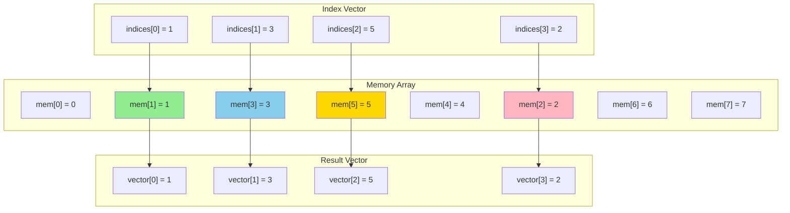

# Chapter 12. Vector Processing & SIMD Comparison

**Part VII — ISA Extensions**

---

Modern application 越來越需要 data-parallel processing。Image processing 對數百萬個 pixel 應用相同的 filter。Machine learning 對數千個 element 執行 matrix operation。Scientific simulation 在廣大的 grid 上計算 physics equation。這些 workload 共享一個共同模式：對不同 data 重複相同的 operation。

Traditional scalar processor 一次處理一個 operation。要處理 1000 個 element，它們執行 1000 條獨立的 instruction。相比之下，vector processor 使用單條 instruction 同時操作多個 element — Single Instruction, Multiple Data (SIMD)。這可以為 data-parallel code 提供 4×、8× 甚至更大的 speedup。

每個主要 architecture 都提供 SIMD extension：x86 有 SSE 和 AVX，ARM 有 NEON 和 SVE。RISC-V 的答案是 V extension（Vector），於 2021 年 ratify。但 RISC-V 採用與前輩不同的方法。與隨著 hardware 改進而變得過時的 fixed-width vector 不同，RISC-V 使用 vector-length agnostic programming — 自動適應不同 hardware implementation 的 code。

本章探討 V extension 的設計，將其與 ARM 和 x86 SIMD 進行比較，並展示如何撰寫高效的 vector code。我們將看到為什麼 RISC-V 的方法比 traditional SIMD architecture 提供更好的長期 scalability。

---

## 12.1 Vector Extension Overview

**The SIMD Evolution**

SIMD extension 經歷了多代演進，每代都添加更寬的 vector：

- x86：MMX（64-bit）→ SSE（128-bit）→ AVX（256-bit）→ AVX-512（512-bit）
- ARM：NEON（128-bit）→ SVE（128-2048 bit，scalable）

每一代都需要新的 instruction 和 software 重寫。為 128-bit vector 優化的 code 不會自動受益於 256-bit hardware。這造成了一個困境：compiler 應該針對 narrow vector 以獲得兼容性，還是針對 wide vector 以獲得 performance？

**Vector-Length Agnostic Programming**

RISC-V 的 V extension 通過 vector-length agnostic (VLA) programming 解決了這個問題。與指定確切 vector width 不同，program 指定對 abstract vector 的 operation。Hardware 根據其能力在 runtime 確定實際的 vector length。

為 V extension 撰寫的 program 可以在任何 implementation 上運行，從具有 128-bit vector 的 embedded processor 到具有 4096-bit vector 的 supercomputer，自動使用可用的 width。這使 software 具有 future-proof 並簡化了 compiler design。

**Key Concepts**

*VLEN*：Vector register length（bit），implementation-defined（必須是 2 的冪，最小 128，最大 65536）。Processor 可能有 VLEN=256（256-bit vector）或 VLEN=512（512-bit vector）。

*ELEN*：Maximum element width（bit），implementation-defined（最小 32，最大 64）。決定最大的 element type（例如，ELEN=64 支援 64-bit integer 和 double）。

*SEW*：Selected element width（bit），由 software 選擇（8、16、32 或 64）。決定有多少 element 適合 vector register。

*LMUL*：Vector register group multiplier（1/8、1/4、1/2、1、2、4、8）。允許將多個 register 用作單個 logical vector 以進行更大的 operation。

*AVL*：Application vector length，application 想要處理的 element 數量。

*VL*：Vector length，instruction 實際處理的 element 數量（VL ≤ AVL，VL ≤ VLEN/SEW）。

關係是：**VL = min(AVL, VLEN/SEW × LMUL)**

**Figure 12.1: Vector Register Organization**

```
Vector Register File (32 registers: v0-v31)
    Each register: VLEN bits (implementation-defined)

Element Width (SEW) - determines elements per register:
    VLEN = 256 bits (example)
    ├─ SEW=8:  32 elements (bytes)
    ├─ SEW=16: 16 elements (halfwords)
    ├─ SEW=32:  8 elements (words)
    └─ SEW=64:  4 elements (doublewords)

Register Grouping (LMUL) - use multiple registers as one:
    ├─ LMUL=1: 1 register  (e.g., v0)
    ├─ LMUL=2: 2 registers (e.g., v0-v1)
    ├─ LMUL=4: 4 registers (e.g., v0-v3)
    └─ LMUL=8: 8 registers (e.g., v0-v7)
```

Vector register 可以用不同的 element width (SEW) 解釋，並且多個連續的 register 可以 group (LMUL) 以進行更大的 operation。

---

## 12.2 Vector Register Organization

**Vector Register File**

V extension 添加 32 個 vector register，v0 到 v31。每個 register 是 VLEN bit 寬，其中 VLEN 是 implementation-defined。與始終為 32 或 64 bit 的 scalar register 不同，vector register 可以是 128、256、512 或更大。

Register v0 有特殊作用：它用作 predicated operation 的 mask register（稍後詳述）。

**Element Width and Capacity**

Vector register 保存多個 element。數量取決於 selected element width (SEW)：

```
Number of elements = VLEN / SEW
```

對於 VLEN=256：

- SEW=8（byte）：32 個 element
- SEW=16（halfword）：16 個 element
- SEW=32（word）：8 個 element
- SEW=64（doubleword）：4 個 element

Software 根據正在處理的 data type 選擇 SEW。

**Register Grouping (LMUL)**

有時你需要處理比一個 register 能容納的更多 element。LMUL（register group multiplier）允許將多個連續 register 視為單個 logical vector：

- LMUL=1：使用 1 個 register（default）
- LMUL=2：使用 2 個連續 register（例如，v0-v1）
- LMUL=4：使用 4 個連續 register（例如，v0-v3）
- LMUL=8：使用 8 個連續 register（例如，v0-v7）

使用 LMUL=2 和 SEW=32 在 VLEN=256 上，你得到 16 個 element（每個 register 8 個 × 2 個 register）。

LMUL 也可以是 fractional（1/2、1/4、1/8）以僅使用 register 的一部分，為其他 operation 留下更多 register。

**Register Alignment**

當 LMUL > 1 時，register number 必須對齊：

- LMUL=2：使用 v0、v2、v4、...（even register）
- LMUL=4：使用 v0、v4、v8、...（4 的倍數）
- LMUL=8：使用 v0、v8、v16、v24（8 的倍數）

這簡化了 hardware implementation。

---

## 12.3 Vector Configuration

**The vtype CSR**

Vector operation 通過 vtype CSR（vector type register）配置，它指定：

- SEW：Selected element width（8、16、32 或 64 bit）
- LMUL：Register group multiplier（1/8、1/4、1/2、1、2、4、8）
- vta：Vector tail agnostic（如何處理 VL 之外的 element）
- vma：Vector mask agnostic（如何處理 masked-off element）

**The vsetvl Instruction**

在執行 vector instruction 之前，software 必須使用 vsetvl instruction 配置 vtype 並設置 VL：

*vsetvli rd, rs1, vtypei*：設置 VL 和 vtype。rs1 包含 AVL（requested vector length），vtypei encode SEW 和 LMUL，rd 接收實際的 VL。

```assembly
# Configure for 32-bit elements, LMUL=1
li a0, 100              # AVL = 100 elements to process
vsetvli t0, a0, e32, m1 # Set SEW=32, LMUL=1, VL = min(AVL, VLEN/32)
                        # t0 now contains actual VL
```

Hardware 將 VL 設置為以下較小者：

- AVL（application 請求的）
- VLEN/SEW × LMUL（hardware 可以處理的）

如果 AVL=100 但 hardware 一次只能處理 8 個 element（VLEN=256、SEW=32、LMUL=1），則 VL=8。Application 必須 loop 以處理所有 100 個 element。

**Vector-Length Agnostic Loop**

這是處理 array 的標準模式：

```c
void vadd_vv(int *dst, int *src1, int *src2, size_t n) {
    size_t vl;
    for (size_t i = 0; i < n; i += vl) {
        vl = vsetvl_e32m1(n - i);  // Set VL for remaining elements

        vle32_v_i32m1(v1, &src1[i], vl);  // Load src1[i:i+vl]
        vle32_v_i32m1(v2, &src2[i], vl);  // Load src2[i:i+vl]
        vadd_vv_i32m1(v3, v1, v2, vl);    // v3 = v1 + v2
        vse32_v_i32m1(&dst[i], v3, vl);   // Store dst[i:i+vl]
    }
}
```

這段 code 在任何 VLEN 上都有效。在 VLEN=128 上，每次 iteration 處理 4 個 element。在 VLEN=512 上，每次 iteration 處理 16 個 element。不需要更改 code。

**Encoding vtype**

vsetvli 中的 vtypei immediate encode SEW 和 LMUL：

```
vtypei[2:0] = LMUL encoding:
  000 = LMUL=1, 001 = LMUL=2, 010 = LMUL=4, 011 = LMUL=8
  101 = LMUL=1/8, 110 = LMUL=1/4, 111 = LMUL=1/2

vtypei[5:3] = SEW encoding:
  000 = SEW=8, 001 = SEW=16, 010 = SEW=32, 011 = SEW=64

vtypei[6] = vta (tail agnostic)
vtypei[7] = vma (mask agnostic)
```

Assembler 提供方便的 mnemonic：`e32, m1` 表示 SEW=32、LMUL=1。

---

## 12.4 Vector Arithmetic and Logic

**Vector-Vector Operations**

Vector arithmetic instruction 對兩個 vector register 的對應 element 進行操作：

*vadd.vv vd, vs2, vs1*：vd[i] = vs2[i] + vs1[i]，i = 0 到 VL-1

*vsub.vv, vmul.vv, vdiv.vv*：Subtraction、multiplication、division

*vand.vv, vor.vv, vxor.vv*：Bitwise AND、OR、XOR

```assembly
# Vector addition: v3 = v1 + v2
vsetvli t0, a0, e32, m1
vle32.v v1, (a1)        # Load first vector
vle32.v v2, (a2)        # Load second vector
vadd.vv v3, v1, v2      # Add element-wise
vse32.v v3, (a3)        # Store result
```

**Vector-Scalar Operations**

通常你需要將相同的 scalar 添加到所有 vector element。Vector-scalar instruction 使用 scalar register（x register）作為第二個 operand：

*vadd.vx vd, vs2, rs1*：vd[i] = vs2[i] + rs1，對所有 i

```assembly
# Add constant 10 to all elements
li a0, 10
vsetvli t0, a1, e32, m1
vle32.v v1, (a2)
vadd.vx v2, v1, a0      # v2[i] = v1[i] + 10
vse32.v v2, (a3)
```

**Vector-Immediate Operations**

對於小 constant，vector-immediate instruction 避免加載到 scalar register：

*vadd.vi vd, vs2, imm*：vd[i] = vs2[i] + imm（imm 是 5-bit signed）

```assembly
# Increment all elements by 1
vadd.vi v2, v1, 1       # v2[i] = v1[i] + 1
```

**Widening and Narrowing Operations**

Widening operation 產生寬度是 input 兩倍的 result：

*vwaddu.vv vd, vs2, vs1*：Widening unsigned add（例如，32-bit input → 64-bit result）

*vwadd.vv*：Widening signed add

Narrowing operation 減少 width：

*vnsrl.wv vd, vs2, vs1*：Narrowing shift right logical（例如，64-bit input → 32-bit result）

這些對於避免 accumulation 中的 overflow 或在 computation 後降低 precision 至關重要。

**Fused Multiply-Add**

Vector fused multiply-add 在一條 instruction 中計算 (a × b) + c：

*vfmadd.vv vd, vs1, vs2*：vd[i] = (vd[i] × vs1[i]) + vs2[i]

這對於 matrix multiplication 和其他 linear algebra operation 至關重要。

---

## 12.5 Vector Memory Operations

**Unit-Stride Loads and Stores**

最常見的 memory access pattern 是 unit-stride：memory 中的連續 element。

*vle32.v vd, (rs1)*：從 address rs1 加載 VL 個 32-bit width 的 element

*vse32.v vs3, (rs1)*：將 VL 個 32-bit width 的 element 存儲到 address rs1

```assembly
# Load 32-bit integers from array
vsetvli t0, a0, e32, m1
vle32.v v1, (a1)        # Load v1[0:VL-1] from memory[a1]
```

加載的 byte 數是 VL × SEW/8。對於 VL=8 和 SEW=32，這加載 32 byte。

**Strided Loads and Stores**

Strided access 加載由 constant stride 分隔的 element：

*vlse32.v vd, (rs1), rs2*：從 rs1、rs1+rs2、rs1+2×rs2、... 加載 element

*vsse32.v vs3, (rs1), rs2*：使用 stride 存儲

```assembly
# Load every other element (stride = 8 bytes for 32-bit elements)
vlse32.v v1, (a1), 8    # Load a1[0], a1[2], a1[4], ...
```

這對於存取 matrix column 或 interleaved data 很有用。

**Indexed (Scatter/Gather) Loads and Stores**

Indexed access 使用 index 的 vector 來 load/store non-contiguous element。這也稱為 "gather"（對於 load）和 "scatter"（對於 store）。

*vluxei32.v vd, (rs1), vs2*：從 rs1+vs2[i] 為每個 i 加載 element（unordered）

*vsuxei32.v vs3, (rs1), vs2*：使用 index 存儲（unordered）

```assembly
# Example: Gather operation
# Suppose we have an array a[] and want to load a[1], a[3], a[5], a[2]
# First, create an index vector containing [1, 3, 5, 2]
vle32.v v1, (a1)        # Load index vector: v1 = [1, 3, 5, 2]
vluxei32.v v2, (a2), v1 # Gather: v2[0]=a[1], v2[1]=a[3], v2[2]=a[5], v2[3]=a[2]
```

Index vector（範例中的 v1）包含要加載的 element 的 index。對於每個 element i，instruction 從 address `base + index[i] * element_size` 加載。因此，如果 v1 包含 [1, 3, 5, 2]，gather operation 加載：

- v2[0] = memory[a2 + 1*4]（index 1 的 element）
- v2[1] = memory[a2 + 3*4]（index 3 的 element）
- v2[2] = memory[a2 + 5*4]（index 5 的 element）
- v2[3] = memory[a2 + 2*4]（index 2 的 element）

這對於 sparse matrix operation、indirect addressing 和存取 non-contiguous data 至關重要。

**Segment Loads and Stores**

Segment operation load/store element 的 group（如 struct field）：

*vlseg2e32.v vd, (rs1)*：Load 2-field segment（例如，{x, y} pair）

*vsseg2e32.v vs3, (rs1)*：Store 2-field segment

```c
// Load array of {x, y} pairs
struct point { int x, y; };
struct point points[100];

vlseg2e32.v v1, (a0)    # v1 = all x values, v2 = all y values
```

這有效地處理 structure-of-arrays (SoA) 和 array-of-structures (AoS) conversion。

**Figure 12.2a: Unit-Stride Access**

```
Unit-Stride (consecutive elements):
Memory:   [0] [1] [2] [3] [4] [5] [6] [7]
           ↓   ↓   ↓   ↓
Vector:   [0] [1] [2] [3]
```

**Figure 12.2b: Strided Access**

```
Strided (every 2nd element, stride=2):
Memory:   [0] [1] [2] [3] [4] [5] [6] [7]
           ↓       ↓       ↓       ↓
Vector:   [0]     [2]     [4]     [6]
```

**Figure 12.2c: Indexed (Gather) Access**



每個 index 指向一個 memory location，該 location 的值被加載到對應的 vector position。

---

## 12.6 Vector Masking

**Predicated Execution**

並非 vector 中的所有 element 都需要處理。Masking 允許選擇性地 enable 或 disable 對 individual element 的 operation。

Mask 存儲在 vector register v0 中，每個 element 一個 bit。如果 v0[i] = 1，則處理 element i；如果 v0[i] = 0，則跳過 element i（或根據 vma 設置處理）。

**Masked Operations**

大多數 vector instruction 都有使用 `.vm` suffix 的 masked variant：

*vadd.vv vd, vs2, vs1, v0.t*：僅在 v0[i] = 1 時添加

```assembly
# Conditional add: dst[i] = (mask[i]) ? src1[i] + src2[i] : dst[i]
vle1.v v0, (a0)         # Load mask into v0
vle32.v v1, (a1)        # Load src1
vle32.v v2, (a2)        # Load src2
vle32.v v3, (a3)        # Load dst (for masked-off elements)
vadd.vv v3, v1, v2, v0.t # Add where mask is 1, keep v3 where mask is 0
vse32.v v3, (a3)        # Store result
```

**Comparison and Mask Generation**

Comparison instruction 生成 mask：

*vmseq.vv vd, vs2, vs1*：vd[i] = (vs2[i] == vs1[i]) ? 1 : 0

*vmslt.vv, vmsle.vv, vmsgt.vv*：Less than、less or equal、greater than

```assembly
# Find elements greater than 100
li a0, 100
vsetvli t0, a1, e32, m1
vle32.v v1, (a2)
vmsgt.vx v0, v1, a0     # v0[i] = (v1[i] > 100) ? 1 : 0
```

**Mask Logical Operations**

Mask 可以與 logical operation 組合：

*vmand.mm vd, vs2, vs1*：Mask AND
*vmor.mm, vmxor.mm, vmnand.mm*：Mask OR、XOR、NAND

```assembly
# Combine two conditions: (a > 100) AND (a < 200)
vmsgt.vx v1, v2, a0     # v1 = (v2 > 100)
vmslt.vx v3, v2, a1     # v3 = (v2 < 200)
vmand.mm v0, v1, v3     # v0 = v1 AND v3
```

**Use Cases**

Masking 對以下情況至關重要：

- Conditional operation（vector code 中的 if-then-else）
- 處理 loop tail（當 array size 不是 VL 的倍數時）
- Sparse computation（跳過 zero element）
- 實作帶條件的 reduction

---

## 12.7 Vector Reductions

**What is a Reduction?**

Reduction 將 vector 的所有 element 組合成單個 scalar result。常見範例：sum 所有 element、find maximum、count non-zero element。

**Reduction Instructions**

*vredsum.vs vd, vs2, vs1*：Sum vs2 的所有 element，添加到 vs1[0]，存儲在 vd[0]

*vredmax.vs, vredmin.vs*：Find maximum 或 minimum

*vredand.vs, vredor.vs, vredxor.vs*：所有 element 的 bitwise AND、OR、XOR

```assembly
# Sum all elements of an array
vsetvli t0, a0, e32, m1
vmv.v.i v2, 0           # Initialize accumulator to 0
vle32.v v1, (a1)        # Load vector
vredsum.vs v2, v1, v2   # v2[0] = sum(v1[0:VL-1]) + v2[0]
vmv.x.s a2, v2          # Move result to scalar register
```

對於大於 VL 的 array，loop 並 accumulate：

```c
int sum_array(int *arr, size_t n) {
    int sum = 0;
    size_t vl;
    for (size_t i = 0; i < n; i += vl) {
        vl = vsetvl_e32m1(n - i);
        vle32_v_i32m1(v1, &arr[i], vl);
        vredsum_vs_i32m1_i32m1(v2, v1, v2, vl);
    }
    return vmv_x_s_i32m1_i32(v2);
}
```

**Masked Reductions**

Reduction 可以被 mask 以僅 sum 選定的 element：

```assembly
# Sum elements where mask is 1
vredsum.vs v2, v1, v2, v0.t
```

這對於 conditional sum（例如，sum 所有 positive element）很有用。

---

## 12.8 Comparison with ARM NEON and x86 AVX

**ARM NEON**

ARM NEON 提供 128-bit SIMD，有 32 個 vector register（AArch64 中的 v0-v31）。每個 register 可以保存：

- 16 × 8-bit element
- 8 × 16-bit element
- 4 × 32-bit element
- 2 × 64-bit element

NEON instruction 明確指定 element width：

```assembly
# ARM NEON: Add two vectors of 4 × 32-bit integers
ld1 {v0.4s}, [x0]       // Load 4 × 32-bit
ld1 {v1.4s}, [x1]
add v2.4s, v0.4s, v1.4s // Add element-wise
st1 {v2.4s}, [x2]
```

**NEON 的限制**：

- Fixed 128-bit width（無 scalability）
- Code 必須為更寬的 vector 重寫
- Base NEON 中沒有 predication（masking）

**ARM SVE (Scalable Vector Extension)**

SVE 通過 scalable vector（128-2048 bit）解決了 NEON 的限制。像 RISC-V V 一樣，SVE 使用 vector-length agnostic programming：

```assembly
# ARM SVE: Vector add (works on any vector length)
ld1w z0.s, p0/z, [x0]   // Load with predication
ld1w z1.s, p0/z, [x1]
add z2.s, z0.s, z1.s    // Add
st1w z2.s, p0, [x2]     // Store with predication
```

SVE 和 RISC-V V 共享類似的 philosophy：scalable vector、predication 和 VLA programming。然而，SVE 更複雜，有更多 instruction variant 和 addressing mode。

**x86 AVX**

x86 的 SIMD 經歷了多代演進：

- SSE：128-bit（16 個 register：xmm0-xmm15）
- AVX：256-bit（16 個 register：ymm0-ymm15）
- AVX-512：512-bit（32 個 register：zmm0-zmm31）

每一代都添加了新的 instruction：

```assembly
# x86 AVX: Add two vectors of 8 × 32-bit integers
vmovdqu ymm0, [rax]     ; Load 256 bits
vmovdqu ymm1, [rbx]
vpaddd ymm2, ymm0, ymm1 ; Add 8 × 32-bit
vmovdqu [rcx], ymm2     ; Store
```

**x86 SIMD 的限制**：

- Fixed width（128、256、512 bit）
- Code 必須為每一代重寫
- AVX-512 有許多 variant（AVX-512F、AVX-512BW、AVX-512DQ 等）
- Complexity：數千條 SIMD instruction

**RISC-V V Advantages**

與 NEON 和 AVX 相比，RISC-V V 提供：

1. **Scalability**：一個 codebase 在任何 VLEN（128 到 65536 bit）上工作
2. **Simplicity**：更少的 instruction variant，一致的命名
3. **Predication**：所有 operation 的內建 masking
4. **Flexibility**：Fractional LMUL、widening/narrowing operation
5. **Future-proof**：無需為更寬的 vector 重寫 code

**Trade-offs**：

- RISC-V V 更新（tooling 和 library 不太成熟）
- x86 AVX 對特定 workload 有廣泛的優化
- ARM NEON 對 fixed-width use case 更簡單

**Figure 12.3: SIMD Architecture Comparison**

| Feature | x86 SSE/AVX | ARM NEON | ARM SVE | RISC-V V |
|---------|-------------|----------|---------|----------|
| **Vector Width** | Fixed: 128/256/512 bits | Fixed: 128 bits | Scalable: 128-2048 bits | Scalable: 128-65536 bits |
| **Registers** | 16 (SSE/AVX)<br/>32 (AVX-512) | 32 | 32 | 32 |
| **Scalability** | No (fixed per generation) | No (fixed) | Yes (scalable) | Yes (scalable) |
| **Code Portability** | No (rewrite per generation) | Yes (single codebase) | Yes (single codebase) | Yes (single codebase) |
| **Predication** | Partial (AVX-512 only) | No (base NEON) | Yes | Yes |
| **Instruction Count** | ~1000s (across generations) | ~200 | ~400 | ~300 |
| **Complexity** | High (many variants) | Low | Medium | Low |
| **Ratification** | 1999 (SSE)<br/>2011 (AVX)<br/>2016 (AVX-512) | 2005 | 2016 | 2021 |
| **Key Advantage** | Mature ecosystem | Simple, widely deployed | Scalable, predication | Scalable, simple, future-proof |
| **Key Limitation** | Fixed widths, complexity | Fixed 128-bit only | Complex instruction set | Newer, less mature tooling |

---

## Summary

RISC-V Vector extension 代表了 SIMD processing 的 modern approach，從 x86 和 ARM SIMD architecture 數十年的經驗中學習。其 vector-length agnostic design 確保今天撰寫的 code 將自動受益於未來 hardware 中更寬的 vector。

**Vector-length agnostic programming** 是 V extension 的定義特徵。通過抽象化 physical vector width，RISC-V 允許單個 binary 在從 tiny embedded processor 到 supercomputer 的 implementation 上高效運行。這消除了為不同 vector width 維護多個 code path 的需要，簡化了 compiler 和 application development。

**Vector configuration** 通過 vsetvl instruction 和 vtype CSR 提供對 element width (SEW)、register grouping (LMUL) 和 vector length (VL) 的 fine-grained control。Hardware 根據 application 的請求 (AVL) 和 implementation 的能力 (VLEN) 自動確定最佳 VL，使撰寫 portable high-performance code 變得容易。

**Vector operation** 涵蓋 data-parallel computation 的完整範圍：具有 vector-vector、vector-scalar 和 vector-immediate variant 的 arithmetic 和 logic operation；用於 precision management 的 widening 和 narrowing operation；以及用於高效 linear algebra 的 fused multiply-add。一致的 instruction 命名和 behavior 使 V extension 比 x86 龐大的 SIMD instruction set 更容易學習。

**Vector memory operation** 支援多樣的 access pattern：unit-stride 用於 contiguous data、strided 用於 matrix column 和 interleaved data、indexed 用於 sparse matrix 和 indirect addressing，以及 segment operation 用於 structure-of-arrays conversion。這種靈活性使廣泛的 algorithm 能夠高效 vectorization。

**Vector masking** 提供 predicated execution，允許對 individual vector element 進行 conditional operation。Comparison instruction 生成 mask，mask logical operation 組合條件，masked operation 選擇性地處理 element。這對於處理 loop tail、在 vector code 中實作 conditional logic 以及優化 sparse computation 至關重要。

**Vector reduction** 有效地將 vector 的所有 element 組合成 scalar result，支援 sum、maximum、minimum 和 bitwise reduction 等 operation。Masked reduction 啟用 conditional aggregation，對許多 algorithm 至關重要。

**與 ARM NEON 和 x86 AVX 相比**，RISC-V V 提供卓越的 scalability 和 simplicity。雖然 NEON 限於 128-bit vector，AVX 需要為每一代（128、256、512 bit）編寫單獨的 code，但 RISC-V V code 自動適應任何 vector width。ARM SVE 共享 RISC-V 的 scalable philosophy，但具有更大的 complexity。x86 的 SIMD 已演變為跨多個不兼容 extension 的數千條 instruction，而 RISC-V V 保持 clean、orthogonal design。

V extension 使 RISC-V 在 machine learning、scientific computing、multimedia processing 和其他 SIMD performance 至關重要的 domain 中為未來的 data-parallel workload 做好準備。

---
