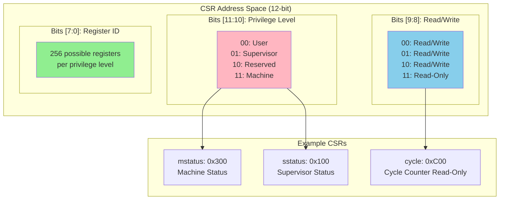
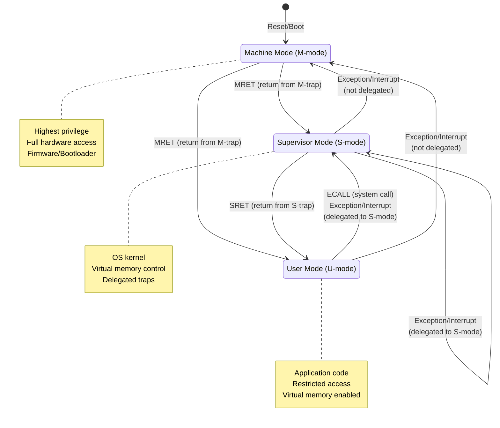

# Chapter 2. Programmer's Model & Register Set

**Part II — Programmer's Model**

---

Understanding a processor architecture begins with understanding its programmer's model: the registers, instructions, and conventions that software uses to interact with hardware. RISC-V's programmer's model is clean, regular, and designed for both simplicity and efficiency.

This chapter explores the fundamental elements that every RISC-V programmer must know. We'll examine the 32 general-purpose registers and their conventional uses, the Control and Status Registers (CSRs) that manage processor state, the privilege levels that separate user code from operating system code, and the calling convention that enables functions to work together. We'll see how RISC-V's design choices—like the zero register, separate CSR address space, and clean privilege model—simplify both hardware implementation and software development.

---

## 2.1 General-Purpose Registers

**The Register File**

RISC-V provides 32 general-purpose registers, numbered x0 through x31. Each register is XLEN bits wide, where XLEN is 32 for RV32, 64 for RV64, and 128 for RV128. This discussion focuses on RV64, the most common variant for application processors.

The 32-register design follows RISC tradition. It's large enough to keep frequently used values in fast registers rather than slow memory, but small enough to implement efficiently in hardware. The register file needs multiple read and write ports to support instruction execution, and size directly impacts chip area and access time.

Unlike some architectures, RISC-V's registers are truly general-purpose. There are no special restrictions on most registers—any register can be used as a source or destination for most instructions. This orthogonality simplifies both hardware implementation and compiler design.

**Register x0: The Zero Register**

Register x0 is special: it always reads as zero, and writes to it are discarded. This might seem wasteful, but it's remarkably useful.

The zero register enables several common operations without dedicated instructions:

- **NOP (no operation)**: `ADDI x0, x0, 0` adds zero to zero and stores in x0 (which discards the result)
- **Move**: `ADDI x1, x2, 0` adds zero to x2 and stores in x1, effectively copying x2 to x1
- **Load immediate**: `ADDI x1, x0, 42` adds 42 to zero, loading the constant 42 into x1
- **Unconditional branch**: `BEQ x0, x0, target` branches if x0 equals x0 (always true)

The zero register also simplifies hardware. Many operations naturally produce zero (like XOR of a register with itself), and having a dedicated zero register makes these operations explicit and efficient.

**Standard Register Names (ABI)**

While the hardware knows registers as x0-x31, software uses symbolic names defined by the Application Binary Interface (ABI). These names indicate each register's conventional use:

| Register | ABI Name | Description | Saved by |
|----------|----------|-------------|----------|
| x0 | zero | Hard-wired zero | — |
| x1 | ra | Return address | Caller |
| x2 | sp | Stack pointer | Callee |
| x3 | gp | Global pointer | — |
| x4 | tp | Thread pointer | — |
| x5-x7 | t0-t2 | Temporaries | Caller |
| x8 | s0/fp | Saved register / Frame pointer | Callee |
| x9 | s1 | Saved register | Callee |
| x10-x11 | a0-a1 | Function arguments / Return values | Caller |
| x12-x17 | a2-a7 | Function arguments | Caller |
| x18-x27 | s2-s11 | Saved registers | Callee |
| x28-x31 | t3-t6 | Temporaries | Caller |

These names are conventions, not hardware requirements. The processor doesn't enforce them—you could use `sp` for arithmetic if you wanted (though your program would likely crash). But following the ABI ensures that code from different compilers and libraries can interoperate.

The 32 general-purpose registers are organized with their ABI names and conventional usage. Registers are categorized as: zero register (x0), special-purpose registers (ra, sp, gp, tp), caller-saved temporaries and arguments (t0-t6, a0-a7), and callee-saved registers (s0-s11). The complete register file organization with ABI names is shown in the table above.

**Caller-Saved vs Callee-Saved**

The ABI divides registers into two categories based on who preserves their values across function calls:

*Caller-Saved Registers* (t0-t6, a0-a7): The calling function must save these if it needs their values after the call. The called function can freely modify them. These are used for temporary values and function arguments.

*Callee-Saved Registers* (s0-s11, sp): The called function must preserve these. If it uses them, it must save their values on entry and restore them before returning. These are used for values that must survive across function calls.

This division optimizes the common case. Temporary values don't need to be saved if they're not used after a call. Long-lived values are automatically preserved across calls.

**Special-Purpose Registers**

Several registers have special conventional uses:

*ra (x1) - Return Address*: Stores the return address for function calls. The JAL and JALR instructions (jump-and-link) automatically write the return address to ra. The function returns by jumping to the address in ra.

*sp (x2) - Stack Pointer*: Points to the top of the stack. The stack grows downward (toward lower addresses) by convention. Functions allocate stack space by subtracting from sp and deallocate by adding to sp.

*gp (x3) - Global Pointer*: Points to the middle of a 4KB region of global variables. This allows accessing globals with a single load/store instruction using a 12-bit signed offset (±2KB from gp). The linker sets up gp, and it remains constant during execution.

*tp (x4) - Thread Pointer*: Points to thread-local storage in multi-threaded programs. Each thread has its own tp value, allowing efficient access to thread-specific data.

*fp (x8) - Frame Pointer*: An alias for s0, used to point to the current stack frame. Some code uses fp to access local variables and function arguments, while sp may change during function execution. Other code omits the frame pointer to free up another register.

**Register Usage in Practice**

Understanding register usage is crucial for reading assembly code and understanding compiler output. Here's a typical function call sequence:

```assembly
# Caller prepares arguments
li a0, 10          # First argument in a0
li a1, 20          # Second argument in a1

# Caller saves any needed temporaries
sd t0, 0(sp)       # Save t0 if needed after call

# Call function
jal ra, my_func    # Jump to my_func, save return address in ra

# Caller restores temporaries
ld t0, 0(sp)       # Restore t0

# Result is in a0
mv s0, a0          # Save result to callee-saved register
```

Inside the called function:

```assembly
my_func:
    # Prologue: allocate stack frame
    addi sp, sp, -32   # Allocate 32 bytes
    sd ra, 24(sp)      # Save return address
    sd s0, 16(sp)      # Save s0 if we'll use it
    
    # Function body uses a0, a1 (arguments)
    add s0, a0, a1     # Use s0 for computation
    
    # Prepare return value
    mv a0, s0          # Return value in a0
    
    # Epilogue: restore and return
    ld s0, 16(sp)      # Restore s0
    ld ra, 24(sp)      # Restore return address
    addi sp, sp, 32    # Deallocate stack frame
    ret                # Return (pseudo-instruction for jalr x0, 0(ra))
```

This pattern—prologue, body, epilogue—is standard for RISC-V functions. The prologue saves registers and allocates stack space. The body performs the computation. The epilogue restores registers and returns.

---

## 2.2 Control and Status Registers (CSRs)

**CSR Overview**

Beyond the 32 general-purpose registers, RISC-V defines a separate address space for Control and Status Registers (CSRs). These registers control processor behavior, report status, and provide access to privileged functionality.

CSRs are accessed using dedicated instructions (CSRRW, CSRRS, CSRRC, and their immediate variants) rather than normal load/store instructions. Each CSR has a 12-bit address, allowing up to 4,096 CSRs, though only a fraction are currently defined.

The CSR address space is partitioned by privilege level and read/write access:

- Bits [11:10] encode the privilege level required to access the CSR
- Bits [9:8] indicate read/write vs read-only
- Bits [7:0] identify the specific register

This encoding allows the hardware to quickly check access permissions. Attempting to access a CSR from insufficient privilege level or writing to a read-only CSR causes an illegal instruction exception.

**Figure 2.1: CSR Address Space Organization**



**Machine-Level CSRs**

Machine mode is the highest privilege level in RISC-V, with access to all CSRs. Key machine-level CSRs include:

*mstatus* (Machine Status): Controls and reports various aspects of processor state:

- MIE: Machine Interrupt Enable (global interrupt enable for M-mode)
- MPIE: Previous MIE value (saved when taking a trap)
- MPP: Previous privilege mode (saved when taking a trap)
- MPRV: Modify Privilege (affects memory access privilege)
- Various extension enable bits (FS for floating-point, VS for vector)

*misa* (Machine ISA): Indicates which extensions are implemented. Each bit corresponds to an extension (bit 0 = A extension, bit 12 = M extension, etc.). This register allows software to detect available features. On some implementations, misa is read-only; on others, it can be written to enable/disable extensions dynamically.

*mie* (Machine Interrupt Enable): Controls which interrupts are enabled. Each bit corresponds to an interrupt source (software interrupt, timer interrupt, external interrupt). Even if a bit is set in mie, interrupts are only taken if MIE in mstatus is also set.

*mip* (Machine Interrupt Pending): Indicates which interrupts are pending. Hardware sets bits when interrupts arrive; software can read mip to determine which interrupts are waiting.

*mtvec* (Machine Trap Vector): Specifies the address of the trap handler. The low 2 bits select the mode:

- 0 (Direct): All traps jump to the same address (mtvec & ~0x3)
- 1 (Vectored): Interrupts jump to (mtvec & ~0x3) + 4×cause, exceptions jump to (mtvec & ~0x3)

*mepc* (Machine Exception PC): Stores the program counter of the instruction that caused the trap (for exceptions) or the instruction to resume after handling an interrupt. The trap handler returns by writing mepc to the PC.

*mcause* (Machine Cause): Indicates what caused the trap. The high bit distinguishes interrupts (1) from exceptions (0). The low bits encode the specific cause (e.g., 2 = illegal instruction, 11 = environment call from M-mode).

*mtval* (Machine Trap Value): Provides additional information about the trap. For address-related exceptions (like page faults), mtval contains the faulting address. For illegal instruction exceptions, it may contain the instruction itself.

*mscratch* (Machine Scratch): A general-purpose register for machine-mode software. Typically used to save a register temporarily when entering a trap handler, before the handler has set up its stack.

**Supervisor-Level CSRs**

Supervisor mode is intended for operating systems. It has its own set of CSRs, analogous to the machine-level ones:

*sstatus*: A restricted view of mstatus, showing only fields relevant to supervisor mode (SIE, SPIE, SPP, etc.). Writing sstatus actually modifies the corresponding fields in mstatus.

*sie, sip*: Supervisor interrupt enable and pending registers, similar to mie/mip but for supervisor-level interrupts.

*stvec, sepc, scause, stval, sscratch*: Supervisor versions of the trap-handling CSRs, used when traps are delegated to supervisor mode.

*satp* (Supervisor Address Translation and Protection): Controls virtual memory:

- MODE: Selects the address translation scheme (Bare, Sv39, Sv48, etc.)
- ASID: Address Space Identifier for TLB tagging
- PPN: Physical page number of the root page table

The satp register is crucial for virtual memory. Writing to satp can change the address translation mode or switch to a different page table, enabling context switches between processes.

**User-Level CSRs**

User mode has access to a limited set of CSRs, primarily for performance monitoring and floating-point control:

*fflags, frm, fcsr*: Floating-point exception flags, rounding mode, and combined control/status register. These allow user code to control floating-point behavior and detect exceptions.

*cycle, time, instret*: Performance counters accessible from user mode (if not disabled by supervisor/machine mode). These provide the number of cycles elapsed, current time, and instructions retired, useful for profiling and timing.

**CSR Instructions**

RISC-V provides six CSR manipulation instructions:

*CSRRW rd, csr, rs1* (CSR Read-Write): Atomically swap the value in csr with the value in rs1, writing the old CSR value to rd. If rd is x0, the read is suppressed (useful for write-only access).

*CSRRS rd, csr, rs1* (CSR Read-Set): Read csr into rd, then set bits in csr corresponding to 1 bits in rs1. If rs1 is x0, this is a read-only operation.

*CSRRC rd, csr, rs1* (CSR Read-Clear): Read csr into rd, then clear bits in csr corresponding to 1 bits in rs1.

*CSRRWI, CSRRSI, CSRRCI*: Immediate variants that use a 5-bit immediate value instead of a register.

These instructions are atomic, ensuring that CSR modifications aren't interrupted. The read-set and read-clear operations are particularly useful for manipulating individual bits without affecting others.

Example: Enabling machine-mode interrupts:

```assembly
# Set MIE bit in mstatus
li t0, 0x8              # MIE is bit 3
csrrs zero, mstatus, t0 # Set bit 3, discard old value
```

Example: Saving and modifying a CSR:

```assembly
# Save current mstatus and disable interrupts
csrrci t0, mstatus, 0x8 # Clear MIE, save old value in t0
# ... critical section ...
csrw mstatus, t0        # Restore original mstatus
```

The CSR instructions provide controlled access to privileged state, enabling operating systems and firmware to manage the processor while preventing user code from interfering with system operation.

---

## 2.3 Program State and Privilege Levels

**Privilege Modes**

RISC-V defines three privilege levels, from lowest to highest:

*User Mode (U-mode)*: The least privileged level, intended for application code. User mode cannot access most CSRs or execute privileged instructions. It typically runs with virtual memory enabled, isolating processes from each other and from the OS.

*Supervisor Mode (S-mode)*: Intended for operating systems. Supervisor mode can manage virtual memory, handle traps delegated from machine mode, and access supervisor-level CSRs. It cannot access machine-level CSRs or certain privileged operations reserved for firmware.

*Machine Mode (M-mode)*: The highest privilege level, intended for firmware and bootloaders. Machine mode has unrestricted access to all hardware resources. It can access all CSRs, execute all instructions, and delegate traps to lower privilege levels.

Not all implementations support all modes. A simple embedded system might implement only M-mode. A microcontroller might implement M-mode and U-mode. A full application processor implements all three modes.

The current privilege level is not stored in a dedicated register. Instead, it's implicit in the processor state and can be inferred from CSRs like mstatus.MPP (previous privilege) after a trap.

**Privilege Level Transitions**

Transitions between privilege levels occur through well-defined mechanisms:

*Trap to Higher Privilege*: When an exception occurs or an interrupt arrives, the processor traps to a higher privilege level (or stays at the same level). The trap handler is determined by the xtvec CSR (mtvec for M-mode, stvec for S-mode). The processor saves the current PC in xepc, the cause in xcause, and additional information in xtval.

*Return from Trap*: The MRET, SRET, and URET instructions return from a trap, restoring the privilege level from xstatus.xPP and the PC from xepc. These instructions are privileged—MRET can only be executed in M-mode, SRET in S-mode or higher.

*Environment Call*: The ECALL instruction explicitly requests a trap to a higher privilege level. User code uses ECALL to invoke OS services (system calls). OS code uses ECALL to invoke firmware services (SBI calls). The trap handler examines the calling context to determine which service was requested.

This controlled transition mechanism ensures that privilege escalation only occurs through defined entry points, maintaining system security.

**Figure 2.2: Privilege Level Transitions**



The state diagram shows how privilege levels transition through traps (upward) and return instructions (downward). ECALL explicitly requests higher privilege, while exceptions and interrupts cause automatic transitions.

---

## 2.4 Calling Convention and ABI

**The RISC-V Calling Convention**

The calling convention defines how functions call each other: how arguments are passed, how return values are communicated, and which registers must be preserved. RISC-V follows the System V ABI (Application Binary Interface), which is also used by many other architectures.

The calling convention is a *software* convention, not enforced by hardware. The processor doesn't care which registers you use for arguments. But following the convention ensures that code from different compilers and libraries can interoperate.

**Argument Passing**

Function arguments are passed in registers `a0` through `a7` (x10-x17). The first argument goes in `a0`, the second in `a1`, and so on:

```c
int add(int x, int y, int z) {
    return x + y + z;
}
```

Compiles to:

```assembly
add:
    add a0, a0, a1    # a0 = x + y
    add a0, a0, a2    # a0 = (x + y) + z
    ret
```

Arguments `x`, `y`, and `z` arrive in `a0`, `a1`, and `a2`. The result is returned in `a0`.

If a function has more than 8 arguments, the additional arguments are passed on the stack:

```c
int sum9(int a, int b, int c, int d, int e, int f, int g, int h, int i) {
    return a + b + c + d + e + f + g + h + i;
}
```

Arguments `a` through `h` are in `a0`-`a7`. Argument `i` is on the stack at `sp+0`.

**Return Values**

Return values are passed in `a0` and `a1`:

- Single return value (up to XLEN bits): `a0`
- Two return values or 128-bit value on RV64: `a0` (low) and `a1` (high)

For example, a function returning a 128-bit integer on RV64:

```c
__int128 multiply(__int128 x, __int128 y);
```

Returns the low 64 bits in `a0` and the high 64 bits in `a1`.

Structures and unions are handled specially:

- Small structs (≤ 2×XLEN bits) are returned in `a0` and `a1`
- Larger structs are returned via a pointer: the caller allocates space and passes a pointer in `a0`; the function writes the result there and returns the pointer in `a0`

**Caller-Saved vs Callee-Saved Registers**

The calling convention divides registers into two categories:

*Caller-saved* (temporary registers): The caller must save these if it needs their values preserved across a function call. The called function is free to modify them.

- `t0`-`t6` (x5-x7, x28-x31): Temporaries
- `a0`-`a7` (x10-x17): Arguments/return values
- `ra` (x1): Return address (modified by `call`)

*Callee-saved* (saved registers): The called function must preserve these. If it uses them, it must save them on entry and restore them before returning.

- `s0`-`s11` (x8-x9, x18-x27): Saved registers
- `sp` (x2): Stack pointer

Example:

```assembly
function:
    # Prologue: save callee-saved registers
    addi sp, sp, -16
    sd s0, 0(sp)
    sd s1, 8(sp)

    # Function body: can use s0, s1 freely
    mv s0, a0
    mv s1, a1
    # ... computation ...

    # Epilogue: restore callee-saved registers
    ld s0, 0(sp)
    ld s1, 8(sp)
    addi sp, sp, 16
    ret
```

**Special Registers**

Several registers have special roles:

*Stack Pointer (sp)*: Points to the top of the stack. Must be preserved by callees. The stack grows downward (toward lower addresses).

*Return Address (ra)*: Holds the return address for the current function. Set by `call` (or `jal`), used by `ret` (which is `jalr zero, 0(ra)`).

*Frame Pointer (fp/s0)*: Optionally points to the base of the current stack frame. This is the same register as `s0`. Using a frame pointer simplifies debugging and stack unwinding, but costs a register.

*Global Pointer (gp)*: Points to global data. Used for relaxation optimization—the linker can replace absolute addresses with gp-relative addresses, saving instructions. Typically set once at program startup and never changed.

*Thread Pointer (tp)*: Points to thread-local storage (TLS). Each thread has its own TLS area. The OS sets `tp` when creating a thread.

---

## 2.5 Stack Frame Structure

**Stack Layout**

The stack is a region of memory used for:

- Local variables
- Saved registers
- Function arguments (beyond the first 8)
- Return addresses (for nested calls)

The stack grows downward. The stack pointer (`sp`) points to the top (lowest address) of the stack. Allocating stack space means subtracting from `sp`; deallocating means adding to `sp`.

A typical stack frame looks like:

```
Higher addresses
+------------------+
| Caller's frame   |
+------------------+
| Arguments 9+     | ← Passed on stack
+------------------+
| Return address   | ← Saved by caller (if needed)
+------------------+
| Saved registers  | ← Callee-saved (s0-s11)
+------------------+
| Local variables  |
+------------------+
| Outgoing args    | ← For functions this function calls
+------------------+ ← sp (stack pointer)
Lower addresses
```

**Function Prologue and Epilogue**

The *prologue* is code at the start of a function that sets up the stack frame:

```assembly
function:
    # Prologue
    addi sp, sp, -32      # Allocate 32 bytes
    sd ra, 24(sp)         # Save return address
    sd s0, 16(sp)         # Save s0
    sd s1, 8(sp)          # Save s1
    # (Local variables use sp+0 to sp+7)

    # Function body
    # ...

    # Epilogue
    ld ra, 24(sp)         # Restore return address
    ld s0, 16(sp)         # Restore s0
    ld s1, 8(sp)          # Restore s1
    addi sp, sp, 32       # Deallocate stack frame
    ret
```

The *epilogue* is code at the end that tears down the stack frame and returns.

**Frame Pointer**

Some functions use a frame pointer (`fp`, which is `s0`). The frame pointer points to a fixed location in the stack frame, making it easier to access local variables and arguments:

```assembly
function:
    # Prologue with frame pointer
    addi sp, sp, -32
    sd ra, 24(sp)
    sd s0, 16(sp)         # Save old frame pointer
    addi s0, sp, 32       # Set frame pointer to old sp

    # Now can access locals relative to fp:
    # Local var at fp-8, fp-16, etc.

    # Epilogue
    ld ra, -8(s0)
    ld s0, -16(s0)
    addi sp, s0, -32
    ret
```

Frame pointers are optional. They simplify debugging (debuggers can walk the stack) and exception handling, but cost a register.

**Leaf Functions**

A *leaf function* is one that doesn't call any other functions. Leaf functions can often avoid saving `ra` and allocating a stack frame:

```assembly
leaf_function:
    # No prologue needed
    add a0, a0, a1
    ret
    # No epilogue needed
```

This is more efficient but only works if the function doesn't call anything and doesn't need to save registers.

---

## 2.6 Comparison with ARM64 and MIPS

**Register Count and Usage**

All three architectures have 32 general-purpose registers, but they use them differently:

*RISC-V*:

- 32 registers (x0-x31)
- x0 is hardwired zero
- 31 usable registers
- Clear caller/callee-saved distinction

*ARM64*:

- 31 general-purpose registers (x0-x30)
- x31 is special: zero register or stack pointer depending on context
- 30 fully general registers
- Link register (x30) holds return address

*MIPS*:

- 32 registers ($0-$31)
- $0 is hardwired zero
- $31 is return address (ra)
- 30 usable general registers

**Calling Conventions**

*RISC-V*:

- Arguments: a0-a7 (8 registers)
- Return: a0-a1
- Caller-saved: t0-t6, a0-a7
- Callee-saved: s0-s11

*ARM64*:

- Arguments: x0-x7 (8 registers)
- Return: x0-x1
- Caller-saved: x0-x18
- Callee-saved: x19-x28

*MIPS*:

- Arguments: $a0-$a3 (4 registers, fewer than RISC-V/ARM)
- Return: $v0-$v1
- Caller-saved: $t0-$t9
- Callee-saved: $s0-$s7

RISC-V and ARM64 are similar, both providing 8 argument registers. MIPS is older and provides only 4, which means more stack usage for functions with many arguments.

**Special Registers**

*RISC-V*:

- sp (x2): Stack pointer
- ra (x1): Return address
- gp (x3): Global pointer
- tp (x4): Thread pointer

*ARM64*:

- sp (x31 in some contexts): Stack pointer
- lr (x30): Link register (return address)
- No global pointer equivalent
- Platform register for TLS

*MIPS*:

- sp ($29): Stack pointer
- ra ($31): Return address
- gp ($28): Global pointer
- No standard thread pointer

**Zero Register**

Both RISC-V and MIPS have a hardwired zero register (x0 / $0). ARM64's x31 can act as zero in some contexts but is also used as the stack pointer, which is more complex.

The zero register is surprisingly useful:

- `mv rd, rs` is `addi rd, rs, 0` or `add rd, rs, zero`
- `li rd, imm` is `addi rd, zero, imm`
- Discarding results: `add zero, a0, a1` (compute but discard)

---

## Summary

RISC-V's programmer's model provides a clean, regular interface between software and hardware. The 32 general-purpose registers (x0-x31) follow RISC tradition, with x0 hardwired to zero—a simple feature that enables many common operations without dedicated instructions. The Application Binary Interface (ABI) assigns conventional roles to registers: a0-a7 for arguments, t0-t6 for temporaries, s0-s11 for saved registers, and ra for the return address.

The calling convention balances efficiency and simplicity. Caller-saved registers (temporaries and arguments) allow callees to use them freely without saving. Callee-saved registers (s0-s11) preserve values across calls, enabling long-lived variables. The stack pointer (sp) and frame pointer (s0/fp) support stack frames for local variables and nested calls. This convention enables separate compilation and efficient function calls.

Control and Status Registers (CSRs) manage processor state and configuration. Unlike general-purpose registers, CSRs use a separate 12-bit address space and dedicated instructions (CSRRW, CSRRS, CSRRC). CSRs are partitioned by privilege level: machine mode CSRs (0x300-0x3FF) control hardware, supervisor mode CSRs (0x100-0x1FF) support operating systems, and user mode CSRs (0x000-0x0FF) provide performance counters and other user-accessible state.

RISC-V defines three privilege levels: Machine mode (M-mode) has full hardware access and handles initialization and low-level exceptions. Supervisor mode (S-mode) runs operating systems with virtual memory and controlled hardware access. User mode (U-mode) runs applications with restricted privileges. This clean separation enables secure, efficient systems from embedded microcontrollers (M-mode only) to full operating systems (M+S+U).

Compared to ARM64 and MIPS, RISC-V's programmer's model is cleaner and more consistent. ARM64 has similar register conventions but with quirks like x31's dual role as zero register and stack pointer. MIPS shows its age with fewer argument registers and less consistent naming. RISC-V's separate CSR address space is cleaner than ARM's system register encoding or MIPS's coprocessor 0 model.

The programmer's model reflects RISC-V's design philosophy: simplicity, regularity, and clean separation of concerns. These principles make RISC-V easier to learn, implement, and optimize than more complex architectures.
