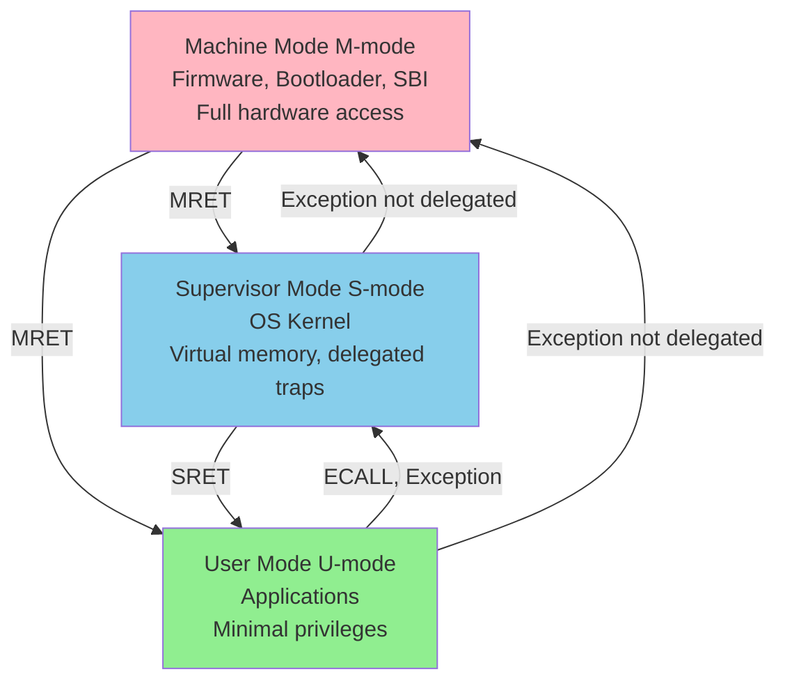
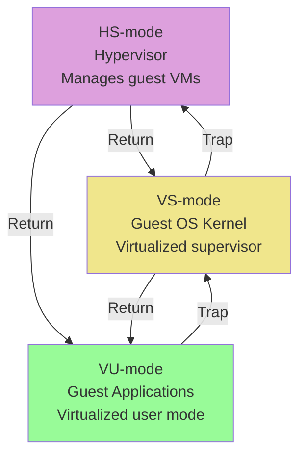
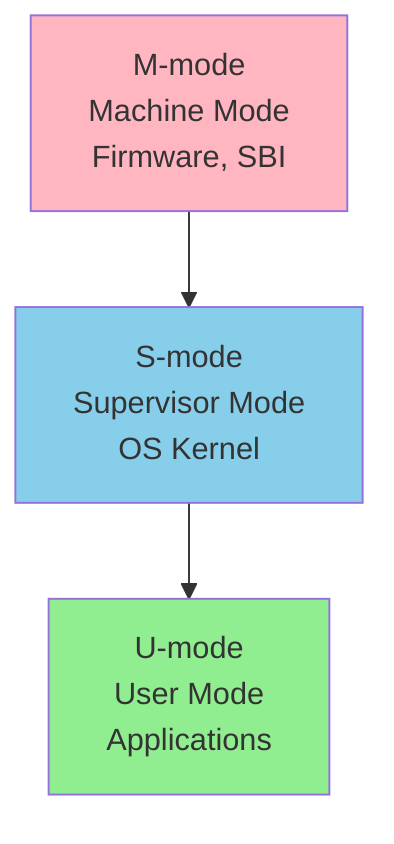
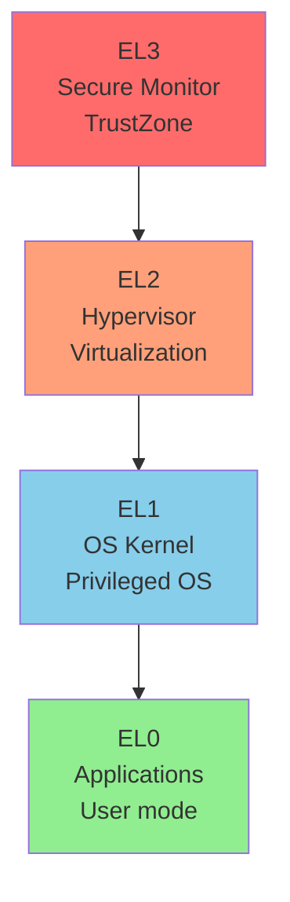
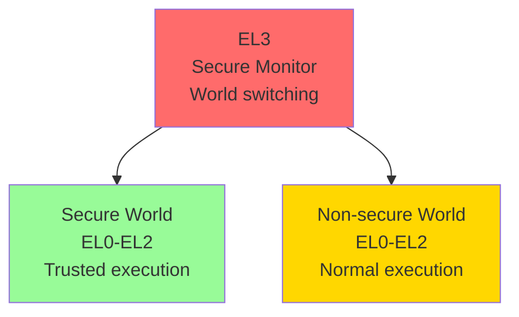

# Chapter 3. Privilege Levels & Execution Environment

**Part II — The RISC-V Execution Model**

---

Modern processors must balance two competing needs: applications require isolation and protection, while operating systems need controlled access to hardware. RISC-V addresses this through a clean privilege architecture with three levels—Machine, Supervisor, and User—each with well-defined responsibilities and capabilities.

This chapter explores how RISC-V implements privilege separation, from the mandatory Machine mode that controls all hardware to the optional Supervisor and User modes that enable operating systems and applications. We'll examine the Supervisor Binary Interface (SBI) that abstracts platform differences, the execution environment interface that defines how programs interact with their environment, and how RISC-V's privilege model compares to ARM's exception levels. Understanding these concepts is essential for anyone working with RISC-V system software, from firmware developers to OS kernel engineers.

---

## 🎯 Learning Objectives

After completing this chapter, you will be able to:

1. **Understand why layered protection is necessary**: Grasp the core concepts of Isolation & Protection, and why modern processors must restrict applications from directly accessing hardware
2. **Master the privilege differences between M/S/U modes**: Clearly distinguish the capabilities and limitations of Machine Mode (building manager), Supervisor Mode (corporate tenant), and User Mode (regular employee)
3. **Understand how SBI serves as M-mode's service window**: Grasp how the Supervisor Binary Interface acts as the standard communication bridge between S-mode and M-mode
4. **Use ecall to request services**: Understand how applications "make a phone call" to the operating system or firmware via the `ecall` instruction to obtain needed services

---

## 💡 Scenario: The Smart Building's Access Card — Understanding Privilege Levels

> **Scene**: In front of the lab whiteboard. Junior points at the screen showing "Illegal Instruction Exception" with a puzzled look. Architect sets down his coffee cup and adjusts his glasses.

**Junior**: "Architect, I just wanted to temporarily disable interrupts in my application to get more precise timing. Why did the CPU throw an error and kick me out? I bought this board myself!"

**Architect**: "Junior, you're thinking about the CPU too simply. Modern processor design is like a **'smart office building'** — for security, there must be strict access levels."

**Junior**: "Access levels?"

**Architect**: "Think about it this way:

- **M-mode (Machine Mode) is the 'Building Manager'**: This is the highest authority. They have the master key to the entire building and can directly control the main power switches (hardware reset, clock configuration). Only they can talk directly to the building's infrastructure.

- **S-mode (Supervisor Mode) is the 'Corporate Tenant'**: This is our operating system (OS). It rents several floors and can decide how to arrange the desks (memory management) and who sits where (scheduling), but it can't cut power to the entire building or interfere with other companies' floors.

- **U-mode (User Mode) is the 'Regular Employee'**: This is your application. You can only work within your assigned desk area (allocated memory). Want to adjust the AC? No way. Want to flip the main power switch? Not a chance."

**Junior**: "So what if I'm actually cold and want to adjust the AC? (meaning: need hardware resources)"

**Architect**: "You have to 'call the front desk.' In RISC-V, this is called **`ecall` (Environment Call)**. You make a request, the OS (S-mode) checks if you're authorized, and if reasonable, the OS does it for you. If it involves lower-level hardware, the OS has to request M-mode's help."

**Junior**: "I see! So when I tried to disable interrupts, it was like an intern trying to run to the server room and pull the main breaker?"

**Architect**: "Exactly. Security (the CPU's hardware exception mechanism) immediately stopped you. This layered protection is the key reason why the system doesn't crash completely because of one bad program."

```
        ┌─────────────────────────────────────────┐
        │         M-mode (Building Manager)        │
        │  ┌─────────────────────────────────┐    │
        │  │    S-mode (Corporate Tenant/OS)  │    │
        │  │  ┌─────────────────────────┐    │    │
        │  │  │   U-mode (Employee/App)  │    │    │
        │  │  │                         │    │    │
        │  │  │    ecall ──────────────►│────┼───►│ Call the front desk
        │  │  │    ◄─────────────────── │◄───┼────│ Response
        │  │  └─────────────────────────┘    │    │
        │  └─────────────────────────────────┘    │
        └─────────────────────────────────────────┘
```

> 💡 **Key Insight**: Privilege levels aren't meant to restrict you — they're meant to protect the entire system. Just like building access control isn't meant to hassle employees, but to prevent one person's mistake from causing a building-wide power outage.

---

## 3.1 RISC-V Privilege Architecture

**The Privilege Model**

RISC-V's privilege architecture is elegantly simple compared to other modern processors. Where ARM defines four exception levels and x86 has rings 0-3 (though only 0 and 3 are commonly used), RISC-V defines just three privilege modes: Machine (M), Supervisor (S), and User (U).

This simplicity is intentional. The RISC-V designers observed that most systems need only two or three privilege levels: one for applications, one for the operating system, and one for firmware. Additional levels add complexity without proportional benefit for most use cases.

The privilege modes form a hierarchy:

- **Machine mode** is the highest privilege level with unrestricted access to all hardware
- **Supervisor mode** is intended for operating systems, with controlled access to privileged operations
- **User mode** is the lowest privilege level, intended for applications with minimal privileges

Importantly, not all modes are mandatory. A simple embedded system might implement only M-mode. A microcontroller with basic memory protection might implement M-mode and U-mode. A full application processor running Linux implements all three modes.

**Machine Mode (M-mode)**

Machine mode is the only mandatory privilege level in RISC-V. Every RISC-V processor must implement M-mode, even if it implements no other privilege levels.

M-mode has complete and unrestricted access to the entire system. It can:

- Access all memory and I/O devices
- Read and write all CSRs
- Execute all instructions
- Configure and delegate traps to lower privilege levels
- Control physical memory protection (PMP)

When a RISC-V processor resets, it starts executing in M-mode. The first code to run—typically a bootloader or firmware—executes in M-mode. This code initializes the hardware, sets up memory protection, and may eventually transfer control to supervisor-mode software (like an operating system) or directly to user-mode applications.

In embedded systems without an operating system, all code may run in M-mode. There's no requirement to use lower privilege levels if they're not needed. This flexibility allows RISC-V to scale from simple microcontrollers to complex application processors.

M-mode software typically implements:

- **Bootloader**: Initial code that runs after reset
- **Firmware**: Low-level hardware initialization and runtime services
- **SBI (Supervisor Binary Interface)**: Services for supervisor-mode software
- **Trap handlers**: For traps that aren't delegated to lower privilege levels

**Supervisor Mode (S-mode)**

Supervisor mode is optional but nearly universal in application processors. It's designed for operating system kernels that manage multiple user processes.

S-mode has more privileges than U-mode but less than M-mode. It can:

- Control virtual memory (page tables, TLB)
- Handle traps delegated from M-mode
- Access supervisor-level CSRs
- Execute privileged instructions (like SFENCE.VMA for TLB management)

S-mode cannot:

- Access machine-level CSRs
- Directly control physical memory protection
- Handle traps not delegated to it
- Access I/O devices not mapped into its address space

This restricted access is intentional. M-mode firmware retains ultimate control over the hardware, while S-mode software (the OS kernel) manages virtual memory and user processes. This separation allows the firmware to provide platform-specific services while the OS remains platform-independent.

Operating systems like Linux, FreeBSD, and real-time operating systems run in S-mode on RISC-V. They use S-mode privileges to:

- Manage virtual memory for process isolation
- Handle system calls from user applications
- Manage interrupts and exceptions
- Schedule processes and manage resources

**User Mode (U-mode)**

User mode is the lowest privilege level, intended for application code. Like S-mode, U-mode is optional, but it's implemented in any system that needs to isolate applications from each other and from the OS.

U-mode has minimal privileges. It can:

- Execute unprivileged instructions
- Access memory mapped into its virtual address space
- Read a few user-accessible CSRs (like performance counters)
- Request services from higher privilege levels via ECALL

U-mode cannot:

- Access privileged CSRs
- Execute privileged instructions
- Directly access I/O devices
- Modify page tables or TLB
- Disable interrupts

When U-mode code needs a privileged operation (like file I/O or memory allocation), it uses the ECALL instruction to trap to S-mode. The OS kernel examines the trap, performs the requested operation if permitted, and returns to U-mode.

This isolation is fundamental to modern operating systems. Each user process runs in U-mode with its own virtual address space. Processes cannot interfere with each other or with the kernel. If a process crashes, it doesn't affect other processes or the system.

**Hypervisor Extension (H-mode)**

The hypervisor extension adds support for virtualization, allowing multiple operating systems to run simultaneously on the same hardware. Unlike M/S/U modes, the hypervisor extension is truly optional and only needed for virtualization use cases.

The H extension doesn't add a new privilege level. Instead, it adds:

- **VS-mode** (Virtual Supervisor): Guest OS kernel mode
- **VU-mode** (Virtual User): Guest OS user mode
- Two-stage address translation
- Additional CSRs for virtualization control

A hypervisor runs in HS-mode (Hypervisor-extended Supervisor mode) and manages multiple guest operating systems. Each guest OS runs in VS-mode, believing it's in S-mode. The hypervisor intercepts certain operations and provides virtualized hardware to each guest.

This extension is important for cloud computing and server virtualization, but most embedded systems and even many application processors don't implement it.

**Figure 3.1a: RISC-V Privilege Hierarchy**



**Figure 3.1b: Hypervisor Extension (Optional)**



---

## 3.2 Privilege Levels vs ARM Exception Levels

**RISC-V's Three-Level Model**

RISC-V's M/S/U privilege model is deliberately minimal. Three levels suffice for most systems:

- M-mode for firmware and platform-specific code
- S-mode for the OS kernel
- U-mode for applications

This simplicity has advantages:

- Easier to understand and implement
- Fewer privilege transitions mean less overhead
- Clear separation of concerns

The model is also flexible. Systems that don't need all three levels can omit S-mode or U-mode. A bare-metal embedded system might use only M-mode. A simple RTOS might use M-mode and U-mode without S-mode.

**ARM's Four-Level Model**

ARM takes a different approach with four exception levels (ELs):

- **EL0**: Applications (like RISC-V U-mode)
- **EL1**: OS kernel (like RISC-V S-mode)
- **EL2**: Hypervisor (for virtualization)
- **EL3**: Secure monitor (for TrustZone)

Additionally, ARM's TrustZone creates two parallel worlds—Secure and Non-secure—each with its own set of exception levels. This creates considerable complexity:

- EL3 manages transitions between Secure and Non-secure worlds
- Each world has its own EL0, EL1, and EL2
- Different exception levels have different capabilities

The ARM model addresses real needs. EL3 and TrustZone provide hardware-enforced security isolation, important for mobile devices handling sensitive data like payment credentials. EL2 enables efficient virtualization for servers and cloud computing.

But this complexity comes at a cost:

- More complex privilege transitions
- More CSRs and state to manage
- Steeper learning curve
- More implementation complexity

**Comparison of Privilege Transitions**

The mechanisms for changing privilege levels differ between RISC-V and ARM, though the concepts are similar.

*RISC-V Transitions*:

- **Upward** (to higher privilege): Exception, interrupt, or ECALL instruction
- **Downward** (to lower privilege): MRET or SRET instruction
- Trap cause stored in xcause CSR
- Return address stored in xepc CSR
- Trap handler address from xtvec CSR

*ARM Transitions*:

- **Upward**: Exception or SVC (supervisor call) instruction
- **Downward**: ERET (exception return) instruction
- Exception syndrome stored in ESR_ELx
- Return address stored in ELR_ELx
- Vector table base in VBAR_ELx

The concepts are nearly identical—both architectures save state, jump to a handler, and provide a return instruction. The main differences are naming and the number of levels involved.

RISC-V's simpler model means fewer cases to handle. An exception in U-mode might go to S-mode (if delegated) or M-mode (if not). In ARM, an exception in EL0 might go to EL1, EL2, or EL3 depending on configuration, and might involve a world switch if TrustZone is involved.

**Security Model Comparison**

Security is where the architectures diverge most significantly.

*ARM TrustZone*:
ARM's TrustZone creates two parallel execution environments—Secure and Non-secure worlds. Each world has its own:

- Memory regions (some memory is Secure-only)
- Peripherals (some devices are Secure-only)
- Exception levels (EL0-EL2 in each world)

The Secure world can access Non-secure resources, but not vice versa. EL3 (Secure monitor) manages transitions between worlds. This provides strong isolation for security-critical code like cryptographic operations, DRM, and payment processing.

TrustZone is mandatory in ARM Cortex-A processors and widely used in mobile devices. It's proven effective for protecting sensitive operations from compromised OS kernels.

*RISC-V PMP and ePMP*:
RISC-V takes a different approach with Physical Memory Protection (PMP). PMP allows M-mode to define memory regions with specific access permissions for lower privilege levels.

PMP provides:

- Up to 16 (or more) memory regions
- Per-region permissions (read, write, execute)
- Protection for S-mode and U-mode
- Flexible region sizes and alignment

The enhanced PMP (ePMP) extension adds:

- Locked regions that even M-mode cannot modify
- More flexible permission models
- Better support for security use cases

PMP is simpler than TrustZone but less comprehensive. It doesn't provide separate execution environments or world switching. For many use cases, PMP suffices. For high-security applications requiring strong isolation, additional mechanisms may be needed.

RISC-V's approach is to keep the base architecture simple and allow extensions for specific security needs. Custom extensions can add TrustZone-like features if required. This flexibility allows implementations to choose the right security model for their use case without mandating complexity for systems that don't need it.

**Figure 3.2a: RISC-V Privilege Levels**



**Figure 3.2b: ARM Exception Levels**



**Figure 3.2c: ARM TrustZone Architecture**



**Trade-offs and Use Cases**

Neither model is universally superior—each makes different trade-offs.

*RISC-V advantages*:

- Simpler to understand and implement
- Lower overhead for privilege transitions
- Flexible—implement only what you need
- Easier to verify and validate

*ARM advantages*:

- TrustZone provides strong security isolation
- Four exception levels enable finer-grained privilege separation
- Mature ecosystem with proven security solutions
- Hypervisor support is standard (EL2)

For embedded systems and microcontrollers, RISC-V's simplicity is often preferable. For mobile devices handling sensitive data, ARM's TrustZone has proven valuable. For servers and cloud computing, both architectures can provide adequate virtualization support (RISC-V via the H extension, ARM via EL2).

The key insight is that RISC-V's modular approach allows adding complexity where needed (via extensions like H for virtualization) while keeping the base simple. ARM's approach is to provide comprehensive features in the base architecture, which ensures consistency but mandates complexity even for systems that don't need all features.

---

## 3.3 Execution Environment Interface (EEI)

**What is an EEI?**

The Execution Environment Interface (EEI) defines the interface between a program and its execution environment. It specifies:

- Which instructions are available
- How system calls are made
- How the program interacts with I/O
- Memory layout and addressing
- Interrupt and exception handling

Different privilege levels have different EEIs. A user-mode program has a different EEI than a supervisor-mode kernel, which has a different EEI than machine-mode firmware.

The EEI concept is important because it separates the ISA (which instructions exist) from the execution environment (how those instructions interact with the system). The same RISC-V ISA can support different EEIs for different use cases.

**Application Execution Environment (AEE)**

The Application Execution Environment is the EEI for user-mode programs. It defines what applications can do and how they interact with the operating system.

A typical AEE provides:

- Virtual memory with process isolation
- System calls via ECALL instruction
- Standard library functions
- File I/O, networking, and other OS services
- Signal handling for asynchronous events

The AEE is usually defined by the operating system and ABI (Application Binary Interface). For example, Linux on RISC-V defines a specific AEE that includes:

- System call numbers and calling convention
- Signal delivery mechanism
- Virtual memory layout
- Thread-local storage access

Applications written for this AEE can run on any RISC-V Linux system, regardless of the underlying hardware.

**Supervisor Execution Environment (SEE)**

The Supervisor Execution Environment is the EEI for OS kernels running in S-mode. It defines how the kernel interacts with the underlying firmware and hardware.

The SEE is typically provided by M-mode firmware through the Supervisor Binary Interface (SBI). The SBI defines services that M-mode provides to S-mode, such as:

- Timer management
- Inter-processor interrupts (IPI)
- Remote fence operations (TLB shootdown)
- System reset and shutdown
- Console I/O (for debugging)

By providing these services through SBI, the firmware abstracts platform-specific details. The OS kernel can be platform-independent, calling SBI functions instead of directly accessing hardware. This is similar to BIOS/UEFI on x86 or ARM's PSCI (Power State Coordination Interface).

**Bare-Metal Execution Environment**

Not all RISC-V systems run operating systems. Embedded systems often run "bare-metal" code directly on the hardware without an OS.

In a bare-metal environment:

- Code runs in M-mode with full hardware access
- No virtual memory or process isolation
- Direct access to all peripherals
- Custom interrupt handlers
- Application-specific memory layout

The bare-metal EEI is defined by the hardware platform and any runtime library used. For example, a microcontroller might provide:

- Startup code that initializes the hardware
- Interrupt vector table
- Basic I/O functions
- Memory map documentation

Bare-metal programming is common in embedded systems, IoT devices, and real-time applications where the overhead of an OS is unacceptable or unnecessary.

---

## 🛠️ Lab 3.1: The Ecall Elevator

This Lab's goal is to let you "see" the privilege mode transition process. We'll use QEMU to simulate a simple bare-metal environment and observe how a User Mode program "takes the elevator" to a higher privilege level via `ecall`.

### Objectives

1. Understand how the `ecall` instruction triggers an exception and traps to a higher privilege level
2. Observe the `mcause` register value to confirm the exception type is "Environment call from U-mode"
3. Observe the `mepc` register to confirm it points to the `ecall` instruction address

### Environment Requirements

- QEMU RISC-V emulator (`qemu-system-riscv64`)
- RISC-V GCC toolchain (`riscv64-unknown-elf-gcc`)
- GDB debugger

### Code

**File: `ecall_elevator.S`**

```assembly
# Lab 3.1: The Ecall Elevator
# Observe how ecall transitions from U-mode to M-mode

.section .text
.global _start

# ============================================================
# M-mode Initialization and Trap Handler Setup
# ============================================================
_start:
    # Set up Trap Handler
    la      t0, trap_handler
    csrw    mtvec, t0

    # Set up User Stack (simplified: using fixed address)
    li      sp, 0x80010000

    # Prepare to switch to U-mode
    # mstatus.MPP = 0 (U-mode), mstatus.MPIE = 1
    li      t0, (0 << 11) | (1 << 7)    # MPP=0 (U-mode), MPIE=1
    csrw    mstatus, t0

    # Set return address (mepc = user_code)
    la      t0, user_code
    csrw    mepc, t0

    # Switch to U-mode
    mret

# ============================================================
# User Mode Code (U-mode)
# ============================================================
user_code:
    # We're now executing in U-mode

    # Prepare syscall arguments
    li      a7, 100         # syscall number = 100 (custom)
    li      a0, 42          # arg0 = 42

    # Press the elevator button!
    ecall                   # <-- Set breakpoint here to observe

    # After ecall returns, a0 contains the return value
    # (This example returns a0 + 1 = 43)

user_loop:
    j       user_loop       # Infinite loop

# ============================================================
# M-mode Trap Handler
# ============================================================
.align 4
trap_handler:
    # === Observation Point 1: Read exception cause ===
    csrr    t0, mcause      # t0 = exception cause
    # U-mode ecall: mcause = 8 (Environment call from U-mode)

    # === Observation Point 2: Read exception address ===
    csrr    t1, mepc        # t1 = address where ecall occurred

    # === Observation Point 3: Read previous privilege state ===
    csrr    t2, mstatus     # mstatus.MPP shows previous mode

    # Simple syscall handling: return a0 + 1
    addi    a0, a0, 1       # return value = argument + 1

    # Skip past ecall instruction (ecall is 4 bytes)
    addi    t1, t1, 4
    csrw    mepc, t1

    # Return to U-mode
    mret
```

### Execution Steps

**1. Compile the program**

```bash
riscv64-unknown-elf-gcc -nostdlib -nostartfiles -T linker.ld \
    -o ecall_elevator.elf ecall_elevator.S
```

**2. Start QEMU and connect GDB**

```bash
# Terminal 1: Start QEMU
qemu-system-riscv64 -machine virt -nographic \
    -kernel ecall_elevator.elf -S -gdb tcp::1234

# Terminal 2: Connect GDB
riscv64-unknown-elf-gdb ecall_elevator.elf
(gdb) target remote :1234
(gdb) break trap_handler
(gdb) continue
```

**3. Observe key registers**

When the breakpoint triggers, execute in GDB:

```gdb
# Check exception cause
(gdb) print/x $mcause
# Expected: 0x8 (Environment call from U-mode)

# Check ecall instruction address
(gdb) print/x $mepc
# Expected: points to ecall address in user_code

# Check previous privilege state
(gdb) print/x $mstatus
# Check MPP bits (bit 12:11): 00 = U-mode
```

### Key Observations

| Register | Value | Meaning |
|----------|-------|---------|
| `mcause` | `0x8` | Exception Code 8 = Environment call from U-mode |
| `mepc` | `ecall address` | Instruction address when trap occurred |
| `mstatus.MPP` | `0b00` | Previously in U-mode (00=U, 01=S, 11=M) |

### Food for Thought

> 💭 **Question**: Why does the Trap Handler need to add 4 to `mepc` before returning?
>
> **Answer**: If we don't skip past `ecall`, `mret` will return to the same `ecall` instruction, causing an infinite trap loop! This is why real-world syscall handlers (like in danieRTOS) include `ctx[CTX_MEPC] += 4` to advance past the ecall.

---

## ⚠️ Common Pitfalls

### Pitfall 1: Bare-Metal Mindset Carryover

**Misconception**: "I'm used to writing bare-metal code on embedded systems. RISC-V should just let me access CSRs directly."

**Reality**: Many RISC-V development boards run Linux, and your program executes in U-mode where you simply cannot access M-mode CSRs.

```c
// ❌ Wrong: Trying to read mstatus in Linux User Space
#include <stdio.h>

int main() {
    unsigned long mstatus;
    asm volatile ("csrr %0, mstatus" : "=r"(mstatus));
    // Result: Illegal Instruction Exception, program killed by SIGILL
    printf("mstatus = 0x%lx\n", mstatus);
    return 0;
}

// ✅ Correct: Use system calls to get system information
#include <stdio.h>
#include <sys/utsname.h>

int main() {
    struct utsname buf;
    uname(&buf);  // Request kernel to look it up via syscall
    printf("Machine: %s\n", buf.machine);
    return 0;
}
```

**Diagnosis**:

If your program mysteriously crashes, first check whether you're using `csrr`/`csrw` to access M-mode or S-mode specific CSRs. In a Linux environment, only a few CSRs (like `cycle`, `time`) can be read from U-mode.

### Pitfall 2: Forgetting to Skip Past ecall

**Symptom**: After the Trap Handler finishes, the CPU enters an infinite trap loop.

**Cause**: `mepc` still points to the `ecall` instruction. After `mret`, it immediately executes `ecall` again, triggering another trap.

```assembly
# ❌ Wrong: Not updating mepc
trap_handler:
    csrr    t0, mcause
    # ... handle syscall ...
    mret                # Returns to same ecall, infinite loop!

# ✅ Correct: Skip past ecall instruction
trap_handler:
    csrr    t0, mcause
    csrr    t1, mepc
    addi    t1, t1, 4   # ecall is 4 bytes
    csrw    mepc, t1
    # ... handle syscall ...
    mret                # Returns to instruction after ecall
```

### Pitfall 3: Confusing M/S/U-Specific CSRs

**Symptom**: Want to read trap information but used the wrong CSR prefix.

**Explanation**: RISC-V CSRs have different prefixes based on privilege level:

| Prefix | Privilege Level | Examples |
|--------|-----------------|----------|
| `m` | Machine | `mstatus`, `mcause`, `mepc`, `mtvec` |
| `s` | Supervisor | `sstatus`, `scause`, `sepc`, `stvec` |
| none | User (some readable) | `cycle`, `time`, `instret` |

```assembly
# ❌ Wrong: Reading S-mode CSR in M-mode Trap Handler
trap_handler:
    csrr    t0, scause      # This reads S-mode's exception cause, not current!

# ✅ Correct: Use M-mode CSRs in M-mode
trap_handler:
    csrr    t0, mcause      # Read M-mode's exception cause
```

> 💡 **Memory Tip**: Use the CSRs for the level you're in. M-mode uses `m*`, S-mode uses `s*`.

---

## Summary

RISC-V's privilege architecture provides a clean, flexible model for separating system software responsibilities. The three privilege levels—Machine (M-mode), Supervisor (S-mode), and User (U-mode)—form a hierarchy where each level has well-defined capabilities and restrictions. M-mode is mandatory and has unrestricted hardware access, making it suitable for firmware and bootloaders. S-mode is optional and designed for operating systems, with controlled access to privileged operations and virtual memory. U-mode is optional and intended for applications, with minimal privileges and strong isolation.

The privilege model is more flexible than it first appears. Simple embedded systems implement only M-mode. Microcontrollers with basic protection implement M-mode and U-mode. Full application processors running Linux implement all three modes. The Hypervisor extension adds VS-mode and VU-mode for virtualization, enabling multiple guest operating systems to run on a single processor.

The Supervisor Binary Interface (SBI) provides a standardized interface between M-mode firmware and S-mode operating systems. SBI abstracts platform-specific details, allowing OS kernels to be portable across different RISC-V implementations. Key SBI services include timer management, inter-processor interrupts, remote fence operations, and system reset. OpenSBI provides a reference implementation that supports numerous platforms.

The Execution Environment Interface (EEI) defines how programs interact with their execution environment. The Application Execution Environment (AEE) is what user programs see—system calls, standard library functions, and OS services. The Supervisor Execution Environment (SEE) is what the OS kernel sees—SBI calls, hardware access, and platform services. Bare-metal environments provide direct hardware access without an OS layer.

Compared to ARM's four exception levels (EL0-EL3), RISC-V's three privilege levels are simpler and more flexible. ARM's EL3 (Secure Monitor) and EL2 (Hypervisor) are always present in ARMv8-A, even if unused. RISC-V makes S-mode and U-mode optional, and adds hypervisor support as an extension. This modularity allows RISC-V to scale from tiny microcontrollers to high-performance servers without carrying unnecessary complexity.

The privilege architecture reflects RISC-V's design philosophy: provide minimal mandatory features, make everything else optional, and maintain clean separation of concerns. This approach enables efficient implementations across a wide range of applications while preserving the flexibility to add advanced features when needed.
