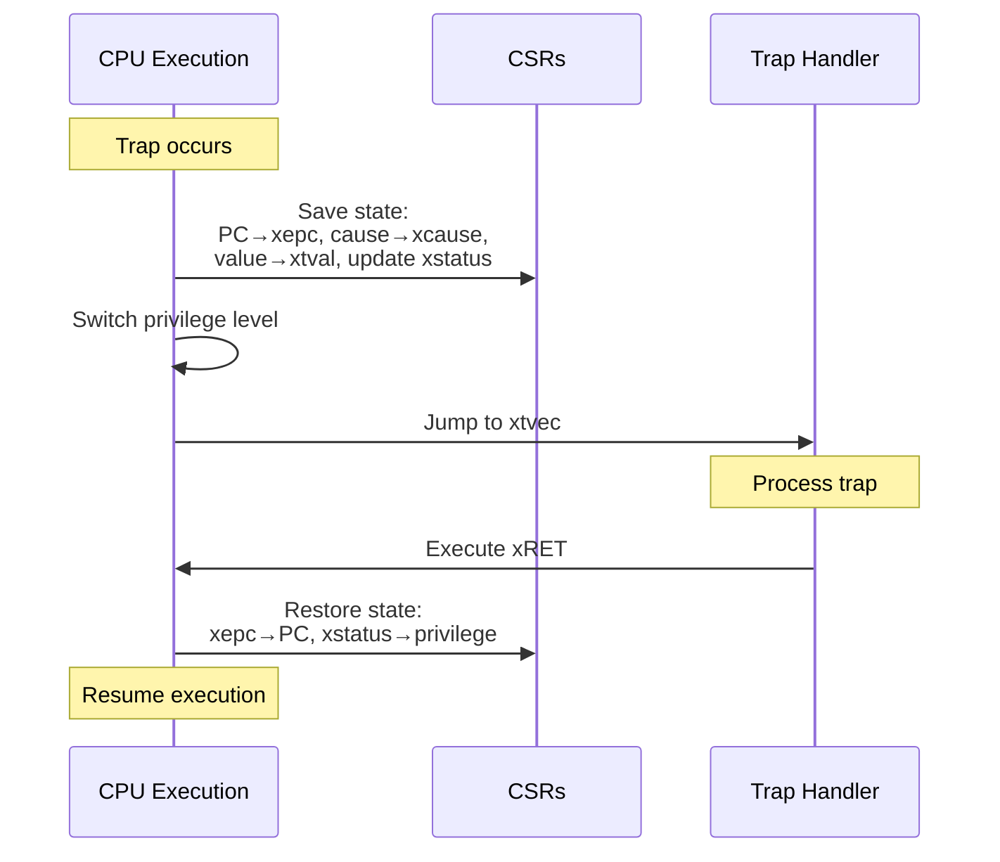

# Chapter 4. Trap, Exception, Interrupt

**Part III — Control Transfer & Exception System**

---

## 🎯 Learning Objectives

After reading this chapter, you will be able to:

1. **Distinguish Exception from Interrupt**: Understand the fundamental difference between synchronous and asynchronous traps
2. **Master the Trap Handling Flow**: Understand the roles of `mtvec`, `mepc`, `mcause`, and `mtval`
3. **Write a Trap Handler**: Implement a basic exception handler
4. **Understand Trap Delegation**: Know how M-mode delegates traps to S-mode
5. **Recognize PLIC**: Understand the basic architecture of the Platform-Level Interrupt Controller

---

## 💡 Scenario: When the CPU Hits the Pause Button

> **Scene**: Junior stares at a completely black terminal screen, looking bewildered.

**Junior**: "Senior, I have a question. I deliberately stuffed some garbage data `.word 0xFFFFFFFF` into my program, and it just crashed. But in Linux, if a program goes bad, usually only that program gets killed (Segmentation Fault), and the system stays fine, right?"

**Senior**: "That's because Linux has a powerful 'emergency response center'—the **Trap Handler**. But in our bare-metal environment right now, you haven't written a handler. When the CPU encounters an instruction it doesn't understand, it doesn't know what to do, so it just... gives up."

**Junior**: "So I need to write this response center myself?"

**Senior**: "Exactly. Think of it this way:

1. **Trap Occurs**: Like a robotic arm on the assembly line suddenly shows a red warning light and stops.
2. **Hardware Action**: The CPU automatically saves the current progress (PC) in `mepc` (Machine Exception PC), then jumps to wherever `mtvec` (Trap Vector) points to for help.
3. **Software Takes Over (Handler)**: This is the code you need to write. You check `mcause` (Machine Cause) to see what triggered the alarm, handle the problem, then let the machine continue."

**Junior**: "Sounds logical—handle it and go back to what you were doing?"

**Senior**: "Here's the trap within the trap. If it's an 'Interrupt' (like a timer going off), you handle it and return to 'what you were doing.' But if it's an 'Illegal Instruction Exception,' returning to 'what you were doing' just hits the same illegal instruction again—infinite loop! So you have to manually 'skip over' that bad instruction."

**Junior**: "I see! Let's try it then."

---

When a program encounters an error, receives an interrupt, or makes a system call, control must transfer from the current execution context to a handler that can deal with the event. RISC-V calls this mechanism a "trap"—a general term encompassing both synchronous exceptions (like page faults and illegal instructions) and asynchronous interrupts (like timer ticks and device signals).

Understanding traps is fundamental to system programming. Operating systems rely on traps to implement system calls, handle errors, and respond to hardware events. Firmware uses traps to manage low-level hardware and provide services to higher-level software. Even application programmers benefit from understanding how exceptions propagate and how interrupt latency affects real-time performance.

This chapter explores RISC-V's trap mechanism in detail: how traps are triggered, how control transfers to handlers, how CSRs record trap information, and how the Platform-Level Interrupt Controller (PLIC) manages external interrupts. We'll also examine the Advanced Interrupt Architecture (AIA) that extends RISC-V's interrupt capabilities for high-performance systems, and compare RISC-V's approach with ARM's exception model.

---

## 4.1 Trap Fundamentals

**What is a Trap?**

In RISC-V terminology, a "trap" is any event that causes a control transfer to a trap handler. This includes both exceptions (synchronous events caused by instruction execution) and interrupts (asynchronous events from external sources).

The term "trap" is deliberately general. It encompasses:

- Illegal instructions
- Page faults
- System calls (ECALL)
- Breakpoints
- Timer interrupts
- External device interrupts
- Inter-processor interrupts

When a trap occurs, the processor:

1. Saves the current program counter to xepc (where x is m, s, or u depending on the target privilege level)
2. Saves the trap cause to xcause
3. Saves additional information to xtval (if applicable)
4. Updates xstatus to record the previous privilege level and interrupt enable state
5. Jumps to the trap handler address specified in xtvec

This mechanism is similar to exception handling in other architectures, but RISC-V's terminology and implementation are particularly clean and consistent.

**Exceptions vs Interrupts**

The distinction between exceptions and interrupts is fundamental:

*Exceptions* are synchronous—they're caused by the execution of a specific instruction. When you execute an instruction that causes an exception, the exception occurs at that point in the program. Examples include:

- Illegal instruction: The processor doesn't recognize the opcode
- Page fault: A memory access violates page table permissions
- ECALL: The program explicitly requests a trap to higher privilege
- Breakpoint: A debugging breakpoint is hit

Exceptions are predictable and reproducible. If you execute the same instruction sequence with the same processor state, you'll get the same exception at the same point.

*Interrupts* are asynchronous—they're caused by events external to the currently executing instruction stream. An interrupt can occur between any two instructions (or even during instruction execution in some implementations). Examples include:

- Timer interrupt: A timer has expired
- External interrupt: A device needs attention
- Software interrupt: Another processor or software has signaled this processor

Interrupts are not predictable from the instruction stream alone. The same program might experience interrupts at different points on different runs, depending on external events.

This distinction affects how traps are handled. Exceptions typically require examining the faulting instruction (available in xtval for some exceptions). Interrupts require identifying which device or source caused the interrupt.

**Synchronous vs Asynchronous Traps**

The synchronous/asynchronous distinction is encoded in the xcause CSR. The high bit of xcause indicates the trap type:

- Bit 63 (in RV64) = 0: Exception (synchronous)
- Bit 63 (in RV64) = 1: Interrupt (asynchronous)

The low bits encode the specific cause. For example:

- xcause = 0x0000000000000002: Illegal instruction exception
- xcause = 0x8000000000000005: Supervisor timer interrupt

This encoding allows trap handlers to quickly distinguish interrupts from exceptions with a simple sign test.

**Trap Classification**

RISC-V doesn't formally classify traps beyond the exception/interrupt distinction, but it's useful to think about exceptions in terms of their behavior:

*Faults*: Exceptions that can be corrected, after which the faulting instruction can be restarted. Page faults are the classic example. When a page fault occurs:

1. The OS trap handler is invoked
2. The handler loads the missing page from disk
3. The handler updates the page table
4. The handler returns, and the faulting instruction is re-executed
5. This time, the instruction succeeds

The key is that xepc points to the faulting instruction, so returning from the trap re-executes it.

*Traps* (in the narrow sense): Exceptions that are reported after the instruction completes. Breakpoints are an example. The breakpoint exception occurs after the EBREAK instruction executes, and xepc points to the next instruction.

*Interrupts*: Asynchronous events. The interrupted instruction may or may not have completed. For precise interrupts, xepc points to an instruction that hasn't executed yet. For imprecise interrupts (rare in RISC-V), the exact point of interruption may be approximate.

*Aborts*: Unrecoverable errors. These are rare in RISC-V. Most errors that would be aborts in other architectures are either faults (if recoverable) or cause the processor to enter a failure state.

Understanding these classifications helps in writing correct trap handlers. Fault handlers must be idempotent (safe to execute multiple times) because the faulting instruction will be retried. Trap handlers for breakpoints must advance xepc before returning to avoid infinite loops.

---

## 4.2 Trap Entry and Exit

**Trap Entry Flow**

When a trap occurs, the processor performs a well-defined sequence of operations. Understanding this sequence is crucial for writing trap handlers and debugging trap-related issues.

The trap entry flow differs slightly depending on the target privilege level (M-mode, S-mode, or U-mode), but the basic pattern is the same. Let's consider a trap to M-mode:

1. **Save PC**: The current PC is saved to mepc. For exceptions, this is the PC of the faulting instruction. For interrupts, this is the PC of the instruction that would have executed next.

2. **Update mcause**: The trap cause is written to mcause. The high bit indicates interrupt (1) or exception (0). The low bits encode the specific cause.

3. **Update mtval**: Additional trap-specific information is written to mtval. For address-related exceptions (like page faults), mtval contains the faulting address. For illegal instruction exceptions, mtval may contain the instruction itself. For some traps, mtval is zero.

4. **Update mstatus**: Several fields in mstatus are updated:
   - MPP (previous privilege) is set to the current privilege level
   - MPIE (previous interrupt enable) is set to the current value of MIE
   - MIE (interrupt enable) is set to 0, disabling interrupts in M-mode

5. **Set privilege to M-mode**: The processor switches to M-mode.

6. **Jump to handler**: The PC is set to the trap handler address from mtvec. The exact address depends on the mtvec mode (direct or vectored).

This entire sequence is atomic—it cannot be interrupted. Once a trap begins, it completes before any other trap can occur.

**Figure 4.1: Trap Entry and Exit Flow**



**CSR Updates on Trap**

Let's examine each CSR update in detail:

*xepc (Exception Program Counter)*: This register holds the address to return to after handling the trap. For exceptions, it's the address of the instruction that caused the exception. For interrupts, it's the address of the instruction that was about to execute when the interrupt occurred.

The trap handler can modify xepc before returning. This is useful for:

- Skipping over a faulting instruction that can't be fixed
- Implementing single-stepping in a debugger
- Emulating instructions not supported by the hardware

*xcause (Trap Cause)*: This register indicates why the trap occurred. The format is:

- Bit XLEN-1: Interrupt bit (1 = interrupt, 0 = exception)
- Bits XLEN-2:0: Exception code or interrupt code

Common exception codes include:

- 0: Instruction address misaligned
- 1: Instruction access fault
- 2: Illegal instruction
- 3: Breakpoint
- 5: Load access fault
- 7: Store/AMO access fault
- 8: Environment call from U-mode
- 9: Environment call from S-mode
- 11: Environment call from M-mode
- 12: Instruction page fault
- 13: Load page fault
- 15: Store/AMO page fault

Common interrupt codes include:

- 1: Supervisor software interrupt
- 3: Machine software interrupt
- 5: Supervisor timer interrupt
- 7: Machine timer interrupt
- 9: Supervisor external interrupt
- 11: Machine external interrupt

*xtval (Trap Value)*: This register provides additional information about the trap. Its contents depend on the trap cause:

- For address misaligned or access fault exceptions: The faulting address
- For illegal instruction exceptions: The instruction itself (optional)
- For breakpoint exceptions: The address of the breakpoint instruction
- For page fault exceptions: The faulting virtual address
- For other traps: Zero or undefined

The trap handler uses xtval to determine what went wrong and how to fix it. For example, a page fault handler uses xtval to know which page to load from disk.

*xstatus (Status Register)*: Several fields are updated:

- **xPP** (Previous Privilege): Set to the privilege level before the trap. This allows the xRET instruction to return to the correct privilege level.
- **xPIE** (Previous Interrupt Enable): Set to the value of xIE before the trap. This preserves the interrupt enable state.
- **xIE** (Interrupt Enable): Cleared to 0, disabling interrupts at the target privilege level. This prevents nested interrupts from immediately occurring.

These updates ensure that the trap handler knows where it came from and can return correctly.

**Trap Vector (xtvec)**

The xtvec CSR specifies where trap handlers are located. It has two fields:

- **BASE** (bits XLEN-1:2): The base address of the trap handler(s), aligned to 4 bytes
- **MODE** (bits 1:0): The vectoring mode

Two modes are defined:

- **Direct mode (MODE=0)**: All traps jump to BASE. A single trap handler must determine the cause by reading xcause and dispatch accordingly.
- **Vectored mode (MODE=1)**: Exceptions jump to BASE. Interrupts jump to BASE + 4×cause. This allows separate handlers for each interrupt source.

Vectored mode is useful for performance. Instead of a single handler that must check xcause and dispatch, each interrupt can have its own handler. This reduces latency for interrupt handling.

Example xtvec values:

- 0x80000000: Direct mode, handler at 0x80000000
- 0x80000001: Vectored mode, base at 0x80000000
  - Exceptions → 0x80000000
  - Supervisor software interrupt (cause 1) → 0x80000004
  - Supervisor timer interrupt (cause 5) → 0x80000014
  - Supervisor external interrupt (cause 9) → 0x80000024

**Trap Return (xRET)**

Returning from a trap is accomplished with the xRET instruction (MRET for M-mode, SRET for S-mode, URET for U-mode). The xRET instruction:

1. **Restore PC**: Set PC to the value in xepc
2. **Restore privilege**: Set the current privilege level to xstatus.xPP
3. **Restore interrupt enable**: Set xIE to xstatus.xPIE
4. **Update xPIE**: Set xPIE to 1 (enabled)
5. **Update xPP**: Set xPP to U-mode (least privilege)

The last two steps prepare for the next trap. Setting xPIE to 1 ensures that interrupts will be enabled after the next trap (unless explicitly disabled). Setting xPP to U-mode ensures that returning from the next trap won't accidentally escalate privilege.

A typical trap handler epilogue looks like:

```assembly
    # Restore saved registers
    ld t0, 0(sp)
    ld t1, 8(sp)
    # ... restore other registers ...
    addi sp, sp, 256    # Deallocate stack frame

    mret                # Return from M-mode trap
```

The MRET instruction is privileged—it can only be executed in M-mode. Similarly, SRET can only be executed in S-mode or higher. Attempting to execute xRET from insufficient privilege causes an illegal instruction exception.

---

## 4.3 Exception Causes and Handling

**Exception Cause Codes**

RISC-V defines a standard set of exception codes. Understanding these codes is essential for writing trap handlers.

*Instruction Address Misaligned (0)*: The PC is not properly aligned for the instruction being fetched. In the base ISA, instructions must be 4-byte aligned. With the C extension, instructions can be 2-byte aligned, but jumping to an odd address still causes this exception.

*Instruction Access Fault (1)*: The instruction fetch failed. This might occur because:

- The address is not mapped in the page table
- The page doesn't have execute permission
- The address is in a protected region (PMP violation)
- A bus error occurred

*Illegal Instruction (2)*: The processor doesn't recognize the instruction. This occurs when:

- The opcode is invalid
- The instruction uses an unimplemented extension
- The instruction is privileged but executed from insufficient privilege
- Reserved fields have incorrect values

Illegal instruction exceptions are often used to emulate unimplemented instructions in software.

*Breakpoint (3)*: The EBREAK instruction was executed. This is used by debuggers to set breakpoints. The trap handler can examine the program state and return control to the debugger.

*Load Address Misaligned (4)* and *Store/AMO Address Misaligned (6)*: A load or store instruction used an improperly aligned address. For example, a 4-byte load (LW) from an address that's not 4-byte aligned. Some implementations support misaligned accesses in hardware; others trap and require software emulation.

*Load Access Fault (5)* and *Store/AMO Access Fault (7)*: A load or store failed for reasons similar to instruction access faults—page table violations, PMP violations, or bus errors.

*Environment Call from U/S/M-mode (8/9/11)*: The ECALL instruction was executed. The exception code indicates which privilege level made the call. This is how system calls are implemented—user code executes ECALL, trapping to the kernel.

*Instruction Page Fault (12)*, *Load Page Fault (13)*, *Store/AMO Page Fault (15)*: A page table entry was found, but it doesn't grant the required permission. These are distinct from access faults (which occur when no valid translation exists). Page faults are typically handled by loading the page from disk and updating the page table.

**Exception Handling Patterns**

Different exceptions require different handling strategies:

*Illegal Instruction Emulation*: When an illegal instruction exception occurs, the handler can:

1. Read the faulting instruction from memory (or from mtval if provided)
2. Decode the instruction
3. If it's an instruction that can be emulated, perform the operation in software
4. Update registers and memory as the instruction would have
5. Advance mepc past the instruction
6. Return with MRET

This technique is used to support optional extensions in software or to provide backward compatibility.

*Page Fault Handling*: Page faults are more complex:

1. Read the faulting address from xtval
2. Check if the address is valid for the process
3. If not, terminate the process (segmentation fault)
4. If valid, allocate a physical page
5. Load the page contents from disk (if it was swapped out)
6. Update the page table to map the virtual address to the physical page
7. Return with SRET (the faulting instruction will be retried)

Page fault handling is critical for virtual memory systems and can involve significant latency if disk I/O is required.

*System Call Handling*: ECALL exceptions implement system calls:

1. Read the system call number (typically from register a7)
2. Read arguments from registers (a0-a6)
3. Validate arguments
4. Perform the requested operation
5. Write the result to a0
6. Advance sepc past the ECALL instruction
7. Return with SRET

The key is advancing sepc—otherwise, returning would re-execute the ECALL, creating an infinite loop.

---

## 4.4 Interrupt Architecture

**Interrupt Types**

RISC-V defines three types of interrupts, each with machine-level and supervisor-level variants:

*Software Interrupts*:

- Machine software interrupt (cause code 3)
- Supervisor software interrupt (cause code 1)
- Triggered by writing to memory-mapped registers
- Used for inter-processor interrupts (IPI)

*Timer Interrupts*:

- Machine timer interrupt (cause code 7)
- Supervisor timer interrupt (cause code 5)
- Triggered when a timer reaches a threshold
- Used for scheduling and timekeeping

*External Interrupts*:

- Machine external interrupt (cause code 11)
- Supervisor external interrupt (cause code 9)
- Triggered by external devices via interrupt controller
- Used for I/O device interrupts

Each interrupt type has a corresponding bit in the `xie` (interrupt enable) and `xip` (interrupt pending) registers.

**Interrupt Enable and Pending**

Interrupts are controlled by two sets of CSRs:

*xie (Interrupt Enable)*: Each bit enables a specific interrupt type.

- Bit 11: Machine external interrupt enable (MEIE)
- Bit 9: Supervisor external interrupt enable (SEIE)
- Bit 7: Machine timer interrupt enable (MTIE)
- Bit 5: Supervisor timer interrupt enable (STIE)
- Bit 3: Machine software interrupt enable (MSIE)
- Bit 1: Supervisor software interrupt enable (SSIE)

*xip (Interrupt Pending)*: Each bit indicates if an interrupt is pending.

- Same bit positions as xie
- Read-only for most bits (set by hardware)
- Software interrupt bits can be written

For an interrupt to be taken:

1. The interrupt must be pending (bit set in xip)
2. The interrupt must be enabled (bit set in xie)
3. Global interrupts must be enabled (xIE bit in xstatus)
4. The interrupt must not be delegated to a lower privilege level

**Interrupt Priority**

When multiple interrupts are pending, the hardware chooses one based on priority. The standard priority order is:

1. External interrupts (highest priority)
2. Software interrupts
3. Timer interrupts (lowest priority)

Within each category, machine-level interrupts have higher priority than supervisor-level.

This ordering ensures that external device interrupts (which may be time-critical) are serviced before software-triggered interrupts.

**Interrupt Nesting**

By default, taking an interrupt disables further interrupts (xIE is cleared). This prevents nested interrupts, which simplifies handler code.

However, handlers can re-enable interrupts to allow nesting:

```assembly
interrupt_handler:
    # Save context
    csrrw sp, mscratch, sp    # Swap sp with mscratch
    addi sp, sp, -256
    sd x1, 0(sp)
    # ... save other registers ...

    # Re-enable interrupts for nesting
    csrsi mstatus, 0x8        # Set MIE bit

    # Handle interrupt
    # ...

    # Disable interrupts before returning
    csrci mstatus, 0x8        # Clear MIE bit

    # Restore context
    ld x1, 0(sp)
    # ... restore other registers ...
    addi sp, sp, 256
    csrrw sp, mscratch, sp
    mret
```

Nested interrupts require careful stack management and reentrancy considerations.

---

## 4.5 Platform-Level Interrupt Controller (PLIC)

**PLIC Architecture**

The Platform-Level Interrupt Controller (PLIC) is the standard interrupt controller for RISC-V systems. It routes interrupts from external sources (devices) to harts and privilege levels.

Key features:

- Supports up to 1024 interrupt sources
- Routes interrupts to multiple targets (harts × privilege modes)
- Priority-based arbitration
- Memory-mapped configuration registers

The PLIC sits between interrupt sources (devices) and interrupt targets (harts):

```
Devices → PLIC → Harts (M-mode, S-mode)
```

**Interrupt Routing**

Each interrupt source can be routed to any combination of targets. A target is a (hart, privilege mode) pair. For example, in a 4-hart system with M-mode and S-mode:

- Hart 0 M-mode
- Hart 0 S-mode
- Hart 1 M-mode
- Hart 1 S-mode
- ... (8 targets total)

Each target has an enable register with one bit per interrupt source. Setting bit N enables source N for that target.

This flexibility allows:

- Dedicating certain interrupts to specific harts
- Sharing interrupts across multiple harts
- Routing interrupts to different privilege levels

**Priority and Threshold**

Each interrupt source has a priority (typically 0-7, where 0 means "never interrupt"). Each target has a threshold. An interrupt is delivered only if its priority exceeds the target's threshold.

This allows:

- Masking low-priority interrupts during critical sections
- Implementing priority-based preemption
- Temporarily disabling interrupts without modifying enable bits

Example: Set threshold to 5 to mask all interrupts with priority ≤ 5.

**PLIC Memory Map and Programming**

The PLIC is configured through memory-mapped registers:

```
Base Address: 0x0C000000 (typical, platform-specific)

Priority registers:     Base + 0x000000 + source_id * 4
Pending registers:      Base + 0x001000 + (source_id / 32) * 4
Enable registers:       Base + 0x002000 + context * 0x80 + (source_id / 32) * 4
Threshold registers:    Base + 0x200000 + context * 0x1000
Claim/Complete:         Base + 0x200004 + context * 0x1000
```

A "context" is a (hart, privilege mode) pair. For a system with M-mode and S-mode per hart:

- Context 0 = Hart 0, M-mode
- Context 1 = Hart 0, S-mode
- Context 2 = Hart 1, M-mode
- Context 3 = Hart 1, S-mode
- ...

Example register definitions and initialization:

```c
// PLIC register definitions
#define PLIC_BASE           0x0C000000
#define PLIC_PRIORITY(id)   (PLIC_BASE + (id) * 4)
#define PLIC_PENDING(id)    (PLIC_BASE + 0x1000 + ((id) / 32) * 4)
#define PLIC_ENABLE(hart, mode, id) \
    (PLIC_BASE + 0x2000 + (hart) * 0x100 + (mode) * 0x80 + ((id) / 32) * 4)
#define PLIC_THRESHOLD(hart, mode) \
    (PLIC_BASE + 0x200000 + (hart) * 0x2000 + (mode) * 0x1000)
#define PLIC_CLAIM(hart, mode) \
    (PLIC_BASE + 0x200004 + (hart) * 0x2000 + (mode) * 0x1000)

// Initialize PLIC
void plic_init(void) {
    // Set priority of interrupt source 1 to 7 (highest)
    *(volatile uint32_t *)PLIC_PRIORITY(1) = 7;

    // Enable interrupt source 1 for hart 0 M-mode
    uint32_t *enable_reg = (uint32_t *)PLIC_ENABLE(0, 0, 1);  // mode 0 = M-mode
    *enable_reg |= (1 << (1 % 32));

    // Set priority threshold to 0 (accept all interrupts with priority > 0)
    *(volatile uint32_t *)PLIC_THRESHOLD(0, 0) = 0;

    // Enable M-mode external interrupt
    set_csr(mie, 1 << 11);  // MEIE
    set_csr(mstatus, 1 << 3);  // MIE
}

// PLIC interrupt handler
void plic_handler(void) {
    // Claim interrupt (read source ID)
    uint32_t source = *(volatile uint32_t *)PLIC_CLAIM(0, 0);

    if (source == 0) {
        // No pending interrupt (should not happen)
        return;
    }

    // Handle interrupt
    printf("Handling PLIC interrupt from source %u\n", source);
    handle_device_interrupt(source);

    // Complete interrupt (write back source ID)
    *(volatile uint32_t *)PLIC_CLAIM(0, 0) = source;
}
```

**Claim and Completion**

The PLIC uses a claim/complete protocol:

1. **Claim**: The handler reads the claim register. This atomically:
   - Returns the ID of the highest-priority pending interrupt
   - Marks that interrupt as "in service"
   - Prevents other harts from claiming the same interrupt

2. **Service**: The handler services the interrupt

3. **Complete**: The handler writes the interrupt ID to the completion register. This:
   - Marks the interrupt as no longer in service
   - Allows the interrupt to be triggered again

Example:

```c
void plic_handler(void) {
    uint32_t irq = plic_claim();  // Claim interrupt
    if (irq == UART_IRQ) {
        uart_interrupt_handler();
    } else if (irq == TIMER_IRQ) {
        timer_interrupt_handler();
    }
    // ... handle other interrupts ...
    plic_complete(irq);           // Complete interrupt
}
```

The claim/complete protocol ensures that:

- Each interrupt is handled exactly once
- Multiple harts can share the PLIC without races
- Level-triggered interrupts don't cause spurious re-triggers

---

## 4.6 Core-Local Interrupt Controller (CLIC)

**CLIC vs PLIC**

The Core-Local Interrupt Controller (CLIC) is an optional extension that provides lower-latency interrupt handling than the PLIC.

*PLIC*:

- Platform-level (shared across harts)
- Flexible routing
- Memory-mapped configuration
- Higher latency (claim/complete protocol)
- Good for general-purpose I/O

*CLIC*:

- Core-local (one per hart)
- Direct vectoring to handlers
- Lower latency
- More complex configuration
- Good for real-time, low-latency interrupts

PLIC and CLIC are complementary. A system might use CLIC for time-critical interrupts and PLIC for general I/O.

**Vectored Interrupt Handling**

CLIC supports vectored interrupts—each interrupt source can have its own handler address. When an interrupt occurs, the hardware jumps directly to the handler, avoiding software dispatch overhead.

The vector table is an array of handler addresses:

```
Vector Table:
  [0]: Handler for interrupt 0
  [1]: Handler for interrupt 1
  [2]: Handler for interrupt 2
  ...
```

The hardware computes the handler address as:

```
handler_address = vector_table_base + (interrupt_id × entry_size)
```

This eliminates the need for a dispatcher that reads the interrupt ID and jumps to the appropriate handler.

**Interrupt Levels and Preemption**

CLIC supports multiple interrupt levels (typically 256). Each interrupt has a level, and higher-level interrupts can preempt lower-level ones.

When an interrupt is taken:

- The current level is saved
- The new level is set to the interrupt's level
- Only interrupts with higher levels can preempt

This provides fine-grained priority control for real-time systems.

---

## 4.7 Advanced Interrupt Architecture (AIA)

**AIA Overview**

The Advanced Interrupt Architecture (AIA) is a newer interrupt specification that extends and improves upon PLIC and CLIC. It provides:

- Message-signaled interrupts (MSI)
- Interrupt virtualization support
- Improved scalability
- Better integration with PCIe

AIA is designed for modern systems with many cores and devices, particularly servers and data center applications.

**Message-Signaled Interrupts (MSI)**

Traditional interrupts use dedicated wires. MSI uses memory writes to signal interrupts:

- Device writes to a special address
- The write is intercepted by the interrupt controller
- An interrupt is triggered

MSI advantages:

- No dedicated interrupt wires needed
- Scales better (thousands of interrupt sources)
- Better for PCIe devices
- Supports interrupt remapping

**Interrupt Virtualization**

AIA includes support for virtualizing interrupts, essential for running multiple guest operating systems:

- Guest interrupts can be delivered directly to guest VMs
- Hypervisor can intercept and remap interrupts
- Reduces virtualization overhead

This is similar to ARM's GIC virtualization extensions.

---

## 4.8 Comparison with ARM GIC

**ARM Generic Interrupt Controller (GIC)**

ARM's GIC is the standard interrupt controller for ARM systems. Comparing with RISC-V:

*Architecture*:

- **GIC**: Centralized, hierarchical (distributor → CPU interfaces)
- **PLIC**: Flat, memory-mapped
- **CLIC**: Core-local, vectored

*Interrupt Types*:

- **GIC**: SGI (software), PPI (private peripheral), SPI (shared peripheral)
- **RISC-V**: Software, timer, external

*Priority Levels*:

- **GIC**: Up to 256 priority levels
- **PLIC**: Typically 8 levels
- **CLIC**: Up to 256 levels

*Virtualization*:

- **GIC**: Built-in virtualization support (GICv3+)
- **RISC-V**: AIA provides virtualization support

**Similarities**:

- Both support priority-based arbitration
- Both support routing interrupts to specific cores
- Both support message-signaled interrupts (GICv3 ITS, RISC-V AIA)

**Differences**:

- GIC is more complex and feature-rich
- PLIC is simpler and more flexible
- CLIC provides lower latency for real-time use cases
- AIA brings RISC-V closer to GIC's capabilities

**Trade-offs**:

- RISC-V's modular approach (PLIC/CLIC/AIA) allows implementations to choose the right complexity
- ARM's unified GIC provides consistency but mandates more complexity
- RISC-V is catching up with AIA for advanced features

---

## 🛠️ Hands-on Lab: Lab 4.1 — Your First Trap Handler

This lab guides you through implementing a minimal Trap Handler that handles an Illegal Instruction and gracefully skips over it.

### Lab Objectives

1. Set `mtvec` to point to your Trap Handler
2. Read `mcause` to determine the trap type
3. Modify `mepc` to skip over the bad instruction
4. Return using `mret`

### Code

Create `lab4_trap.S`:

```assembly
# lab4_trap.S - Minimal Trap Handler Implementation
.section .text
.global _start

_start:
    # 1. Set up Trap Vector
    la t0, trap_handler
    csrw mtvec, t0          # Tell CPU: jump here when trap occurs

    # 2. Execute some normal instructions
    li a0, 100
    li a1, 200
    add a2, a0, a1          # a2 = 300

    # 3. Deliberately trigger an illegal instruction
    .word 0xFFFFFFFF        # This is NOT a valid RISC-V instruction!

    # 4. If Handler is correct, we skip the above and continue here
    li a3, 999              # Marker: we successfully skipped it!

    # 5. Exit program
    li a7, 93               # exit syscall
    li a0, 0                # exit code
    ecall

# ============================================
# Trap Handler
# ============================================
.align 4                    # mtvec requires 4-byte alignment
trap_handler:
    # Save registers we'll use
    addi sp, sp, -16
    sd t0, 0(sp)
    sd t1, 8(sp)

    # Read trap cause
    csrr t0, mcause

    # Check if Illegal Instruction (cause = 2)
    li t1, 2
    bne t0, t1, unknown_trap

    # It's an illegal instruction! Skip it
    # Read mepc (address of trapping instruction)
    csrr t0, mepc

    # Assume 32-bit instruction, skip 4 bytes
    # (Compressed instructions are 2 bytes; simplified here)
    addi t0, t0, 4
    csrw mepc, t0           # Update mepc

    # Restore registers
    ld t0, 0(sp)
    ld t1, 8(sp)
    addi sp, sp, 16

    # Return! CPU will jump to new mepc
    mret

unknown_trap:
    # Unknown trap, halt
    j unknown_trap
```

### Compile and Run

```bash
# Compile
riscv64-unknown-elf-gcc -nostdlib -nostartfiles -o lab4_trap lab4_trap.S

# Run with QEMU (requires Machine Mode support)
qemu-system-riscv64 -machine virt -nographic -bios none -kernel lab4_trap

# Or use Spike
spike --isa=rv64gc lab4_trap
```

### What to Observe

Use GDB to trace execution:

```bash
# Terminal 1: Start QEMU and wait for GDB
qemu-system-riscv64 -machine virt -nographic -bios none -kernel lab4_trap -s -S

# Terminal 2: Connect GDB
riscv64-unknown-elf-gdb lab4_trap
(gdb) target remote :1234
(gdb) break trap_handler
(gdb) continue
```

When the breakpoint hits, examine:

```gdb
(gdb) info registers mcause    # Should show 2 (Illegal Instruction)
(gdb) info registers mepc      # Address of the .word 0xFFFFFFFF
(gdb) stepi                    # Step through handler
```

You should observe:

- `mcause = 2` (Illegal Instruction)
- `mepc` points to the address of `.word 0xFFFFFFFF`
- `mtval` may contain the encoding of the illegal instruction

> **danieRTOS Reference**: The context switch mechanism in danieRTOS builds on these trap handling fundamentals, using `mret` to switch between tasks.

### Key Concept: mepc Adjustment

> 💭 **Why doesn't an Interrupt need to modify `mepc`, but an Exception does?**
>
> - **Interrupt**: Is "asynchronous"—it occurs between two instructions. `mepc` points to the "next instruction to execute." After handling the interrupt, continuing from there is correct.
> - **Exception**: Is "synchronous"—triggered by the current instruction. `mepc` points to the "instruction that triggered the exception." If you don't modify `mepc`, `mret` will re-execute the same instruction, triggering the exception again, forming an infinite loop!

---

## ⚠️ Common Pitfalls

### Pitfall 1: Forgetting to Set `mtvec`

**Error Scenario**: A trap triggers at startup before `mtvec` is set, causing the CPU to jump to an uninitialized address (usually 0).

```assembly
# ❌ Wrong: mtvec not set before potential trap
_start:
    ecall                   # If mtvec isn't set, jumps to unknown address

# ✅ Correct: Set mtvec as the first thing
_start:
    la t0, trap_handler
    csrw mtvec, t0
    # Now safe to execute instructions that might trap
```

### Pitfall 2: Corrupting Caller's Registers in Handler

**Error Scenario**: The Trap Handler uses `a0`, `t0`, etc. without saving/restoring them, causing the interrupted program's data to be corrupted.

```assembly
# ❌ Wrong: Directly using registers
trap_handler:
    csrr t0, mcause         # t0 is overwritten!
    # ... handle ...
    mret                    # Original t0 value is gone

# ✅ Correct: Save first, restore after
trap_handler:
    addi sp, sp, -8
    sd t0, 0(sp)            # Save t0

    csrr t0, mcause
    # ... handle ...

    ld t0, 0(sp)            # Restore t0
    addi sp, sp, 8
    mret
```

### Pitfall 3: Confusing `mret` with `ret`

**Error Scenario**: Using `ret` instead of `mret` at the end of the Trap Handler.

```assembly
# ❌ Wrong: ret is just jalr x0, 0(ra), doesn't restore privilege level
trap_handler:
    # ...
    ret                     # Jumps to ra, but privilege unchanged, mepc unused

# ✅ Correct: mret restores mstatus.MPP and jumps to mepc
trap_handler:
    # ...
    mret                    # Correct return
```

---

## Summary

RISC-V's trap mechanism provides a unified framework for handling both synchronous exceptions and asynchronous interrupts. When a trap occurs, the processor saves the current PC to `xepc`, records the cause in `xcause`, stores additional information in `xtval`, updates privilege and interrupt state in `xstatus`, and jumps to the handler address in `xtvec`. This clean, consistent mechanism works across all privilege levels (M-mode, S-mode, U-mode) with parallel CSR sets.

Exceptions are synchronous events caused by instruction execution: illegal instructions, misaligned accesses, page faults, breakpoints, and environment calls (ECALL). The `xcause` register encodes the exception type, while `xtval` provides context like the faulting address or illegal instruction. Exception handlers can fix the problem (like loading a swapped page) and resume execution, or terminate the offending program.

Interrupts are asynchronous events from external sources: software interrupts (for inter-processor communication), timer interrupts (for preemptive scheduling), and external interrupts (from devices). Each interrupt type has enable bits in `xie` and pending bits in `xip`. Interrupts are only taken when globally enabled (`xstatus.xIE = 1`) and individually enabled. Nested interrupts require careful management of the interrupt enable state.

The Platform-Level Interrupt Controller (PLIC) manages external interrupts from devices. It provides priority-based arbitration, per-hart interrupt routing, and a claim/complete protocol that ensures each interrupt is handled exactly once. The PLIC supports up to 1024 interrupt sources with configurable priorities and thresholds. Memory-mapped registers control configuration and claim interrupts for handling.

The Core-Local Interrupt Controller (CLIC) extends RISC-V with vectored interrupts, preemptive priority levels, and hardware interrupt nesting. CLIC reduces interrupt latency by eliminating software dispatch and enabling direct jumps to interrupt-specific handlers. This makes CLIC suitable for real-time systems where deterministic, low-latency interrupt handling is critical.

The Advanced Interrupt Architecture (AIA) brings message-signaled interrupts (MSI), interrupt virtualization, and scalable interrupt delivery to RISC-V. The Incoming MSI Controller (IMSIC) receives MSI writes and signals interrupts to harts. The Advanced PLIC (APLIC) converts wired interrupts to MSIs. Together, they enable efficient interrupt handling in large multi-core systems and virtualized environments.

Compared to ARM's Generic Interrupt Controller (GIC), RISC-V's interrupt architecture is more modular. Simple systems use the basic PLIC. Real-time systems add CLIC for low latency. High-performance systems add AIA for MSI and virtualization. ARM's GIC provides all features in one controller, which ensures consistency but mandates complexity even for simple systems. RISC-V's approach allows implementations to choose the right level of complexity for their needs.
