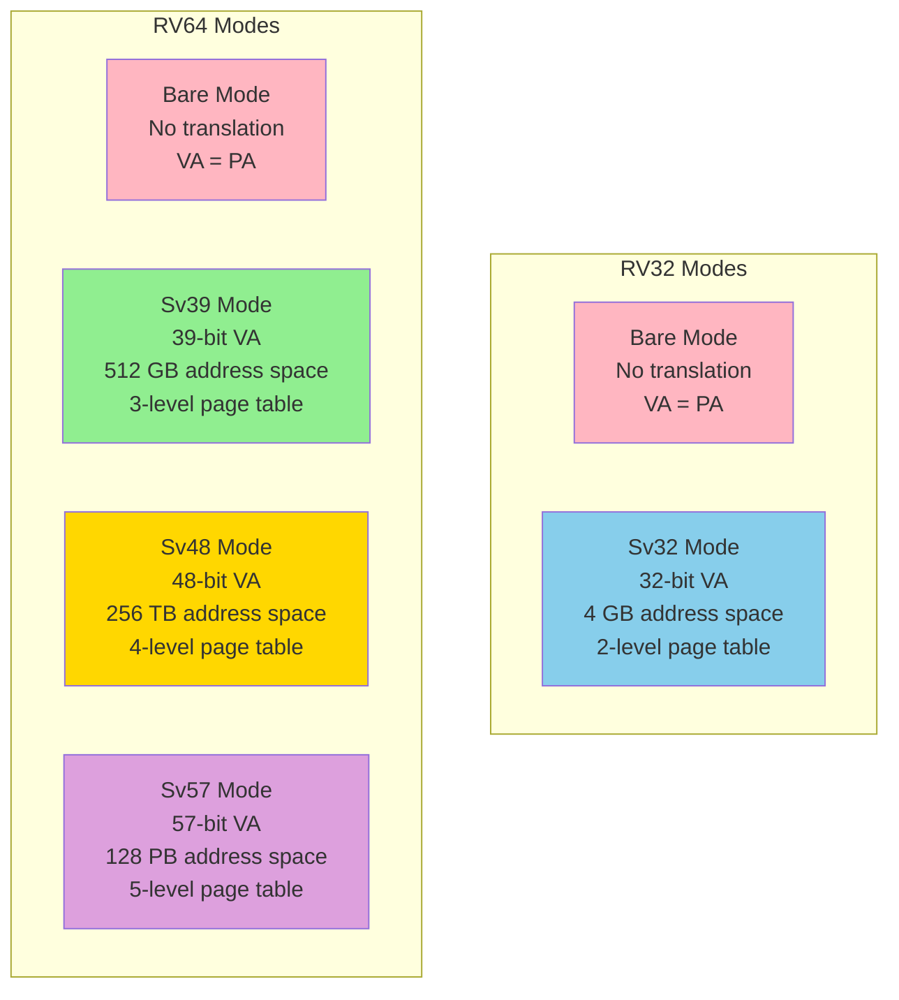
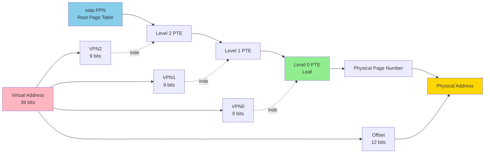

# Chapter 5. Virtual Memory & Paging (Sv39 / Sv48)

**Part IV — Memory & Addressing**

---

## 🎯 Learning Objectives

After reading this chapter, you will be able to:

1. **Understand VA to PA Translation**: Grasp how Virtual Addresses are converted to Physical Addresses via Page Tables
2. **Master Sv39 Structure**: Understand the three-level Page Table hierarchy (L2 → L1 → L0)
3. **Configure the `satp` CSR**: Calculate and set `satp` to enable the MMU
4. **Understand TLB Mechanism**: Know how TLB accelerates address translation and when to flush it
5. **Handle Page Faults**: Analyze the causes of Page Faults and understand the handling flow

---

## 💡 Scenario: The Library's Call Numbers

> **Scene**: Junior is debugging a multi-process system, staring at GDB's memory display, increasingly puzzled.

**Junior**: "Professor, I've encountered something really weird. I'm running two programs simultaneously, and when I look at their memory in GDB, both are using address `0x10000`! But the data inside is completely different. How is this possible? Is the CPU a quantum computer?"

**Professor**: (laughing) "This isn't quantum entanglement. Have you ever been to a library?"

**Junior**: "Sure, but what does a library have to do with this?"

**Professor**: "Imagine this: You're at Library Branch A, and using call number `Q123`, you find a book called 'Introduction to Quantum Mechanics.' Your friend is at Branch B, uses the same call number `Q123`, and finds 'Calculus Exercise Collection.'"

**Junior**: "Because each branch has its own shelf arrangement?"

**Professor**: "Exactly!

1. **Call Number (Virtual Address)**: The address the program sees, like a call number. Each program thinks it has an entire library to itself.
2. **Actual Shelf Location (Physical Address)**: Where the book really is.
3. **Catalog Index (Page Table)**: The lookup table that translates call numbers to actual shelf locations.
4. **Branch (Process)**: Each branch has its own catalog index."

**Junior**: "So two programs using the same virtual address, through different Page Tables, get translated to different physical addresses?"

**Professor**: "You've got it! This is the essence of **Virtual Memory**. The operating system prepares a dedicated catalog (Page Table) for each process, making each think it has exclusive use of the entire library, when in reality everyone's books are crammed into the same warehouse. The benefits are:

- **Isolation**: Program A messing up won't affect Program B.
- **Protection**: Some shelves are marked 'Staff Only'—you can't touch them without permission.
- **Flexibility**: Books can be relocated anytime—just update the catalog."

**Junior**: "So what's the `satp` CSR for?"

**Professor**: "`satp` tells the CPU: 'Use this particular catalog (Page Table), starting from this location.' When the OS switches processes, it updates `satp` to point to a different catalog."

**Junior**: "Got it! Let's try building this catalog ourselves!"

---

Virtual memory is one of the most important abstractions in modern computing. It provides memory protection, isolating processes from each other and from the operating system. It provides address space abstraction, giving each process a simple, contiguous view of memory regardless of physical layout. It enables memory overcommitment, allowing systems to run more programs than would fit in physical RAM. And it supports shared memory, enabling efficient communication and resource sharing.

RISC-V implements virtual memory through a clean, flexible paging system. Sv39 provides 39-bit virtual addresses (512 GB address space) with three-level page tables, suitable for most application processors. Sv48 extends this to 48-bit virtual addresses (256 TB address space) with four-level page tables for systems requiring larger address spaces. Both modes support superpages (2 MB and 1 GB pages) for reduced TLB pressure and efficient large mappings.

This chapter explores RISC-V's virtual memory system in detail: page table structures, address translation, TLB management, page faults, and the Physical Memory Protection (PMP) mechanism that provides memory protection even without virtual memory. Understanding these concepts is essential for operating system developers, hypervisor implementers, and anyone working with RISC-V system software.

---

## 5.1 Virtual Memory Overview

**Why Virtual Memory?**

Virtual memory is one of the most important abstractions in modern computing. It solves several fundamental problems that would otherwise make operating systems nearly impossible to build.

First, virtual memory provides *memory protection*. Without it, any program could read or write any memory location, including the operating system's code and data. A buggy program could crash the entire system. A malicious program could steal data from other programs or take control of the system. Virtual memory allows the OS to isolate each process in its own address space, preventing interference.

Second, virtual memory provides *address space abstraction*. Each process sees a simple, contiguous address space starting at address zero, regardless of where its memory is actually located in physical RAM. The process doesn't need to know—or care—that its memory might be scattered across different physical locations, or that some of it might be swapped to disk. This abstraction simplifies programming and allows the OS to manage physical memory flexibly.

Third, virtual memory enables *memory overcommitment*. The OS can give each process a large virtual address space (512 GB in Sv39, 256 TB in Sv48) even if the system has far less physical RAM. Most of that virtual space is never actually used. The OS only allocates physical memory for the pages that are actually accessed. This allows running more programs than would fit in physical memory simultaneously.

Fourth, virtual memory supports *shared memory*. Multiple processes can map the same physical memory into their virtual address spaces. This is essential for shared libraries (like libc), which would otherwise waste memory by being loaded separately for each process. It's also used for inter-process communication and memory-mapped files.

**RISC-V Virtual Memory Modes**

RISC-V defines several virtual memory modes, selected by the MODE field in the `satp` (Supervisor Address Translation and Protection) CSR:

- **Bare** (MODE=0): No address translation. Virtual addresses equal physical addresses. This is the mode used by M-mode and by systems that don't need virtual memory.

- **Sv32** (MODE=1): 32-bit virtual addressing for RV32. Provides a 4 GB virtual address space with two-level page tables. Used in 32-bit embedded systems running operating systems.

- **Sv39** (MODE=8): 39-bit virtual addressing for RV64. Provides a 512 GB virtual address space with three-level page tables. This is the most common mode for 64-bit RISC-V systems running Linux or similar operating systems.

- **Sv48** (MODE=9): 48-bit virtual addressing for RV64. Provides a 256 TB virtual address space with four-level page tables. Used in systems that need larger address spaces, such as large servers or databases.

- **Sv57** (MODE=10): 57-bit virtual addressing for RV64. Provides a 128 PB virtual address space with five-level page tables. This mode is defined but rarely implemented, as 256 TB is sufficient for nearly all current applications.

The choice of mode is a trade-off. Larger address spaces require more levels of page table lookup, which increases the cost of TLB misses. Most systems use Sv39, which provides a good balance between address space size and performance.

**The satp CSR**

The `satp` (Supervisor Address Translation and Protection) register controls virtual memory. It's a supervisor-level CSR that can only be accessed from S-mode or M-mode.

In RV64, satp has three fields:

```
 63    60 59                44 43                                0
+--------+--------------------+----------------------------------+
|  MODE  |        ASID        |               PPN                |
+--------+--------------------+----------------------------------+
```

- **MODE** (bits 63:60): Selects the address translation mode (0=Bare, 8=Sv39, 9=Sv48, 10=Sv57)
- **ASID** (bits 59:44): Address Space Identifier, a 16-bit tag used to distinguish TLB entries from different processes
- **PPN** (bits 43:0): Physical Page Number of the root page table

To enable virtual memory, the OS:

1. Allocates a page table in physical memory
2. Initializes the page table entries
3. Writes satp with MODE=8 (for Sv39) or MODE=9 (for Sv48) and the physical address of the root page table
4. Executes SFENCE.VMA to flush the TLB

After this, all memory accesses from S-mode and U-mode go through address translation.

**Address Space Identifiers (ASIDs)**

The ASID field in satp is an optimization. When the OS switches between processes, it must change satp to point to the new process's page table. This would normally require flushing the entire TLB, since TLB entries from the old process are no longer valid.

ASIDs avoid this cost. Each TLB entry is tagged with the ASID from satp when it was created. When looking up a TLB entry, the hardware checks that the ASID matches. This allows TLB entries from multiple processes to coexist. When switching processes, the OS just changes satp (including the ASID), and the TLB automatically filters entries.

If the OS runs out of ASIDs (there are only 2^16 = 65536 possible values), it can flush the TLB and reuse ASIDs. But in practice, 65536 is enough for most workloads.

**TLB Management**

The Translation Lookaside Buffer (TLB) caches recent address translations. Without the TLB, every memory access would require walking the page table, which could take several memory accesses. The TLB makes virtual memory practical by caching translations.

RISC-V doesn't specify the TLB implementation—it's a microarchitectural detail. But it does provide instructions for managing the TLB:

- **SFENCE.VMA**: Fence for virtual memory. This instruction orders memory accesses and TLB updates. It's used after modifying page tables to ensure the TLB is consistent.

SFENCE.VMA can take two optional arguments:

- `rs1`: If non-zero, only flush TLB entries for the virtual address in rs1
- `rs2`: If non-zero, only flush TLB entries for the ASID in rs2

If both are zero, the entire TLB is flushed. If only rs1 is non-zero, only entries for that virtual address are flushed (across all ASIDs). If only rs2 is non-zero, only entries for that ASID are flushed.

This flexibility allows the OS to minimize TLB flushes. For example, when unmapping a single page, the OS can flush just that page's TLB entry instead of the entire TLB.

**Figure 5.1: RISC-V Virtual Memory Modes**



---

## 5.2 Sv39: 39-bit Virtual Address Space

**Sv39 Overview**

Sv39 is the most widely used virtual memory mode for 64-bit RISC-V systems. It provides a 512 GB virtual address space, which is sufficient for most applications while keeping page table walks reasonably fast.

The "39" in Sv39 refers to the number of bits in the virtual address. A 39-bit address can represent 2^39 = 512 GB of address space. This might seem small compared to the 64-bit registers in RV64, but it's a practical choice. Most programs don't need more than 512 GB of virtual memory, and using fewer bits means fewer levels of page table lookup.

**Sv39 Address Format**

An Sv39 virtual address is divided into four parts:

```
 63        39 38    30 29    21 20    12 11           0
+------------+--------+--------+--------+--------------+
|  Reserved  | VPN[2] | VPN[1] | VPN[0] | Page Offset  |
+------------+--------+--------+--------+--------------+
     25 bits   9 bits   9 bits   9 bits    12 bits
```

- **Reserved** (bits 63:39): Must be equal to bit 38 (sign extension). This ensures that valid addresses are either in the lower half (0x0000_0000_0000_0000 to 0x0000_003F_FFFF_FFFF) or the upper half (0xFFFF_FFC0_0000_0000 to 0xFFFF_FFFF_FFFF_FFFF) of the 64-bit address space. Addresses that don't follow this rule cause a page fault.

- **VPN[2]** (bits 38:30): Virtual Page Number, level 2. This is the index into the root page table.

- **VPN[1]** (bits 29:21): Virtual Page Number, level 1. This is the index into the second-level page table.

- **VPN[0]** (bits 20:12): Virtual Page Number, level 0. This is the index into the third-level (leaf) page table.

- **Page Offset** (bits 11:0): Offset within the 4 KB page. This is not translated—it's copied directly to the physical address.

Each VPN field is 9 bits, which means each page table has 2^9 = 512 entries. The page offset is 12 bits, which means pages are 2^12 = 4096 bytes (4 KB).

**Three-Level Page Table Walk**

Address translation in Sv39 involves walking a three-level page table. Here's the algorithm:

1. Start with the root page table. Its physical address is in satp.PPN.

2. Use VPN[2] as an index into the root page table. Read the Page Table Entry (PTE) at that index.

3. If the PTE is invalid (V=0) or has invalid permissions, raise a page fault.

4. If the PTE is a leaf (R=1, W=1, or X=1), the translation is complete. The PTE contains the physical page number. Go to step 8.

5. Otherwise, the PTE points to the next level page table. Use VPN[1] as an index into that page table. Read the PTE at that index.

6. If the PTE is invalid or has invalid permissions, raise a page fault.

7. If the PTE is a leaf, the translation is complete. Otherwise, use VPN[0] as an index into the third-level page table. Read the PTE at that index. This must be a leaf.

8. Combine the physical page number from the PTE with the page offset from the virtual address to form the physical address.

This process can require up to three memory accesses (one per level). That's why the TLB is so important—it caches the result, avoiding the page table walk for subsequent accesses to the same page.

**Page Table Entry (PTE) Format**

Each PTE in Sv39 is 64 bits:

```
 63      54 53        28 27        19 18        10 9  8 7 6 5 4 3 2 1 0
+----------+------------+------------+------------+-----+-+-+-+-+-+-+-+-+
| Reserved |   PPN[2]   |   PPN[1]   |   PPN[0]   | RSW |D|A|G|U|X|W|R|V|
+----------+------------+------------+------------+-----+-+-+-+-+-+-+-+-+
  10 bits     26 bits      9 bits       9 bits    2 bits  8 flag bits
```

- **Reserved** (bits 63:54): Reserved for future use. Must be zero.

- **PPN[2:0]** (bits 53:10): Physical Page Number. For a leaf PTE, this is the physical page number of the mapped page. For a non-leaf PTE, this is the physical page number of the next-level page table.

- **RSW** (bits 9:8): Reserved for Software. The hardware ignores these bits. The OS can use them for any purpose (e.g., tracking page state).

- **D** (bit 7): Dirty. Set by hardware when the page is written. Used by the OS to track which pages need to be written back to disk.

- **A** (bit 6): Accessed. Set by hardware when the page is read or written. Used by the OS for page replacement algorithms.

- **G** (bit 5): Global. If set, this mapping is global and not associated with any ASID. Global mappings are never flushed by ASID-specific SFENCE.VMA.

- **U** (bit 4): User. If set, this page is accessible from U-mode. If clear, the page is only accessible from S-mode.

- **X** (bit 3): Execute. If set, the page can be executed.

- **W** (bit 2): Write. If set, the page can be written.

- **R** (bit 1): Read. If set, the page can be read.

- **V** (bit 0): Valid. If clear, the PTE is invalid and any access causes a page fault.

**PTE Flags and Permissions**

The R, W, X, and U flags control access permissions. The hardware checks these flags during address translation:

- If V=0, the PTE is invalid. Page fault.
- If R=0 and W=1, the PTE is invalid (write-only pages are reserved). Page fault.
- If R=1, W=1, or X=1, the PTE is a leaf. The physical page number is in PPN[2:0].
- If R=0, W=0, and X=0, the PTE is a pointer to the next level. The physical page number of the next-level page table is in PPN[2:0].

For leaf PTEs, the permissions are checked:

- If the access is a read and R=0, page fault.
- If the access is a write and W=0, page fault.
- If the access is an instruction fetch and X=0, page fault.
- If the access is from U-mode and U=0, page fault.

The A and D bits are set by hardware when the page is accessed or modified. The OS can clear these bits and use them to implement page replacement algorithms (e.g., LRU).

**Superpages**

Sv39 supports *superpages*—large pages that are multiples of the base 4 KB page size. A superpage is created by making a PTE at level 1 or level 2 a leaf (by setting R, W, or X).

- A level 1 leaf PTE creates a 2 MB superpage (2^21 bytes). VPN[0] is not used; instead, bits 20:12 of the virtual address become part of the page offset.

- A level 2 leaf PTE creates a 1 GB superpage (2^30 bytes). VPN[1] and VPN[0] are not used; instead, bits 29:12 of the virtual address become part of the page offset.

Superpages reduce TLB pressure by covering more memory with fewer TLB entries. They're commonly used for large allocations like the kernel's direct map of physical memory, or for large application heaps.

For a superpage PTE to be valid, the PPN must be properly aligned. For a 2 MB superpage, PPN[0] must be zero. For a 1 GB superpage, PPN[1:0] must be zero. If the alignment is incorrect, the PTE is considered invalid.

**Figure 5.2: Sv39 Address Translation**



---

## 5.3 Sv48: 48-bit Virtual Address Space

**Sv48 Overview**

Sv48 extends Sv39 by adding one more level to the page table, increasing the virtual address space from 512 GB to 256 TB. This is useful for very large applications, such as databases that manage terabytes of data, or for systems that need to map large amounts of physical memory.

The trade-off is performance. Each additional level of page table adds one more memory access to the page table walk. For workloads with poor TLB hit rates, this can noticeably impact performance. Most systems use Sv39 unless they specifically need the larger address space.

**Sv48 Address Format**

An Sv48 virtual address has 48 bits of address and 16 bits of sign extension:

```
 63        48 47    39 38    30 29    21 20    12 11           0
+------------+--------+--------+--------+--------+--------------+
|  Reserved  | VPN[3] | VPN[2] | VPN[1] | VPN[0] | Page Offset  |
+------------+--------+--------+--------+--------+--------------+
    16 bits    9 bits   9 bits   9 bits   9 bits    12 bits
```

The structure is similar to Sv39, but with an additional VPN[3] field for the fourth level of page table.

**Four-Level Page Table Walk**

The page table walk in Sv48 is similar to Sv39, but with an extra level:

1. Start with the root page table at satp.PPN
2. Use VPN[3] to index into the root page table
3. If the PTE is a leaf, translation is complete
4. Otherwise, use VPN[2] to index into the level 2 page table
5. If the PTE is a leaf, translation is complete
6. Otherwise, use VPN[1] to index into the level 1 page table
7. If the PTE is a leaf, translation is complete
8. Otherwise, use VPN[0] to index into the level 0 page table
9. This must be a leaf PTE
10. Combine the PPN from the PTE with the page offset to form the physical address

**Sv48 Superpages**

Sv48 supports the same superpages as Sv39, plus one additional size:

- **4 KB**: Level 0 leaf (base page size)
- **2 MB**: Level 1 leaf (2^21 bytes)
- **1 GB**: Level 2 leaf (2^30 bytes)
- **512 GB**: Level 3 leaf (2^39 bytes)

The 512 GB superpage is enormous—it's the entire address space of Sv39! Such large pages are rarely used, but they could be useful for mapping very large regions of physical memory with minimal TLB overhead.

**Sv48 vs Sv39 Trade-offs**

Choosing between Sv39 and Sv48 involves several considerations:

*Address Space*:

- Sv39: 512 GB (sufficient for most applications)
- Sv48: 256 TB (needed for very large databases, in-memory computing)

*Page Table Walk Cost*:

- Sv39: Up to 3 memory accesses
- Sv48: Up to 4 memory accesses
- Impact depends on TLB hit rate

*Memory Overhead*:

- Sv48 requires more page table memory for sparse address spaces
- Each additional level adds 4 KB per 512 GB of virtual address space

*Compatibility*:

- Sv39 is more widely supported
- Sv48 may not be implemented on all RISC-V processors

For most systems, Sv39 is the right choice. Sv48 should be used only when the larger address space is genuinely needed.

---

## 5.4 Page Faults and Exception Handling

**Page Fault Types**

RISC-V defines three types of page faults, distinguished by the type of access that caused the fault:

- **Instruction Page Fault** (exception code 12): Occurs when fetching an instruction from a page that is not mapped, not executable, or not accessible at the current privilege level.

- **Load Page Fault** (exception code 13): Occurs when loading from a page that is not mapped, not readable, or not accessible at the current privilege level.

- **Store/AMO Page Fault** (exception code 15): Occurs when storing to a page that is not mapped, not writable, or not accessible at the current privilege level.

When a page fault occurs, the processor:

1. Sets `scause` to the exception code (12, 13, or 15)
2. Sets `sepc` to the PC of the faulting instruction
3. Sets `stval` to the faulting virtual address
4. Traps to S-mode (or M-mode if not delegated)

The OS page fault handler examines `stval` to determine which page caused the fault, then decides how to handle it.

**Page Fault Handling**

The OS can handle page faults in several ways:

*Demand Paging*: The page is valid but not currently in physical memory. The OS:

1. Allocates a physical page
2. Loads the page contents from disk (if it was swapped out) or zeros it (if it's a new page)
3. Updates the page table to map the virtual page to the physical page
4. Executes SFENCE.VMA to flush the TLB
5. Returns with SRET, which re-executes the faulting instruction

*Copy-on-Write*: The page is mapped read-only, but the process tries to write to it. This is used for fork() optimization. The OS:

1. Allocates a new physical page
2. Copies the contents from the old page to the new page
3. Updates the page table to map the virtual page to the new page with write permission
4. Executes SFENCE.VMA
5. Returns with SRET

*Invalid Access*: The page is not mapped and should not be. The OS:

1. Sends a SIGSEGV signal to the process (on Unix-like systems)
2. The process typically terminates with a segmentation fault

The key is that `sepc` points to the faulting instruction, so returning from the trap re-executes it. This is essential for demand paging and copy-on-write to work correctly.

---

## 🛠️ Hands-on Lab: Lab 5.1 — Putting on Magic Glasses (Enable Paging)

This lab guides you through building the simplest Page Table: Identity Mapping (Virtual Address = Physical Address), and enabling the MMU.

### Lab Objectives

1. Understand Sv39's Page Table Entry (PTE) structure
2. Build an Identity Mapping Page Table
3. Configure the `satp` CSR and enable the MMU
4. Understand the role of `sfence.vma`

### Concept Explanation

In Sv39 mode, the Page Table has three levels:

```
Virtual Address (39-bit):
+--------+--------+--------+------------+
| VPN[2] | VPN[1] | VPN[0] |   Offset   |
|  9-bit |  9-bit |  9-bit |   12-bit   |
+--------+--------+--------+------------+

Page Table Walk:
  satp.PPN → Level 2 Table → Level 1 Table → Level 0 Table → Physical Page
```

Each Page Table Entry (PTE) is 64-bit:

```
PTE Format:
+-----------------------------------------------+-------+
|             PPN (44-bit)                      | Flags |
|                                               | RWXUG |
+-----------------------------------------------+-------+
  63                                    10  9       0

Flags:
  V (Valid)     - bit 0: Entry is valid
  R (Read)      - bit 1: Readable
  W (Write)     - bit 2: Writable
  X (Execute)   - bit 3: Executable
  U (User)      - bit 4: User mode accessible
  G (Global)    - bit 5: Global mapping
  A (Accessed)  - bit 6: Has been accessed
  D (Dirty)     - bit 7: Has been written
```

### Code

Create `lab5_paging.c`:

```c
// lab5_paging.c - Minimal Identity Mapping Demo
#include <stdint.h>

// PTE Flag Definitions
#define PTE_V   (1 << 0)  // Valid
#define PTE_R   (1 << 1)  // Read
#define PTE_W   (1 << 2)  // Write
#define PTE_X   (1 << 3)  // Execute
#define PTE_U   (1 << 4)  // User
#define PTE_A   (1 << 6)  // Accessed
#define PTE_D   (1 << 7)  // Dirty

// Sv39: 512 entries per page table (9-bit index)
#define PAGE_SIZE     4096
#define PTE_PER_PAGE  512

// Page Table (must be 4KB aligned)
__attribute__((aligned(PAGE_SIZE)))
uint64_t root_page_table[PTE_PER_PAGE];

// Simplified: We use 1GB Gigapages for Identity Mapping
// VPN[2] = 0 → PA 0x0000_0000 ~ 0x3FFF_FFFF (1GB)
// VPN[2] = 1 → PA 0x4000_0000 ~ 0x7FFF_FFFF (1GB)

void setup_identity_mapping(void) {
    // Clear Page Table
    for (int i = 0; i < PTE_PER_PAGE; i++) {
        root_page_table[i] = 0;
    }

    // Create Identity Mapping (first 4GB, using 1GB gigapages)
    // This is a Leaf PTE: RWX bits are set, meaning this is the final mapping
    for (int i = 0; i < 4; i++) {
        uint64_t pa = (uint64_t)i << 30;  // Each entry maps 1GB
        uint64_t ppn = pa >> 12;          // PPN = PA >> 12
        root_page_table[i] = (ppn << 10) | PTE_V | PTE_R | PTE_W | PTE_X | PTE_A | PTE_D;
    }
}

void enable_paging(void) {
    uint64_t root_ppn = ((uint64_t)root_page_table) >> 12;

    // satp format: MODE (4-bit) | ASID (16-bit) | PPN (44-bit)
    // MODE = 8 (Sv39)
    uint64_t satp_val = (8ULL << 60) | root_ppn;

    // Set satp
    asm volatile("csrw satp, %0" : : "r"(satp_val));

    // Flush TLB - CRITICAL!
    asm volatile("sfence.vma");
}

int main(void) {
    setup_identity_mapping();
    enable_paging();

    // If we reach here, paging is working!
    // The program continues to run because VA == PA
    return 0;
}
```

### Compile and Run

```bash
# Compile (for bare-metal S-mode)
riscv64-unknown-elf-gcc -march=rv64gc -mabi=lp64d -nostdlib \
    -T linker.ld -o lab5_paging lab5_paging.c startup.S

# Run with QEMU
qemu-system-riscv64 -machine virt -nographic -bios none -kernel lab5_paging
```

### What You Just Did

You've accomplished the fundamental MMU setup:

1. **Built a Page Table**: Created entries that map VA to the same PA
2. **Configured satp**: Told the CPU where the Page Table is and which mode to use
3. **Flushed TLB**: Ensured the CPU uses the new mappings

> **danieRTOS Reference**: The memory management in danieRTOS uses similar identity mapping for kernel space, with separate per-task mappings for user space.

### Paper Exercise: Address Translation Drill

Given an Sv39 Virtual Address: `0x0000_0040_1234_5678`

Manually extract:

1. **VPN[2]** = bits 38-30 = ?
2. **VPN[1]** = bits 29-21 = ?
3. **VPN[0]** = bits 20-12 = ?
4. **Offset** = bits 11-0 = ?

<details>
<summary>Click to reveal answer</summary>

```
VA = 0x0000_0040_1234_5678
   = 0b 0000...0001 000000001 000100011 010001010110 01111000

VPN[2] = bits 38-30 = 0x001 = 1
VPN[1] = bits 29-21 = 0x009 = 9
VPN[0] = bits 20-12 = 0x234 = 564
Offset = bits 11-0  = 0x678 = 1656
```

**Translation Process**:
1. From `satp.PPN`, find the Root Table (Level 2)
2. Use VPN[2]=1 as index, find Level 1 Table's PPN
3. Use VPN[1]=9 as index, find Level 0 Table's PPN
4. Use VPN[0]=564 as index, find the final Physical Page's PPN
5. Physical Address = (PPN << 12) | Offset

</details>

---

## ⚠️ Common Pitfalls

### Pitfall 1: Page Table Not Aligned

**Error Scenario**: Page Table is not 4KB aligned, causing `satp` to compute an incorrect PPN.

```c
// ❌ Wrong: Not aligned
uint64_t page_table[512];  // May not be 4KB aligned!

// ✅ Correct: Force 4KB alignment
__attribute__((aligned(4096)))
uint64_t page_table[512];
```

### Pitfall 2: Forgetting to Flush TLB

**Error Scenario**: Modified the Page Table but didn't execute `sfence.vma`, causing the CPU to continue using stale TLB cache.

```c
// ❌ Wrong: Forgot to flush after modification
page_table[index] = new_pte;
// CPU may still use old mapping!

// ✅ Correct: Flush TLB after modification
page_table[index] = new_pte;
asm volatile("sfence.vma");  // Tell CPU: Page Table changed, clear cache
```

### Pitfall 3: Confusing Leaf PTE with Non-Leaf PTE

**Error Scenario**: Setting RWX bits on an intermediate level, accidentally creating a gigapage mapping.

```c
// PTE type determination rules:
// - RWX all 0: Non-Leaf (points to next level Page Table)
// - RWX at least one is 1: Leaf (final mapping)

// ❌ Wrong: Level 2 PTE has R bit set, becomes 1GB gigapage!
level2_pte = (next_table_ppn << 10) | PTE_V | PTE_R;  // Accidentally becomes Leaf

// ✅ Correct: Non-Leaf PTE only sets V bit
level2_pte = (next_table_ppn << 10) | PTE_V;  // Correct Non-Leaf
```

---

## Summary

RISC-V's virtual memory system provides memory protection, address space abstraction, and flexible memory management through a clean paging mechanism. The `satp` CSR controls address translation, selecting the translation mode (Bare, Sv32, Sv39, Sv48), specifying the Address Space Identifier (ASID) for TLB tagging, and pointing to the root page table.

Sv39 provides 39-bit virtual addresses with a 512 GB address space, using three-level page tables. Each level has 512 entries indexed by 9-bit VPN fields. Page Table Entries (PTEs) are 64 bits, containing a 44-bit physical page number and 8 flag bits (V, R, W, X, U, G, A, D). Leaf PTEs at level 0 map 4 KB pages. Leaf PTEs at higher levels create superpages: 2 MB at level 1, 1 GB at level 2.

Sv48 extends this to 48-bit virtual addresses with a 256 TB address space, using four-level page tables. The additional level provides more address space at the cost of one extra memory access per translation. Sv48 is needed for large databases, scientific computing, and systems requiring very large address spaces.

The Translation Lookaside Buffer (TLB) caches recent address translations, avoiding expensive page table walks. TLB entries are tagged with ASID to distinguish different address spaces. The SFENCE.VMA instruction flushes TLB entries, with optional parameters to flush specific virtual addresses or ASIDs. Efficient TLB management is critical for performance—unnecessary flushes cause expensive page table walks.

Page faults occur when the hardware cannot complete a translation: invalid PTEs (V=0), permission violations (accessing a page without R/W/X permission), or privilege violations (U-mode accessing a non-U page). The OS page fault handler can implement demand paging (allocate and load pages on first access), copy-on-write (share pages until written), and memory-mapped files (map file contents into address space).

Physical Memory Protection (PMP) provides memory protection without virtual memory, essential for embedded systems and M-mode firmware. PMP uses CSRs (pmpcfg0-15, pmpaddr0-63) to define up to 64 memory regions with access permissions (R, W, X) and address matching modes (OFF, TOR, NA4, NAPOT). PMP checks occur in parallel with virtual memory translation, protecting against both user programs and S-mode OS bugs.

Compared to ARM's translation system, RISC-V's is simpler and more regular. ARM uses complex descriptor formats with multiple page sizes and attributes. RISC-V uses a single PTE format with clean flag bits. ARM's ASID is 16 bits; RISC-V's is 16 bits in Sv39 and 9 bits in Sv48. Both support superpages, but RISC-V's approach is more uniform—any level can be a leaf.

RISC-V's virtual memory design reflects its philosophy: provide a clean, minimal mechanism that's easy to implement and understand, while supporting the features needed for modern operating systems. The result is a system that's simpler than ARM's but equally capable for most applications.
