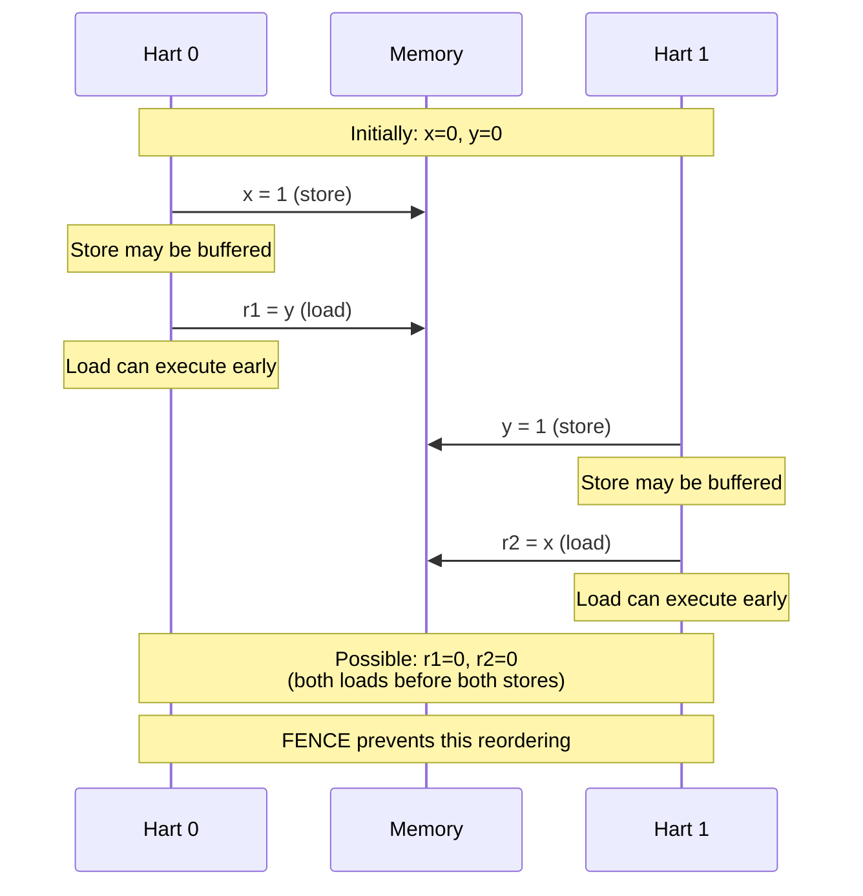
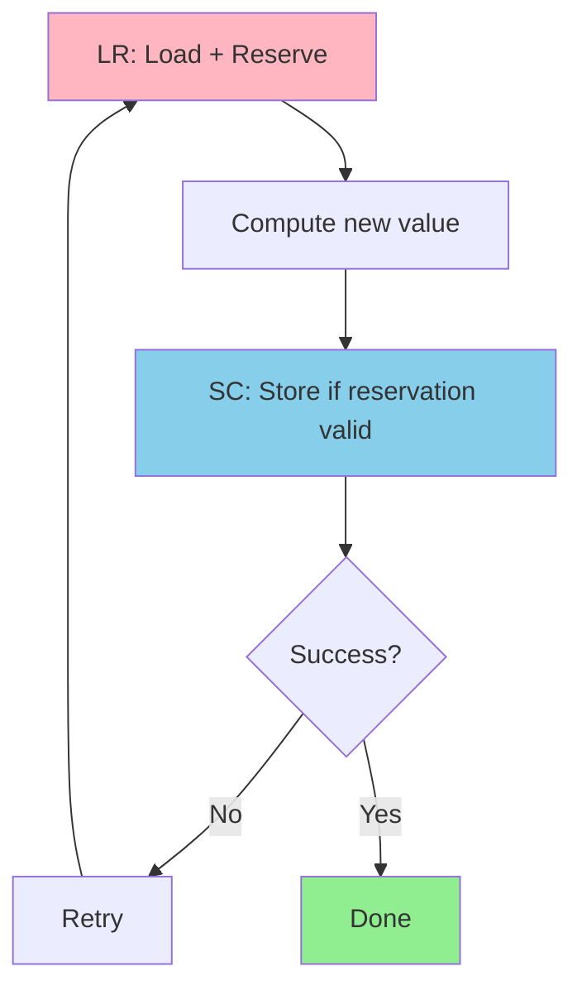
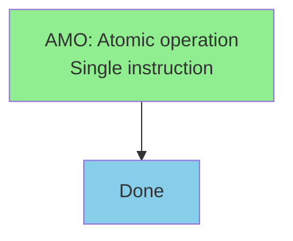
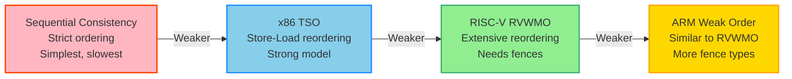

# Chapter 6. Memory Ordering & Synchronization

**Part IV — Memory & Addressing**

---

## 🎯 Learning Objectives

After reading this chapter, you will be able to:

1. **Understand Out-of-Order Execution**: Know why CPUs reorder memory accesses
2. **Master RVWMO**: Understand the basic rules of RISC-V Weak Memory Ordering
3. **Use Fence Instructions**: Know when to use `fence` to enforce ordering
4. **Implement a Spinlock**: Use `amoswap` or `lr/sc` to build a mutex lock
5. **Avoid Data Races**: Identify and fix race conditions in multi-core programs

---

## 💡 Scenario: Shipping Logic at the Distribution Center

> **Scene**: Junior wrote a dual-core program where Core 0 writes data and Core 1 reads it, but the results are always scrambled.

**Junior**: "Senior, I'm losing my mind! My program logic is correct, but the output looks like random numbers."

**Senior**: "Show me the code."

**Junior**: (showing screen)

```c
// Core 0                    // Core 1
data = 42;                   while (flag == 0) {}
flag = 1;                    print(data);  // Expected: 42
```

"By logic, Core 1 should wait until `flag` becomes 1 before printing `data`, and by then `data` should already be 42, right? But sometimes it prints 0!"

**Senior**: "You're imagining the CPU as too honest. Modern CPUs are like distribution center managers—for efficiency, they'll 'secretly reorder shipments.'"

**Junior**: "What do you mean?"

**Senior**: "Imagine you're a logistics manager. You have two packages to ship:

1. Package A: Ship to Taipei (far)
2. Package B: Ship to Hsinchu (near)

Which do you ship first?"

**Junior**: "The Hsinchu one—it's faster anyway."

**Senior**: "Bingo! The CPU thinks the same way. It sees `data = 42` and `flag = 1` as two stores. It notices `flag`'s address is already in cache while `data` has to wait for memory, so it writes `flag` first."

**Junior**: "So Core 1 sees `flag == 1`, but `data` hasn't been written yet?"

**Senior**: "Exactly. This is **Memory Reordering**. The fix is to use a **Fence** instruction to tell the CPU: 'No cutting in line! All preceding stores must complete before executing subsequent stores.'"

```c
// Core 0 (fixed version)
data = 42;
__sync_synchronize();  // Compiles to: fence iorw, iorw
flag = 1;
```

**Junior**: "I see! What about `amoswap` and those atomic instructions?"

**Senior**: "That's a different problem: 'How do you ensure two people don't enter the bathroom at the same time?' That's what Spinlock solves."

---

Modern processors execute instructions out of order, reorder memory accesses, and use caches that can delay when writes become visible to other processors. These optimizations are essential for performance, but they create a fundamental problem: what does a program actually mean when multiple processors access shared memory? Without careful synchronization, programs can observe impossible behaviors where effects appear to happen in the wrong order.

RISC-V addresses this through a memory consistency model that defines which memory access orderings are legal, and synchronization primitives that enforce ordering when needed. The RISC-V Weak Memory Ordering (RVWMO) model allows aggressive reordering for performance while providing fence instructions and atomic operations to enforce ordering where required. Understanding memory ordering is essential for anyone writing concurrent code, implementing synchronization primitives, or optimizing multi-threaded applications.

This chapter explores RISC-V's memory model in detail: the RVWMO consistency model, fence instructions for enforcing ordering, atomic instructions for lock-free synchronization, the Total Store Ordering (RVTSO) extension for stronger ordering, and comparisons with ARM's and x86's memory models. We'll see how to implement locks, barriers, and lock-free data structures correctly on RISC-V.

---

## 6.1 Memory Consistency Models

**The Memory Ordering Problem**

Modern processors don't execute instructions in the order they appear in the program. They reorder loads and stores, execute instructions out of order, and use store buffers and caches that can delay when writes become visible to other processors. These optimizations are essential for performance, but they create a problem: what does a program actually *mean* when multiple processors are accessing shared memory?

Consider this simple example with two processors:

```
Processor 0:          Processor 1:
x = 1                 y = 1
r1 = y                r2 = x
```

Initially, `x = 0` and `y = 0`. After both processors execute, what are the possible values of `r1` and `r2`?

In a sequentially consistent system, there are three possible outcomes:

- `r1 = 0, r2 = 1` (P0 executes first)
- `r1 = 1, r2 = 0` (P1 executes first)
- `r1 = 1, r2 = 1` (stores happen before loads)

But in a weakly ordered system like RISC-V, there's a fourth possibility:

- `r1 = 0, r2 = 0` (both loads execute before both stores become visible)

This happens because each processor can reorder its own store after its load. The store to `x` might sit in P0's store buffer while P0 executes the load from `y`. Similarly for P1. Both loads see the old values (0), even though both stores eventually complete.

This behavior is surprising and can lead to bugs if programmers aren't careful. But it's also essential for performance. Forcing sequential consistency would require stalling the processor on every memory operation, which would be unacceptably slow.

**Sequential Consistency (SC)**

Sequential consistency is the simplest and most intuitive memory model. It was defined by Leslie Lamport in 1979: "the result of any execution is the same as if the operations of all processors were executed in some sequential order, and the operations of each individual processor appear in this sequence in the order specified by its program."

In other words:

1. All memory operations appear to execute in some total order
2. Each processor's operations appear in program order within that total order

SC is easy to reason about—programs behave as if they execute one instruction at a time, in order. But SC is also restrictive. It prohibits many optimizations:

- Store buffers (stores must be visible immediately)
- Out-of-order execution of loads
- Speculative loads
- Non-blocking caches

Modern processors don't implement SC because the performance cost is too high.

**Weak Memory Models**

Weak memory models relax the ordering requirements to allow more optimization. They permit reordering of memory operations, with explicit synchronization instructions (like fences) to enforce ordering when needed.

The key insight is that most memory operations don't need strict ordering. If a thread is computing on local data, it doesn't matter if loads and stores are reordered—no other thread can observe the difference. Ordering only matters at synchronization points: when acquiring a lock, releasing a lock, or communicating between threads.

Weak memory models make these synchronization points explicit. The programmer (or compiler) inserts fence instructions or uses atomic operations with ordering semantics to enforce the necessary ordering. Between synchronization points, the hardware is free to reorder operations for performance.

**RISC-V Weak Memory Ordering (RVWMO)**

RISC-V uses a weak memory model called RVWMO (RISC-V Weak Memory Ordering). It's similar to the memory models of ARM and Power, but with a formal specification that precisely defines what behaviors are allowed.

RVWMO allows extensive reordering:

- Loads can be reordered with other loads
- Stores can be reordered with other stores  
- Loads can be reordered with stores
- Stores can be reordered with loads

The only operations that are *not* reordered are those with explicit dependencies or those separated by fence instructions.

This might sound chaotic, but in practice, most programs don't need to worry about it. Single-threaded programs behave as expected (the processor preserves the illusion of sequential execution within a thread). Multithreaded programs use locks, atomics, and other synchronization primitives that include the necessary fences.

RVWMO strikes a balance: it's weak enough to allow aggressive optimization, but strong enough to support efficient synchronization primitives.

---

## 6.2 RISC-V Memory Model (RVWMO)

**Program Order vs Memory Order**

To understand RVWMO, we need to distinguish two concepts:

*Program order* is the order in which instructions appear in the program. If instruction A appears before instruction B in the program, we say A precedes B in program order.

*Memory order* is the order in which memory operations become visible to other harts (RISC-V's term for hardware threads). This is the order that other harts observe when they read from memory.

In a sequentially consistent system, memory order equals program order. In RVWMO, memory order can differ from program order due to reordering.

**Load and Store Ordering Rules**

RVWMO allows the following reorderings:

1. **Load → Load**: A load can be reordered before an earlier load (unless they have a dependency or are separated by a fence)

2. **Load → Store**: A load can be reordered before an earlier store (unless they have a dependency or are separated by a fence)

3. **Store → Store**: A store can be reordered before an earlier store (unless they overlap in address or are separated by a fence)

4. **Store → Load**: A store can be reordered before an earlier load (unless they overlap in address or are separated by a fence)

The key exceptions are:

- Operations to overlapping addresses are not reordered
- Operations separated by a FENCE instruction are not reordered
- Operations with syntactic dependencies are not reordered

**Preserved Program Order (PPO)**

Not all program order is lost. RVWMO defines *Preserved Program Order* (PPO)—the subset of program order that is guaranteed to be respected in memory order.

PPO includes:

1. **Overlapping addresses**: If two memory operations access overlapping addresses, they are not reordered. For example, a store to address X followed by a load from address X will execute in order.

2. **Explicit synchronization**: Operations separated by a FENCE instruction maintain their order.

3. **Acquire/Release**: Atomic operations with `.aq` (acquire) or `.rl` (release) suffixes enforce ordering.

4. **Syntactic dependencies**: If a later instruction uses the result of an earlier instruction, they execute in order. For example:

   ```assembly
   ld a0, 0(a1)      # Load from address in a1
   ld a2, 0(a0)      # Load from address in a0 (depends on first load)
   ```

   The second load depends on the first, so they cannot be reordered.

5. **Control dependencies**: If a later instruction is control-dependent on an earlier instruction (e.g., after a branch), certain orderings are preserved.

PPO is the foundation of RVWMO. It defines the minimum ordering that the hardware must respect. Everything else can be reordered.

**Global Memory Order**

RVWMO requires that there exists a *global memory order*—a total order of all memory operations across all harts that is consistent with each hart's PPO.

This doesn't mean operations actually execute in this order. It means that the observable effects must be *consistent* with some such order. The hardware can reorder, buffer, and cache operations as long as the final result looks like they executed in some valid global order.

This property is called *multi-copy atomicity*. When a store becomes visible to one hart, it becomes visible to all harts at the same point in the global memory order. There's no state where hart A sees a store but hart B doesn't (assuming both are reading the same address).

Multi-copy atomicity simplifies reasoning about concurrent programs. It means you don't have to worry about stores propagating at different rates to different harts.

**Figure 6.1: Memory Ordering Example**



---

## 6.3 Memory Ordering Instructions

**The FENCE Instruction**

The FENCE instruction enforces ordering between memory operations. It prevents reordering of operations before the fence with operations after the fence.

The basic syntax is:

```assembly
fence pred, succ
```

Where `pred` (predecessor) and `succ` (successor) specify which types of operations are ordered:

- `r`: Reads (loads)
- `w`: Writes (stores)
- `rw`: Both reads and writes

Common fence variants:

**FENCE rw, rw** (full fence):

```assembly
fence rw, rw
```

Orders all memory operations before the fence with all memory operations after the fence. This is the strongest fence—it prevents all reordering across the fence.

**FENCE w, w** (store-store fence):

```assembly
fence w, w
```

Orders stores before the fence with stores after the fence. Loads can still be reordered. This is useful for ensuring that a sequence of stores becomes visible in order.

**FENCE r, r** (load-load fence):

```assembly
fence r, r
```

Orders loads before the fence with loads after the fence. Stores can still be reordered.

**FENCE r, rw** (acquire fence):

```assembly
fence r, rw
```

Orders loads before the fence with all operations after the fence. This is used for acquire semantics (e.g., after acquiring a lock).

**FENCE rw, w** (release fence):

```assembly
fence rw, w
```

Orders all operations before the fence with stores after the fence. This is used for release semantics (e.g., before releasing a lock).

**Example: Message Passing**

Consider a classic message-passing pattern:

```assembly
# Producer (Hart 0)
    sw a0, 0(s0)      # Write data
    fence w, w        # Ensure data is written before flag
    sw a1, 0(s1)      # Write flag

# Consumer (Hart 1)
loop:
    lw t0, 0(s1)      # Read flag
    beqz t0, loop     # Wait for flag
    fence r, r        # Ensure flag is read before data
    lw t1, 0(s0)      # Read data
```

The producer writes data, then sets a flag. The consumer waits for the flag, then reads the data. The fences ensure that:

1. The data write happens before the flag write (producer)
2. The flag read happens before the data read (consumer)

Without the fences, the hardware could reorder the operations, and the consumer might read stale data.

**FENCE.I: Instruction Fence**

FENCE.I synchronizes the instruction and data streams. It ensures that all previous stores to instruction memory are visible to subsequent instruction fetches.

This is needed for:

- **Self-modifying code**: If a program writes new instructions to memory, FENCE.I ensures those instructions are fetched correctly.
- **JIT compilation**: A JIT compiler generates code at runtime. After writing the code to memory, it executes FENCE.I before jumping to the new code.
- **Dynamic linking**: Loading a shared library involves writing code to memory.

Example:

```assembly
    # Write new instruction to memory
    sw a0, 0(s0)

    # Ensure instruction cache sees the new instruction
    fence.i

    # Jump to new code
    jalr s0
```

FENCE.I is relatively expensive—it may require flushing instruction caches. It should be used sparingly.

**FENCE.TSO: Total Store Ordering**

FENCE.TSO provides x86-like memory ordering. It's equivalent to `FENCE rw, rw` but may be implemented more efficiently on some microarchitectures.

TSO (Total Store Ordering) is the memory model used by x86 processors. It's stronger than RVWMO:

- Loads are not reordered with loads
- Stores are not reordered with stores
- Loads are not reordered with earlier stores
- Stores *can* be reordered with earlier loads (the only relaxation)

FENCE.TSO is useful for porting x86 code to RISC-V. Instead of analyzing the code to determine which fences are needed, you can insert FENCE.TSO at synchronization points and get x86-like behavior.

**Acquire and Release Semantics**

Atomic operations (from the A extension) can have `.aq` (acquire) or `.rl` (release) suffixes that enforce ordering:

- **Acquire** (`.aq`): No memory operations after the atomic can be reordered before it. This is used when acquiring a lock—you want to ensure that accesses to protected data happen after the lock is acquired.

- **Release** (`.rl`): No memory operations before the atomic can be reordered after it. This is used when releasing a lock—you want to ensure that accesses to protected data happen before the lock is released.

Example:

```assembly
# Acquire lock
acquire_loop:
    lr.w.aq t0, 0(a0)     # Load-reserved with acquire
    bnez t0, acquire_loop # Wait if locked
    li t1, 1
    sc.w t1, t1, 0(a0)    # Store-conditional
    bnez t1, acquire_loop # Retry if failed

    # Critical section - access protected data
    lw t2, 0(s0)
    addi t2, t2, 1
    sw t2, 0(s0)

# Release lock
    sw zero, 0(a0)        # Clear lock (with release semantics)
    fence rw, w           # Release fence
```

The `.aq` on the load-reserved ensures that loads/stores in the critical section don't move before the lock acquisition. The release fence ensures they don't move after the lock release.

---

## 6.4 Atomic Operations (A Extension)

**The A Extension**

The A (Atomic) extension provides atomic memory operations for synchronization. It includes:

- Load-Reserved / Store-Conditional (LR/SC)
- Atomic Memory Operations (AMO)

These operations are essential for implementing locks, semaphores, and lock-free data structures.

**Load-Reserved / Store-Conditional (LR/SC)**

LR/SC is a pair of instructions that together implement atomic read-modify-write:

**LR.W / LR.D** (Load-Reserved):

```assembly
lr.w rd, (rs1)      # Load word from address in rs1
lr.d rd, (rs1)      # Load doubleword from address in rs1
```

LR loads a value from memory and establishes a *reservation* on that memory location. The reservation tracks whether any other hart has written to that location.

**SC.W / SC.D** (Store-Conditional):

```assembly
sc.w rd, rs2, (rs1)  # Store word to address in rs1
sc.d rd, rs2, (rs1)  # Store doubleword to address in rs1
```

SC attempts to store a value to memory. It succeeds only if the reservation is still valid (no other hart has written to the location). SC writes 0 to `rd` on success, or a non-zero value on failure.

**LR/SC Example: Atomic Increment**

```assembly
atomic_increment:
    lr.w t0, 0(a0)        # Load current value
    addi t0, t0, 1        # Increment
    sc.w t1, t0, 0(a0)    # Try to store
    bnez t1, atomic_increment  # Retry if failed
```

This implements an atomic increment. If another hart modifies the location between the LR and SC, the SC fails, and we retry.

**Reservation Set**

The reservation is not necessarily on a single address. The hardware maintains a *reservation set*—a set of bytes that includes the address loaded by LR. The reservation is invalidated if any hart writes to any byte in the reservation set.

The reservation set is implementation-defined, but it must include at least the bytes loaded by LR. It might be as small as a single word, or as large as a cache line.

This means SC can fail spuriously—even if no other hart wrote to the exact address, SC might fail if another hart wrote to a nearby address in the same reservation set. Code using LR/SC must handle spurious failures by retrying.

**LR/SC Guidelines**

For LR/SC to work correctly:

1. **Minimal code between LR and SC**: The reservation can be broken by interrupts, context switches, or other harts' stores. Keep the critical section small.

2. **No other memory operations**: Some implementations invalidate the reservation if the hart performs any other memory operation between LR and SC. Avoid loads or stores between LR and SC.

3. **Always retry on failure**: SC can fail spuriously. Always check the result and retry.

4. **Forward progress**: Implementations must guarantee that LR/SC eventually succeeds if no other hart is contending. This prevents livelock.

**Atomic Memory Operations (AMO)**

AMOs are single instructions that atomically read, modify, and write memory. They're simpler than LR/SC for common operations like increment, swap, or bitwise operations.

The A extension defines these AMOs:

**AMOSWAP**: Atomic swap

```assembly
amoswap.w rd, rs2, (rs1)   # Atomically: rd = mem[rs1]; mem[rs1] = rs2
amoswap.d rd, rs2, (rs1)
```

**AMOADD**: Atomic add

```assembly
amoadd.w rd, rs2, (rs1)    # Atomically: rd = mem[rs1]; mem[rs1] += rs2
amoadd.d rd, rs2, (rs1)
```

**AMOAND, AMOOR, AMOXOR**: Atomic bitwise operations

```assembly
amoand.w rd, rs2, (rs1)    # Atomically: rd = mem[rs1]; mem[rs1] &= rs2
amoor.w rd, rs2, (rs1)     # Atomically: rd = mem[rs1]; mem[rs1] |= rs2
amoxor.w rd, rs2, (rs1)    # Atomically: rd = mem[rs1]; mem[rs1] ^= rs2
```

**AMOMIN, AMOMAX**: Atomic min/max (signed)

```assembly
amomin.w rd, rs2, (rs1)    # Atomically: rd = mem[rs1]; mem[rs1] = min(mem[rs1], rs2)
amomax.w rd, rs2, (rs1)    # Atomically: rd = mem[rs1]; mem[rs1] = max(mem[rs1], rs2)
```

**AMOMINU, AMOMAXU**: Atomic min/max (unsigned)

```assembly
amominu.w rd, rs2, (rs1)   # Unsigned min
amomaxu.w rd, rs2, (rs1)   # Unsigned max
```

All AMOs can have `.aq` and/or `.rl` suffixes for acquire/release semantics.

**AMO Example: Atomic Increment**

Using AMO, atomic increment is a single instruction:

```assembly
amoadd.w zero, t0, 0(a0)   # Atomically add t0 to mem[a0]
```

This is simpler and more efficient than the LR/SC version. The old value is discarded (written to `zero`).

**AMO vs LR/SC**

When should you use AMO vs LR/SC?

*Use AMO when*:

- The operation matches one of the AMO instructions
- You need a simple, single-instruction atomic operation
- Performance is critical (AMOs are typically faster than LR/SC)

*Use LR/SC when*:

- The operation is complex (e.g., conditional update)
- You need to read the old value and make a decision
- The operation doesn't match any AMO

Example: Atomic compare-and-swap (CAS) requires LR/SC:

```assembly
cas:
    lr.w t0, 0(a0)         # Load current value
    bne t0, a1, cas_fail   # Compare with expected value
    sc.w t1, a2, 0(a0)     # Store new value
    bnez t1, cas           # Retry if failed
    li a0, 1               # Success
    ret
cas_fail:
    li a0, 0               # Failure
    ret
```

This can't be done with a single AMO because it requires a conditional check.

**Figure 6.2a: LR/SC Pattern**



**Figure 6.2b: AMO Pattern**



---

## 6.5 Comparison with ARM and x86

**ARM Memory Model**

ARM uses a weak memory model similar to RISC-V. The ARMv8 architecture defines:

- **Relaxed ordering**: Like RVWMO, ARM allows extensive reordering
- **DMB** (Data Memory Barrier): Similar to RISC-V FENCE
- **DSB** (Data Synchronization Barrier): Stronger than DMB, waits for operations to complete
- **ISB** (Instruction Synchronization Barrier): Similar to RISC-V FENCE.I

ARM atomic operations:

- **LDXR/STXR**: Load-Exclusive / Store-Exclusive (similar to LR/SC)
- **Atomic operations**: LDADD, LDCLR, LDEOR, etc. (similar to AMOs)

The main difference is that ARM has more fence variants (DMB with different domains and types), while RISC-V has a simpler fence model.

**x86 Memory Model**

x86 uses a much stronger memory model called TSO (Total Store Ordering):

- Loads are not reordered with loads
- Stores are not reordered with stores
- Loads are not reordered with earlier stores
- Stores *can* be reordered with earlier loads (the only relaxation)

This is much closer to sequential consistency than RVWMO. Most x86 code doesn't need explicit fences because the hardware provides strong ordering.

x86 atomic operations:

- **LOCK prefix**: Makes an instruction atomic (e.g., `LOCK ADD`)
- **CMPXCHG**: Compare-and-swap
- **XCHG**: Atomic exchange (implicitly locked)

Porting x86 code to RISC-V requires adding fences. The FENCE.TSO instruction helps by providing x86-like ordering.

**Performance Implications**

The choice of memory model affects performance:

*Weak models (RISC-V, ARM)*:

- Allow aggressive reordering and optimization
- Better performance for well-synchronized code
- Require careful use of fences
- More complex for programmers

*Strong models (x86 TSO)*:

- Simpler for programmers
- Less optimization opportunity
- Implicit ordering has performance cost
- Easier to port code

RISC-V's weak model is a deliberate choice to maximize performance. The cost is that programmers must understand memory ordering and use synchronization correctly.

**Figure 6.3: Memory Model Comparison**



---

## 6.6 Programming with Weak Memory

**Best Practices**

Programming correctly with weak memory ordering requires discipline:

1. **Use high-level synchronization**: Prefer mutexes, semaphores, and atomic types from your language's standard library. These handle memory ordering correctly.

2. **Understand data races**: A data race occurs when two harts access the same memory location without synchronization, and at least one access is a write. Data races are undefined behavior.

3. **Use acquire/release**: For custom synchronization, use acquire semantics when reading a synchronization variable and release semantics when writing it.

4. **Minimize critical sections**: Keep the code between lock acquisition and release as short as possible.

5. **Test on real hardware**: Memory ordering bugs may not appear in simulation or on strongly-ordered processors. Test on actual RISC-V hardware.

**Common Patterns**

*Spinlock*:

```assembly
acquire:
    li t0, 1
acquire_loop:
    amoswap.w.aq t1, t0, 0(a0)  # Atomic swap with acquire
    bnez t1, acquire_loop        # Retry if already locked
    # Critical section

release:
    amoswap.w.rl zero, zero, 0(a0)  # Atomic swap with release
```

*Message passing*:

```assembly
# Producer
    sw a0, 0(s0)       # Write data
    fence rw, w        # Release fence
    sw a1, 0(s1)       # Write flag

# Consumer
    lw t0, 0(s1)       # Read flag
    fence r, rw        # Acquire fence
    lw t1, 0(s0)       # Read data
```

*Dekker's algorithm* (mutual exclusion without atomic operations):

```assembly
# Hart 0
    li t0, 1
    sw t0, flag0       # flag0 = 1
    fence w, rw
    lw t1, flag1       # Read flag1
    bnez t1, wait      # If flag1 set, wait
    # Critical section
    sw zero, flag0     # flag0 = 0
```

These patterns rely on careful placement of fences to ensure correct ordering.

**Debugging Memory Ordering Issues**

Memory ordering bugs are notoriously difficult to debug:

- They may occur rarely and non-deterministically
- They may not appear on some hardware
- They may disappear when debugging code is added

Strategies:

- Use memory model checking tools (e.g., herd7, rmem)
- Add assertions to check invariants
- Use thread sanitizers (e.g., ThreadSanitizer)
- Test under high contention
- Review synchronization code carefully

The RISC-V memory model is formally specified, which allows using formal verification tools to prove correctness.

---

## 🛠️ Hands-on Lab: Lab 6.1 — The Bathroom Battle (Spinlock)

This lab guides you through implementing a Spinlock using the `amoswap` instruction to protect shared variables from concurrent access by multiple cores.

### Lab Objectives

1. Understand why naive read-modify-write operations cause Race Conditions
2. Use `amoswap` (Atomic Memory Operation Swap) to implement a Spinlock
3. Understand acquire/release semantics

### Concept Explanation

**Why Atomic Operations?**

Consider this "naive" lock implementation:

```c
// ❌ Wrong lock implementation
void lock_acquire(int *lock) {
    while (*lock == 1) {}  // (1) Read: check if lock is held
    *lock = 1;              // (2) Write: acquire lock
}
```

Problem: Steps (1) and (2) are not atomic!

```
Time →
Core 0: read lock=0 ──────────────────────── write lock=1
Core 1: ────────────────── read lock=0 ───── write lock=1
         ↑ Both cores think they acquired the lock!
```

**The Role of amoswap**

`amoswap` combines "read old value" and "write new value" into one atomic operation:

```assembly
# amoswap.w.aq rd, rs2, (rs1)
# Atomically executes:
#   temp = memory[rs1]
#   memory[rs1] = rs2
#   rd = temp
```

### Code

Create `lab6_spinlock.S`:

```assembly
# lab6_spinlock.S - Spinlock using amoswap
.section .text
.global spinlock_acquire
.global spinlock_release

# void spinlock_acquire(int *lock)
# a0 = address of lock
spinlock_acquire:
    li t0, 1                    # t0 = 1 (LOCKED state)
spin:
    # amoswap.w.aq: Atomic swap with acquire semantics
    # Atomically: old value → t1, new value 1 → memory[a0]
    amoswap.w.aq t1, t0, (a0)

    # Check if old value was 0 (UNLOCKED)
    bnez t1, spin               # If old value wasn't 0, keep spinning

    ret                         # Successfully acquired lock!

# void spinlock_release(int *lock)
# a0 = address of lock
spinlock_release:
    # amoswap.w.rl: Atomic swap with release semantics
    # Write 0 (UNLOCKED) to lock
    li t0, 0
    amoswap.w.rl zero, t0, (a0)  # Discard result (write to zero)

    ret
```

**C Driver Program** `main.c`:

```c
#include <stdio.h>

extern void spinlock_acquire(int *lock);
extern void spinlock_release(int *lock);

int shared_counter = 0;
int lock = 0;

void increment_safely(void) {
    spinlock_acquire(&lock);

    // Critical Section: protected region
    shared_counter++;

    spinlock_release(&lock);
}

int main() {
    // Simulate concurrent access
    increment_safely();
    increment_safely();
    printf("Counter: %d\n", shared_counter);
    return 0;
}
```

### Compile and Run

```bash
# Compile
riscv64-unknown-elf-gcc -o lab6_spinlock main.c lab6_spinlock.S

# Run
qemu-riscv64 lab6_spinlock
```

**Expected Output**:

```
Counter: 2
```

### What You Just Did

You've implemented a correct spinlock:

1. **Atomicity**: `amoswap` ensures read-and-write happens as one indivisible operation
2. **Acquire Semantics**: `.aq` ensures subsequent operations in the critical section don't move before the lock acquisition
3. **Release Semantics**: `.rl` ensures previous operations in the critical section don't move after the lock release

> **danieRTOS Reference**: The scheduler in danieRTOS uses similar spinlocks to protect the task queue during context switches.

---

## ⚠️ Common Pitfalls

### Pitfall 1: Confusing `volatile` with Memory Barriers

**Error Scenario**: Thinking `volatile` solves multi-core synchronization.

```c
// ❌ Wrong: volatile only prevents compiler optimization, doesn't affect CPU reordering
volatile int flag = 0;
data = 42;
flag = 1;  // CPU may still execute this first!

// ✅ Correct: Need a memory barrier
data = 42;
__sync_synchronize();  // Or: asm volatile("fence rw, rw")
flag = 1;
```

### Pitfall 2: Using Regular load/store in Spinlock

**Error Scenario**: Not using atomic instructions, allowing two cores into the critical section.

```c
// ❌ Wrong: Non-atomic operations
void bad_lock(int *lock) {
    while (*lock) {}  // Read
    *lock = 1;        // Write — can be interrupted between these!
}

// ✅ Correct: Use atomic operations
void good_lock(int *lock) {
    while (__sync_lock_test_and_set(lock, 1)) {}  // Compiles to amoswap
}
```

### Pitfall 3: Forgetting acquire/release Semantics

**Error Scenario**: Using atomic operations but without correct ordering.

```assembly
# ❌ Wrong: No .aq, critical section reads may be moved earlier
amoswap.w t1, t0, (a0)      # No .aq

# ❌ Wrong: No .rl, critical section writes may be delayed
amoswap.w zero, t0, (a0)    # No .rl

# ✅ Correct: acquire for lock, release for unlock
amoswap.w.aq t1, t0, (a0)   # acquire
amoswap.w.rl zero, t0, (a0) # release
```

---

## Summary

Memory ordering is one of the most subtle and challenging aspects of concurrent programming. Modern processors reorder memory accesses for performance, creating behaviors that can seem impossible from a sequential perspective. RISC-V's memory model defines which reorderings are legal and provides synchronization primitives to enforce ordering when needed.

The RISC-V Weak Memory Ordering (RVWMO) model allows aggressive reordering: loads can be reordered with loads, stores with stores, and loads with earlier stores. Only store-load ordering is preserved by default. This weak model enables high performance but requires explicit synchronization. The model is formally specified using happens-before relationships and preserved program order, allowing formal verification of concurrent algorithms.

Fence instructions enforce memory ordering. FENCE with predecessor and successor sets (r, w, rw) creates ordering between memory operations. FENCE RW, RW is a full barrier preventing all reordering. FENCE W, W orders stores (for publish). FENCE R, RW orders loads before subsequent accesses (for acquire). FENCE RW, W orders all accesses before stores (for release). FENCE.I synchronizes instruction and data caches after code modification.

Atomic instructions provide indivisible read-modify-write operations essential for synchronization. Load-Reserved/Store-Conditional (LR/SC) implements lock-free algorithms: LR loads and reserves, SC stores only if the reservation is still valid. Atomic Memory Operations (AMO) like AMOSWAP, AMOADD, and AMOAND perform atomic operations directly. Acquire and release annotations (.aq, .rl) provide ordering without separate fences.

The Total Store Ordering (RVTSO) extension provides stronger ordering compatible with x86's TSO model. RVTSO preserves all orderings except store-load, making it easier to port x86 code but potentially reducing performance. Most RISC-V implementations use RVWMO for better performance, but RVTSO is available for compatibility.

Common synchronization patterns include spinlocks (using AMOSWAP or LR/SC), mutexes (with futex system calls for blocking), barriers (using atomic counters), and lock-free data structures (using LR/SC for ABA-safe updates). Each pattern requires careful fence placement to ensure correctness under RVWMO.

Compared to ARM and x86, RISC-V's memory model is similar to ARM's (both are weakly ordered) but simpler and more formally specified. x86's TSO model is stronger, preserving more orderings by default, which simplifies programming but may reduce performance. RISC-V's RVTSO extension provides x86 compatibility when needed.

Memory ordering bugs are notoriously difficult to debug—they occur rarely, non-deterministically, and may disappear when debugging code is added. Strategies include using memory model checking tools (herd7, rmem), thread sanitizers (ThreadSanitizer), formal verification, and careful code review. RISC-V's formal memory model specification enables rigorous verification of concurrent algorithms.
