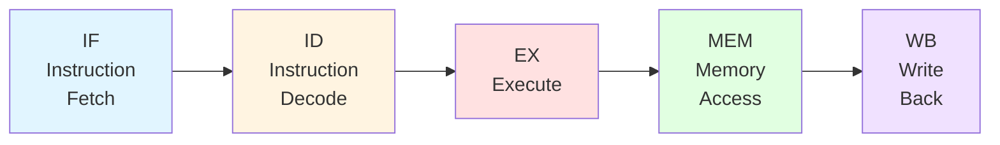
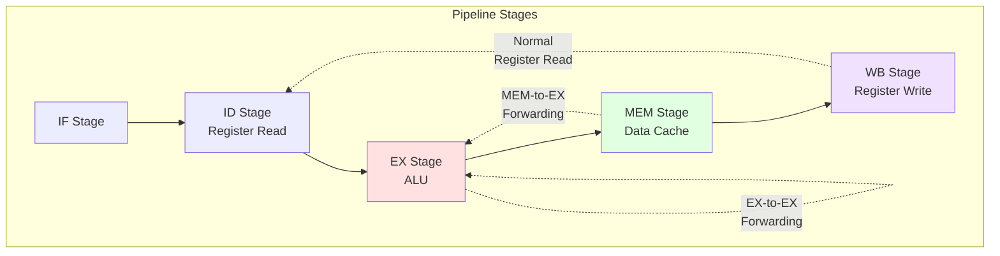
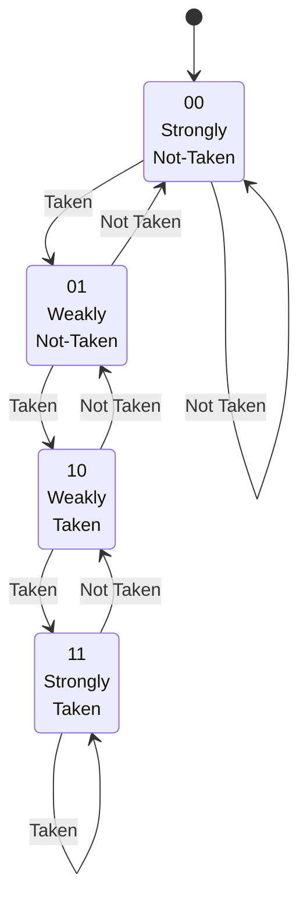

# Chapter 7. RISC-V Pipeline Fundamentals

**Part V — Pipeline & Microarchitecture**

---

The pipeline is the heart of modern processor design. It's the mechanism that allows a processor to work on multiple instructions simultaneously, dramatically improving throughput. In this chapter, we'll explore how RISC-V processors implement pipelining, from the classic five-stage pipeline to advanced techniques for handling hazards and branches.

Understanding pipelines is crucial for anyone working with RISC-V, whether you're designing hardware, writing compilers, or optimizing performance-critical code. The beauty of RISC-V's design is that its clean, regular instruction set makes it particularly well-suited for efficient pipeline implementation. We'll examine the classic five-stage pipeline (Fetch, Decode, Execute, Memory, Writeback), the three types of hazards that disrupt pipeline flow (structural, data, control), and techniques for handling them (forwarding, stalling, branch prediction). We'll also explore how pipeline depth affects performance and complexity.

---

## 7.1 Classic Five-Stage Pipeline

The classic five-stage pipeline is the foundation of most RISC processor designs. It divides instruction execution into five distinct stages, allowing up to five instructions to be in flight simultaneously. Let's walk through each stage.

**Figure 7.1: Five-Stage Pipeline Overview**



**Figure 7.2: Pipeline Timing Diagram**

```
Cycle:  1    2    3    4    5    6    7    8    9
I1:     IF   ID   EX   MEM  WB
I2:          IF   ID   EX   MEM  WB
I3:               IF   ID   EX   MEM  WB
I4:                    IF   ID   EX   MEM  WB
I5:                         IF   ID   EX   MEM  WB
```

In steady state, all five stages are busy with different instructions, achieving a throughput of one instruction per cycle (IPC = 1).

### Instruction Fetch (IF)

**The first stage fetches the next instruction from memory.** The program counter (PC) points to the address of the instruction to fetch. The instruction is read from the instruction cache (I-cache) or main memory if there's a cache miss.

In RISC-V, all instructions are either 16-bit (compressed, with C extension) or 32-bit (standard). The fetch unit must handle both formats, though in a simple implementation without the C extension, all instructions are 32-bit aligned.

```
IF Stage:
  instruction = I-cache[PC]
  next_PC = PC + 4  // or PC + 2 for compressed instructions
```

**Fetch bandwidth** is critical for performance. A processor that can fetch multiple instructions per cycle (superscalar) needs wider fetch paths and more complex PC prediction logic.

### Instruction Decode (ID)

**The second stage decodes the instruction and reads operands from the register file.** The decoder examines the opcode and function fields to determine what operation to perform and which registers to read.

RISC-V's regular instruction format makes decoding straightforward. All instructions have the opcode in bits [6:0], and register specifiers are always in the same positions:

- `rs1` (source register 1): bits [19:15]
- `rs2` (source register 2): bits [24:20]  
- `rd` (destination register): bits [11:7]

```
ID Stage:
  opcode = instruction[6:0]
  rs1_data = register_file[instruction[19:15]]
  rs2_data = register_file[instruction[24:20]]
  rd_addr = instruction[11:7]
  immediate = decode_immediate(instruction)
```

**Immediate generation** is also part of this stage. RISC-V has several immediate formats (I-type, S-type, B-type, U-type, J-type), and the decoder must extract and sign-extend the immediate value correctly.

### Execute (EX)

**The third stage performs the actual computation.** This is where the ALU (Arithmetic Logic Unit) operates on the source operands to produce a result.

For arithmetic instructions like `ADD`, `SUB`, `AND`, the ALU performs the operation. For load/store instructions, the ALU calculates the memory address by adding the base register and offset. For branches, the ALU evaluates the branch condition.

```
EX Stage:
  case opcode:
    ADD:  result = rs1_data + rs2_data
    SUB:  result = rs1_data - rs2_data
    LOAD: address = rs1_data + immediate
    BEQ:  taken = (rs1_data == rs2_data)
```

**Branch condition evaluation** happens here. If a branch is taken, the pipeline must be flushed (more on this in Section 7.4).

### Memory Access (MEM)

**The fourth stage accesses data memory for load and store instructions.** For loads, data is read from the data cache (D-cache). For stores, data is written to the cache.

```
MEM Stage:
  if LOAD:
    load_data = D-cache[address]
  if STORE:
    D-cache[address] = rs2_data
```

**Cache hit or miss** is determined here. A cache miss can stall the pipeline for many cycles while data is fetched from main memory.

For non-memory instructions, this stage does nothing (or passes through the result from the EX stage).

### Write Back (WB)

**The fifth and final stage writes the result back to the register file.** This is the commit point where the instruction's effects become architecturally visible.

```
WB Stage:
  if rd != x0:  // x0 is hardwired to zero
    register_file[rd] = result
```

**RISC-V's x0 register** is always zero, so writes to x0 are discarded. This is checked in hardware to avoid unnecessary register file writes.

### Pipeline Example: Executing a Simple Program

Let's trace a simple RISC-V program through the pipeline:

```assembly
# Example: Calculate sum = a + b + c
    lw   x1, 0(x10)    # I1: Load a from memory
    lw   x2, 4(x10)    # I2: Load b from memory
    lw   x3, 8(x10)    # I3: Load c from memory
    add  x4, x1, x2    # I4: x4 = a + b
    add  x5, x4, x3    # I5: x5 = (a + b) + c
    sw   x5, 12(x10)   # I6: Store sum to memory
```

**Cycle-by-cycle execution** (assuming no cache misses):

```
Cycle:  1    2    3    4    5    6    7    8    9    10   11
I1:     IF   ID   EX   MEM  WB
I2:          IF   ID   EX   MEM  WB
I3:               IF   ID   EX   MEM  WB
I4:                    IF   ID   EX   MEM  WB
I5:                         IF   ID   EX   MEM  WB
I6:                              IF   ID   EX   MEM  WB
```

In this ideal case, 6 instructions complete in 11 cycles. After the pipeline fills (first 5 cycles), we achieve 1 instruction per cycle.

---

## 7.2 Pipeline Hazards

Pipelining would be perfect if instructions were completely independent. Unfortunately, they're not. **Hazards** are situations where the next instruction cannot execute in the next clock cycle. There are three types of hazards.

### Structural Hazards

**A structural hazard occurs when two instructions need the same hardware resource at the same time.** For example, if the instruction fetch and memory access stages both need to access memory in the same cycle, there's a conflict.

In a simple RISC-V implementation with a single memory port, you can't fetch an instruction and perform a load/store simultaneously. The solution is either to stall one operation or to use separate instruction and data caches (Harvard architecture).

**Register file port conflicts** are another example. If the register file has only one write port, you can't write back two results in the same cycle. Most RISC-V implementations avoid this by having enough ports or by carefully scheduling operations.

### Data Hazards

**Data hazards occur when an instruction depends on the result of a previous instruction that hasn't completed yet.** There are three types:

**RAW (Read After Write)** — The most common hazard. An instruction tries to read a register before a previous instruction writes it:

```assembly
add  x1, x2, x3   # x1 = x2 + x3
sub  x4, x1, x5   # x4 = x1 - x5  (needs x1 from previous instruction)
```

The `sub` instruction needs the value of `x1`, but the `add` instruction hasn't written it yet. This is a **true dependency** and must be handled carefully.

**Figure 7.3: RAW Data Hazard**

```
Cycle:           1    2    3    4    5    6    7    8
add x1,x2,x3:    IF   ID   EX   MEM  WB
sub x4,x1,x5:         IF   ID   --   --   EX   MEM  WB
                                └─ stall ─┘
```

Without forwarding, the `sub` must stall until `add` writes `x1` in cycle 5.

**WAR (Write After Read)** — An instruction writes a register before a previous instruction reads it. This is an **anti-dependency**:

```assembly
add  x1, x2, x3   # reads x2
sub  x2, x4, x5   # writes x2
```

In an in-order pipeline, WAR hazards don't occur because instructions complete in order. But in out-of-order processors (Chapter 8), they can happen.

**WAW (Write After Write)** — Two instructions write the same register. This is an **output dependency**:

```assembly
add  x1, x2, x3   # writes x1
sub  x1, x4, x5   # writes x1
```

Again, this is mainly a concern for out-of-order processors.

### Control Hazards

**Control hazards occur when the pipeline doesn't know which instruction to fetch next.** This happens with branches and jumps.

Consider a conditional branch:

```assembly
beq  x1, x2, target   # if x1 == x2, jump to target
add  x3, x4, x5       # next instruction if not taken
...
target:
  sub  x6, x7, x8     # target instruction if taken
```

The pipeline doesn't know whether to fetch the `add` or the `sub` until the branch condition is evaluated in the EX stage. By that time, the pipeline has already fetched the next instruction speculatively.

**Branch misprediction** causes pipeline bubbles (wasted cycles) because the speculatively fetched instructions must be discarded.

**Figure 7.6: Branch Misprediction**

```
Cycle:           1    2    3    4    5    6
beq (taken):     IF   ID   EX   MEM  WB
Wrong Path I1:        IF   ID   XX
Wrong Path I2:             IF   XX
Correct Path:                   IF   ID   EX
                                └─ 3 cycles wasted ─┘
```

When the branch is resolved in cycle 3 and found to be mispredicted, instructions from the wrong path are squashed, wasting 2-3 cycles.

---

## 7.3 Hazard Resolution

Processors use several techniques to handle hazards without stalling the pipeline too much.

### Forwarding (Bypassing)

**Forwarding (also called bypassing) allows a result to be used before it's written back to the register file.** This is the most important technique for reducing data hazard stalls.

Consider our earlier example:

```assembly
add  x1, x2, x3   # x1 = x2 + x3 (result available at end of EX stage)
sub  x4, x1, x5   # x4 = x1 - x5 (needs x1 in EX stage)
```

Without forwarding, the `sub` would have to wait until the `add` writes `x1` in the WB stage (3 cycles later). With forwarding, the result from the `add` instruction's EX stage can be forwarded directly to the `sub` instruction's EX stage.

**Forwarding paths** are data paths that bypass the register file:

- **EX-to-EX forwarding**: Result from EX stage to EX stage (1 cycle later)
- **MEM-to-EX forwarding**: Result from MEM stage to EX stage (2 cycles later)
- **WB-to-EX forwarding**: Result from WB stage to EX stage (3 cycles later, but this is just normal register file read)

**Figure 7.4: Forwarding Paths**



**Forwarding Logic** (simplified):

```c
// Forwarding unit logic
if (EX_MEM.RegWrite && (EX_MEM.rd != 0) && (EX_MEM.rd == ID_EX.rs1))
    ForwardA = 01;  // Forward from EX/MEM pipeline register
else if (MEM_WB.RegWrite && (MEM_WB.rd != 0) && (MEM_WB.rd == ID_EX.rs1))
    ForwardA = 10;  // Forward from MEM/WB pipeline register
else
    ForwardA = 00;  // No forwarding, use register file

// Similar logic for rs2 (ForwardB)
```

**Example with forwarding**:

```assembly
add  x1, x2, x3   # I1: x1 = x2 + x3 (result ready at end of EX)
sub  x4, x1, x5   # I2: x4 = x1 - x5 (needs x1 at start of EX)
```

```
Cycle:  1    2    3    4    5    6
I1:     IF   ID   EX   MEM  WB
I2:          IF   ID   EX   MEM  WB
                       ^
                       |
                Forward from I1's EX stage
```

With forwarding, I2 can execute immediately after I1, with no stall!

**Forwarding doesn't solve all data hazards.** The classic example is a load followed immediately by a use:

```assembly
lw   x1, 0(x2)    # load x1 from memory
add  x3, x1, x4   # use x1 immediately
```

The load data isn't available until the end of the MEM stage, but the `add` needs it at the beginning of the EX stage. Even with forwarding, a **one-cycle stall** is required.

**Figure 7.5: Load-Use Hazard**

```
Cycle:           1    2    3    4    5    6    7
lw x1,0(x2):     IF   ID   EX   MEM  WB
add x3,x1,x4:         IF   ID   --   EX   MEM  WB
                                └─ stall ─┘
```

The `add` must stall in cycle 3 because the load data isn't ready until the end of cycle 4. Even with MEM-to-EX forwarding, we need one bubble.

### Pipeline Stalls

**When forwarding isn't enough, the pipeline must stall (insert bubbles).** A stall freezes earlier pipeline stages while later stages continue.

For the load-use hazard above, the pipeline inserts a one-cycle stall:

```
Cycle:  1    2    3    4    5    6
lw      IF   ID   EX   MEM  WB
add          IF   ID   stall EX  MEM
```

The `add` instruction's ID stage is held for an extra cycle, creating a bubble in the EX stage.

**Stall detection logic** monitors the pipeline for hazards:

```c
// Hazard detection unit
bool load_use_hazard = (ID_EX.MemRead) &&
                       ((ID_EX.rd == IF_ID.rs1) ||
                        (ID_EX.rd == IF_ID.rs2));

if (load_use_hazard) {
    // Stall the pipeline
    PC_write = 0;        // Don't update PC
    IF_ID_write = 0;     // Don't update IF/ID register
    Control_signals = 0; // Insert bubble (nop) in EX stage
}
```

**Performance impact**: Each stall reduces IPC (Instructions Per Cycle). Compilers try to schedule instructions to avoid load-use hazards when possible.

**Compiler scheduling example**:

```assembly
# Original code (has load-use hazard):
lw   x1, 0(x2)
add  x3, x1, x4    # Stall! (depends on x1)
sub  x5, x6, x7

# Compiler-scheduled code (no hazard):
lw   x1, 0(x2)
sub  x5, x6, x7    # Independent instruction fills the slot
add  x3, x1, x4    # No stall now (x1 is ready)
```

By reordering independent instructions, the compiler can hide load latency and avoid stalls.

### Compiler Scheduling

**Compilers can reorder instructions to avoid hazards without changing program semantics.** This is called **instruction scheduling** or **software pipelining**.

Example: Instead of this (with a load-use hazard):

```assembly
lw   x1, 0(x2)
add  x3, x1, x4   # stall!
```

The compiler can insert an independent instruction:

```assembly
lw   x1, 0(x2)
sub  x5, x6, x7   # independent instruction
add  x3, x1, x4   # no stall now
```

**Loop unrolling** and **software pipelining** are advanced compiler techniques that expose more instruction-level parallelism and reduce hazards.

---

## 7.4 Branch Handling

Branches are the bane of pipelining. Every branch is a potential control hazard that can disrupt the smooth flow of instructions through the pipeline.

### Branch Prediction Basics

**Branch prediction tries to guess whether a branch will be taken or not-taken before the condition is evaluated.** The pipeline speculatively fetches and executes instructions based on this prediction. If the prediction is correct, there's no penalty. If it's wrong, the pipeline must be flushed and restarted from the correct path.

**Misprediction penalty** is the number of cycles wasted when a branch is mispredicted. In a five-stage pipeline, if the branch is resolved in the EX stage (cycle 3), the misprediction penalty is 2 cycles (the IF and ID stages of the wrong-path instructions must be discarded).

**Branch prediction accuracy** is critical for performance. Modern processors achieve 95-99% accuracy on typical workloads. Even a 5% misprediction rate can significantly impact performance if branches are frequent (every 5-10 instructions in typical code).

### Static Branch Prediction

**Static prediction uses fixed rules that don't change during execution.** The simplest strategies are:

**Always not-taken**: Assume all branches are not taken. This works well for forward branches (like `if` statements that skip over error handling code).

**Always taken**: Assume all branches are taken. This works well for backward branches (like loop back-edges).

**BTFNT (Backward Taken, Forward Not-Taken)**: A hybrid strategy that predicts backward branches as taken and forward branches as not-taken. This is surprisingly effective because loops (backward branches) are usually taken, and forward branches (error checks, early exits) are usually not taken.

```
Static Prediction:
  if (branch_target < PC):  // backward branch
    predict_taken()
  else:                      // forward branch
    predict_not_taken()
```

**Profile-guided prediction**: The compiler can use profiling data to predict branches based on actual execution patterns. Hot paths are predicted as taken.

### Dynamic Branch Prediction

**Dynamic prediction learns from past branch behavior and adapts during execution.** This is much more accurate than static prediction.

**Branch History Table (BHT)**: A table indexed by the branch PC (or a hash of it) that stores prediction information. Each entry contains a **two-bit saturating counter**:

```
00: Strongly not-taken
01: Weakly not-taken
10: Weakly taken
11: Strongly taken
```

When a branch is taken, the counter increments (saturates at 11). When not taken, it decrements (saturates at 00). The prediction is "taken" if the counter is 10 or 11.

**Why two bits?** A single bit would mispredict on every iteration of a loop (predict taken, but the last iteration is not taken, so flip to not-taken, but the next loop iteration is taken, so flip back...). Two bits provide hysteresis: a single misprediction doesn't immediately flip the prediction.

**Figure 7.7: Two-Bit Saturating Counter State Machine**



**Example: Loop prediction**

```c
for (int i = 0; i < 100; i++) {
    // Loop body
}
```

The loop back-edge branch is taken 99 times and not-taken once (exit). With a 2-bit counter:

- After a few iterations, counter reaches 11 (strongly taken)
- Predicts "taken" for iterations 1-99 (correct)
- Iteration 100: not-taken (misprediction), counter goes to 10
- Next loop: first iteration is taken, counter goes back to 11
- **Result**: Only 1 misprediction per 100 iterations (99% accuracy)

**Local vs global history**:

- **Local history**: Each branch has its own history (pattern of taken/not-taken).
- **Global history**: All branches share a global history register that tracks the last N branch outcomes.

Global history can capture correlations between branches (e.g., if branch A is taken, branch B is likely taken too).

### Branch Target Buffer (BTB)

**The BTB is a cache that stores the target addresses of recently executed branches.** When a branch is predicted taken, the BTB provides the target address so the fetch unit can immediately fetch from the correct location.

Without a BTB, even if a branch is correctly predicted as taken, the pipeline must wait until the branch target is calculated in the EX stage. The BTB eliminates this delay.

```
BTB Lookup:
  if (PC in BTB) and (predict_taken):
    next_PC = BTB[PC].target
  else:
    next_PC = PC + 4
```

**Return Address Stack (RAS)**: Function returns (`ret` in RISC-V, which is `jalr x0, 0(x1)`) are a special case. The return address is pushed onto a hardware stack when a function is called (`jal` or `jalr`), and popped when returning. This provides near-perfect prediction for function returns.

### RISC-V: No Branch Delay Slots

**RISC-V does not have branch delay slots, unlike MIPS.** In MIPS, the instruction immediately after a branch is always executed, regardless of whether the branch is taken. This is called a **delay slot**.

MIPS example:

```assembly
beq  $t0, $t1, target
add  $t2, $t3, $t4      # delay slot: always executed
```

The `add` instruction executes even if the branch is taken. Compilers must fill the delay slot with a useful instruction or a `nop`.

**RISC-V eliminated delay slots** for several reasons:

- **Simpler pipeline control**: No need to track delay slot instructions.
- **Cleaner ISA**: The semantics are more intuitive.
- **Better for superscalar**: Delay slots complicate multi-issue pipelines.
- **Compiler complexity**: Filling delay slots is tricky and doesn't always help.

This is a significant improvement over MIPS and makes RISC-V easier to implement and optimize.

---

## 7.5 Trap and Interrupt Handling in Pipeline

Traps and interrupts (covered in Chapter 4) have a significant impact on the pipeline. They require precise exception handling and pipeline flushing.

### Precise Exceptions

**A precise exception means the architectural state is consistent when the exception is taken.** All instructions before the faulting instruction have completed, and no instructions after it have modified architectural state.

This requires **in-order commit**: even if instructions execute out-of-order (Chapter 8), they must commit (update architectural state) in program order.

For a five-stage in-order pipeline, precise exceptions are natural: instructions complete in order. But the pipeline must ensure that:

1. All instructions before the exception have written back.
2. The faulting instruction and all later instructions have not modified state.

### Pipeline Flush on Trap

**When a trap occurs, the pipeline must be flushed.** All instructions in the pipeline that are younger than the trap are discarded (squashed).

```
Cycle:  1    2    3         4       5
I1:     IF   ID   EX(trap)  --      --
I2:          IF   ID        squash  --
I3:               IF        squash  --
I4:                         squash  --
```

Instructions I2, I3, I4 are squashed. The PC is redirected to the trap handler (from `xtvec`), and execution resumes there.

**Squashing** means:

- Clear pipeline registers (set to `nop` or invalid).
- Prevent any writes to architectural state (register file, memory, CSRs).
- Invalidate any speculative state (branch predictions, cache fills).

### Performance Cost

**Traps are expensive.** A trap in a five-stage pipeline wastes 3-4 cycles (the instructions in the pipeline that must be squashed). In deeper pipelines or out-of-order processors, the cost is even higher.

This is why:

- **Exception-free code is faster**: Avoid page faults, misaligned accesses, illegal instructions.
- **Interrupts should be infrequent**: High interrupt rates can severely degrade performance.
- **Trap handlers should be fast**: The sooner you return from a trap, the sooner useful work resumes.

---

## 7.6 Simple In-Order Implementations

Let's look at how real RISC-V processors implement pipelines.

### Single-Issue vs Multi-Issue

**Single-issue** processors execute one instruction per cycle (at most). The classic five-stage pipeline is single-issue.

**Multi-issue** (superscalar) processors can execute multiple instructions per cycle. For example, a 2-issue processor can fetch, decode, and execute 2 instructions simultaneously.

**Issue width** is the maximum number of instructions that can be issued per cycle. Wider issue requires:

- Multiple fetch ports (or wider fetch)
- Multiple decode units
- Multiple execution units (ALUs, load/store units)
- More register file ports
- More complex hazard detection and forwarding logic

### Scalar vs Superscalar

**Scalar** means single-issue, one instruction at a time.

**Superscalar** means multi-issue, exploiting **instruction-level parallelism (ILP)** by executing independent instructions in parallel.

Superscalar processors are more complex but can achieve higher IPC (Instructions Per Cycle). A 4-issue superscalar can theoretically execute 4 instructions per cycle, achieving IPC = 4 (though in practice, IPC is usually 1.5-2.5 due to hazards and dependencies).

### RISC-V Implementation Examples

**Rocket Core**: An open-source, in-order, single-issue RISC-V core developed at UC Berkeley. It has a classic five-stage pipeline and is used in many academic and commercial projects. Rocket is simple, efficient, and easy to understand.

**BOOM (Berkeley Out-of-Order Machine)**: An open-source, out-of-order, superscalar RISC-V core (also from UC Berkeley). BOOM is much more complex than Rocket but achieves higher performance. We'll cover out-of-order execution in Chapter 8.

**SiFive Cores**:

- **E-series** (e.g., E20, E21): Small, low-power, in-order cores for embedded systems.
- **U-series** (e.g., U54, U74): Higher-performance, in-order cores with MMU for running Linux.
- **P-series** (e.g., P270, P670): High-performance, out-of-order cores for demanding applications.

### Performance Characteristics

**CPI (Cycles Per Instruction)**: The average number of cycles needed to execute one instruction. For an ideal five-stage pipeline with no hazards, CPI = 1. In practice, hazards increase CPI to 1.2-1.5 for in-order cores.

**IPC (Instructions Per Cycle)**: The inverse of CPI. IPC = 1/CPI. Higher IPC means better performance.

**Pipeline depth trade-offs**:

- **Deeper pipelines** (more stages) allow higher clock frequencies because each stage does less work. But they increase branch misprediction penalties and make hazard handling more complex.
- **Shallow pipelines** (fewer stages) have lower misprediction penalties and simpler control, but lower maximum frequency.

Modern processors balance these trade-offs. RISC-V cores range from 3-stage pipelines (simple embedded cores) to 10+ stage pipelines (high-performance cores).

---

## Summary

In this chapter, we explored the fundamentals of RISC-V pipelining:

- **Five-stage pipeline**: IF, ID, EX, MEM, WB — the classic RISC pipeline structure.
- **Hazards**: Structural, data (RAW, WAR, WAW), and control hazards that disrupt pipeline flow.
- **Hazard resolution**: Forwarding, stalls, and compiler scheduling to minimize performance loss.
- **Branch handling**: Static and dynamic prediction, BTB, and RISC-V's elimination of delay slots.
- **Trap handling**: Precise exceptions, pipeline flushing, and performance costs.
- **Implementations**: Single-issue vs multi-issue, scalar vs superscalar, and real RISC-V cores.

RISC-V's clean, regular ISA makes it ideal for efficient pipeline implementation. The absence of delay slots and complex addressing modes simplifies pipeline control compared to older architectures like MIPS.

In the next chapter, we'll explore **out-of-order execution**, where processors dynamically reorder instructions to extract even more parallelism and performance.
