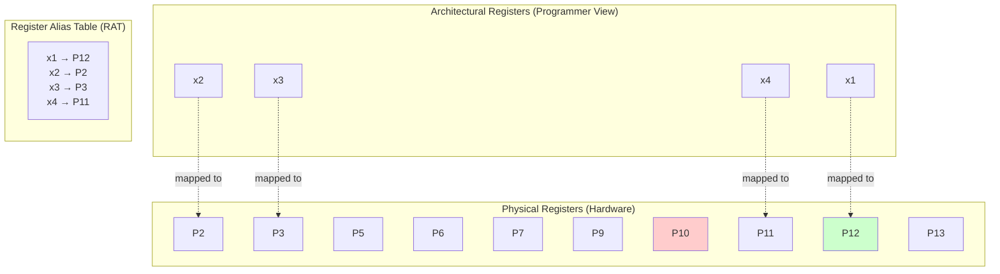
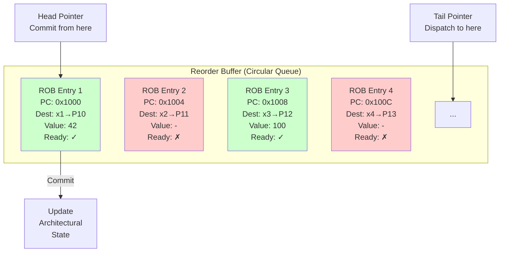
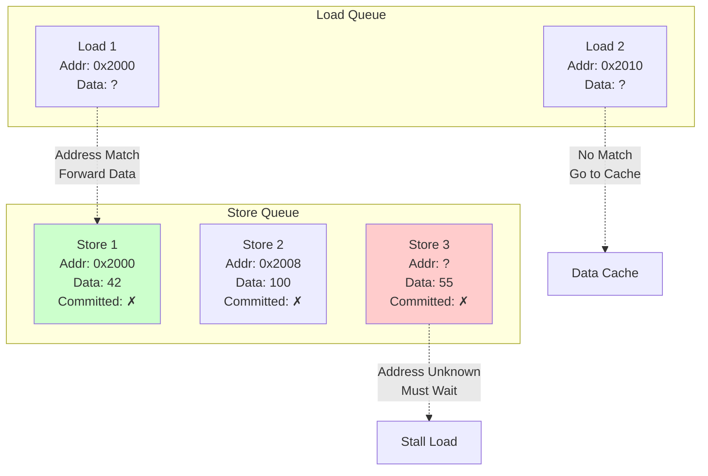
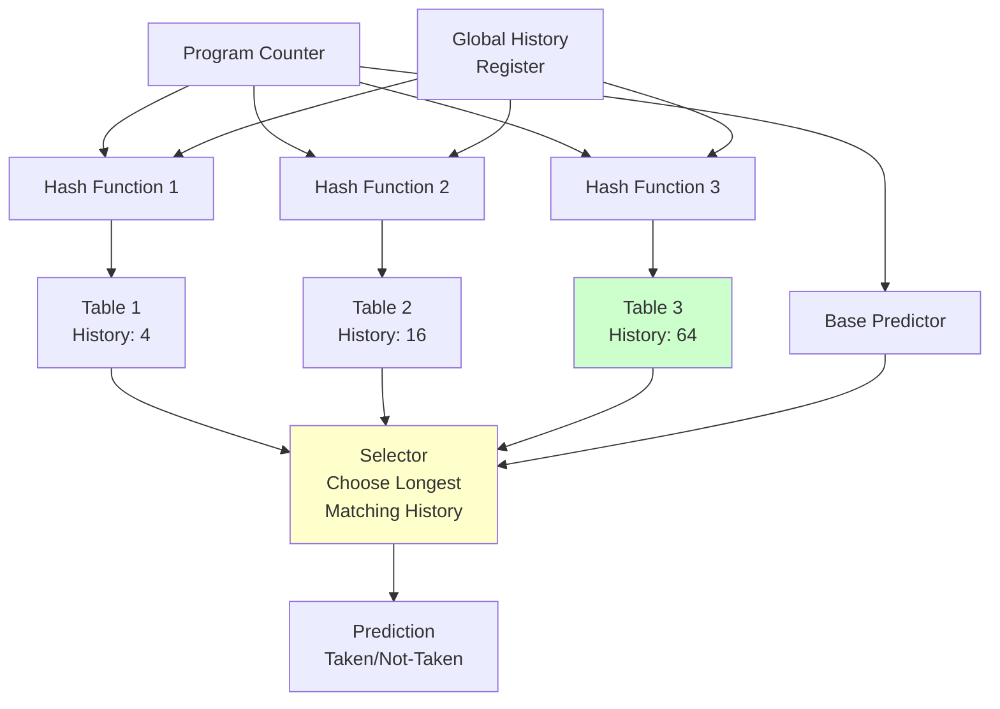
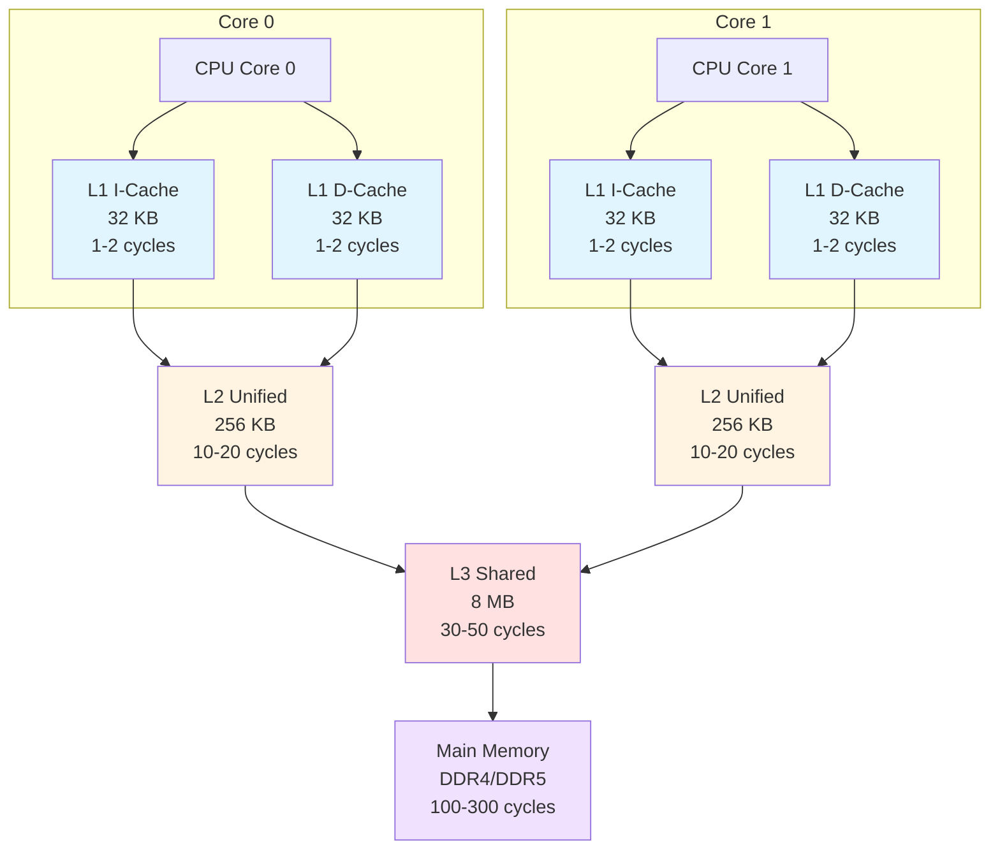
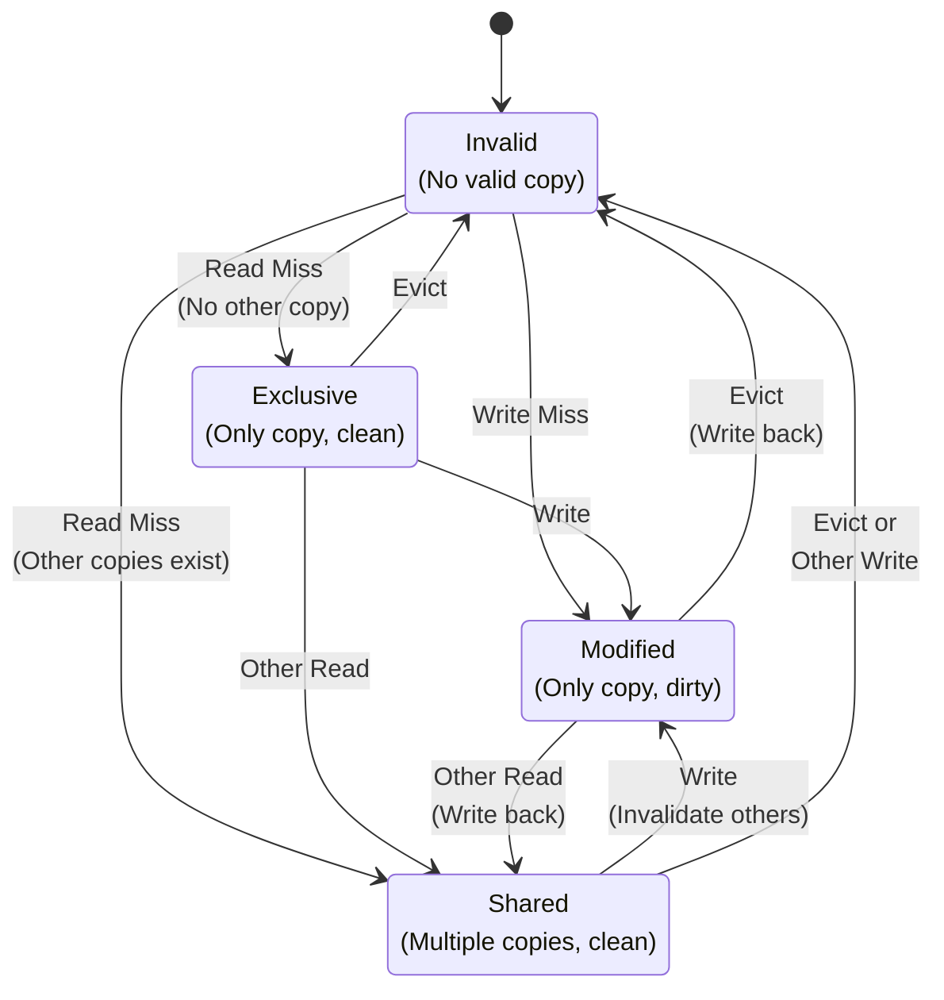

# Chapter 8. Microarchitecture Variations

**Part V — Pipeline & Microarchitecture**

---

## 🎯 Learning Objectives

After reading this chapter, you will be able to:

1. **Distinguish In-Order from Out-of-Order**: Understand the performance differences and use cases of both execution models
2. **Understand Register Renaming**: Know how Physical Registers eliminate False Dependencies (WAW/WAR)
3. **Master ROB Mechanism**: Understand how the Reorder Buffer guarantees "out-of-order execution, in-order commit"
4. **Recognize Speculative Execution**: Understand the principles and security risks (Spectre/Meltdown)
5. **Use Performance Counters**: Calculate CPI using `mcycle` and `minstret`

---

## 💡 Scenario: The Michelin Restaurant Kitchen Philosophy

> **Scene**: Junior is comparing benchmark results of two RISC-V cores and finds that despite similar frequencies, performance differs by a factor of two.

**Junior**: "Professor, I looked at specs for two RISC-V cores. SiFive U74 and Alibaba C910 both run at about 1.5GHz, but the CoreMark scores differ by almost 2x! How is this possible?"

**Professor**: "Have you ever been to a Michelin-star restaurant?"

**Junior**: "Sure, but what does that have to do with CPUs?"

**Professor**: "Imagine two restaurants.

**The first one (In-Order)**: The chef strictly follows the order of tickets. If the first dish needs 10 minutes for ingredients to thaw, all other dishes must wait—even if the second dish's ingredients are already ready.

**The second one (Out-of-Order)**: The chef looks at which dish has ingredients ready first and starts with that. While waiting for ingredients to thaw, the chef has already finished three other dishes."

**Junior**: "So Out-of-Order means the CPU doesn't wait idly?"

**Professor**: "Exactly. But this requires a smart 'restaurant manager' to coordinate:

1. **Reservation Station**: Tracks what ingredients each dish needs; starts cooking when ingredients arrive.
2. **Reorder Buffer**: Even though cooking order is scrambled, dishes must still be served in the order customers placed them—otherwise chaos ensues.
3. **Register Renaming**: If two dishes both need 'eggs,' but they're actually different eggs, label them differently to avoid confusion."

**Junior**: "Sounds complex. What's the cost?"

**Professor**: "Transistor count explodes, and power consumption goes up with it. That's why phone 'big cores' are power-hungry while 'little cores' are efficient—big cores are usually Out-of-Order, little cores are In-Order."

**Junior**: "Let's measure the actual performance difference!"

---

In Chapter 7, we explored the classic five-stage in-order pipeline. But modern processors go far beyond this simple model. Out-of-order (OOO) execution allows processors to dynamically reorder instructions to extract more parallelism, dramatically improving performance. While in-order processors execute instructions in program order and stall on dependencies, out-of-order processors can execute independent instructions while waiting for slow operations to complete.

This chapter explores the microarchitectural techniques that enable high-performance RISC-V processors: register renaming to eliminate false dependencies, reorder buffers to maintain precise exceptions, speculative execution to execute beyond branches, and advanced branch prediction to minimize misprediction penalties. We'll examine the cache hierarchy that hides memory latency, and cache coherence protocols that maintain consistency across multiple cores. Understanding these techniques is essential for anyone designing high-performance RISC-V systems or optimizing code for modern processors.

---

## 8.1 Out-of-Order Execution Basics

### In-Order vs Out-of-Order

**In-order processors execute instructions in the exact order they appear in the program.** If an instruction stalls (e.g., waiting for a cache miss), all subsequent instructions must wait, even if they're independent and could execute.

**Out-of-order (OOO) processors can execute instructions in a different order than the program specifies**, as long as the final result is the same. This allows the processor to work around stalls and dependencies, keeping execution units busy.

Example:

```assembly
lw   x1, 0(x2)     # I1: load (cache miss, 100 cycles)
add  x3, x4, x5    # I2: independent of I1
sub  x6, x7, x8    # I3: independent of I1
add  x9, x1, x10   # I4: depends on I1
```

**In-order execution**: I2 and I3 must wait for I1 to complete (100 cycles), even though they're independent.

**Out-of-order execution**: I2 and I3 can execute immediately while I1 is waiting for the cache miss. Only I4 must wait for I1.

This simple reordering can dramatically improve performance, especially when memory latency is high.

**Figure 8.1: In-Order vs Out-of-Order Execution**

```
Cycle:           1    2    3    ...  103  104  105  106  107
lw x1 (miss):    IF   ID   EX   MEM(100 cycles)  WB
add x3,x4,x5:         IF   ID   -------- stall -------- EX   MEM  WB
sub x6,x7,x8:              IF   -------- stall -------- ID   EX   MEM  WB
```

```
Cycle:            1    2    3    4    5    6    7    ...  103  104  105  106
lw x1 (miss):     IF   ID   EX   MEM (100 cycles) -------- WB
add x3,x4,x5:          IF   ID   EX   MEM  WB
sub x6,x7,x8:               IF   ID   EX   MEM  WB
add x9,x1,x10:                   IF   ID   ---- wait ----  EX   MEM  WB
```

Out-of-order execution allows independent instructions to proceed while the load is waiting, dramatically reducing wasted cycles.

### Dynamic Scheduling

**Dynamic scheduling** is the hardware mechanism that enables out-of-order execution. The processor analyzes dependencies at runtime and schedules instructions to execution units when their operands are ready.

Two classic algorithms for dynamic scheduling:

**Scoreboarding** (CDC 6600, 1964): A centralized control unit tracks which registers are being written and which instructions are waiting for them. When all operands are ready, the instruction is issued to an execution unit.

**Tomasulo's algorithm** (IBM 360/91, 1967): Uses **reservation stations** to buffer instructions waiting for operands. When an operand is produced, it's broadcast to all waiting instructions. This eliminates the need for a centralized scoreboard and enables **register renaming** (Section 8.2).

Modern OOO processors use variations of Tomasulo's algorithm with additional structures like the **Reorder Buffer (ROB)** to ensure precise exceptions.

---

## 8.2 Register Renaming

### The Problem: False Dependencies

Consider this code:

```assembly
add  x1, x2, x3    # I1: x1 = x2 + x3
sub  x4, x1, x5    # I2: x4 = x1 - x5 (RAW dependency on x1)
add  x1, x6, x7    # I3: x1 = x6 + x7 (WAW dependency on x1)
mul  x8, x1, x9    # I4: x8 = x1 * x9 (RAW dependency on x1 from I3)
```

I2 has a **true dependency (RAW)** on I1 — it must wait for I1 to produce `x1`.

But I3 has a **false dependency (WAW)** on I1 — both write `x1`, but I3's write doesn't actually depend on I1's value. Similarly, I4 depends on I3's `x1`, not I1's.

**False dependencies (WAR and WAW) limit parallelism** because the processor must serialize instructions that could otherwise execute in parallel.

### Physical vs Architectural Registers

**Register renaming** eliminates false dependencies by mapping architectural registers (the 32 registers visible to the programmer) to a larger set of **physical registers** (hidden from the programmer).

RISC-V has 32 architectural registers (`x0`-`x31`). A high-performance OOO processor might have 128 or 256 physical registers.

**Register Alias Table (RAT)**: Maps each architectural register to a physical register. When an instruction writes an architectural register, it's allocated a new physical register.

Example with renaming:

```assembly
add  P10, P2, P3   # I1: x1 -> P10
sub  P11, P10, P5  # I2: x4 -> P11, reads P10 (I1's result)
add  P12, P6, P7   # I3: x1 -> P12 (new physical register!)
mul  P13, P12, P9  # I4: x8 -> P13, reads P12 (I3's result)
```

Now I3 and I4 use `P12` for `x1`, while I1 and I2 use `P10`. The WAW dependency is eliminated — I3 can execute as soon as `P6` and `P7` are ready, without waiting for I1.

**Figure 8.2: Register Renaming Example**



In this example, `x1` was previously mapped to `P10` (shown in red, now free), and is currently mapped to `P12` (shown in green).

### Free List Management

**Physical registers must be recycled** when they're no longer needed. A **free list** tracks which physical registers are available for allocation.

When an instruction commits (Section 8.3), its old physical register mapping can be freed:

```
I3 commits: x1 was mapped to P10, now mapped to P12
  -> P10 can be freed (added to free list)
```

**Register renaming eliminates WAR and WAW hazards**, leaving only true RAW dependencies. This dramatically increases instruction-level parallelism.

---

## 8.3 Reorder Buffer (ROB) and Issue Queue

### Reorder Buffer (ROB)

**The ROB ensures that instructions commit in program order**, even though they execute out-of-order. This is essential for **precise exceptions** (Chapter 7).

The ROB is a circular buffer that holds all in-flight instructions in program order. Each entry contains:

- Instruction PC
- Destination register (architectural and physical)
- Result value (when execution completes)
- Exception status
- Ready bit

**Instruction flow through the ROB**:

1. **Dispatch**: Instruction is allocated a ROB entry and issued to an execution unit.
2. **Execute**: Instruction executes out-of-order when operands are ready.
3. **Complete**: Result is written to the ROB entry and broadcast to waiting instructions.
4. **Commit**: When the instruction reaches the head of the ROB and is complete, it commits (updates architectural state).

**Commit is in-order**: Instructions commit from the head of the ROB one at a time (or in small groups). This ensures that if an exception occurs, all earlier instructions have committed and all later instructions can be discarded.

**Figure 8.3: Reorder Buffer (ROB) Structure**



Green entries are ready to commit (when they reach the head). Red entries are still executing.

**ROB Example Code**:

```c
// ROB entry structure
struct ROB_Entry {
    uint64_t PC;              // Instruction address
    uint8_t  arch_reg;        // Architectural register (x0-x31)
    uint8_t  phys_reg;        // Physical register (P0-P127)
    uint64_t value;           // Result value
    bool     ready;           // Execution complete?
    bool     exception;       // Exception occurred?
    uint8_t  exception_code;  // Exception type
};

// Commit logic (simplified)
void commit_instruction() {
    ROB_Entry *entry = &ROB[head];

    if (!entry->ready) {
        return;  // Can't commit yet
    }

    if (entry->exception) {
        // Handle exception: flush pipeline, jump to handler
        flush_pipeline();
        PC = trap_handler_address;
        return;
    }

    // Update architectural state
    if (entry->arch_reg != 0) {  // x0 is always zero
        RAT[entry->arch_reg] = entry->phys_reg;
        free_old_physical_register(entry->arch_reg);
    }

    // Advance head pointer
    head = (head + 1) % ROB_SIZE;
}
```

### Issue Queue and Reservation Stations

**The issue queue (or reservation stations) holds instructions waiting for operands.** When an instruction is dispatched, it's placed in the issue queue. When all its operands are ready, it's issued to an execution unit.

**Wakeup and select**:

- **Wakeup**: When a result is produced, it's broadcast to all issue queue entries. Entries waiting for that result mark the operand as ready.
- **Select**: Among all ready instructions, the scheduler selects which ones to issue to execution units (based on priority, age, or other policies).

This is the heart of dynamic scheduling. The issue queue decouples instruction dispatch from execution, allowing the processor to find parallelism dynamically.

---

## 8.4 Load/Store Queue

Memory operations are particularly challenging in OOO processors because they must respect **memory ordering** (Chapter 6) while still allowing reordering for performance.

### Load Queue and Store Queue

**The load queue** holds all in-flight loads. **The store queue** holds all in-flight stores. These queues track memory addresses and data, and enforce ordering constraints.

**Store-to-load forwarding**: If a load reads from the same address as an earlier store, the load can get the data directly from the store queue without waiting for the store to commit to memory.

```assembly
sw   x1, 0(x2)     # Store x1 to address in x2
lw   x3, 0(x2)     # Load from same address
```

The load can forward the data from the store queue, avoiding a memory access.

**Figure 8.4: Load/Store Queue Structure**



Store-to-load forwarding allows loads to get data from earlier stores without waiting for them to commit to memory.

### Memory Disambiguation

**Memory disambiguation** is the problem of determining whether two memory operations access the same address. This is difficult because addresses are often computed dynamically.

```assembly
sw   x1, 0(x2)     # Store to address A
lw   x3, 0(x4)     # Load from address B — is B == A?
```

If `x2` and `x4` contain the same value, the load depends on the store. But the processor doesn't know this until the addresses are computed.

**Conservative approach**: Assume all loads depend on all earlier stores. This is safe but limits parallelism.

**Speculative approach**: Assume loads don't depend on earlier stores and execute them speculatively. If a dependency is later detected (address match), squash the load and re-execute.

Modern processors use **memory dependence prediction** to guess which loads depend on which stores, improving speculation accuracy.

---

## 8.5 Advanced Branch Prediction

Branch prediction is even more critical in OOO processors because mispredictions waste more work (all the speculatively executed instructions must be discarded).

### Two-Level Adaptive Predictors

**Two-level predictors** use both local and global branch history to make predictions. They can capture complex patterns like:

```c
if (a > 0) {        // Branch B1
  if (b > 0) {      // Branch B2
    ...
  }
}
```

If B1 is taken, B2 is more likely to be taken. A global history predictor can learn this correlation.

**Structure**: A global history register (GHR) tracks the last N branch outcomes (taken/not-taken). This is used to index into a pattern history table (PHT) that contains 2-bit counters.

### TAGE (Tagged Geometric History Length)

**TAGE** is a state-of-the-art branch predictor used in modern high-performance processors. It uses multiple predictor tables with different history lengths (e.g., 4, 8, 16, 32, 64 branches).

Each table is indexed by a hash of the PC and history. The predictor uses the longest matching history to make a prediction, falling back to shorter histories if there's no match.

TAGE achieves very high accuracy (98-99%) on most workloads.

**Figure 8.5: TAGE Predictor Structure**



TAGE uses multiple tables with different history lengths. The longest matching history provides the prediction.

### Return Address Stack (RAS)

**Function returns** are predicted using a hardware stack (mentioned in Chapter 7). When a function call is detected (`jal` or `jalr` with `rd != x0`), the return address is pushed onto the RAS. When a return is detected (`jalr x0, 0(x1)`), the top of the RAS is popped and used as the prediction.

The RAS is very accurate (>99%) because function calls and returns are well-structured.

### Indirect Branch Prediction

**Indirect branches** (`jalr` with a computed target) are harder to predict than direct branches. The target can vary widely depending on the value in the register.

**Indirect branch target buffer (iBTB)**: A cache indexed by the branch PC that stores recently seen targets. For virtual function calls or switch statements, the iBTB can achieve good accuracy.

**Advanced techniques**: Some processors use the call path (sequence of recent function calls) to predict indirect branch targets, improving accuracy for polymorphic code.

---

## 8.6 Cache Hierarchy

Modern processors have multiple levels of cache to hide memory latency.

### L1 Instruction and Data Caches

**L1 caches** are small (32-64 KB), fast (1-2 cycle latency), and split into separate instruction (I-cache) and data (D-cache) caches.

**Split I/D caches** allow simultaneous instruction fetch and data access, avoiding structural hazards. They're also optimized differently: I-caches are read-only and can use simpler replacement policies.

**Virtually indexed, physically tagged (VIPT)**: L1 caches often use virtual addresses for indexing (to avoid TLB lookup latency) but physical addresses for tags (to avoid aliasing issues).

### L2 Unified Cache

**L2 cache** is larger (256 KB - 1 MB), slower (10-20 cycles), and unified (holds both instructions and data).

L2 is the victim cache for L1: when data is evicted from L1, it's placed in L2. This creates an inclusive hierarchy (L2 contains everything in L1).

### L3 Shared Cache

**L3 cache** (if present) is even larger (4-32 MB), slower (30-50 cycles), and shared among all cores in a multi-core processor.

L3 reduces traffic to main memory and provides a large shared working set for all cores.

**Figure 8.6: Cache Hierarchy**



Each level is larger and slower. L1 is private per core, L2 may be private or shared, L3 is shared among all cores.

### Cache Replacement Policies

**LRU (Least Recently Used)**: Evict the cache line that hasn't been accessed for the longest time. This is effective but expensive to implement for high associativity.

**PLRU (Pseudo-LRU)**: An approximation of LRU that's cheaper to implement. Uses a tree of bits to track approximate recency.

**Random**: Evict a random cache line. Surprisingly effective and very simple.

Modern caches often use PLRU or adaptive policies that combine multiple strategies.

---

## 8.7 Cache Coherence

In multi-core systems, each core has its own L1 cache. **Cache coherence** ensures that all cores see a consistent view of memory.

### MESI Protocol

**MESI** is the most common coherence protocol. Each cache line is in one of four states:

- **M (Modified)**: This cache has the only valid copy, and it's been modified (dirty).
- **E (Exclusive)**: This cache has the only valid copy, and it's clean (matches memory).
- **S (Shared)**: Multiple caches have valid copies, all clean.
- **I (Invalid)**: This cache line is not valid.

**State transitions**:

- **Read miss**: If another cache has the line in M, it writes back to memory and transitions to S. The requesting cache loads the line in S.
- **Write**: If the line is in S, all other caches invalidate their copies. The writing cache transitions to M.

**Figure 8.7: MESI Protocol State Diagram**



**MESI Example**:

```c
// Core 0 and Core 1 both access the same cache line

// Initial state: Both caches Invalid (I)

// Core 0: Read from address 0x1000
// Core 0 cache: I → E (exclusive, no other copy)

// Core 1: Read from address 0x1000
// Core 0 cache: E → S (shared)
// Core 1 cache: I → S (shared)

// Core 0: Write to address 0x1000
// Core 0 cache: S → M (modified, dirty)
// Core 1 cache: S → I (invalidated)

// Core 1: Read from address 0x1000
// Core 0 cache: M → S (write back to memory)
// Core 1 cache: I → S (load from memory)
```

### MOESI Protocol

**MOESI** adds an **O (Owned)** state: the cache has a dirty copy, but other caches may have shared copies. This reduces write-backs to memory.

### Snooping vs Directory-Based Coherence

**Snooping**: All caches monitor (snoop) a shared bus for memory transactions. When a cache sees a transaction that affects its data, it responds appropriately (invalidate, write-back, etc.).

Snooping is simple but doesn't scale well beyond ~8-16 cores because bus bandwidth becomes a bottleneck.

**Directory-based**: A centralized directory tracks which caches have copies of each cache line. Coherence messages are sent point-to-point rather than broadcast.

Directory-based coherence scales better to many cores (64+) and is used in large multi-core processors.

### RISC-V Coherence Considerations

RISC-V doesn't mandate a specific coherence protocol. The **RVWMO memory model** (Chapter 6) defines the ordering guarantees, but the coherence mechanism is implementation-defined.

Most RISC-V multi-core systems use MESI or MOESI with snooping (for small core counts) or directory-based coherence (for large core counts).

---

## 8.8 Comparison with ARM and MIPS OOO Cores

Let's compare RISC-V OOO implementations with other architectures.

### RISC-V BOOM vs ARM Cortex-A76/A78

**BOOM (Berkeley Out-of-Order Machine)** is an open-source RISC-V OOO core. It has:

- 3-4 issue width
- 128-entry ROB
- 64-entry issue queue
- Advanced branch prediction (TAGE)
- L1 I/D caches, L2 unified cache

**ARM Cortex-A76** (2018) is a high-performance mobile core:

- 4-issue width
- 128-entry ROB
- Sophisticated branch prediction
- 64 KB L1 I/D, 256-512 KB L2

**Comparison**: BOOM and Cortex-A76 are similar in structure. Both use register renaming, ROB, and advanced branch prediction. The main differences are in implementation details (pipeline depth, cache sizes, power optimization).

RISC-V's simpler ISA (no complex addressing modes, no condition codes) makes the OOO logic slightly simpler than ARM's, but the difference is small in modern designs.

### RISC-V vs MIPS R10000 Pipeline

**MIPS R10000** (1996) was one of the first commercial OOO processors:

- 4-issue superscalar
- 32-entry active list (similar to ROB)
- Register renaming with 64 physical registers
- Speculative execution

The R10000 pioneered many techniques still used today. Modern RISC-V OOO cores like BOOM are evolutionary descendants of the R10000 design philosophy.

**Key difference**: RISC-V has no branch delay slots, making branch misprediction recovery simpler than MIPS.

### Microarchitecture Trade-offs

**Complexity vs Performance**: OOO execution provides 2-3x performance improvement over in-order for general-purpose workloads, but at the cost of 3-5x more transistors and power.

**When to use OOO**:

- High-performance applications (servers, desktops, high-end mobile)
- Workloads with irregular memory access patterns
- Code with many branches and dependencies

**When to use in-order**:

- Embedded systems with power/area constraints
- Predictable real-time workloads
- Simple control-dominated code

RISC-V's flexibility allows both in-order (Rocket, SiFive E/U-series) and OOO (BOOM, SiFive P-series) implementations, making it suitable for a wide range of applications.

---

## 🛠️ Hands-on Lab: Lab 8.1 — The Truth Behind Performance Counters

This lab guides you through using RISC-V's hardware performance counters to measure CPI (Cycles Per Instruction) of the same code under different conditions.

### Lab Objectives

1. Read `mcycle` (Machine Cycle Counter) and `minstret` (Machine Instructions Retired)
2. Calculate CPI = Cycles / Instructions
3. Observe how different code patterns affect CPI

### Concept Explanation

RISC-V provides two key performance counter CSRs:

| CSR | Name | Description |
|-----|------|-------------|
| `mcycle` | Machine Cycle Counter | Clock cycles elapsed since reset |
| `minstret` | Machine Instructions Retired | Instructions completed since reset |

**CPI (Cycles Per Instruction)** = mcycle / minstret

- CPI = 1.0: Ideal case, one instruction completes per cycle
- CPI > 1.0: Stalls present (cache miss, hazard, etc.)
- CPI < 1.0: Superscalar processor, multiple instructions complete per cycle

### Code

Create `lab8_perf.c`:

```c
// lab8_perf.c - Performance Counter Measurement
#include <stdio.h>
#include <stdint.h>

// Read mcycle
static inline uint64_t read_mcycle(void) {
    uint64_t val;
    asm volatile("csrr %0, mcycle" : "=r"(val));
    return val;
}

// Read minstret
static inline uint64_t read_minstret(void) {
    uint64_t val;
    asm volatile("csrr %0, minstret" : "=r"(val));
    return val;
}

// Test function 1: Simple addition loop (no dependencies)
volatile int result1;
void test_independent(int n) {
    int a = 0, b = 0, c = 0, d = 0;
    for (int i = 0; i < n; i++) {
        a += 1;
        b += 2;
        c += 3;
        d += 4;
    }
    result1 = a + b + c + d;
}

// Test function 2: Addition loop with dependencies
volatile int result2;
void test_dependent(int n) {
    int a = 0;
    for (int i = 0; i < n; i++) {
        a += 1;
        a += a;  // depends on previous line's result
        a += a;  // depends on previous line's result
        a += a;  // depends on previous line's result
    }
    result2 = a;
}

void measure(const char *name, void (*func)(int), int n) {
    uint64_t cycle_start = read_mcycle();
    uint64_t instr_start = read_minstret();

    func(n);

    uint64_t cycle_end = read_mcycle();
    uint64_t instr_end = read_minstret();

    uint64_t cycles = cycle_end - cycle_start;
    uint64_t instrs = instr_end - instr_start;

    // Calculate CPI (multiply by 100 to avoid floating point)
    uint64_t cpi_x100 = (cycles * 100) / instrs;

    printf("%s:\n", name);
    printf("  Cycles: %lu\n", cycles);
    printf("  Instructions: %lu\n", instrs);
    printf("  CPI: %lu.%02lu\n", cpi_x100 / 100, cpi_x100 % 100);
}

int main() {
    int n = 100000;

    printf("=== Performance Counter Lab ===\n\n");

    measure("Independent Operations", test_independent, n);
    printf("\n");
    measure("Dependent Operations", test_dependent, n);

    return 0;
}
```

### Compile and Run

```bash
# Compile
riscv64-unknown-elf-gcc -O2 -o lab8_perf lab8_perf.c

# Run (requires M-mode access to mcycle/minstret)
qemu-riscv64 lab8_perf
```

**Expected Output** (values vary by implementation):

```
=== Performance Counter Lab ===

Independent Operations:
  Cycles: 500123
  Instructions: 700045
  CPI: 0.71

Dependent Operations:
  Cycles: 1200456
  Instructions: 800089
  CPI: 1.50
```

### What You Just Did

1. **Independent Operations**: Four parallel additions can be executed simultaneously by OOO processors, resulting in CPI < 1
2. **Dependent Operations**: Each addition depends on the previous result, forcing sequential execution, resulting in CPI > 1

> **danieRTOS Reference**: The scheduler uses similar performance measurement techniques to profile task execution time and optimize scheduling decisions.

---

## ⚠️ Common Pitfalls

### Pitfall 1: Thinking Out-of-Order Is Always Better

**Misconception**: "OoO processors are always faster than In-Order!"

**Correct Understanding**:
- OoO has heavier penalties on **Branch Misprediction** (more instructions to flush)
- OoO may not be optimal in **power-constrained** scenarios (phones, IoT)
- For **highly parallel** workloads (GPU-like), simple In-Order cores are often more efficient

### Pitfall 2: Ignoring Spectre/Meltdown Risks

**Misconception**: "Speculative Execution is just a performance optimization with no side effects."

**Correct Understanding**:
- Spectre and Meltdown attacks exploit **side-channel effects** of Speculative Execution
- Even when mispredicted instructions are cancelled, their effects on **Cache** remain
- Attackers can infer secret data by measuring Cache access timing

```c
// Simplified Spectre attack concept
if (x < array1_size) {           // Bounds check
    y = array2[array1[x] * 256]; // If x is out of bounds, this shouldn't execute
}
// But Speculative Execution may "execute first, ask questions later"
// Even after discovering x is out of bounds and cancelling,
// array2's cache state has leaked array1[x]'s value
```

### Pitfall 3: Confusing mcycle with time

**Error Scenario**: Using `mcycle` to measure "real time."

**Correct Understanding**:
- `mcycle`: CPU clock cycles, tied to CPU frequency
- `time`: Real time (usually from RTC or Timer)
- If CPU frequency changes dynamically (DVFS), `mcycle` cannot be directly converted to time

```c
// ❌ Wrong: Assuming mcycle equals time
uint64_t start = read_mcycle();
do_something();
uint64_t elapsed_ns = (read_mcycle() - start) * 1000000000 / CPU_FREQ;
// If CPU frequency changed, this calculation is wrong

// ✅ Correct: Use time CSR or SBI timer
uint64_t start = read_time();
do_something();
uint64_t elapsed_ns = (read_time() - start) * 1000000000 / TIMER_FREQ;
```

---

## Summary

In this chapter, we explored advanced microarchitecture techniques for high-performance RISC-V processors:

- **Out-of-order execution**: Dynamic scheduling to extract instruction-level parallelism.
- **Register renaming**: Eliminating false dependencies (WAR, WAW) with physical registers.
- **Reorder buffer**: Ensuring in-order commit for precise exceptions.
- **Load/store queues**: Memory disambiguation and store-to-load forwarding.
- **Advanced branch prediction**: TAGE, RAS, indirect branch prediction.
- **Cache hierarchy**: L1/L2/L3 caches with LRU/PLRU replacement.
- **Cache coherence**: MESI/MOESI protocols for multi-core consistency.
- **Comparisons**: RISC-V BOOM vs ARM Cortex-A76 and MIPS R10000.

RISC-V's clean ISA makes it an excellent target for both simple in-order cores and complex OOO designs. The architecture doesn't impose unnecessary constraints, allowing microarchitects to innovate freely.

In the next chapter, we'll shift focus from hardware to software, exploring how RISC-V systems boot and how firmware and operating systems interact with the hardware.
