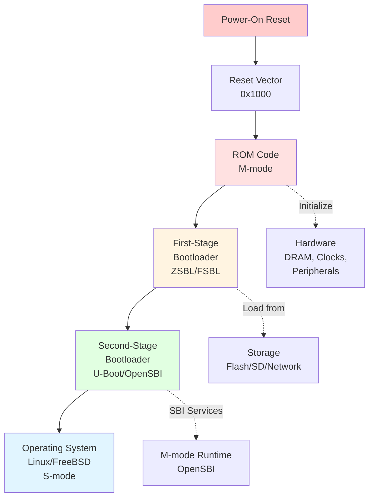
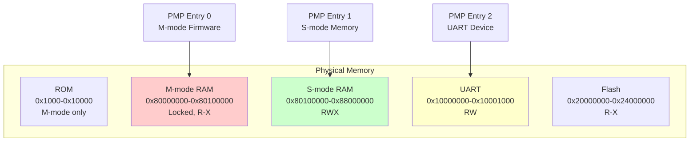
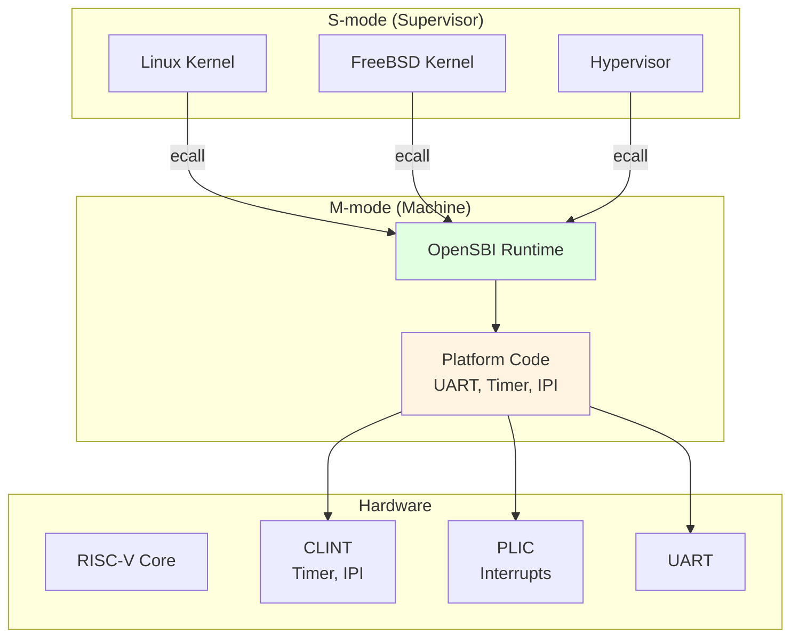

# Chapter 9: Reset, Boot Flow & Firmware

**Part VI — Booting & System Software**

---

What happens when you power on a RISC-V system? Unlike application software that runs in a well-prepared environment, the boot process starts from nothing—no operating system, no memory initialization, not even a stack. This chapter explores how RISC-V systems bootstrap themselves from power-on reset to a running operating system.

The boot process is a carefully orchestrated sequence of firmware stages, each preparing the environment for the next. We'll trace this journey from the reset vector through machine-mode firmware (ZSBL, FSBL, OpenSBI), bootloaders (U-Boot, GRUB), and finally to the operating system handoff. Understanding this process is essential for firmware developers, system integrators, and anyone debugging boot issues.

---

## 9.1 Reset and Boot Sequence

### Power-On Reset

**When power is applied to a RISC-V processor, hardware reset logic initializes the core to a known state.** All harts (hardware threads) begin execution in **Machine mode (M-mode)**, the highest privilege level with full access to all hardware resources.

**Reset state** (defined by the RISC-V Privileged Specification):

- **PC (Program Counter)**: Set to the **reset vector** address (implementation-defined, often `0x1000` or `0x80000000`)
- **Privilege mode**: M-mode (mstatus.MPP = 3)
- **Interrupts**: Disabled (mstatus.MIE = 0, mie = 0)
- **Virtual memory**: Disabled (satp = 0)
- **Most CSRs**: Undefined or zero
- **General-purpose registers**: Undefined (except x0, which is always zero)

**Only one hart boots by default.** In multi-hart systems, the **boot hart** (usually hart 0) starts executing from the reset vector, while other harts are held in a wait state until explicitly started by the boot hart.

### Reset Vector

**The reset vector is the first instruction address executed after reset.** This address is implementation-defined and typically points to:

- **ROM** (Read-Only Memory): Contains first-stage bootloader (FSBL)
- **Flash memory**: Contains firmware image
- **RAM**: Pre-loaded by JTAG debugger (for development)

**Example reset vectors**:

- SiFive FU540: `0x1000` (ROM)
- SiFive FU740: `0x1000` (ROM)
- QEMU virt machine: `0x1000` (ROM)
- Rocket Chip: `0x10000` (configurable)

**Figure 9.1: RISC-V Boot Sequence Overview**



### Early Initialization

**The first code executed at the reset vector must be extremely careful** — it runs with no stack, no initialized data, and minimal hardware setup. Typical early initialization:

```assembly
# Reset vector entry point (M-mode)
_start:
    # Disable interrupts (already disabled by reset, but be explicit)
    csrw    mie, zero
    csrw    mip, zero
    
    # Initialize global pointer (gp) for data access
    .option push
    .option norelax
    la      gp, __global_pointer$
    .option pop
    
    # Set up stack pointer (sp)
    la      sp, __stack_top
    
    # Clear BSS (uninitialized data)
    la      t0, __bss_start
    la      t1, __bss_end
1:  bge     t0, t1, 2f
    sd      zero, 0(t0)
    addi    t0, t0, 8
    j       1b
2:
    # Jump to C code
    call    boot_main
```

**Key steps**:

1. **Disable interrupts**: Ensure no interrupts occur during initialization
2. **Set up `gp` (global pointer)**: Enables efficient access to global variables
3. **Set up `sp` (stack pointer)**: Enables function calls and local variables
4. **Clear BSS**: Zero-initialize uninitialized global variables
5. **Jump to C code**: Now safe to run higher-level code

---

## 9.2 Machine Mode Initialization

### CSR Initialization

**Machine-mode firmware must initialize critical CSRs before proceeding.** These control interrupt handling, memory protection, and hardware features.

**Essential CSR initialization**:

```c
// Initialize machine-mode CSRs
void init_machine_mode(void) {
    // 1. Set up trap vector
    write_csr(mtvec, (uintptr_t)&m_trap_vector);
    
    // 2. Enable machine-mode interrupts (but keep global IE off for now)
    write_csr(mie, MIE_MSIE | MIE_MTIE | MIE_MEIE);
    
    // 3. Initialize mstatus
    uintptr_t mstatus = read_csr(mstatus);
    mstatus &= ~MSTATUS_MIE;  // Keep interrupts disabled
    mstatus |= MSTATUS_FS_INITIAL;  // Enable FPU (if present)
    write_csr(mstatus, mstatus);
    
    // 4. Clear pending interrupts
    write_csr(mip, 0);
    
    // 5. Initialize performance counters (if present)
    write_csr(mcounteren, 0x7);  // Enable cycle, time, instret for S-mode
}
```

### Physical Memory Protection (PMP) Setup

**PMP is RISC-V's mechanism for isolating memory regions and enforcing access permissions.** M-mode firmware configures PMP entries to protect firmware code, restrict device access, and define memory regions for S-mode.

**PMP configuration example**:

```c
// Configure PMP to allow S-mode access to RAM
void setup_pmp(void) {
    // Entry 0: Protect M-mode firmware (0x80000000 - 0x80100000)
    // TOR (Top-Of-Range) addressing
    write_csr(pmpaddr0, 0x80000000 >> 2);
    write_csr(pmpaddr1, 0x80100000 >> 2);
    write_csr(pmpcfg0, PMP_R | PMP_X | PMP_L | PMP_TOR);  // R-X, locked

    // Entry 1: Allow S-mode full access to RAM (0x80100000 - 0x88000000)
    write_csr(pmpaddr2, 0x80100000 >> 2);
    write_csr(pmpaddr3, 0x88000000 >> 2);
    write_csr(pmpcfg0, (PMP_R | PMP_W | PMP_X | PMP_TOR) << 8);  // RWX

    // Entry 2: Allow access to UART (0x10000000 - 0x10001000)
    write_csr(pmpaddr4, 0x10000000 >> 2);
    write_csr(pmpaddr5, 0x10001000 >> 2);
    write_csr(pmpcfg0, (PMP_R | PMP_W | PMP_TOR) << 16);  // RW
}
```

**PMP addressing modes**:

- **OFF**: Entry disabled
- **TOR (Top-Of-Range)**: Region from `pmpaddr[i-1]` to `pmpaddr[i]`
- **NA4**: Naturally aligned 4-byte region
- **NAPOT**: Naturally aligned power-of-2 region

**Figure 9.2: PMP Memory Protection**



### Memory Configuration

**M-mode firmware must initialize DRAM controllers and configure memory timing.** This is highly platform-specific and often the most complex part of early boot.

**Typical DRAM initialization**:

1. Configure DRAM controller registers (timing, refresh rate)
2. Perform DRAM training (calibrate delays)
3. Test memory (optional, but recommended)
4. Set up memory map (base address, size)

**Example (simplified)**:

```c
void init_dram(void) {
    volatile uint32_t *dram_ctrl = (uint32_t *)0x10000000;

    // Configure DRAM timing (platform-specific)
    dram_ctrl[0] = 0x12345678;  // Timing register
    dram_ctrl[1] = 0x9ABCDEF0;  // Refresh register

    // Wait for DRAM ready
    while (!(dram_ctrl[2] & 0x1));

    // Simple memory test
    volatile uint64_t *mem = (uint64_t *)0x80000000;
    mem[0] = 0xDEADBEEFCAFEBABE;
    if (mem[0] != 0xDEADBEEFCAFEBABE) {
        // Memory test failed
        while (1);
    }
}
```

---

## 9.3 Firmware and Bootloader

### Firmware Stages

**RISC-V boot firmware is typically organized into multiple stages**, each with specific responsibilities:

1. **ZSBL (Zeroth-Stage Bootloader)**: Minimal ROM code, initializes DRAM
2. **FSBL (First-Stage Bootloader)**: Loads SSBL from storage
3. **SSBL (Second-Stage Bootloader)**: Full-featured bootloader (U-Boot)
4. **Runtime firmware**: M-mode services (OpenSBI)

**Why multiple stages?**

- **ROM size constraints**: ZSBL must fit in small on-chip ROM
- **Flexibility**: FSBL/SSBL can be updated without hardware changes
- **Feature richness**: Later stages can use DRAM and have more code space

### First-Stage Bootloader (FSBL)

**FSBL's primary job is to load the second-stage bootloader from non-volatile storage** (Flash, SD card, network).

**FSBL responsibilities**:

- Initialize storage controller (SPI, SD, eMMC)
- Load SSBL image from storage to DRAM
- Verify SSBL integrity (checksum, signature)
- Jump to SSBL entry point

**Example FSBL flow**:

```c
void fsbl_main(void) {
    // 1. Initialize storage
    spi_flash_init();

    // 2. Load SSBL from flash to DRAM
    uint8_t *ssbl_dest = (uint8_t *)0x80200000;
    uint32_t ssbl_size = 512 * 1024;  // 512 KB
    spi_flash_read(0x100000, ssbl_dest, ssbl_size);

    // 3. Verify checksum
    if (!verify_checksum(ssbl_dest, ssbl_size)) {
        panic("SSBL checksum failed");
    }

    // 4. Jump to SSBL
    void (*ssbl_entry)(void) = (void (*)(void))ssbl_dest;
    ssbl_entry();
}
```

### U-Boot for RISC-V

**U-Boot is the most common second-stage bootloader for RISC-V Linux systems.** It provides a rich environment for loading and booting operating systems.

**U-Boot features**:

- **Multiple boot sources**: Flash, SD, USB, network (TFTP, NFS)
- **File system support**: FAT, ext2/3/4, SquashFS
- **Network stack**: DHCP, TFTP, NFS
- **Scripting**: Boot scripts for automation
- **Device tree**: Passes hardware description to OS
- **Interactive shell**: For debugging and manual boot

**U-Boot boot flow**:

```
U-Boot SPL (if used) → U-Boot proper → Load kernel → Load device tree → Boot kernel
```

---

## 9.4 OpenSBI: Supervisor Binary Interface

**OpenSBI is the reference implementation of the RISC-V Supervisor Binary Interface (SBI).** It provides a standard interface between M-mode firmware and S-mode operating systems.

### OpenSBI Architecture

**OpenSBI runs in M-mode and provides runtime services to S-mode software** (OS kernels, hypervisors). It acts as a thin firmware layer that abstracts platform-specific details.

**Figure 9.3: OpenSBI Architecture**



**OpenSBI provides**:

- **Timer services**: Set timer interrupts
- **IPI (Inter-Processor Interrupt)**: Send IPIs to other harts
- **RFENCE**: Remote fence operations (TLB flush, I-cache flush)
- **Hart state management**: Start/stop harts
- **System reset**: Reboot or shutdown
- **Console I/O**: Early debug output

### Platform Initialization

**OpenSBI initializes platform-specific hardware during boot**:

```c
// OpenSBI platform initialization (simplified)
int sbi_platform_init(void) {
    // 1. Initialize console (UART)
    uart_init();
    sbi_printf("OpenSBI v1.0\n");

    // 2. Initialize CLINT (timer and IPI)
    clint_init();

    // 3. Initialize PLIC (interrupt controller)
    plic_init();

    // 4. Set up PMP for S-mode
    setup_pmp();

    // 5. Initialize other harts
    for (int i = 1; i < num_harts; i++) {
        sbi_hsm_hart_start(i, smode_entry, 0);
    }

    return 0;
}
```

### SBI Runtime Services

**S-mode software invokes SBI services using the `ecall` instruction.** The SBI call convention uses registers to pass function ID and parameters:

- **a7**: SBI extension ID (EID)
- **a6**: SBI function ID (FID)
- **a0-a5**: Parameters
- **a0**: Return value (0 = success, negative = error)
- **a1**: Additional return value (optional)

**Example: Setting a timer**

```assembly
# S-mode code: Set timer for 1 second from now
li      a7, 0x54494D45    # EID_TIME = 0x54494D45 ("TIME")
li      a6, 0             # FID_SET_TIMER = 0
rdtime  a0                # Read current time
li      t0, 10000000      # 1 second at 10 MHz
add     a0, a0, t0        # Target time
ecall                     # Call OpenSBI
```

**OpenSBI handles the ecall**:

```c
// OpenSBI trap handler
void sbi_trap_handler(struct sbi_trap_regs *regs) {
    if (regs->cause == CAUSE_SUPERVISOR_ECALL) {
        ulong eid = regs->a7;
        ulong fid = regs->a6;

        if (eid == SBI_EXT_TIME && fid == SBI_EXT_TIME_SET_TIMER) {
            // Set timer
            uint64_t next_time = regs->a0;
            clint_set_timer(current_hart(), next_time);
            regs->a0 = SBI_SUCCESS;
        }

        // Advance sepc past ecall
        regs->sepc += 4;
    }
}
```

---

## 9.5 Supervisor Mode Handoff

### M-mode to S-mode Transition

**After OpenSBI initialization, control is transferred to S-mode** (the operating system). This transition involves:

1. **Set up S-mode entry point**: `sepc` = OS entry address
2. **Configure mstatus**: Set `MPP` = 1 (S-mode), enable interrupts
3. **Delegate interrupts/exceptions**: Configure `mideleg` and `medeleg`
4. **Pass parameters**: Device tree address in `a1`
5. **Execute `mret`**: Return to S-mode

**OpenSBI handoff code**:

```c
void sbi_boot_hart(ulong next_addr, ulong next_mode, ulong fdt_addr) {
    // 1. Set S-mode entry point
    csr_write(CSR_SEPC, next_addr);

    // 2. Configure mstatus for S-mode
    ulong mstatus = csr_read(CSR_MSTATUS);
    mstatus = INSERT_FIELD(mstatus, MSTATUS_MPP, PRV_S);  // Return to S-mode
    mstatus = INSERT_FIELD(mstatus, MSTATUS_MPIE, 0);     // Disable interrupts initially
    mstatus = INSERT_FIELD(mstatus, MSTATUS_SPP, 0);      // S-mode came from U-mode
    csr_write(CSR_MSTATUS, mstatus);

    // 3. Delegate interrupts to S-mode
    csr_write(CSR_MIDELEG, MIP_SSIP | MIP_STIP | MIP_SEIP);

    // 4. Delegate exceptions to S-mode
    csr_write(CSR_MEDELEG, (1 << CAUSE_MISALIGNED_FETCH) |
                           (1 << CAUSE_FETCH_PAGE_FAULT) |
                           (1 << CAUSE_LOAD_PAGE_FAULT) |
                           (1 << CAUSE_STORE_PAGE_FAULT));

    // 5. Pass device tree address in a1
    register ulong a0 asm("a0") = current_hartid();
    register ulong a1 asm("a1") = fdt_addr;

    // 6. Jump to S-mode
    asm volatile("mret" : : "r"(a0), "r"(a1));
}
```

### Device Tree Passing

**The device tree (DTB) describes the hardware platform to the OS.** OpenSBI passes the DTB address to the kernel in register `a1`.

**Device tree structure** (simplified):

```dts
/dts-v1/;

/ {
    #address-cells = <2>;
    #size-cells = <2>;
    compatible = "sifive,fu740", "sifive,fu540";
    model = "SiFive HiFive Unmatched";

    cpus {
        #address-cells = <1>;
        #size-cells = <0>;

        cpu@0 {
            device_type = "cpu";
            reg = <0>;
            compatible = "sifive,u74", "riscv";
            riscv,isa = "rv64imafdc";
            mmu-type = "riscv,sv39";
        };
        // More CPUs...
    };

    memory@80000000 {
        device_type = "memory";
        reg = <0x0 0x80000000 0x2 0x00000000>;  // 8 GB at 0x80000000
    };

    soc {
        uart@10010000 {
            compatible = "sifive,uart0";
            reg = <0x0 0x10010000 0x0 0x1000>;
            interrupts = <4>;
        };
        // More devices...
    };
};
```

**Kernel receives DTB**:

```c
// Linux kernel entry point (arch/riscv/kernel/head.S)
_start:
    // a0 = hartid
    // a1 = DTB address

    // Save DTB address
    la      t0, dtb_early_pa
    sd      a1, 0(t0)

    // Continue boot...
```

---

## 9.6 Linux Boot on RISC-V

### Linux Kernel Entry Point

**The Linux kernel for RISC-V starts in `arch/riscv/kernel/head.S`** with the following state:

- **Privilege mode**: S-mode
- **MMU**: Disabled (satp = 0)
- **Interrupts**: Disabled
- **a0**: Hart ID
- **a1**: Device tree physical address

**Early kernel initialization**:

```assembly
# arch/riscv/kernel/head.S (simplified)
_start:
    # Disable interrupts
    csrw    sie, zero
    csrw    sip, zero

    # Save hart ID and DTB address
    mv      s0, a0          # s0 = hartid
    mv      s1, a1          # s1 = DTB address

    # Set up temporary stack
    la      sp, init_thread_union + THREAD_SIZE

    # Clear BSS
    la      t0, __bss_start
    la      t1, __bss_stop
1:  sd      zero, 0(t0)
    addi    t0, t0, 8
    blt     t0, t1, 1b

    # Set up early page tables
    call    setup_vm

    # Enable MMU
    la      t0, early_pg_dir
    srli    t0, t0, 12
    li      t1, SATP_MODE_SV39
    or      t0, t0, t1
    csrw    satp, t0
    sfence.vma

    # Jump to virtual address space
    la      t0, .Lvirtual
    jr      t0
.Lvirtual:
    # Now running with MMU enabled
    call    start_kernel
```

### Device Tree Parsing

**The kernel parses the device tree to discover hardware**:

```c
// Simplified device tree parsing
void __init setup_arch(char **cmdline_p) {
    // 1. Unflatten device tree
    unflatten_device_tree();

    // 2. Parse memory nodes
    early_init_dt_scan_memory();

    // 3. Parse CPU nodes
    for_each_of_cpu_node(node) {
        parse_cpu_node(node);
    }

    // 4. Parse chosen node (bootargs, initrd)
    early_init_dt_scan_chosen(cmdline_p);

    // 5. Set up memory management
    setup_bootmem();
    paging_init();
}
```

**Figure 9.4: Linux Boot Sequence**

```
OpenSBI (M-mode)
    |
    | mret (a0=hartid, a1=DTB address)
    v
_start (S-mode, arch/riscv/kernel/head.S)
    |
    +---> Setup early page tables
    +---> Enable MMU (write satp, sfence.vma)
    |
    v
start_kernel() (init/main.c)
    |
    +---> parse_early_param()
    +---> setup_arch()  ← Parse device tree, setup memory
    +---> mm_init()     ← Memory management init
    +---> sched_init()  ← Scheduler init
    +---> rest_init()
          |
          +---> kernel_init() → Init process (PID 1)
```

---

## 9.7 Comparison with ARM Trusted Firmware

**RISC-V's boot architecture is simpler than ARM's**, but serves similar purposes.

### Boot Flow Comparison

**ARM Trusted Firmware (TF-A)** uses multiple boot stages:

- **BL1**: ROM code (EL3)
- **BL2**: Trusted boot firmware (EL3)
- **BL31**: Runtime firmware (EL3)
- **BL32**: Secure OS (S-EL1, optional)
- **BL33**: Non-secure bootloader (EL2/EL1) → OS

**RISC-V OpenSBI** is simpler:

- **ZSBL/FSBL**: ROM code (M-mode)
- **OpenSBI**: Runtime firmware (M-mode)
- **U-Boot**: Bootloader (S-mode)
- **OS**: Linux/FreeBSD (S-mode)

**Key differences**:

| Feature | ARM TF-A | RISC-V OpenSBI |
|---------|----------|----------------|
| **Privilege levels** | EL0-EL3 (4 levels) | U/S/M (3 levels) |
| **Secure world** | TrustZone (S-EL0/1) | PMP-based isolation |
| **Runtime firmware** | BL31 (EL3) | OpenSBI (M-mode) |
| **Hypervisor** | EL2 (built-in) | H-extension (optional) |
| **Boot stages** | BL1→BL2→BL31→BL33 | ZSBL→FSBL→OpenSBI→U-Boot |
| **Complexity** | High (many stages) | Lower (fewer stages) |

### M-mode vs EL3

**Both M-mode and EL3 are the highest privilege levels**, but differ in scope:

**M-mode (RISC-V)**:

- Minimal, focused on essential services
- Delegates most exceptions/interrupts to S-mode
- Thin runtime layer (OpenSBI ~50 KB)
- No built-in secure world (use PMP)

**EL3 (ARM)**:

- Rich feature set (TrustZone, secure monitor)
- Handles all secure world transitions
- Larger runtime (TF-A ~200 KB+)
- Built-in secure/non-secure separation

**RISC-V's philosophy**: Keep M-mode minimal, push complexity to S-mode. ARM's philosophy: Rich firmware layer with extensive security features.

---

## Summary

**The RISC-V boot process is a carefully orchestrated sequence**:

1. **Reset**: Hart starts in M-mode at reset vector
2. **ZSBL/FSBL**: Initialize DRAM, load bootloader
3. **OpenSBI**: Provide SBI runtime services
4. **U-Boot**: Load kernel and device tree
5. **Linux**: Parse device tree, initialize hardware, start init

**Key takeaways**:

- ✅ M-mode firmware is minimal and platform-specific
- ✅ OpenSBI provides standard SBI interface
- ✅ Device tree describes hardware to OS
- ✅ PMP protects M-mode firmware from S-mode
- ✅ Simpler than ARM's multi-stage boot flow

In the next chapter, we'll dive deeper into M-mode firmware design, SBI call interface, and the Hypervisor extension.
