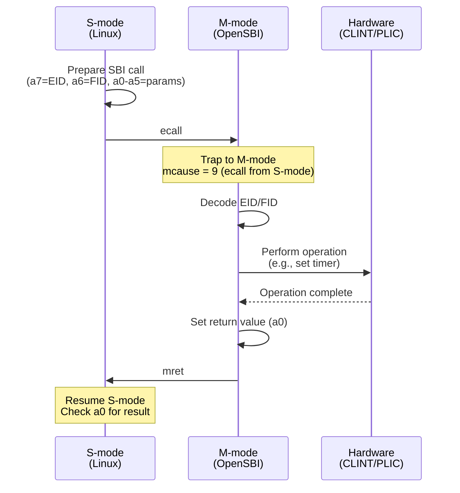
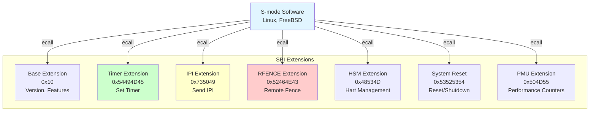
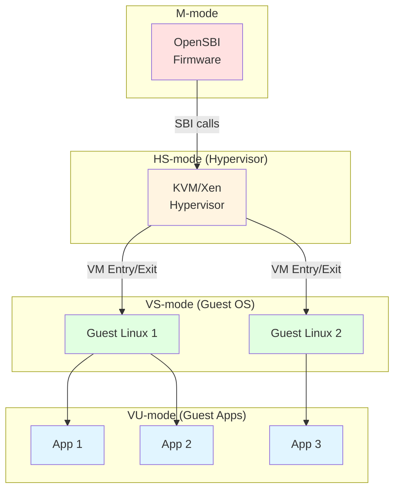
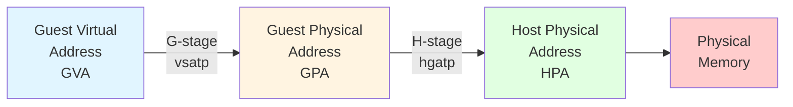

# Chapter 10: Machine Mode, SBI & Supervisor Mode

**Part VI — Booting & System Software**

---

Machine mode is RISC-V's highest privilege level, with unrestricted access to all hardware resources. But with great power comes great responsibility—M-mode firmware must be minimal, robust, and provide essential services to supervisor mode software. This chapter explores how to design M-mode firmware, implement SBI services, and support advanced features like virtualization and security.

Unlike monolithic firmware architectures, RISC-V encourages a thin M-mode layer that delegates most functionality to S-mode. This design philosophy keeps M-mode simple and portable while allowing rich OS features in S-mode. We'll examine M-mode firmware design patterns, the Supervisor Binary Interface (SBI) specification, hypervisor support through the H extension, and security features like Physical Memory Protection (PMP) and the WorldGuard extension.

---

## 10.1 Machine Mode Firmware Design

### Minimal M-mode Firmware

**The RISC-V philosophy is to keep M-mode firmware as small as possible.** A minimal M-mode firmware might be only a few kilobytes, providing just enough functionality to boot S-mode software.

**Minimal M-mode responsibilities**:

1. **Early hardware initialization**: DRAM, clocks, reset
2. **Platform-specific setup**: Configure peripherals
3. **SBI runtime services**: Timer, IPI, RFENCE, console
4. **Exception delegation**: Pass most traps to S-mode
5. **Boot S-mode software**: Set up and jump to OS

**Example minimal M-mode firmware structure**:

```c
// Minimal M-mode firmware
void m_mode_main(unsigned long hartid, void *fdt) {
    // 1. Initialize platform
    platform_init();
    
    // 2. Set up trap handler
    write_csr(mtvec, (uintptr_t)&m_trap_entry);
    
    // 3. Configure PMP
    setup_pmp();
    
    // 4. Delegate exceptions and interrupts
    write_csr(medeleg, 0xb1ff);  // Delegate most exceptions
    write_csr(mideleg, 0x0222);  // Delegate S-mode interrupts
    
    // 5. Start other harts (if multi-core)
    if (hartid == 0) {
        for (int i = 1; i < num_harts; i++) {
            start_hart(i);
        }
    }
    
    // 6. Boot S-mode payload
    boot_next_stage(hartid, fdt);
}
```

### Platform-Specific Initialization

**Each RISC-V platform has unique hardware that must be initialized.** M-mode firmware abstracts these details through a platform layer.

**Platform initialization example**:

```c
// Platform-specific initialization
struct platform_ops {
    int (*early_init)(void);
    int (*final_init)(void);
    void (*console_putc)(char c);
    int (*console_getc)(void);
    void (*timer_init)(void);
    void (*ipi_send)(unsigned long hartid);
    void (*system_reset)(void);
};

// SiFive FU740 platform
static struct platform_ops fu740_ops = {
    .early_init = fu740_early_init,
    .final_init = fu740_final_init,
    .console_putc = uart_putc,
    .console_getc = uart_getc,
    .timer_init = clint_timer_init,
    .ipi_send = clint_ipi_send,
    .system_reset = fu740_system_reset,
};

int platform_init(void) {
    struct platform_ops *ops = &fu740_ops;
    
    // Early initialization
    if (ops->early_init)
        ops->early_init();
    
    // Initialize console
    if (ops->console_putc)
        sbi_console_init(ops->console_putc, ops->console_getc);
    
    // Initialize timer
    if (ops->timer_init)
        ops->timer_init();
    
    // Final initialization
    if (ops->final_init)
        ops->final_init();
    
    return 0;
}
```

### Runtime Services

**M-mode firmware provides runtime services to S-mode** through the SBI interface. These services remain active after S-mode boots.

**Core runtime services**:

- **Timer**: Set timer interrupts (`sbi_set_timer`)
- **IPI**: Send inter-processor interrupts (`sbi_send_ipi`)
- **RFENCE**: Remote fence operations (`sbi_remote_fence_i`, `sbi_remote_sfence_vma`)
- **Console**: Debug output (`sbi_console_putchar`, `sbi_console_getchar`)
- **Hart management**: Start/stop harts (`sbi_hart_start`, `sbi_hart_stop`)
- **System reset**: Reboot/shutdown (`sbi_system_reset`)

---

## 10.2 SBI Call Interface

### SBI Call Mechanism

**S-mode software invokes SBI services using the `ecall` instruction.** This traps to M-mode, which handles the request and returns to S-mode.

**Figure 10.1: SBI Call Flow**



### SBI Calling Convention

**SBI calls use a standard register convention**:

**Input registers**:

- **a7**: Extension ID (EID) — Identifies the SBI extension
- **a6**: Function ID (FID) — Identifies the function within the extension
- **a0-a5**: Function parameters (up to 6 parameters)

**Output registers**:

- **a0**: Error code (0 = success, negative = error)
- **a1**: Return value (optional, function-specific)

**Preserved registers**: All registers except a0-a1 are preserved across SBI calls.

**Example: Send IPI**

```c
// S-mode code: Send IPI to hart 1
static inline long sbi_send_ipi(unsigned long hart_mask,
                                unsigned long hart_mask_base) {
    register unsigned long a0 asm("a0") = hart_mask;
    register unsigned long a1 asm("a1") = hart_mask_base;
    register unsigned long a6 asm("a6") = SBI_EXT_IPI_SEND_IPI;
    register unsigned long a7 asm("a7") = SBI_EXT_IPI;
    
    asm volatile("ecall"
                 : "+r"(a0), "+r"(a1)
                 : "r"(a6), "r"(a7)
                 : "memory");
    
    return a0;  // Return error code
}

// Usage
sbi_send_ipi(1 << 1, 0);  // Send IPI to hart 1
```

### SBI Error Codes

**SBI functions return standard error codes**:

```c
#define SBI_SUCCESS                0
#define SBI_ERR_FAILED            -1
#define SBI_ERR_NOT_SUPPORTED     -2
#define SBI_ERR_INVALID_PARAM     -3
#define SBI_ERR_DENIED            -4
#define SBI_ERR_INVALID_ADDRESS   -5
#define SBI_ERR_ALREADY_AVAILABLE -6
#define SBI_ERR_ALREADY_STARTED   -7
#define SBI_ERR_ALREADY_STOPPED   -8
```

**Error handling**:

```c
long ret = sbi_send_ipi(hart_mask, 0);
if (ret < 0) {
    switch (ret) {
    case SBI_ERR_INVALID_PARAM:
        pr_err("Invalid hart mask\n");
        break;
    case SBI_ERR_FAILED:
        pr_err("IPI send failed\n");
        break;
    default:
        pr_err("Unknown error: %ld\n", ret);
    }
}
```

---

## 10.3 SBI Standard Extensions

**SBI defines multiple extensions**, each providing related functionality. Extensions are identified by EID (Extension ID).

### Timer Extension (EID = 0x54494D45)

**The Timer extension provides timer interrupt services.**

**Function: `sbi_set_timer` (FID = 0)**

Sets the timer to fire at a specific time value.

```c
// Set timer to fire in 1 second
uint64_t current_time = rdtime();
uint64_t next_time = current_time + 10000000;  // 10 MHz clock

register unsigned long a0 asm("a0") = next_time;
register unsigned long a6 asm("a6") = 0;  // FID_SET_TIMER
register unsigned long a7 asm("a7") = 0x54494D45;  // EID_TIME
asm volatile("ecall" : "+r"(a0) : "r"(a6), "r"(a7) : "memory");
```

**M-mode implementation**:

```c
void sbi_set_timer(uint64_t stime_value) {
    unsigned long hartid = current_hartid();

    // Write to CLINT mtimecmp register
    volatile uint64_t *mtimecmp = (uint64_t *)(CLINT_BASE + 0x4000 + hartid * 8);
    *mtimecmp = stime_value;

    // Clear pending timer interrupt
    csr_clear(CSR_MIP, MIP_STIP);
}
```

### IPI Extension (EID = 0x735049)

**The IPI extension sends inter-processor interrupts.**

**Function: `sbi_send_ipi` (FID = 0)**

Sends IPI to a set of harts specified by a hart mask.

```c
// Send IPI to harts 1, 2, 3
unsigned long hart_mask = 0b1110;  // Bits 1, 2, 3 set
sbi_send_ipi(hart_mask, 0);
```

**M-mode implementation**:

```c
int sbi_send_ipi(unsigned long hart_mask, unsigned long hart_mask_base) {
    for (int i = 0; i < 64; i++) {
        if (hart_mask & (1UL << i)) {
            unsigned long hartid = hart_mask_base + i;

            // Write to CLINT MSIP register
            volatile uint32_t *msip = (uint32_t *)(CLINT_BASE + hartid * 4);
            *msip = 1;
        }
    }
    return SBI_SUCCESS;
}
```

### RFENCE Extension (EID = 0x52464E43)

**The RFENCE extension performs remote fence operations** (TLB flush, I-cache flush) on other harts.

**Functions**:

- `sbi_remote_fence_i` (FID = 0): Flush instruction cache
- `sbi_remote_sfence_vma` (FID = 1): Flush TLB entries
- `sbi_remote_sfence_vma_asid` (FID = 2): Flush TLB entries for specific ASID

**Example: Remote TLB flush**

```c
// Flush TLB on harts 1-3 for address range 0x80000000-0x80001000
unsigned long hart_mask = 0b1110;
unsigned long start_addr = 0x80000000;
unsigned long size = 0x1000;

register unsigned long a0 asm("a0") = hart_mask;
register unsigned long a1 asm("a1") = 0;  // hart_mask_base
register unsigned long a2 asm("a2") = start_addr;
register unsigned long a3 asm("a3") = size;
register unsigned long a6 asm("a6") = 1;  // FID_REMOTE_SFENCE_VMA
register unsigned long a7 asm("a7") = 0x52464E43;  // EID_RFENCE
asm volatile("ecall" : "+r"(a0) : "r"(a1), "r"(a2), "r"(a3), "r"(a6), "r"(a7) : "memory");
```

**M-mode implementation**:

```c
int sbi_remote_sfence_vma(unsigned long hart_mask, unsigned long hart_mask_base,
                          unsigned long start_addr, unsigned long size) {
    // Send IPI to target harts
    for (int i = 0; i < 64; i++) {
        if (hart_mask & (1UL << i)) {
            unsigned long hartid = hart_mask_base + i;

            // Store fence parameters for target hart
            remote_fence_info[hartid].start = start_addr;
            remote_fence_info[hartid].size = size;
            remote_fence_info[hartid].type = FENCE_SFENCE_VMA;

            // Send IPI
            clint_send_ipi(hartid);
        }
    }

    // Wait for completion (optional, depends on implementation)
    return SBI_SUCCESS;
}

// IPI handler on target hart
void handle_remote_fence_ipi(void) {
    struct remote_fence_info *info = &remote_fence_info[current_hartid()];

    if (info->type == FENCE_SFENCE_VMA) {
        // Perform sfence.vma
        if (info->size == 0) {
            asm volatile("sfence.vma" ::: "memory");
        } else {
            // Flush specific range (implementation-specific)
            for (unsigned long addr = info->start;
                 addr < info->start + info->size;
                 addr += PAGE_SIZE) {
                asm volatile("sfence.vma %0" :: "r"(addr) : "memory");
            }
        }
    }
}
```

### HSM Extension (EID = 0x48534D)

**The Hart State Management (HSM) extension controls hart lifecycle.**

**Functions**:

- `sbi_hart_start` (FID = 0): Start a hart
- `sbi_hart_stop` (FID = 1): Stop current hart
- `sbi_hart_get_status` (FID = 2): Get hart status

**Example: Start a hart**

```c
// Start hart 1 at address 0x80200000 with argument 0x12345678
unsigned long hartid = 1;
unsigned long start_addr = 0x80200000;
unsigned long opaque = 0x12345678;

register unsigned long a0 asm("a0") = hartid;
register unsigned long a1 asm("a1") = start_addr;
register unsigned long a2 asm("a2") = opaque;
register unsigned long a6 asm("a6") = 0;  // FID_HART_START
register unsigned long a7 asm("a7") = 0x48534D;  // EID_HSM
asm volatile("ecall" : "+r"(a0) : "r"(a1), "r"(a2), "r"(a6), "r"(a7) : "memory");
```

**M-mode implementation**:

```c
int sbi_hart_start(unsigned long hartid, unsigned long start_addr, unsigned long opaque) {
    if (hartid >= num_harts)
        return SBI_ERR_INVALID_PARAM;

    if (hart_state[hartid] != HART_STOPPED)
        return SBI_ERR_ALREADY_STARTED;

    // Set up hart entry point
    hart_entry_addr[hartid] = start_addr;
    hart_entry_arg[hartid] = opaque;

    // Wake up hart (platform-specific)
    platform_hart_start(hartid);

    hart_state[hartid] = HART_STARTED;
    return SBI_SUCCESS;
}
```

### System Reset Extension (EID = 0x53525354)

**The System Reset extension provides system-wide reset and shutdown.**

**Function: `sbi_system_reset` (FID = 0)**

```c
// Reboot the system
#define SBI_RESET_TYPE_SHUTDOWN  0
#define SBI_RESET_TYPE_COLD_REBOOT  1
#define SBI_RESET_TYPE_WARM_REBOOT  2

register unsigned long a0 asm("a0") = SBI_RESET_TYPE_COLD_REBOOT;
register unsigned long a1 asm("a1") = 0;  // Reset reason
register unsigned long a6 asm("a6") = 0;  // FID_SYSTEM_RESET
register unsigned long a7 asm("a7") = 0x53525354;  // EID_SRST
asm volatile("ecall" : "+r"(a0) : "r"(a1), "r"(a6), "r"(a7) : "memory");
// This call does not return
```

**Figure 10.2: SBI Extensions Overview**



---

## 10.4 Console and Debug Output

### Console I/O via SBI

**SBI provides simple console I/O for early debugging** before full UART drivers are available.

**Legacy console functions** (deprecated but widely used):

- `sbi_console_putchar` (EID = 0x01): Output one character
- `sbi_console_getchar` (EID = 0x02): Input one character

**Example: Early printk**

```c
void sbi_putchar(char c) {
    register unsigned long a0 asm("a0") = c;
    register unsigned long a7 asm("a7") = 0x01;  // Legacy console putchar
    asm volatile("ecall" : "+r"(a0) : "r"(a7) : "memory");
}

void early_printk(const char *str) {
    while (*str) {
        if (*str == '\n')
            sbi_putchar('\r');
        sbi_putchar(*str++);
    }
}

// Usage
early_printk("Hello from S-mode!\n");
```

**M-mode implementation**:

```c
void sbi_console_putchar(int ch) {
    // Platform-specific UART output
    uart_putc(ch);
}

int sbi_console_getchar(void) {
    // Platform-specific UART input
    return uart_getc();
}
```

**Modern approach**: Use the **Debug Console Extension (DBCN)** for more features (buffered I/O, formatted output).

---

## 10.5 Hypervisor Extension (H Extension)

### Virtualization Support in RISC-V

**The Hypervisor extension (H) adds virtualization support to RISC-V**, enabling a hypervisor to run multiple guest operating systems. Unlike ARM's built-in EL2, RISC-V virtualization is an optional extension.

**Key features**:

- **VS-mode and VU-mode**: Virtualized supervisor and user modes
- **Two-stage address translation**: Guest physical → Host physical
- **Virtual interrupts**: Virtualized interrupt delivery
- **Hypervisor CSRs**: Control virtualization features

**Privilege modes with H extension**:

- **M-mode**: Machine mode (firmware)
- **HS-mode**: Hypervisor-extended supervisor mode (hypervisor)
- **VS-mode**: Virtual supervisor mode (guest OS)
- **U-mode**: User mode (applications)
- **VU-mode**: Virtual user mode (guest applications)

**Figure 10.3: RISC-V Virtualization Architecture**



### Two-Stage Address Translation

**With the H extension, address translation happens in two stages**:

1. **First stage (G-stage)**: Guest virtual address (GVA) → Guest physical address (GPA)
   - Controlled by guest OS (vsatp CSR)
   - Guest thinks it's managing physical memory

2. **Second stage (H-stage)**: Guest physical address (GPA) → Host physical address (HPA)
   - Controlled by hypervisor (hgatp CSR)
   - Translates guest "physical" addresses to real physical addresses

**Figure 10.4: Two-Stage Address Translation**



**Example**:

- Guest OS maps virtual address `0x1000` to guest physical address `0x80001000` (using vsatp)
- Hypervisor maps guest physical `0x80001000` to host physical `0x90001000` (using hgatp)
- Final access: `0x1000` (GVA) → `0x80001000` (GPA) → `0x90001000` (HPA)

### Virtual Interrupt Handling

**The H extension virtualizes interrupts**, allowing the hypervisor to inject interrupts into guest VMs.

**Hypervisor interrupt CSRs**:

- **hvip**: Hypervisor virtual interrupt pending
- **hie**: Hypervisor interrupt enable
- **hgeip**: Hypervisor guest external interrupt pending

**Injecting a virtual interrupt**:

```c
// Hypervisor code: Inject timer interrupt into guest
void inject_guest_timer_interrupt(void) {
    // Set virtual supervisor timer interrupt pending
    csr_set(CSR_HVIP, HVIP_VSTIP);

    // When guest resumes, it will see a timer interrupt
}
```

**Guest handling**:

```c
// Guest OS sees the interrupt as a normal S-mode interrupt
void guest_timer_handler(void) {
    // Handle timer interrupt
    // Guest doesn't know it's virtualized
}
```

### VM Entry and Exit

**The hypervisor switches between HS-mode and VS-mode** using special instructions and CSR manipulation.

**VM Entry** (HS-mode → VS-mode):

```c
void vm_enter(struct vcpu *vcpu) {
    // 1. Load guest state
    write_csr(CSR_VSSTATUS, vcpu->vsstatus);
    write_csr(CSR_VSIE, vcpu->vsie);
    write_csr(CSR_VSTVEC, vcpu->vstvec);
    write_csr(CSR_VSSCRATCH, vcpu->vsscratch);
    write_csr(CSR_VSEPC, vcpu->vsepc);
    write_csr(CSR_VSCAUSE, vcpu->vscause);
    write_csr(CSR_VSTVAL, vcpu->vstval);
    write_csr(CSR_VSATP, vcpu->vsatp);

    // 2. Set hstatus.SPV = 1 (virtualization enabled)
    csr_set(CSR_HSTATUS, HSTATUS_SPV);

    // 3. Set sepc to guest entry point
    write_csr(CSR_SEPC, vcpu->pc);

    // 4. Enter VS-mode
    asm volatile("sret");  // Return to VS-mode
}
```

**VM Exit** (VS-mode → HS-mode):

When the guest executes certain instructions (ecall, WFI, privileged CSR access) or takes a trap, control returns to the hypervisor.

```c
void vm_exit_handler(struct vcpu *vcpu) {
    // Save guest state
    vcpu->vsstatus = read_csr(CSR_VSSTATUS);
    vcpu->vsepc = read_csr(CSR_VSEPC);
    vcpu->vscause = read_csr(CSR_VSCAUSE);
    vcpu->vstval = read_csr(CSR_VSTVAL);
    vcpu->pc = read_csr(CSR_SEPC);

    // Handle exit reason
    unsigned long cause = read_csr(CSR_SCAUSE);

    switch (cause) {
    case CAUSE_VIRTUAL_SUPERVISOR_ECALL:
        // Guest made hypercall
        handle_hypercall(vcpu);
        break;
    case CAUSE_GUEST_PAGE_FAULT:
        // Guest page fault (G-stage or H-stage)
        handle_guest_page_fault(vcpu);
        break;
    case CAUSE_VIRTUAL_INSTRUCTION:
        // Guest tried to execute privileged instruction
        emulate_instruction(vcpu);
        break;
    default:
        // Other traps
        inject_exception_to_guest(vcpu, cause);
    }
}
```

---

## 10.6 Security Model

### Physical Memory Protection (PMP)

**PMP is RISC-V's primary memory protection mechanism**, enforced in M-mode. It defines memory regions and access permissions for lower privilege modes.

**PMP use cases**:

- Protect M-mode firmware from S-mode
- Isolate security-critical regions
- Enforce memory access policies
- Implement basic TEE (Trusted Execution Environment)

**PMP configuration registers**:

- **pmpcfg0-pmpcfg15**: Configuration for PMP entries (8 entries per register)
- **pmpaddr0-pmpaddr63**: Address registers (up to 64 entries)

**PMP entry format** (pmpcfg):

```
Bits [7:0] for each entry:
  [7]: L (Lock) - Entry cannot be modified until reset
  [6:5]: Reserved
  [4:3]: A (Address matching mode)
         00 = OFF, 01 = TOR, 10 = NA4, 11 = NAPOT
  [2]: X (Execute permission)
  [1]: W (Write permission)
  [0]: R (Read permission)
```

**Example: Protect M-mode firmware**

```c
void protect_m_mode_firmware(void) {
    // Protect 0x80000000 - 0x80100000 (1 MB M-mode firmware)
    // Use TOR (Top-Of-Range) mode

    // Entry 0: Start address (0x80000000)
    write_csr(pmpaddr0, 0x80000000 >> 2);

    // Entry 1: End address (0x80100000)
    write_csr(pmpaddr1, 0x80100000 >> 2);

    // Configure: TOR mode, R+X, Locked
    uint8_t cfg = PMP_R | PMP_X | PMP_TOR | PMP_L;
    write_csr(pmpcfg0, cfg << 8);  // Entry 1 config

    // Now S-mode cannot access 0x80000000 - 0x80100000
}
```

### Enhanced PMP (ePMP)

**ePMP extends PMP with additional security features**:

- **Rule locking**: Prevent modification of PMP entries
- **M-mode lockdown**: Restrict M-mode access to specific regions
- **Whitelist mode**: Default deny, explicit allow

**ePMP adds mseccfg CSR**:

```
Bits:
  [2]: RLB (Rule Locking Bypass) - Allow M-mode to modify locked entries
  [1]: MMWP (Machine Mode Whitelist Policy) - Enforce whitelist for M-mode
  [0]: MML (Machine Mode Lockdown) - Restrict M-mode access
```

**Example: M-mode lockdown**

```c
void enable_m_mode_lockdown(void) {
    // Set MML bit: M-mode can only access regions with L=1 and X=0
    write_csr(CSR_MSECCFG, MSECCFG_MML);

    // Now M-mode is restricted to explicitly allowed regions
}
```

### Comparison with ARM TrustZone

**RISC-V PMP vs ARM TrustZone**:

| Feature | RISC-V PMP | ARM TrustZone |
|---------|------------|---------------|
| **Isolation** | Region-based (up to 64 regions) | World-based (Secure/Non-secure) |
| **Granularity** | 4 bytes to 2^64 bytes | 4 KB minimum |
| **Privilege** | M-mode enforced | EL3 enforced |
| **Secure world** | No built-in secure world | Dedicated S-EL0/S-EL1 |
| **Complexity** | Simple, flexible | Complex, rich features |
| **Use case** | Firmware protection, basic TEE | Full TEE, secure boot, DRM |

**RISC-V security philosophy**: Provide minimal hardware mechanisms (PMP), build rich security features in software (TEE frameworks like Keystone, Penglai).

**ARM TrustZone philosophy**: Provide rich hardware support for secure world, standardize TEE architecture.

---

## Summary

Machine mode and SBI provide the foundation for RISC-V system software. This chapter covered five key areas:

**M-mode firmware** is designed to be minimal and platform-specific. It initializes hardware, sets up memory protection, and provides runtime services through the SBI interface. Unlike ARM's extensive EL3 firmware, RISC-V keeps M-mode simple and delegates most functionality to S-mode.

**SBI interface** provides a standard ecall-based interface between M-mode firmware and S-mode operating systems. The calling convention uses registers a0-a7 for parameters and returns error codes in a0. This standardization ensures that OS kernels can run on any RISC-V platform without modification.

**SBI extensions** cover essential system services: Timer extension for scheduling, IPI extension for inter-processor communication, RFENCE extension for TLB synchronization, HSM extension for hart lifecycle management, and System Reset extension for reboot and shutdown. Each extension is identified by an Extension ID (EID) and provides multiple functions.

**Hypervisor extension** adds virtualization support through VS-mode and VU-mode, enabling guest operating systems to run under a hypervisor. Two-stage address translation (GVA → GPA → HPA) isolates guest memory, while virtual interrupt injection allows the hypervisor to deliver interrupts to guests. VM entry and exit are managed through CSR manipulation and the SRET instruction.

**PMP and ePMP** provide memory protection by defining access permissions for memory regions. PMP is simpler than ARM TrustZone but sufficient for protecting M-mode firmware and implementing basic trusted execution environments. ePMP adds enhanced security features like M-mode lockdown and rule locking.

In the next chapter, we'll explore RISC-V ISA extensions, starting with the standard extensions (M, A, F, D, C) and moving to advanced features like Vector and Bit Manipulation.
