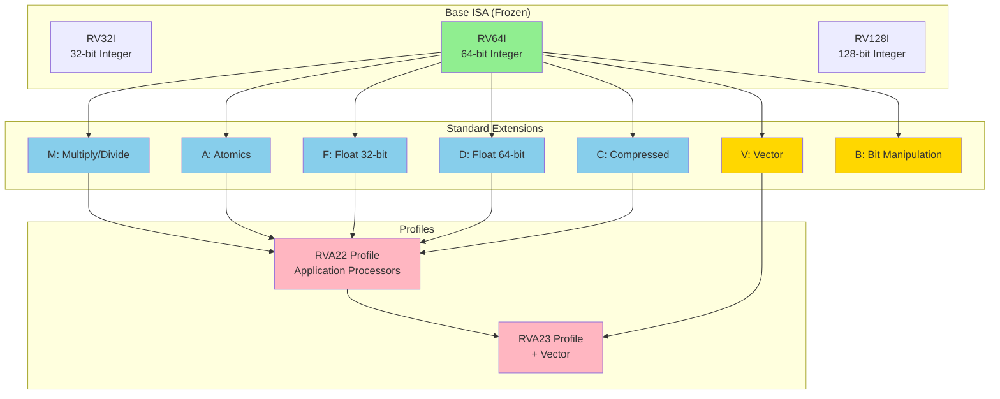

# Chapter 11. RISC-V Standard Extensions

**Part VII — ISA Extensions**

---

## 🎯 Learning Objectives

After reading this chapter, you will be able to:

1. **Decode ISA Naming**: Parse the meaning of ISA strings like RV64GC, RV32IM
2. **Understand the G Package**: Know that G = IMAFD and its historical background
3. **Master Z/X Extension Logic**: Understand the naming rules for new-style Extensions
4. **Compare Hardware vs Software Implementation**: Understand the performance difference between hardware instructions and software emulation
5. **Detect Extension Presence**: Query CPU-supported features via the `misa` CSR

---

## 💡 Scenario: Skill Trees and DLCs

> **Scene**: Junior is reading Linux Kernel compile options and gets intimidated by a long ISA string.

**Junior**: "Senior, is this `MARCH` variable a Wi-Fi password? `RV64IMAFDC_Zicsr`... who can read this?"

**Senior**: (laughs) "This is RISC-V's ID card. Don't worry—let's treat it like RPG character stats. Breaking it down makes it simple."

**Junior**: "RPG stats?"

**Senior**: "Look at the first two characters **RV64**—this means it's a 64-bit character that can wield two-handed swords (64-bit registers). RV32 would be 32-bit."

**Junior**: "I get that part. What about that string of letters?"

**Senior**: "Those are 'skills it has learned.' Each letter represents an ability:

| Letter | Name | Analogy | Function |
|--------|------|---------|----------|
| **I** | Integer | Basic Training | Addition, subtraction, logic ops—essential skill |
| **M** | Multiply | Multiplication Skill | Hardware multiply/divide—without it, you do N additions |
| **A** | Atomic | Locking Skill | Atomic operations—the foundation of spinlocks |
| **F** | Float | Single-Precision Magic | 32-bit floating-point math |
| **D** | Double | Double-Precision Magic | 64-bit floating-point math |
| **C** | Compressed | Contortion Skill | 16-bit compressed instructions—saves space |

"

**Junior**: "Makes sense. But what about **RV64GC** that everyone talks about? There's no G in that table!"

**Senior**: "**G (General)** is a 'value bundle.' Since IMAFD are so commonly used together, the spec defines **G = I + M + A + F + D**. So `RV64GC` is really shorthand for `RV64IMAFDC`—the baseline for running Linux."

**Junior**: "Got it! What about that **Z** prefix at the end? Hidden skill?"

**Senior**: "Pretty much. Since 26 letters aren't enough anymore, newer features (or features split out from I) use **Z** prefix plus a name. Think of them as **DLC expansions**.

For example, `Zicsr` means CSR operations are supported, `Zifencei` means instruction fence is supported. This 'password' just tells the compiler: 'This CPU bought these DLCs, feel free to use these instructions'!"

**Junior**: "Ha! So it's just a skill list—that makes it much clearer!"

---

RISC-V's modular design is one of its most distinctive features. Unlike monolithic instruction set architectures that bundle everything together, RISC-V separates functionality into a minimal base ISA plus optional extensions. This approach allows implementations to include only the features they need, from tiny microcontrollers to high-performance servers.

The base integer ISA (RV32I or RV64I) provides just enough instructions to run a complete operating system and applications—47 instructions in total. But most practical systems need more: multiplication and division, atomic operations for synchronization, floating-point arithmetic, and compressed instructions for code density. These capabilities come from standard extensions, each identified by a single letter.

Understanding these extensions is crucial for anyone working with RISC-V. Compiler writers need to know which instructions are available. Hardware designers must decide which extensions to implement. Software developers need to understand the performance implications of using extension instructions versus emulating them in software.

In this chapter, we'll explore the standard extensions that form the foundation of most RISC-V systems: M for multiplication, A for atomics, F and D for floating-point, C for compressed instructions, and B for bit manipulation. We'll see how these extensions integrate with the base ISA and compare them with similar features in ARM and x86.

---

## 11.1 Extension Overview

**The Extension Model**

RISC-V extensions follow a carefully designed model. The base ISA (I) is frozen and will never change. Extensions add functionality without modifying the base. Once an extension is ratified, it too is frozen, ensuring long-term stability.

Extensions are identified by single letters: M, A, F, D, C, V, B, and so on. A processor's capabilities are described by concatenating these letters: RV64IMAFD means a 64-bit processor with integer, multiplication, atomic, single-precision float, and double-precision float extensions. The letter G is shorthand for IMAFD (general-purpose), so RV64GC means RV64IMAFD plus compressed instructions.

**Standard vs Non-Standard Extensions**

Standard extensions are defined by RISC-V International and ratified through a formal process. They have reserved letter codes and are guaranteed to be compatible across implementations. Non-standard extensions use the X prefix (like Xvendor) and are vendor-specific.

Custom extensions can add specialized instructions without conflicting with standard ones. The instruction encoding reserves opcode space for custom instructions, allowing vendors to innovate while maintaining compatibility with standard software.

**Extension Discovery**

Software can detect which extensions are present by reading the `misa` CSR (Machine ISA register). Each bit in `misa` corresponds to an extension:

```c
// Read misa to detect extensions
unsigned long misa = read_csr(CSR_MISA);

bool has_M = (misa & (1 << ('M' - 'A')));  // Bit 12
bool has_A = (misa & (1 << ('A' - 'A')));  // Bit 0
bool has_F = (misa & (1 << ('F' - 'A')));  // Bit 5
bool has_D = (misa & (1 << ('D' - 'A')));  // Bit 3
bool has_C = (misa & (1 << ('C' - 'A')));  // Bit 2
```

On some implementations, `misa` is read-only. On others, writing to `misa` can enable or disable extensions dynamically, though this is rare in practice.

**Figure 11.1: RISC-V Extension Ecosystem**



The diagram shows how extensions build on the base ISA and combine into profiles for specific use cases.

---

## 11.2 M Extension: Integer Multiplication and Division

**Why M is Optional**

The M extension adds integer multiplication and division instructions. You might wonder why these fundamental operations aren't in the base ISA. The answer is simplicity and flexibility.

Tiny embedded systems (like IoT sensors) may never need multiplication or division. Making M optional allows these systems to save chip area and power. Software can emulate multiplication using shifts and adds if needed, though much slower than hardware.

For most systems, M is essential. It's part of the G (general-purpose) bundle and required by the RVA22 profile for application processors.

**Multiplication Instructions**

The M extension provides four multiplication instructions for RV32 and RV64:

*MUL rd, rs1, rs2*: Multiply rs1 by rs2, store the lower XLEN bits in rd. This is the most common multiplication, used when you only need the low-order result.

```assembly
# Example: Multiply two 32-bit numbers
li a0, 100
li a1, 200
mul a2, a0, a1      # a2 = 100 * 200 = 20000
```

*MULH rd, rs1, rs2*: Multiply signed rs1 by signed rs2, store the upper XLEN bits in rd. Used for detecting overflow or implementing multi-word multiplication.

*MULHU rd, rs1, rs2*: Multiply unsigned rs1 by unsigned rs2, store the upper XLEN bits in rd.

*MULHSU rd, rs1, rs2*: Multiply signed rs1 by unsigned rs2, store the upper XLEN bits in rd. This asymmetric variant is useful for certain algorithms.

**Why separate high and low multiply?** A full multiplication of two XLEN-bit numbers produces a 2×XLEN-bit result. MUL gives you the low half, MULH/MULHU/MULHSU give you the high half. To get the full result, you execute both:

```assembly
# 64-bit × 64-bit = 128-bit multiplication
mul  a2, a0, a1     # Low 64 bits
mulh a3, a0, a1     # High 64 bits
# Result is in a3:a2 (128 bits)
```

**Division and Remainder**

The M extension also provides division and remainder instructions:

*DIV rd, rs1, rs2*: Signed division, rd = rs1 / rs2 (truncated toward zero).

*DIVU rd, rs1, rs2*: Unsigned division, rd = rs1 / rs2.

*REM rd, rs1, rs2*: Signed remainder, rd = rs1 % rs2.

*REMU rd, rs1, rs2*: Unsigned remainder, rd = rs1 % rs2.

```assembly
# Example: Divide 100 by 7
li a0, 100
li a1, 7
div a2, a0, a1      # a2 = 100 / 7 = 14
rem a3, a0, a1      # a3 = 100 % 7 = 2
```

**Division by zero** does not trap in RISC-V. Instead, it returns defined values: division by zero returns -1 (all bits set), and remainder by zero returns the dividend. This allows software to check for zero explicitly if needed, without the overhead of trap handling.

**RV64 Word Operations**

On RV64, the M extension adds word-sized (32-bit) variants that operate on the lower 32 bits and sign-extend the result to 64 bits:

*MULW, DIVW, DIVUW, REMW, REMUW*

```assembly
# RV64: 32-bit multiplication with sign extension
li a0, 0x80000000   # -2147483648 (32-bit)
li a1, 2
mulw a2, a0, a1     # a2 = 0xFFFFFFFF00000000 (sign-extended)
```

These are essential for efficiently handling 32-bit data on 64-bit processors.

**Performance Characteristics**

Multiplication and division are slower than addition and logic operations. Typical latencies:

- MUL: 2-4 cycles (pipelined, throughput 1/cycle)
- DIV: 10-40 cycles (not pipelined, variable latency)

Division is particularly expensive. Compilers optimize division by constants into multiplication by the reciprocal when possible.

---

## 11.3 A Extension: Atomic Instructions

**The Need for Atomics**

In multi-processor systems, multiple harts (hardware threads) may access shared memory simultaneously. Without atomic operations, race conditions can corrupt data. Consider incrementing a shared counter:

```c
// Non-atomic increment (WRONG for multi-threaded code)
int counter = 0;

void increment() {
    counter++;  // Read-modify-write: NOT atomic!
}
```

This compiles to three separate instructions:

```assembly
lw   a0, counter
addi a0, a0, 1
sw   a0, counter
```

If two harts execute this simultaneously, both might read the same value, increment it, and write back the same result—losing one increment. Atomic instructions solve this problem.

**Load-Reserved / Store-Conditional**

The A extension provides two fundamental primitives for building atomic operations:

*LR.W rd, (rs1)*: Load-Reserved Word. Loads a word from memory and registers a reservation on that address.

*SC.W rd, rs1, (rs2)*: Store-Conditional Word. Stores rs1 to memory at rs2 only if the reservation is still valid. Returns 0 in rd on success, non-zero on failure.

The reservation is invalidated if another hart writes to the reserved address or if certain events occur (context switch, cache eviction, etc.).

**Atomic increment using LR/SC**:

```assembly
# Atomic increment of counter
retry:
    lr.w  a0, (a1)      # Load counter, set reservation
    addi  a0, a0, 1     # Increment
    sc.w  a2, a0, (a1)  # Store if reservation valid
    bnez  a2, retry     # Retry if SC failed
```

If another hart modifies the counter between LR and SC, the SC fails and the loop retries. This ensures atomicity.

**Atomic Memory Operations (AMO)**

For common atomic operations, the A extension provides dedicated AMO instructions that are more efficient than LR/SC loops:

*AMOSWAP.W rd, rs2, (rs1)*: Atomically swap memory[rs1] with rs2, return old value in rd.

*AMOADD.W rd, rs2, (rs1)*: Atomically add rs2 to memory[rs1], return old value in rd.

*AMOAND.W, AMOOR.W, AMOXOR.W*: Atomic AND, OR, XOR.

*AMOMIN.W, AMOMAX.W, AMOMINU.W, AMOMAXU.W*: Atomic min/max (signed and unsigned).

```assembly
# Atomic increment using AMO (simpler than LR/SC)
amoadd.w zero, a0, (a1)  # Atomically add a0 to memory[a1]
```

**Atomic Ordering Annotations**

AMO and LR/SC instructions can have ordering annotations:

*.aq* (acquire): Subsequent memory operations cannot be reordered before this instruction.

*.rl* (release): Previous memory operations cannot be reordered after this instruction.

*.aqrl*: Both acquire and release.

```assembly
# Atomic swap with acquire-release semantics
amoswap.w.aqrl a0, a1, (a2)
```

These annotations are crucial for implementing lock-free data structures and memory barriers (see Chapter 6 on memory ordering).

**RV64 Variants**

On RV64, the A extension provides both word (32-bit) and doubleword (64-bit) variants:

*LR.W / SC.W*: 32-bit load-reserved / store-conditional
*LR.D / SC.D*: 64-bit load-reserved / store-conditional
*AMOADD.W / AMOADD.D*: 32-bit / 64-bit atomic add
(and similarly for other AMO operations)

**Comparison with ARM and x86**

*ARM*: Uses LDREX/STREX (load-exclusive / store-exclusive), similar to RISC-V's LR/SC. ARMv8.1 added atomic instructions (LDADD, LDSWP, etc.) similar to RISC-V's AMO.

*x86*: Uses LOCK prefix with normal instructions (LOCK ADD, LOCK XCHG, etc.) and dedicated atomic instructions (CMPXCHG). x86's model is more complex but provides strong ordering by default.

RISC-V's approach is cleaner: LR/SC for flexibility, AMO for common cases, explicit ordering annotations for performance.

---

## 11.4 F and D Extensions: Floating-Point

**Floating-Point in RISC-V**

The F extension adds single-precision (32-bit) floating-point, and the D extension adds double-precision (64-bit). Both follow the IEEE 754 standard, ensuring compatibility with other architectures and programming languages.

Floating-point is optional because not all systems need it. Embedded controllers often work with integers only. But for scientific computing, graphics, and many applications, floating-point is essential.

**Floating-Point Register File**

F and D extensions add a separate register file with 32 floating-point registers, f0 through f31. Each register is FLEN bits wide, where FLEN is 32 for F-only, 64 for D, and 128 for Q (quad-precision, future extension).

The separation of integer and floating-point registers simplifies hardware design and allows both to be accessed simultaneously. It also follows the tradition of RISC architectures like MIPS and SPARC.

**Floating-Point CSRs**

Three CSRs control floating-point behavior:

*fcsr* (Floating-Point Control and Status Register): Combined control and status.

*frm* (Floating-Point Rounding Mode): Bits [7:5] of fcsr, selects rounding mode:

- 000: Round to nearest, ties to even (default)
- 001: Round toward zero (truncate)
- 010: Round down (toward -∞)
- 011: Round up (toward +∞)
- 100: Round to nearest, ties to max magnitude

*fflags* (Floating-Point Exception Flags): Bits [4:0] of fcsr, records exceptions:

- NV: Invalid operation
- DZ: Divide by zero
- OF: Overflow
- UF: Underflow
- NX: Inexact

```c
// Set rounding mode to round toward zero
write_csr(CSR_FRM, 0b001);

// Check for floating-point exceptions
unsigned int flags = read_csr(CSR_FFLAGS);
if (flags & 0x10) {
    // Invalid operation occurred
}
```

**F Extension Instructions**

The F extension provides arithmetic, comparison, conversion, and move instructions for single-precision floats:

*Arithmetic*: FADD.S, FSUB.S, FMUL.S, FDIV.S, FSQRT.S

*Fused multiply-add*: FMADD.S, FMSUB.S, FNMADD.S, FNMSUB.S

*Comparison*: FEQ.S, FLT.S, FLE.S

*Conversion*: FCVT.W.S (float to int), FCVT.S.W (int to float), and variants

*Move*: FMV.X.W (float reg to int reg), FMV.W.X (int reg to float reg)

*Load/Store*: FLW, FSW

```assembly
# Example: Compute (a * b) + c using fused multiply-add
flw  fa0, 0(a0)     # Load a
flw  fa1, 4(a0)     # Load b
flw  fa2, 8(a0)     # Load c
fmadd.s fa3, fa0, fa1, fa2  # fa3 = (a * b) + c
fsw  fa3, 12(a0)    # Store result
```

**D Extension Instructions**

The D extension extends F with double-precision operations. All F instructions have D equivalents (FADD.D, FMUL.D, etc.). Additionally, D provides conversions between single and double precision:

*FCVT.S.D*: Convert double to single (with rounding)
*FCVT.D.S*: Convert single to double (exact)

```assembly
# Convert single to double
flw  fa0, 0(a0)     # Load single-precision
fcvt.d.s fa1, fa0   # Convert to double-precision
fsd  fa1, 0(a1)     # Store double-precision
```

**NaN Boxing**

On RV64 with F extension (but not D), single-precision values in 64-bit registers must be NaN-boxed: the upper 32 bits are set to all 1s. This allows hardware to distinguish between valid single-precision values and invalid data.

```
Valid single-precision in 64-bit register:
[63:32] = 0xFFFFFFFF
[31:0]  = single-precision value
```

With D extension, this is not needed because registers are naturally 64 bits.

**Performance**

Floating-point operations are typically slower than integer operations:

- FADD/FSUB: 3-5 cycles latency
- FMUL: 4-6 cycles latency
- FDIV: 10-20 cycles latency (not pipelined)
- FSQRT: 15-30 cycles latency

Fused multiply-add (FMADD) is particularly valuable: it computes (a × b) + c in one instruction with a single rounding, faster and more accurate than separate multiply and add.

---

## 11.5 C Extension: Compressed Instructions

**The Code Density Problem**

RISC architectures traditionally use fixed-length 32-bit instructions. This simplifies decoding and pipelining but wastes memory and instruction cache space. Many common operations (like "add register to register" or "load from stack") don't need 32 bits to encode.

The C extension addresses this by adding 16-bit compressed instructions that can be freely mixed with standard 32-bit instructions. This improves code density by 25-30% with minimal hardware complexity.

**How Compressed Instructions Work**

Compressed instructions are 16 bits and aligned on 16-bit boundaries. The processor's fetch unit automatically expands them to equivalent 32-bit instructions before decoding. This expansion is transparent to software—compressed instructions are just a more compact encoding.

The low 2 bits of an instruction indicate its length:

- `xx00`, `xx01`, `xx10`: 16-bit compressed instruction (C extension)
- `xxx11`: 32-bit standard instruction (or longer for future extensions)

This encoding allows the processor to determine instruction boundaries without pre-decoding.

**Common Compressed Instructions**

The C extension provides compressed forms of the most frequent operations:

*C.ADD rd, rs2*: Add register to register (expands to ADD rd, rd, rs2)

*C.ADDI rd, imm*: Add immediate (expands to ADDI rd, rd, imm)

*C.LW rd', offset(rs1')*: Load word (expands to LW rd, offset(rs1))

*C.SW rs2', offset(rs1')*: Store word (expands to SW rs2, offset(rs1))

*C.J offset*: Jump (expands to JAL x0, offset)

*C.JALR rs1*: Jump and link register (expands to JALR x1, 0(rs1))

*C.MV rd, rs2*: Move register (expands to ADD rd, x0, rs2)

*C.LI rd, imm*: Load immediate (expands to ADDI rd, x0, imm)

```assembly
# Standard 32-bit instructions (8 bytes total)
addi sp, sp, -16
sw   ra, 12(sp)

# Compressed equivalents (4 bytes total)
c.addi16sp sp, -16
c.swsp ra, 12
```

**Register Encoding Restrictions**

To fit in 16 bits, compressed instructions have restrictions:

- Many use only registers x8-x15 (s0-s1, a0-a5), encoded in 3 bits
- Immediates are smaller (6-bit instead of 12-bit)
- Offsets are scaled (e.g., word loads use offset×4)

The compiler and assembler handle these restrictions automatically, using compressed instructions when possible and falling back to 32-bit instructions when necessary.

**Code Density Improvement**

Typical programs see 25-30% code size reduction with the C extension. This translates to:

- Better instruction cache utilization
- Reduced memory bandwidth
- Lower power consumption (fewer instruction fetches)

For embedded systems with limited flash memory, this can be the difference between fitting the program or not.

**Mixing 16-bit and 32-bit Instructions**

Compressed and standard instructions can be freely mixed in the same program. The processor handles alignment automatically:

```
Address  Instruction
0x1000:  c.addi sp, -16     (16-bit)
0x1002:  c.sw ra, 12(sp)    (16-bit)
0x1004:  jal ra, function   (32-bit)
0x1008:  c.lwsp ra, 12      (16-bit)
```

Branch targets and jump addresses can be any 16-bit aligned address, not just 32-bit aligned.

---

## 11.6 B Extension: Bit Manipulation

**Why Bit Manipulation Matters**

Bit manipulation operations—counting leading zeros, rotating bits, extracting bit fields—are common in cryptography, compression, hashing, and low-level systems programming. Without dedicated instructions, these operations require multiple instructions and are slow.

The B extension adds efficient bit manipulation instructions. Unlike M, A, F, D, and C, the B extension is modular, divided into several sub-extensions that can be implemented independently.

**B Extension Sub-Extensions**

*Zba*: Address generation instructions (shift-add for array indexing)

*Zbb*: Basic bit manipulation (count leading zeros, rotate, min/max, sign-extend)

*Zbc*: Carry-less multiplication (for cryptography)

*Zbs*: Single-bit operations (set, clear, invert, extract)

A processor might implement Zba and Zbb for general use, while omitting Zbc if cryptography isn't needed.

**Zba: Address Generation**

Zba provides shift-add instructions for efficient array indexing:

*SH1ADD rd, rs1, rs2*: rd = (rs1 << 1) + rs2
*SH2ADD rd, rs1, rs2*: rd = (rs1 << 2) + rs2
*SH3ADD rd, rs1, rs2*: rd = (rs1 << 3) + rs2

```c
// Array indexing: address = base + (index * sizeof(element))
int array[100];
int index = 10;

// Without Zba (3 instructions):
// slli t0, index, 2    # t0 = index * 4
// add  t0, t0, base    # t0 = base + (index * 4)
// lw   a0, 0(t0)

// With Zba (2 instructions):
// sh2add t0, index, base  # t0 = base + (index * 4)
// lw     a0, 0(t0)
```

**Zbb: Basic Bit Manipulation**

Zbb provides commonly used bit operations:

*CLZ rd, rs*: Count leading zeros
*CTZ rd, rs*: Count trailing zeros
*CPOP rd, rs*: Count population (number of 1 bits)

*ROL rd, rs1, rs2*: Rotate left
*ROR rd, rs1, rs2*: Rotate right

*MIN rd, rs1, rs2*: Signed minimum
*MAX rd, rs1, rs2*: Signed maximum
*MINU, MAXU*: Unsigned variants

*SEXT.B, SEXT.H*: Sign-extend byte/halfword to XLEN

```assembly
# Count leading zeros (useful for finding highest set bit)
li   a0, 0x00001000
clz  a1, a0          # a1 = 51 (on RV64)

# Rotate right by 4 bits
li   a0, 0x12345678
rori a1, a0, 4       # a1 = 0x81234567
```

**Zbc: Carry-Less Multiplication**

Zbc provides carry-less multiplication, used in cryptographic algorithms like AES-GCM:

*CLMUL rd, rs1, rs2*: Carry-less multiply (low half)
*CLMULH rd, rs1, rs2*: Carry-less multiply (high half)

Carry-less multiplication is like normal multiplication but without carries between bit positions—essentially XOR instead of ADD.

**Zbs: Single-Bit Operations**

Zbs provides instructions for manipulating individual bits:

*BSET rd, rs1, rs2*: Set bit rs2 in rs1
*BCLR rd, rs1, rs2*: Clear bit rs2 in rs1
*BINV rd, rs1, rs2*: Invert bit rs2 in rs1
*BEXT rd, rs1, rs2*: Extract bit rs2 from rs1

```assembly
# Set bit 5 in register a0
bseti a0, a0, 5      # a0 |= (1 << 5)

# Extract bit 3 from register a1
bexti a2, a1, 3      # a2 = (a1 >> 3) & 1
```

**Performance Impact**

Bit manipulation instructions typically execute in 1 cycle, same as basic ALU operations. Without them, equivalent operations might take 3-10 instructions. For cryptography and compression, this can mean 2-5× speedup.

---

## 11.7 Zicsr and Zifencei

**Zicsr: CSR Instructions**

The Zicsr extension defines the CSR (Control and Status Register) instructions we've used throughout this book: CSRRW, CSRRS, CSRRC, and their immediate variants.

Historically, these were part of the base I extension. But to keep the base ISA truly minimal, they were separated into Zicsr. Any system that needs to access CSRs (which is almost all systems) implements Zicsr.

**Zifencei: Instruction Fence**

The Zifencei extension provides the FENCE.I instruction, which synchronizes instruction and data caches. This is necessary when code is modified at runtime (self-modifying code, JIT compilation, dynamic linking).

*FENCE.I*: Ensures that all previous stores to instruction memory are visible to subsequent instruction fetches.

```assembly
# Example: JIT compiler writes new code to memory
sw   a0, 0(a1)       # Write instruction to memory
sw   a2, 4(a1)       # Write another instruction
fence.i              # Synchronize I-cache and D-cache
jalr a1              # Jump to newly written code
```

Without FENCE.I, the processor might execute stale instructions from the I-cache instead of the newly written code.

Like Zicsr, Zifencei was separated from the base ISA to keep it minimal. Systems that don't modify code at runtime can omit it.

---

## 11.8 RVA22 Profile

**The Need for Profiles**

With so many optional extensions, how do software developers know what features they can rely on? A processor implementing just RV64I is very different from one implementing RV64IMAFDCV.

Profiles solve this problem by defining standard combinations of extensions for specific use cases. Software targeting a profile can assume all mandatory features are present.

**RVA22 Profile**

The RVA22 profile (ratified in 2022) targets application processors capable of running rich operating systems like Linux. It comes in two variants:

*RVA22U (Unprivileged)*: Specifies the user-mode ISA. Mandatory extensions include:

- RV64I base ISA
- M, A, F, D, C extensions (i.e., RV64GC)
- Zicsr, Zifencei
- Zba, Zbb, Zbs (address generation and basic bit manipulation)
- Various other Z-extensions for specific functionality

*RVA22S (Supervisor)*: Adds supervisor-mode requirements for OS support:

- Sv39 virtual memory (39-bit virtual addresses)
- Supervisor mode and required CSRs
- SBI (Supervisor Binary Interface) support
- Additional privilege-related extensions

**Profile Compliance**

A processor claiming RVA22S compliance guarantees it can run standard Linux distributions and other Unix-like operating systems without modification. This is crucial for software portability.

Future profiles (RVA23, RVA24) will add more features. RVA23 makes the Vector extension (V) mandatory, recognizing the importance of SIMD for modern applications.

**Embedded Profiles**

Separate profiles exist for embedded systems:

- Microcontroller profiles (RVM): Minimal feature sets for resource-constrained devices
- Real-time profiles: Add requirements for deterministic interrupt handling

These profiles ensure that embedded software can target well-defined platforms.

---

## 🛠️ Hands-on Lab: Lab 11.1 — The Power of Hardware Acceleration (Soft vs Hard Mul)

This lab demonstrates the performance difference between "having the M Extension" and "not having the M Extension" through compiler options.

### Lab Objectives

1. Use the same C code (multiplication operations)
2. Compile for **RV64I** (no multiply instruction) and **RV64IM** (with multiply instruction)
3. Observe Assembly differences
4. Compare execution cycles

### Code

Create `mul_test.c`:

```c
// mul_test.c - Compare software vs hardware multiply
#include <stdint.h>

// Read cycle counter
static inline uint64_t read_cycles(void) {
    uint64_t val;
    asm volatile("csrr %0, mcycle" : "=r"(val));
    return val;
}

// Simple multiply function
long multiply(long a, long b) {
    return a * b;
}

// Multiple multiplication test
volatile long result;
void bench_multiply(int iterations) {
    long a = 123456;
    long b = 789012;
    for (int i = 0; i < iterations; i++) {
        result = multiply(a, b);
        a++;
    }
}

int main(void) {
    int iterations = 10000;

    uint64_t start = read_cycles();
    bench_multiply(iterations);
    uint64_t end = read_cycles();

    // Simple output (assumes putchar available)
    // cycles = end - start
    return 0;
}
```

### Experiment Steps

**Step A: Compile as RV64IM (with multiply instruction)**

```bash
# Tell compiler it can use multiply instructions (mul, mulw, etc.)
riscv64-unknown-elf-gcc -O2 -march=rv64im -mabi=lp64 \
    -c mul_test.c -o mul_hard.o

# View Assembly
riscv64-unknown-elf-objdump -d mul_hard.o
```

**Observe Assembly**:

```assembly
multiply:
    mul     a0, a0, a1    # Direct hardware multiply, 1 cycle
    ret
```

**Step B: Compile as RV64I (no multiply instruction)**

```bash
# Tell compiler "this CPU doesn't know multiplication"
riscv64-unknown-elf-gcc -O2 -march=rv64i -mabi=lp64 \
    -c mul_test.c -o mul_soft.o

# View Assembly
riscv64-unknown-elf-objdump -d mul_soft.o
```

**Observe Assembly**:

```assembly
multiply:
    call    __muldi3      # Call software emulation library (libgcc)
```

### Analysis

`__muldi3` is libgcc's software multiply implementation, internally composed of dozens of `add`, `shift`, `branch` instructions:

```assembly
# Simplified logic of __muldi3 (Shift-and-Add algorithm)
__muldi3:
    li t0, 0          # result = 0
loop:
    andi t1, a1, 1    # if (b & 1)
    beqz t1, skip
    add t0, t0, a0    #   result += a
skip:
    slli a0, a0, 1    # a <<= 1
    srli a1, a1, 1    # b >>= 1
    bnez a1, loop     # while (b != 0)
    mv a0, t0
    ret
```

### Expected Results

| Config | Single Multiply Cycles | 10000 Multiplies |
|--------|----------------------|------------------|
| **RV64IM** | ~1-4 cycles | ~10,000-40,000 cycles |
| **RV64I** | ~30-60 cycles | ~300,000-600,000 cycles |

**Conclusion**: Hardware M extension can be 10-50x faster than software emulation!

> **danieRTOS Reference**: The danieRTOS Makefile uses `-march=rv64gc` to ensure all standard extensions are available.

---

## ⚠️ Common Pitfalls

### Pitfall 1: Misunderstanding G's Composition

**Misconception**: "RV64G includes compressed instructions (C)"

**Correct Understanding**:
- **G = IMAFD**, does NOT include C
- **GC = IMAFD + C**
- Linux typically requires **RV64GC** because most distributions default to C extension for space savings

```bash
# ❌ Wrong: Thinking G includes C
riscv64-linux-gnu-gcc -march=rv64g  # Actually doesn't have C

# ✅ Correct: Explicitly specify GC
riscv64-linux-gnu-gcc -march=rv64gc
```

### Pitfall 2: misa Detection Trap

**Error Scenario**: Reading `misa` in S-mode or U-mode.

**Consequence**: Illegal Instruction Exception, because `misa` is an M-mode CSR.

```c
// ❌ Wrong: Reading misa directly in S-mode
unsigned long misa;
asm volatile("csrr %0, misa" : "=r"(misa));  // Exception!

// ✅ Correct: Get info via SBI or Device Tree
// Or use try-catch mechanism to test specific instructions
```

### Pitfall 3: Ignoring Zicsr and Zifencei

**Error Scenario**: In newer spec versions, CSR operations and FENCE.I have been separated from I.

**Consequence**: Using old `-march=rv64i` may cause problems.

```bash
# Old version (pre-2019)
# CSR operations were part of I

# New version (post-2019)
# CSR operations require explicit Zicsr
riscv64-unknown-elf-gcc -march=rv64i_zicsr_zifencei ...

# Simpler approach: Use G (it implies Zicsr and Zifencei)
riscv64-unknown-elf-gcc -march=rv64gc ...
```

> 💡 **Tip**: In practice, use standard combinations like `rv64gc` or `rv64imac` to avoid missing essential Extensions.

---

## Summary

RISC-V's modular extension system is one of its greatest strengths. The base ISA provides a minimal foundation, while standard extensions add functionality as needed. This chapter covered the core extensions that form the basis of most RISC-V systems.

**M extension** adds integer multiplication and division, essential for most applications beyond the simplest embedded systems. The separate high and low multiply instructions efficiently handle multi-word arithmetic, while division provides defined behavior even for division by zero.

**A extension** provides atomic operations for multi-processor synchronization. Load-reserved and store-conditional offer flexible primitives for building lock-free algorithms, while atomic memory operations provide efficient implementations of common patterns. Explicit ordering annotations give programmers fine-grained control over memory consistency.

**F and D extensions** add IEEE 754 floating-point arithmetic with a separate register file and dedicated CSRs for rounding modes and exception flags. Fused multiply-add instructions provide both performance and accuracy benefits. The separation of single and double precision allows implementations to include only what they need.

**C extension** improves code density by 25-30% through 16-bit compressed instructions that expand transparently to 32-bit equivalents. This reduces memory usage and improves cache efficiency with minimal hardware complexity, making it valuable for both embedded systems and high-performance processors.

**B extension** adds efficient bit manipulation through modular sub-extensions. Address generation instructions accelerate array indexing, basic bit manipulation provides common operations like count-leading-zeros and rotate, and specialized instructions support cryptography and other domains.

**Zicsr and Zifencei** complete the picture by providing CSR access and instruction cache synchronization. Though separated from the base ISA for minimality, they're essential for almost all practical systems.

**RVA22 profile** ties these extensions together into a coherent platform for application processors. By mandating specific extensions and versions, profiles ensure software portability while preserving RISC-V's flexibility.

In the next chapter, we'll explore the Vector extension, RISC-V's approach to SIMD and data-parallel processing.
