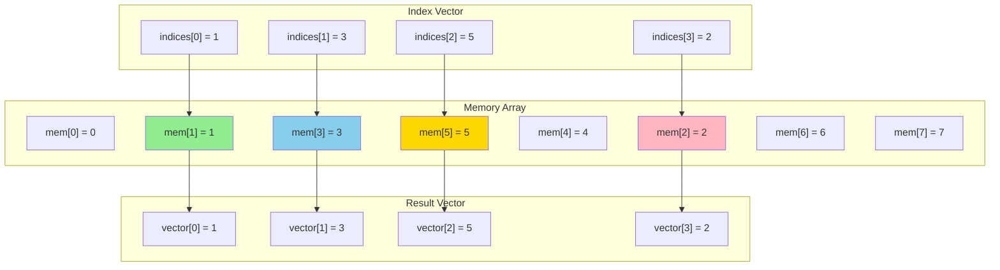

# Chapter 12. Vector Processing & SIMD Comparison

**Part VII — ISA Extensions**

---

Modern applications increasingly demand data-parallel processing. Image processing applies the same filter to millions of pixels. Machine learning performs matrix operations on thousands of elements. Scientific simulations compute physics equations across vast grids. These workloads share a common pattern: the same operation repeated on different data.

Traditional scalar processors handle one operation at a time. To process 1000 elements, they execute 1000 separate instructions. Vector processors, by contrast, operate on multiple elements simultaneously with a single instruction—Single Instruction, Multiple Data (SIMD). This can provide 4×, 8×, or even greater speedups for data-parallel code.

Every major architecture offers SIMD extensions: x86 has SSE and AVX, ARM has NEON and SVE. RISC-V's answer is the V extension (Vector), ratified in 2021. But RISC-V takes a different approach from its predecessors. Instead of fixed-width vectors that become obsolete as hardware improves, RISC-V uses vector-length agnostic programming—code that adapts automatically to different hardware implementations.

This chapter explores the V extension's design, compares it with ARM and x86 SIMD, and shows how to write efficient vector code. We'll see why RISC-V's approach offers better long-term scalability than traditional SIMD architectures.

---

## 12.1 Vector Extension Overview

**The SIMD Evolution**

SIMD extensions have evolved through multiple generations, each adding wider vectors:

- x86: MMX (64-bit) → SSE (128-bit) → AVX (256-bit) → AVX-512 (512-bit)
- ARM: NEON (128-bit) → SVE (128-2048 bits, scalable)

Each generation requires new instructions and software rewrites. Code optimized for 128-bit vectors doesn't automatically benefit from 256-bit hardware. This creates a dilemma: should compilers target narrow vectors for compatibility or wide vectors for performance?

**Vector-Length Agnostic Programming**

RISC-V's V extension solves this with vector-length agnostic (VLA) programming. Instead of specifying exact vector widths, programs specify operations on abstract vectors. The hardware determines the actual vector length at runtime based on its capabilities.

A program written for V extension runs on any implementation, from embedded processors with 128-bit vectors to supercomputers with 4096-bit vectors, automatically using the available width. This future-proofs software and simplifies compiler design.

**Key Concepts**

*VLEN*: Vector register length in bits, implementation-defined (must be power of 2, minimum 128, maximum 65536). A processor might have VLEN=256 (256-bit vectors) or VLEN=512 (512-bit vectors).

*ELEN*: Maximum element width in bits, implementation-defined (minimum 32, maximum 64). Determines the largest element type (e.g., ELEN=64 supports 64-bit integers and doubles).

*SEW*: Selected element width in bits, chosen by software (8, 16, 32, or 64). Determines how many elements fit in a vector register.

*LMUL*: Vector register group multiplier (1/8, 1/4, 1/2, 1, 2, 4, 8). Allows using multiple registers as a single logical vector for larger operations.

*AVL*: Application vector length, the number of elements the application wants to process.

*VL*: Vector length, the number of elements actually processed by an instruction (VL ≤ AVL, VL ≤ VLEN/SEW).

The relationship is: **VL = min(AVL, VLEN/SEW × LMUL)**

**Figure 12.1: Vector Register Organization**

```
Vector Register File (32 registers: v0-v31)
    Each register: VLEN bits (implementation-defined)

Element Width (SEW) - determines elements per register:
    VLEN = 256 bits (example)
    ├─ SEW=8:  32 elements (bytes)
    ├─ SEW=16: 16 elements (halfwords)
    ├─ SEW=32:  8 elements (words)
    └─ SEW=64:  4 elements (doublewords)

Register Grouping (LMUL) - use multiple registers as one:
    ├─ LMUL=1: 1 register  (e.g., v0)
    ├─ LMUL=2: 2 registers (e.g., v0-v1)
    ├─ LMUL=4: 4 registers (e.g., v0-v3)
    └─ LMUL=8: 8 registers (e.g., v0-v7)
```

A vector register can be interpreted with different element widths (SEW), and multiple consecutive registers can be grouped (LMUL) for larger operations.

---

## 12.2 Vector Register Organization

**Vector Register File**

The V extension adds 32 vector registers, v0 through v31. Each register is VLEN bits wide, where VLEN is implementation-defined. Unlike scalar registers which are always 32 or 64 bits, vector registers can be 128, 256, 512, or even larger.

Register v0 has a special role: it's used as the mask register for predicated operations (more on this later).

**Element Width and Capacity**

A vector register holds multiple elements. The number depends on the selected element width (SEW):

```
Number of elements = VLEN / SEW
```

For VLEN=256:

- SEW=8 (byte): 32 elements
- SEW=16 (halfword): 16 elements
- SEW=32 (word): 8 elements
- SEW=64 (doubleword): 4 elements

Software selects SEW based on the data type being processed.

**Register Grouping (LMUL)**

Sometimes you need to process more elements than fit in one register. LMUL (register group multiplier) allows treating multiple consecutive registers as a single logical vector:

- LMUL=1: Use 1 register (default)
- LMUL=2: Use 2 consecutive registers (e.g., v0-v1)
- LMUL=4: Use 4 consecutive registers (e.g., v0-v3)
- LMUL=8: Use 8 consecutive registers (e.g., v0-v7)

With LMUL=2 and SEW=32 on VLEN=256, you get 16 elements (8 per register × 2 registers).

LMUL can also be fractional (1/2, 1/4, 1/8) to use only part of a register, leaving more registers available for other operations.

**Register Alignment**

When LMUL > 1, register numbers must be aligned:

- LMUL=2: Use v0, v2, v4, ... (even registers)
- LMUL=4: Use v0, v4, v8, ... (multiples of 4)
- LMUL=8: Use v0, v8, v16, v24 (multiples of 8)

This simplifies hardware implementation.

---

## 12.3 Vector Configuration

**The vtype CSR**

Vector operations are configured through the vtype CSR (vector type register), which specifies:

- SEW: Selected element width (8, 16, 32, or 64 bits)
- LMUL: Register group multiplier (1/8, 1/4, 1/2, 1, 2, 4, 8)
- vta: Vector tail agnostic (how to handle elements beyond VL)
- vma: Vector mask agnostic (how to handle masked-off elements)

**The vsetvl Instruction**

Before executing vector instructions, software must configure vtype and set VL using the vsetvl instruction:

*vsetvli rd, rs1, vtypei*: Set VL and vtype. rs1 contains AVL (requested vector length), vtypei encodes SEW and LMUL, rd receives the actual VL.

```assembly
# Configure for 32-bit elements, LMUL=1
li a0, 100              # AVL = 100 elements to process
vsetvli t0, a0, e32, m1 # Set SEW=32, LMUL=1, VL = min(AVL, VLEN/32)
                        # t0 now contains actual VL
```

The hardware sets VL to the smaller of:

- AVL (what the application requested)
- VLEN/SEW × LMUL (what the hardware can handle)

If AVL=100 but the hardware can only process 8 elements at a time (VLEN=256, SEW=32, LMUL=1), then VL=8. The application must loop to process all 100 elements.

**Vector-Length Agnostic Loop**

Here's the standard pattern for processing an array:

```c
void vadd_vv(int *dst, int *src1, int *src2, size_t n) {
    size_t vl;
    for (size_t i = 0; i < n; i += vl) {
        vl = vsetvl_e32m1(n - i);  // Set VL for remaining elements
        
        vle32_v_i32m1(v1, &src1[i], vl);  // Load src1[i:i+vl]
        vle32_v_i32m1(v2, &src2[i], vl);  // Load src2[i:i+vl]
        vadd_vv_i32m1(v3, v1, v2, vl);    // v3 = v1 + v2
        vse32_v_i32m1(&dst[i], v3, vl);   // Store dst[i:i+vl]
    }
}
```

This code works on any VLEN. On VLEN=128, it processes 4 elements per iteration. On VLEN=512, it processes 16 elements per iteration. No code changes needed.

**Encoding vtype**

The vtypei immediate in vsetvli encodes SEW and LMUL:

```
vtypei[2:0] = LMUL encoding:
  000 = LMUL=1, 001 = LMUL=2, 010 = LMUL=4, 011 = LMUL=8
  101 = LMUL=1/8, 110 = LMUL=1/4, 111 = LMUL=1/2

vtypei[5:3] = SEW encoding:
  000 = SEW=8, 001 = SEW=16, 010 = SEW=32, 011 = SEW=64

vtypei[6] = vta (tail agnostic)
vtypei[7] = vma (mask agnostic)
```

The assembler provides convenient mnemonics: `e32, m1` means SEW=32, LMUL=1.

---

## 12.4 Vector Arithmetic and Logic

**Vector-Vector Operations**

Vector arithmetic instructions operate on corresponding elements from two vector registers:

*vadd.vv vd, vs2, vs1*: vd[i] = vs2[i] + vs1[i] for i = 0 to VL-1

*vsub.vv, vmul.vv, vdiv.vv*: Subtraction, multiplication, division

*vand.vv, vor.vv, vxor.vv*: Bitwise AND, OR, XOR

```assembly
# Vector addition: v3 = v1 + v2
vsetvli t0, a0, e32, m1
vle32.v v1, (a1)        # Load first vector
vle32.v v2, (a2)        # Load second vector
vadd.vv v3, v1, v2      # Add element-wise
vse32.v v3, (a3)        # Store result
```

**Vector-Scalar Operations**

Often you need to add the same scalar to all vector elements. Vector-scalar instructions use a scalar register (x register) as the second operand:

*vadd.vx vd, vs2, rs1*: vd[i] = vs2[i] + rs1 for all i

```assembly
# Add constant 10 to all elements
li a0, 10
vsetvli t0, a1, e32, m1
vle32.v v1, (a2)
vadd.vx v2, v1, a0      # v2[i] = v1[i] + 10
vse32.v v2, (a3)
```

**Vector-Immediate Operations**

For small constants, vector-immediate instructions avoid loading into a scalar register:

*vadd.vi vd, vs2, imm*: vd[i] = vs2[i] + imm (imm is 5-bit signed)

```assembly
# Increment all elements by 1
vadd.vi v2, v1, 1       # v2[i] = v1[i] + 1
```

**Widening and Narrowing Operations**

Widening operations produce results twice as wide as the inputs:

*vwaddu.vv vd, vs2, vs1*: Widening unsigned add (e.g., 32-bit inputs → 64-bit results)

*vwadd.vv*: Widening signed add

Narrowing operations reduce width:

*vnsrl.wv vd, vs2, vs1*: Narrowing shift right logical (e.g., 64-bit inputs → 32-bit results)

These are essential for avoiding overflow in accumulations or reducing precision after computation.

**Fused Multiply-Add**

Vector fused multiply-add computes (a × b) + c in one instruction:

*vfmadd.vv vd, vs1, vs2*: vd[i] = (vd[i] × vs1[i]) + vs2[i]

This is crucial for matrix multiplication and other linear algebra operations.

---

## 12.5 Vector Memory Operations

**Unit-Stride Loads and Stores**

The most common memory access pattern is unit-stride: consecutive elements in memory.

*vle32.v vd, (rs1)*: Load VL elements of 32-bit width from address rs1

*vse32.v vs3, (rs1)*: Store VL elements of 32-bit width to address rs1

```assembly
# Load 32-bit integers from array
vsetvli t0, a0, e32, m1
vle32.v v1, (a1)        # Load v1[0:VL-1] from memory[a1]
```

The number of bytes loaded is VL × SEW/8. For VL=8 and SEW=32, this loads 32 bytes.

**Strided Loads and Stores**

Strided access loads elements separated by a constant stride:

*vlse32.v vd, (rs1), rs2*: Load elements from rs1, rs1+rs2, rs1+2×rs2, ...

*vsse32.v vs3, (rs1), rs2*: Store with stride

```c
// Load every other element (stride = 8 bytes for 32-bit elements)
vlse32.v v1, (a1), 8    # Load a1[0], a1[2], a1[4], ...
```

This is useful for accessing matrix columns or interleaved data.

**Indexed (Scatter/Gather) Loads and Stores**

Indexed access uses a vector of indices to load/store non-contiguous elements. This is also called "gather" (for loads) and "scatter" (for stores).

*vluxei32.v vd, (rs1), vs2*: Load elements from rs1+vs2[i] for each i (unordered)

*vsuxei32.v vs3, (rs1), vs2*: Store with indices (unordered)

```assembly
# Example: Gather operation
# Suppose we have an array a[] and want to load a[1], a[3], a[5], a[2]
# First, create an index vector containing [1, 3, 5, 2]
vle32.v v1, (a1)        # Load index vector: v1 = [1, 3, 5, 2]
vluxei32.v v2, (a2), v1 # Gather: v2[0]=a[1], v2[1]=a[3], v2[2]=a[5], v2[3]=a[2]
```

The index vector (v1 in the example) contains the indices of elements to load. For each element i, the instruction loads from address `base + index[i] * element_size`. So if v1 contains [1, 3, 5, 2], the gather operation loads:

- v2[0] = memory[a2 + 1*4] (element at index 1)
- v2[1] = memory[a2 + 3*4] (element at index 3)
- v2[2] = memory[a2 + 5*4] (element at index 5)
- v2[3] = memory[a2 + 2*4] (element at index 2)

This is essential for sparse matrix operations, indirect addressing, and accessing non-contiguous data.

**Segment Loads and Stores**

Segment operations load/store groups of elements (like struct fields):

*vlseg2e32.v vd, (rs1)*: Load 2-field segments (e.g., {x, y} pairs)

*vsseg2e32.v vs3, (rs1)*: Store 2-field segments

```c
// Load array of {x, y} pairs
struct point { int x, y; };
struct point points[100];

vlseg2e32.v v1, (a0)    # v1 = all x values, v2 = all y values
```

This efficiently handles structure-of-arrays (SoA) and array-of-structures (AoS) conversions.

**Figure 12.2a: Unit-Stride Access**

```
Unit-Stride (consecutive elements):
Memory:   [0] [1] [2] [3] [4] [5] [6] [7]
           ↓   ↓   ↓   ↓
Vector:   [0] [1] [2] [3]
```

**Figure 12.2b: Strided Access**

```
Strided (every 2nd element, stride=2):
Memory:   [0] [1] [2] [3] [4] [5] [6] [7]
           ↓       ↓       ↓       ↓
Vector:   [0]     [2]     [4]     [6]
```

**Figure 12.2c: Indexed (Gather) Access**



Each index points to a memory location, and the value at that location is loaded into the corresponding vector position.

---

## 12.6 Vector Masking

**Predicated Execution**

Not all elements in a vector may need processing. Masking allows selectively enabling or disabling operations on individual elements.

The mask is stored in vector register v0, with one bit per element. If v0[i] = 1, element i is processed; if v0[i] = 0, element i is skipped (or handled according to vma setting).

**Masked Operations**

Most vector instructions have a masked variant using the `.vm` suffix:

*vadd.vv vd, vs2, vs1, v0.t*: Add only where v0[i] = 1

```assembly
# Conditional add: dst[i] = (mask[i]) ? src1[i] + src2[i] : dst[i]
vle1.v v0, (a0)         # Load mask into v0
vle32.v v1, (a1)        # Load src1
vle32.v v2, (a2)        # Load src2
vle32.v v3, (a3)        # Load dst (for masked-off elements)
vadd.vv v3, v1, v2, v0.t # Add where mask is 1, keep v3 where mask is 0
vse32.v v3, (a3)        # Store result
```

**Comparison and Mask Generation**

Comparison instructions generate masks:

*vmseq.vv vd, vs2, vs1*: vd[i] = (vs2[i] == vs1[i]) ? 1 : 0

*vmslt.vv, vmsle.vv, vmsgt.vv*: Less than, less or equal, greater than

```assembly
# Find elements greater than 100
li a0, 100
vsetvli t0, a1, e32, m1
vle32.v v1, (a2)
vmsgt.vx v0, v1, a0     # v0[i] = (v1[i] > 100) ? 1 : 0
```

**Mask Logical Operations**

Masks can be combined with logical operations:

*vmand.mm vd, vs2, vs1*: Mask AND
*vmor.mm, vmxor.mm, vmnand.mm*: Mask OR, XOR, NAND

```assembly
# Combine two conditions: (a > 100) AND (a < 200)
vmsgt.vx v1, v2, a0     # v1 = (v2 > 100)
vmslt.vx v3, v2, a1     # v3 = (v2 < 200)
vmand.mm v0, v1, v3     # v0 = v1 AND v3
```

**Use Cases**

Masking is essential for:

- Conditional operations (if-then-else in vector code)
- Handling loop tails (when array size isn't a multiple of VL)
- Sparse computations (skip zero elements)
- Implementing reductions with conditions

---

## 12.7 Vector Reductions

**What is a Reduction?**

A reduction combines all elements of a vector into a single scalar result. Common examples: sum all elements, find maximum, count non-zero elements.

**Reduction Instructions**

*vredsum.vs vd, vs2, vs1*: Sum all elements of vs2, add to vs1[0], store in vd[0]

*vredmax.vs, vredmin.vs*: Find maximum or minimum

*vredand.vs, vredor.vs, vredxor.vs*: Bitwise AND, OR, XOR of all elements

```assembly
# Sum all elements of an array
vsetvli t0, a0, e32, m1
vmv.v.i v2, 0           # Initialize accumulator to 0
vle32.v v1, (a1)        # Load vector
vredsum.vs v2, v1, v2   # v2[0] = sum(v1[0:VL-1]) + v2[0]
vmv.x.s a2, v2          # Move result to scalar register
```

For arrays larger than VL, loop and accumulate:

```c
int sum_array(int *arr, size_t n) {
    int sum = 0;
    size_t vl;
    for (size_t i = 0; i < n; i += vl) {
        vl = vsetvl_e32m1(n - i);
        vle32_v_i32m1(v1, &arr[i], vl);
        vredsum_vs_i32m1_i32m1(v2, v1, v2, vl);
    }
    return vmv_x_s_i32m1_i32(v2);
}
```

**Masked Reductions**

Reductions can be masked to sum only selected elements:

```assembly
# Sum elements where mask is 1
vredsum.vs v2, v1, v2, v0.t
```

This is useful for conditional sums (e.g., sum all positive elements).

---

## 12.8 Comparison with ARM NEON and x86 AVX

**ARM NEON**

ARM NEON provides 128-bit SIMD with 32 vector registers (v0-v31 in AArch64). Each register can hold:

- 16 × 8-bit elements
- 8 × 16-bit elements
- 4 × 32-bit elements
- 2 × 64-bit elements

NEON instructions specify the element width explicitly:

```assembly
# ARM NEON: Add two vectors of 4 × 32-bit integers
ld1 {v0.4s}, [x0]       // Load 4 × 32-bit
ld1 {v1.4s}, [x1]
add v2.4s, v0.4s, v1.4s // Add element-wise
st1 {v2.4s}, [x2]
```

**Limitations of NEON**:

- Fixed 128-bit width (no scalability)
- Code must be rewritten for wider vectors
- No predication (masking) in base NEON

**ARM SVE (Scalable Vector Extension)**

SVE addresses NEON's limitations with scalable vectors (128-2048 bits). Like RISC-V V, SVE uses vector-length agnostic programming:

```assembly
# ARM SVE: Vector add (works on any vector length)
ld1w z0.s, p0/z, [x0]   // Load with predication
ld1w z1.s, p0/z, [x1]
add z2.s, z0.s, z1.s    // Add
st1w z2.s, p0, [x2]     // Store with predication
```

SVE and RISC-V V share similar philosophies: scalable vectors, predication, and VLA programming. However, SVE is more complex with more instruction variants and addressing modes.

**x86 AVX**

x86's SIMD evolved through multiple generations:

- SSE: 128-bit (16 registers: xmm0-xmm15)
- AVX: 256-bit (16 registers: ymm0-ymm15)
- AVX-512: 512-bit (32 registers: zmm0-zmm31)

Each generation added new instructions:

```assembly
# x86 AVX: Add two vectors of 8 × 32-bit integers
vmovdqu ymm0, [rax]     ; Load 256 bits
vmovdqu ymm1, [rbx]
vpaddd ymm2, ymm0, ymm1 ; Add 8 × 32-bit
vmovdqu [rcx], ymm2     ; Store
```

**Limitations of x86 SIMD**:

- Fixed widths (128, 256, 512 bits)
- Code must be rewritten for each generation
- AVX-512 has many variants (AVX-512F, AVX-512BW, AVX-512DQ, etc.)
- Complexity: thousands of SIMD instructions

**RISC-V V Advantages**

Compared to NEON and AVX, RISC-V V offers:

1. **Scalability**: One codebase works on any VLEN (128 to 65536 bits)
2. **Simplicity**: Fewer instruction variants, consistent naming
3. **Predication**: Built-in masking for all operations
4. **Flexibility**: Fractional LMUL, widening/narrowing operations
5. **Future-proof**: No need to rewrite code for wider vectors

**Trade-offs**:

- RISC-V V is newer (less mature tooling and libraries)
- x86 AVX has extensive optimization for specific workloads
- ARM NEON is simpler for fixed-width use cases

**Figure 12.3: SIMD Architecture Comparison**

| Feature | x86 SSE/AVX | ARM NEON | ARM SVE | RISC-V V |
|---------|-------------|----------|---------|----------|
| **Vector Width** | Fixed: 128/256/512 bits | Fixed: 128 bits | Scalable: 128-2048 bits | Scalable: 128-65536 bits |
| **Registers** | 16 (SSE/AVX)<br/>32 (AVX-512) | 32 | 32 | 32 |
| **Scalability** | No (fixed per generation) | No (fixed) | Yes (scalable) | Yes (scalable) |
| **Code Portability** | No (rewrite per generation) | Yes (single codebase) | Yes (single codebase) | Yes (single codebase) |
| **Predication** | Partial (AVX-512 only) | No (base NEON) | Yes | Yes |
| **Instruction Count** | ~1000s (across generations) | ~200 | ~400 | ~300 |
| **Complexity** | High (many variants) | Low | Medium | Low |
| **Ratification** | 1999 (SSE)<br/>2011 (AVX)<br/>2016 (AVX-512) | 2005 | 2016 | 2021 |
| **Key Advantage** | Mature ecosystem | Simple, widely deployed | Scalable, predication | Scalable, simple, future-proof |
| **Key Limitation** | Fixed widths, complexity | Fixed 128-bit only | Complex instruction set | Newer, less mature tooling |

---

## Summary

The RISC-V Vector extension represents a modern approach to SIMD processing, learning from decades of experience with x86 and ARM SIMD architectures. Its vector-length agnostic design ensures that code written today will automatically benefit from wider vectors in future hardware.

**Vector-length agnostic programming** is the V extension's defining feature. By abstracting away the physical vector width, RISC-V allows a single binary to run efficiently on implementations ranging from tiny embedded processors to supercomputers. This eliminates the need to maintain multiple code paths for different vector widths, simplifying both compiler and application development.

**Vector configuration** through the vsetvl instruction and vtype CSR provides fine-grained control over element width (SEW), register grouping (LMUL), and vector length (VL). The hardware automatically determines the optimal VL based on the application's request (AVL) and the implementation's capabilities (VLEN), making it easy to write portable high-performance code.

**Vector operations** cover the full spectrum of data-parallel computation: arithmetic and logic operations with vector-vector, vector-scalar, and vector-immediate variants; widening and narrowing operations for precision management; and fused multiply-add for efficient linear algebra. The consistent instruction naming and behavior make the V extension easier to learn than x86's sprawling SIMD instruction set.

**Vector memory operations** support diverse access patterns: unit-stride for contiguous data, strided for matrix columns and interleaved data, indexed for sparse matrices and indirect addressing, and segment operations for structure-of-arrays conversions. This flexibility enables efficient vectorization of a wide range of algorithms.

**Vector masking** provides predicated execution, allowing conditional operations on individual vector elements. Comparison instructions generate masks, mask logical operations combine conditions, and masked operations selectively process elements. This is essential for handling loop tails, implementing conditional logic in vector code, and optimizing sparse computations.

**Vector reductions** efficiently combine all elements of a vector into a scalar result, supporting operations like sum, maximum, minimum, and bitwise reductions. Masked reductions enable conditional aggregations, crucial for many algorithms.

**Compared to ARM NEON and x86 AVX**, RISC-V V offers superior scalability and simplicity. While NEON is limited to 128-bit vectors and AVX requires separate code for each generation (128, 256, 512 bits), RISC-V V code automatically adapts to any vector width. ARM SVE shares RISC-V's scalable philosophy but with greater complexity. x86's SIMD has evolved into thousands of instructions across multiple incompatible extensions, while RISC-V V maintains a clean, orthogonal design.

The V extension positions RISC-V well for future data-parallel workloads in machine learning, scientific computing, multimedia processing, and other domains where SIMD performance is critical.
